# **HTA Critical Path Analysis实现分析**  
---

## **1. Design Overview**   
关键路径分析的核心思想是找出大型系统中构成起始和结束之间最长路径的操作，关键路径上的操作会显著影响程序的整体性能。关键路径上的操作可以为我们进行性能分析和优化提供参考，让我们了解系统性能受限于何种因素，如X% CPU-bound, Y% GPU-bound或分布式训练中Z% communication-bound。同时，在确认关键路径后，可以通过简单的修改DAG重新运行关键路径查找算法来评估某些改进的收益。

值得注意的是，在找出关键路径并对其中某些操作进行优化后，关键路径可能会发生变化，例如下图中`mult()`操作的时间优化后比`add1()`操作的时间短，此时`add1()`成为了关键路径上的关键操作。


### **1.1 核心假设**  
为了简化PyTorch算子之间的依赖关系分析，该分析框架做出了以下关键假设：
1. **CPU operators的串行依赖关系**：假设CPU操作是顺序执行的，即一个CPU线程上的operator会等待该线程上一个operator完成后才开始执行
    - 在深度学习框架中，CPU operator通常是顺序执行的，无需考虑复杂的并行或重叠执行情况。假设CPU线程上有算子A、B和C。Operator B会等待operator A完成后再开始，operator C又会等待operator B完成后再开始。这种顺序执行的假设使得分析CPU operators之间的依赖关系变得简单明了
2. **CPU和GPU之间的依赖关系**：考虑了**kernel launch delay, kernel-kernel delay以及同步事件**


### **1.2 核心概念**  
- **事件依赖图(Event Dependency Graph)**：基于CUDA Stream/MPI通信构建的DAG  
- **关键路径(Critical Path)**：从任务开始到结束的最长执行链路，决定整体耗时下限  
- **CUDA stream中的kernels执行顺序**：在同一个CUDA stream中的所有GPU kernels都是按顺序执行的，一个kernel必须等待前一个kernel完成后才能开始执行。
- **隐式依赖关系**：如果一个CUDA stream中有超过1个未完成的kernel，就在前一个kernel的结束节点和后一个kernel的开始节点间添加一条边，表示kernel间延迟
- **kernel launch delay**:系统启动延迟，CUDA运行本身需要一些时间来初始化和调度kernel。CPU需要将相关操作发送到GPU上执行，从CPU发出启动信号到GPU实际开始执行kernels之间存在时间延迟。当前CUDA流中已经有其他kernel在等待执行，那么新启动的kernel要在这些kernel之后排队等待，仅在当前CUDA流中没有其他kernel在等待执行，从启动到执行的延迟才能被算作kernel launch delay
- **kernel kernel delay**:多个kernels在GPU上执行时，kernels之间由于GPU的任务调度,资源分配或执行依赖等因素存在一定的时间延迟
- **同步事件**:CPU和GPU之间可能会有同步操作，确保CPU和GPU操作按顺序执行。例如，CPU可能需要等待GPU完成某个操作后才能继续执行后续操作，或者GPU要等待CPU完成数据准备后才能启动kernel
    - **Synchronization Dependencies**:
        - Stream Synchronization流间同步:一个流中的操作需要等待另一个流中的操作完成之后才能开始执行
        - Wait Synchronization等待同步:CPU等待GPU上的操作完成
    - **Synchronization Edges**:
        - 上下文/设备同步:全局同步，所有GPU流的最后一个kernel到CPU的同步调用，CPU上调用context/Device Synchronize的运行时函数节点
        - 单一流同步:只需要从特定的stream中最后一个完成的kernel节点，添加边到CPU上对应的流同步调用节点
        - 事件同步:GPU到GPU的同步，通过事件协调不同GPU操作的执行顺序，通常不直接在DAG中添加边。在代码中插入事件记录点，后续B操作可以设置为等待先前记录的事件完成，这样后续的操作只有在等待的事件完成时才能开始执行。
    - **Handling CUDA Events Synchronization**:
        `cudaStreamWaitEvent()` destination_stream_event告诉destination stream等待event事件完成，再继续执行操作。
        
        事件记录与流依赖:stream1->kernel1->在stream1中记录event,`cudaEventRecord(event1,stream1)`,表示stream1中所有前面的操作都已完成至事件标记出。
        
        `cudaStreamWaitEvent(stream2, event1)`,stream2等stream1完成再继续，在DAG中需将等待事件的kernel,如kernel B和记录event 2 kernel如kernel A连接起来，以表示它们之间的依赖关系.


        ```mermaid
        graph LR
        %% Stream 1 操作序列
        subgraph Stream1["Stream 1 (Producer)"]
            direction LR
            S1_K1["Kernel A"] --> S1_E1["cudaEventRecord(event1, stream1)"]
        end

        %% Stream 2 操作序列
        subgraph Stream2["Stream 2 (Consumer)"]
            direction LR
            S2_W1["cudaStreamWaitEvent(stream2, event1)"] --> S2_K1["Kernel B"]
        end

        %% 跨流依赖
        S1_E1 -.->|事件同步| S2_W1

        %% 样式定义
        classDef stream fill:#f5f5f5,stroke:#666,stroke-width:1px;
        classDef kernel fill:#ffebee,stroke:#ff5252;
        classDef event fill:#e3f2fd,stroke:#2196f3;
        class S1_K1,S2_K1 kernel;
        class S1_E1,S2_W1 event;
        class Stream1,Stream2 stream;

        %% 连接线样式
        %% linkStyle 0 stroke:#ff5252;  %% Stream1内部连接
        %%linkStyle 1 stroke:#2196f3;  %% Stream2内部连接
        %%linkStyle 2 stroke:#2196f3,stroke-dasharray:5,5;  %% 跨流依赖
        ```

 
> CUDA Sync Events:
> 1. stream to stream:不同流之间的依赖关系
> 2. kernel to kernel:kernel间执行顺序和依赖关系
> 3. CPU to GPU:CPU需要等待GPU完成其任务时出发此事件


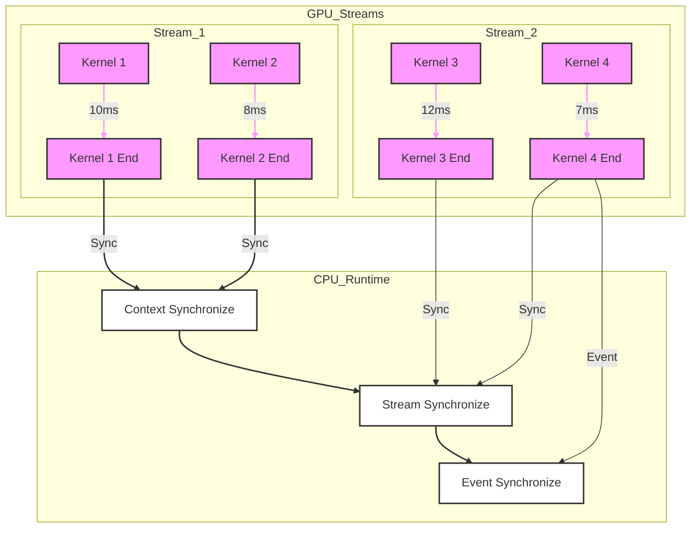


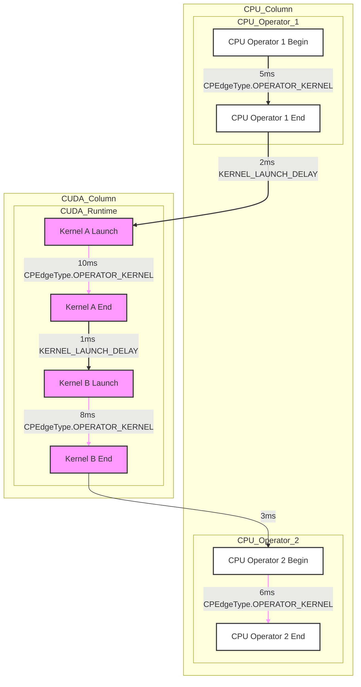
---


## **2. Example & API**  
### **2.1 Example**  

```python
import inspect
from hta.trace_analysis import TraceAnalysis
from hta.analyzers.critical_path_analysis import restore_cpgraph


hta_dir = "/home/hwt/HolisticTraceAnalysis"
trace_dir = hta_dir + "/tests/data/critical_path/simple_add/"

analyzer = TraceAnalysis(trace_dir = trace_dir)
annotation = "[param|pytorch.model.alex_net|0|0|0|measure|forward]"
instance_id = 1  # note this is zero based

cp_graph, success = analyzer.critical_path_analysis(
        rank = 0, annotation=annotation, instance_id=instance_id)


print(success)
print(cp_graph.summary())

cp_graph.show_critical_path()

analyzer.overlay_critical_path_analysis(
    0, cp_graph, output_dir='~/HolisticTraceAnalysis/tests/data/critical_path/simple_add/overlaid')

zip_file = cp_graph.save(out_dir="/tmp/my_saved_cp_graph")

rest_graph = restore_cpgraph(zip_filename=zip_file, t_full=analyzer.t, rank=0)

print(len(rest_graph.critical_path_edges_set) == len(cp_graph.critical_path_edges_set))
print(len(rest_graph.nodes) == len(cp_graph.nodes))


print(rest_graph.summary())
# recompute critical path
rest_graph.critical_path()
print(rest_graph.summary())
```
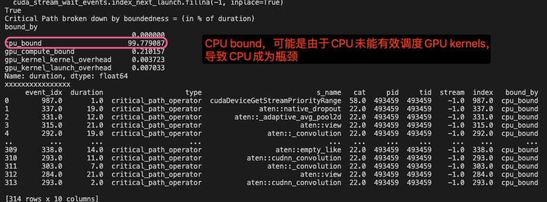
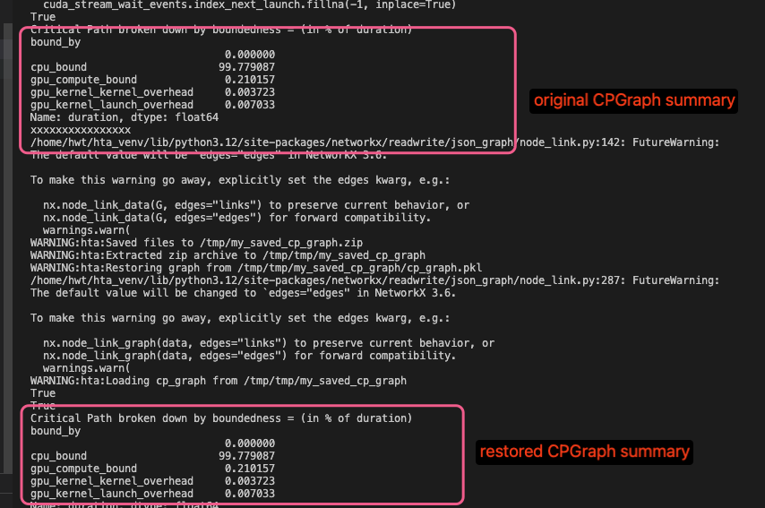

### **2.2 相关API**  

1. `critical_path_analysis()`:，构建CPGraph并进行关键路径分析(TraceAnalysis)
    ```python
    def critical_path_analysis(
        cls,
        t: "Trace",
        rank: int,
        annotation: str,
        instance_id: Union[Optional[int], Tuple[int, int]],
    ) -> Tuple[CPGraph, bool]
    ```
1. `overlay_critical_path_analysis()`:在原始trace文件上绘制出关键路径的分析图像(TraceAnalysis)
    ```python
    def overlay_critical_path_analysis(
        cls,
        t: "Trace",
        rank: int,
        critical_path_graph: CPGraph,
        output_dir: str,
        only_show_critical_events: bool,
        show_all_edges: bool,
    ) -> str
    ```
2. `show_critical_path()`: 显示关键路径(CPGraph)
    ```python
    def show_critical_path(self) -> None
    ```

5. `summary()`: 提供关键路径的详细信息(CPGraph)
    ```python
    def summary(self) -> pd.core.series.Series
    ```
6. `critcal_path()`:关键路径计算(CPGraph)
    ```python
    def critical_path(self) -> bool
    ```
3. `save()`:存储CPGraph对象(CPGraph)
    ```python
    def save(self, out_dir: str) -> str
    ```
    用于保存已经构造好的关键路径图的状态，只有在关键路径图构造完成后才能执行保存操作。
4. `restore_cpgraph()`:恢复CPGraph对象
    ```python
    def restore_cpgraph(zip_filename: str, t_full: "Trace", rank: int) -> CPGraph
    ```
    构造CPGraph可能需要耗费一定的时间。如果用户希望在现有的关键路径图基础上模拟新的更改，频繁地重新构造整个图会使迭代过程变得缓慢。该函数允许用户将关键路径图恢复到之前保存的状态。这样，在模拟新的更改时，用户不需要重新构造整个图，而是可以从保存的状态开始，从而节省时间。


---
## **3. 架构设计与实现** 
计算关键路径主要包括以下步骤(DAG = Nodes + Edges)：
1. 构建有权有向无环图（Weighted DAG）：
    - Nodes：表示特定的时间点，标记了操作（如CPU operators或GPU kernels）的开始和结束。
    - Edges：表示节点之间的关系
        - 时间边：权重表示时间。例如，若在CPU上启动一个GPU kernel存在2ms的延迟，则这条启动操作会被表示为一条权重为2ms的边。
        - 依赖边：权重为0，表示数据依赖或CPU与GPU之间的同步操作，不涉及时间成本。
2. 查找DAG中的最长路径：
    使用图算法在构建的 DAG 中找到最长路径，该路径即为关键路径，决定了整个计算过程的最小执行时间。

另外，嵌套运算符链接主要存在于CPU call stacks,每个Pytorch顶级运算符都依赖于前一个顶级运算符，如下图所示:

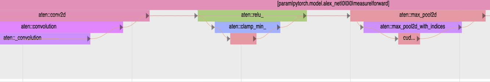


### **3.1 相关项目目录及文件**  
```shell
├── trace_analysis.py # TraceAnalysis类实现，包括关键路径分析在内的很多trace分析的功能
├── benchmarks # 对HTA工具的各组件进行性能分析与优化验证
├── docs # 相关文档
├── examples # 使用示例
│   ├── experimental
│   │   └── critical_path_analysis.ipynb # critical path analysis 相关api使用示例
│   │...
├── hta # 关键代码
│   ├── analyzers # trace分析器关键代码
│   │   ├── critical_path_analysis.py # 关键路径分析主要功能代码
│   │   └── ...
│   ├── common # 通用组件
│   │   ├── call_stack.py # CPU调用栈
│   │   ├── constants.py # 常量定义 CUDA_MAX_LAUNCH_QUEUE_PER_STREAM: int = 1024
│   │   ├── ...
│   │   ├── trace_call_graph.py # CallStackGraph单个thread/stream的执行图
│   │   ├── trace_call_stack.py # CallGraph为一组CallStackGraph表示trace的层次结构关系
│   │   ├── trace_df.py # trace事件检索,支持按迭代阶段/operator名称/正则模式快速筛选事件,同时通过符号表编码实现10倍内存压缩
│   │   ├── trace_file.py # trace文件管理包含元数据维护,文件映射构建,数据序列化等核心功能
│   │   ├── trace_filter.py # trace过滤器
│   │   ├── trace_parser.py # trace解析器
│   │   ├── trace.py # 用于分布式机器学习训练任务中收集跟踪数据的容器
│   │   ├── trace_stack_filter.py # 多维度事件过滤，包括基于时间窗口/调用栈层级的事件选择,CPU算子与GPU Kernel的依赖关系追踪以及复合条件过滤
│   │   ├── trace_symbol_table.py # trace符号表
│   │   └── types.py # 设备类型 操作类型 
│   ├── configs # trace解析配置
│   │   ├── config.py # trace分析器的配置
│   │   ├── default_values.py # 默认配置 trace路径 线程数 ValueType AttributeSpec
│   │   ├── env_options.py # 环境变量配置
│   │   ├── event_args_formats # 待配置文件为yaml格式示例
│   │   │   └── event_args_1.0.0.yaml
│   │   ├── event_args_yaml_parser.py # yaml参数解析器
│   │   ├── logging.config # 日志配置
│   │   ├── parser_config.py # 解析器配置
│   │   └── trace_analyzer.json # 基本配置包括文件路径个等
│   ├── ...
│   ├── utils # 其他工具
├── scripts # 将trace转换成适用于perfetto的格式
│   └── convert_to_perfetto.py
├── tests # 测试文件及输入trace
│   ├── data # trace
│   │   ├── critical_path # 测试critical_path模块的相关数据
│   │   │   ├── alexnet
│   │   │   │   └── benchmark_result_2869224_1695835535_trace.json.gz
│   │   │   ├── cuda_event_sync
│   │   │   │   └── event_sync_trace.json.gz
│   │   │   ├── cuda_event_sync_multi_stream
│   │   │   │   └── event_sync_trace.json.gz
│   │   │   └── simple_add
│   │   │       ├── benchmark_result_493459_1694039959_trace.json.gz
│   │   │       └── overlaid
│   │   │           └── overlaid_critical_path_benchmark_result_493459_1694039959_trace.json.gz
│   ├── __init__.py
│   ├── test_critical_path_analysis.py # critical path analysis测试代码
│   └── ...
```

### **3.2 相关数据结构**  

主要数据结构如下：
- TraceAnalysis        trace分析类
- Trace                存放trace数据的类
- ParserConfig         trace解析器配置
- TraceSymbolTable     trace符号表
- CPUOperatorFilter    CPU算子过滤器
- GPUKernelFilter      GPU算子过滤器
- CallStackIdentity    调用栈属性
- CallStackNode        调用栈节点
- CallStackGraph       调用栈图
- CallGraph            表示整个跟踪数据集，由多个CallStackGraph对象组成
- CPNode               CPGraph节点类
- CPEdgeType           CPGraph边类型
- CPEdge               CPGraph边类
- _CPGraphData         DAG数据类
- CPGraph              图类
- CriticalPathAnalysis 关键路径分析类

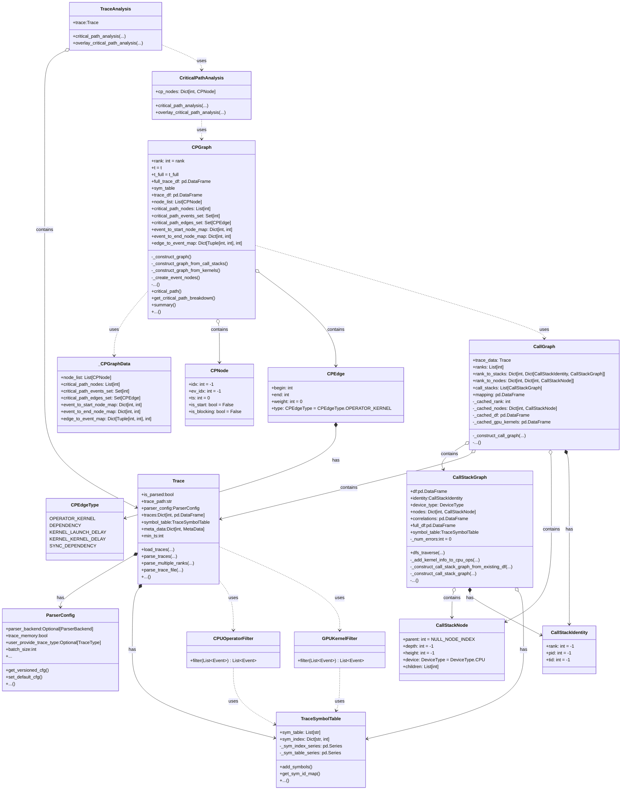

---

### **3.3 关键步骤分析**  

以下内容从实例化一个TraceAnalysis对象，构建DAG并对关键路径进行分析的流程展开。

#### **3.3.1 TraceAnalysis初始化**  
首先使用`TraceAnalysis(trace_dir = trace_dir)`并输入trace文件的目录实例化一个trace_analysis分析器。我们来看一下TraceAnalysis类的初始化过程, TraceAnalysis数据成员即Trace类实例，同时通过`load_traces`函数加载traces数据并在最后将bool变量is_parsed置1表示数据已解析完成。

```python
class TraceAnalysis:
    def __init__(
        self,
        trace_files: Optional[Dict[int, str]] = None,
        trace_dir: str = DEFAULT_TRACE_DIR,
        include_last_profiler_step: Optional[bool] = False,
    ):
        self.t = Trace(trace_files, trace_dir)
        self.t.load_traces(include_last_profiler_step)
        assert self.t.is_parsed is True

    ...
```
#### **3.3.2 Trace初始化及加载**  
随后关注Trace类的初始化过程，主要工作是初始化trace_files，建立rank到trace files name的映射关系。

```python
class Trace:
    def __init__(
        self,
        trace_files: Optional[Union[List[str], Dict[int, str]]] = None,
        trace_dir: str = DEFAULT_TRACE_DIR,
        parser_config: Optional[ParserConfig] = None,
    ) -> None:

        self.is_parsed: bool = False
        self.trace_path: str = normalize_path(trace_dir) # 规范化trace路径
        # 实例化解析器
        self.parser_config: ParserConfig = (
            parser_config or ParserConfig.get_default_cfg()
        )

        # 获取所有trace files的绝对路径, 输入的trace_files有两种类型
        # Dict存储rank到trace文件名映射
        # List存储trace文件名
        # 最后都变成Dict格式
        self.trace_files: Dict[int, str]
        if trace_files is None:
            logger.debug("trace_files is None") # trace_files为空
            self.trace_files = get_trace_files(self.trace_path) # 根据trace_path获得trace_files的map
        elif isinstance(trace_files, dict): # 如果trace_files是dict类型[rank(int), trace_file_name(str)]
            self.trace_files = trace_files
            logger.debug("trace file is dict type")
        elif isinstance(trace_files, list): # 如果trace_files是list类型,全部为trace_files的名字
            ok, self.trace_files = create_rank_to_trace_dict(trace_files)
            logger.debug("trace file is list type")
            if not ok:
                logger.warning("failed to create rank to trace map")
        else:
            logger.error(
                f"Unsupported type for trace_files = {trace_files}, should be list or dict"
            )
            return


        self.traces: Dict[int, pd.DataFrame] = {}
        self.symbol_table = TraceSymbolTable() # 初始化符号表
        self.meta_data: Dict[int, MetaData] = {}
        self.min_ts: int = 0
    
        self._normalize_trace_filenames() # 规范化trace文件路径
        if not self._validate_trace_files():  # 判断文件路径是否有效
            raise ValueError("Trace files validation failed.")
        logger.debug(f"trace_path={self.trace_path}")
        logger.debug(f"# trace_files={len(self.trace_files)}")
        if len(self.trace_files) > 0: # 如果trace_files不为空,输出文件信息
            rank = next(iter(self.trace_files))
            trace_file = self.trace_files[rank]
            logger.debug(f"trace_files[{rank}] = {trace_file}")
   
```
加载trace的真正函数是`load_trace`,概函数首先查看trace是否被解析如果已经解析过直接返回，然后调用`self.parse_traces`函数解析具体的trace,而后通过`align_and_filter_trace`对齐trace的ts时间戳并过滤感兴趣的事件并将其保存在traces中,traces中保存rank和pd.DataFrame类型的Trace数据的映射关系。
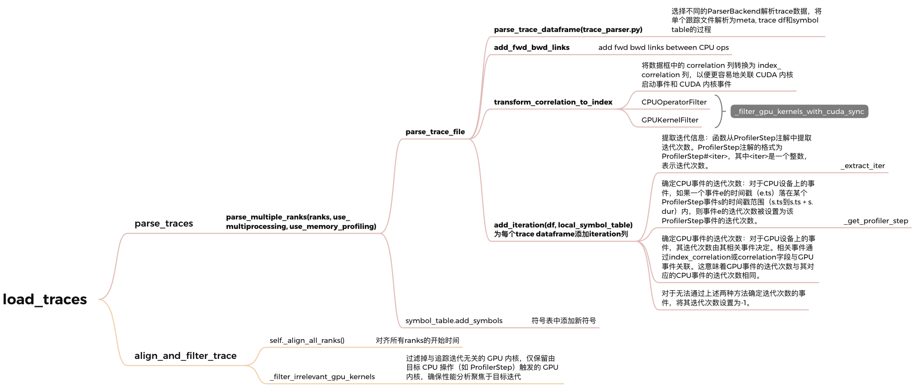
```python
    def load_traces(
        self,
        include_last_profiler_step: Optional[bool] = False, # 是否包含最后一个profiler step
        use_multiprocessing: bool = True, # 是否使用多进程解析trace数据
        use_memory_profiling: bool = True, # 是否在解析过程中使用内存分析
    ) -> None:

        if self.is_parsed:# 如果追踪数据已经解析并加载，发出警告并退出
            logger.warning("Traces are already parsed and loaded!")
            return
        # 1. 解析追踪数据,使用指定的多进程和内存分析设置来解析追踪数据
        self.parse_traces(
            use_multiprocessing=use_multiprocessing,
            use_memory_profiling=use_memory_profiling,
        )
        # 2. 对齐和过滤trace数据
        self.align_and_filter_trace(include_last_profiler_step)
        # 3. 建立rank和对应trace数据的映射关系
        for rank, df in self.traces.items():
            df = self.traces[rank].set_index("index", drop=False) # 设置index列为当前 rank 的追踪数据设置索引列，并保留原始索引列
            df.index.names = [None]
            self.traces[rank] = df 
        self.is_parsed = True
```


至此TraceAnalysis初始化完成，具体上述代码的细节这里就不展开了。
#### 3.3.3 关键路径分析函数
而后调用`critical_path_analysis`函数，
该函数旨在对特定rank内的trace事件执行临界路径分析，通过选定跟踪注解annotation及实例ID，可将分析范围限定在该注解所对应的时间区间内的事件，涵盖该时间段内由CPU操作启动的GPU kernel。例如，传递参数`annotation='ProfilerStep'`，可将分析范围限定在一个迭代周期内。需注意，建议避免使用跟踪中的第一个步骤或迭代，因其通常缺少部分事件；分析还需GPU trace中的CUDA同步事件，这些事件可参考https://github.com/pytorch/pytorch/pull/105187

```python
Class TraceAnalysis:
    ...
    def critical_path_analysis(
        self,
        rank: int,
        annotation: str, # 用于限定分析范围的跟踪注解，如 "ProfilerStep" 可匹配所有相关注解
        instance_id: Union[Optional[int], Tuple[int, int]], # 可为整数或整数元组，整数表示指定注解实例，默认为第一个实例；元组则表示从起始实例到结束实例的范围，包含起始和结束实例
    ) -> Tuple[CPGraph, bool]:
        return CriticalPathAnalysis.critical_path_analysis(
            self.t, rank, annotation, instance_id 
        ) # self.t -> Trace 类型，输入的trace数据结构
    ...
```

还有另一个函数`overlay_critical_path_analysis`,该函数用于将识别出的临界路径叠加到跟踪文件上进行可视化。函数返回叠加后的跟踪文件路径，生成的跟踪文件名相较于原始文件名会新增`overlaid_critical_path_`前缀。需注意，对于不在临界路径上的kernel launch，图中仍会在CUDA runtime和kernel之间保留权重为0的边，默认情况下这些权重为0的边不会显示在叠加后的跟踪文件中。若要启用此显示，可设置环境变量`CRITICAL_PATH_SHOW_ZERO_WEIGHT_LAUNCH_EDGE=1`。
```python
Class TraceAnalysis:
    ... 
    def overlay_critical_path_analysis(
        self,
        rank: int,# 确定要生成时间序列的特定rank
        critical_path_graph: CPGraph, # 传入之前生成的路径图对象
        output_dir: str, # 指定存储叠加后跟踪文件的输出目录
        only_show_critical_events: bool = True, # 设置为True时，输出的跟踪文件将仅包含临界路径上的operators和GPU kernel，但仍保留用户注解
        show_all_edges: bool = False, # 当设置为True时，会为临界路径图中所有类型的边添加边事件，这对于调试算法很有用
    ) -> str:
        return CriticalPathAnalysis.overlay_critical_path_analysis(
            self.t,
            rank,
            critical_path_graph,
            output_dir,
            only_show_critical_events,
            show_all_edges,
        )
    ...
```
#### **3.3.3 CriticalPathAnalysis**
TraceAnalysis中的`critical_path_analysis()`和`overlay_critical_path_analysis()`返回的实际上是CriticalPathAnalysis类中的两个函数:
- `critical_path_analysis()`:该功能用于在指定的rank内对跟踪事件执行临界路径分析，并通过选择跟踪注解和实例ID来进一步缩小分析的关注区域，限定分析在所选注解的时间范围内进行。
- `overlay_critical_path_analysis()`:该功能可将识别出的临界路径叠加到跟踪文件上以增强可视化效果。


```python
class CriticalPathAnalysis:
    ...
    @classmethod
    def critical_path_analysis(
        cls,
        t: "Trace",
        rank: int,
        annotation: str,
        instance_id: Union[Optional[int], Tuple[int, int]],
    ) -> Tuple[CPGraph, bool]:

        # 数据准备阶段
        trace_df = t.get_trace(rank)
        sym_index = t.symbol_table.get_sym_id_map()
        ...

        # 注解范围处理
        if annotation == "":  # 全量trace分析
            start_ts = trace_df.ts.min()
            end_ts = trace_df.end.max()
        else:  # 按注解筛选时间窗口
            annotations = trace_df[trace_df.name.isin(annotation_ids)]
            start_ts = ...  # 计算起始时间
            end_ts = ...    # 计算结束时间

        #  kernel数据筛选
        cpu_kernels = trace_df[trace_df["stream"].eq(-1)]  # CPU事件
        gpu_kernels = trace_df[trace_df["stream"].ne(-1)]  # GPU事件
        
        # 构建裁剪数据集（核心数据处理）
        a = cpu_kernels.query(...)  # 时间窗口筛选
        b = gpu_kernels.join(...).query(...)  # 关联运行时信息
        clipped_df = trace_df.loc[a.index.union(b.index)]  # 合并数据集

        # 构建关键路径图
        t_copy = deepcopy(t)  # 创建副本操作
        t_copy.traces[rank] = clipped_df
        cp_graph = CPGraph(t_copy, t, rank)  # 图对象构建

        return cp_graph, cp_graph.critical_path()  # 返回结果


    @classmethod
    def overlay_critical_path_analysis(
        cls,
        t: "Trace",
        rank: int,
        critical_path_graph: CPGraph,
        output_dir: str,
        only_show_critical_events: bool,
        show_all_edges: bool,
    ) -> str:
        # 如果只显示临界事件，则强制关闭显示所有边
        if only_show_critical_events:
            show_all_edges = False

        # 确保输出目录存在
        path = Path(output_dir).expanduser()
        ...
        # 构建输出文件路径
        output_file = os.path.join(
            str(path), "overlaid_critical_path_" + t.trace_files[rank].split("/")[-1]
        )

        # 获取原始追踪数据
        overlaid_trace = t.get_raw_trace_for_one_rank(rank=rank)
        raw_events = overlaid_trace["traceEvents"]

        # 标记临界路径上的事件
        for ev_idx, event in enumerate(raw_events):
            if ev_idx in critical_path_graph.critical_path_events_set:
                event["args"]["critical"] = 1

        # 准备边事件
        flow_events = []
        flow_id = 0

        # 根据边生成流事件
        def get_flow_event(...):
            ...

        # 获取边的迭代器
        if show_all_edges:
            edges = (
                critical_path_graph.edges[u, v]["object"]
                for u, v in critical_path_graph.edges
            )
            if not hta_options.critical_path_show_zero_weight_launch_edges():
                edges = (
                    e
                    for e in edges
                    if not CriticalPathAnalysis._is_zero_weight_launch_edge(e)
                )
        else:
            edges = (e for e in critical_path_graph.critical_path_edges_set)

        # 处理每条边并添加到流事件
        for e in edges:
            u, v = e.begin, e.end
            start_ev_id, end_ev_id = critical_path_graph.get_events_for_edge(e)
            start_ev, end_ev = raw_events[start_ev_id], raw_events[end_ev_id]

            flow_events.append(get_flow_event(...))  # 边起始事件
            flow_events.append(get_flow_event(...))  # 边结束事件
            flow_id += 1

        # 如果只显示临界事件，则过滤非临界事件
        if only_show_critical_events:
            raw_events = [
                event
                for event in raw_events
                if (
                    event["ph"] != "X"
                    or event.get("cat", "") in ["user_annotation", "python_function"]
                    or ("args" in event and event["args"].get("critical", 0) == 1)
                )
            ]

        # 将流事件添加到追踪数据中
        overlaid_trace["traceEvents"].extend(flow_events)

        # 写入新的追踪文件
        t.write_raw_trace(output_file, overlaid_trace)

        return output_file
    ...
```


---

#### 3.3.4 CPGraph
CPGraph基于`networkx.DiGraph`，表示从一个rank的trace进行关键路径分析的图结构,可用于获取统计信息和进一步可视化关键路径。`networkx`是一个用于创建、操作和研究复杂网络结构的Python库。它通过维护node id与CPNode对象之间的映射关系，使用**整数**作为networkx图数据结构中的节点标识。同时，边由于其类型是可哈希的，可以直接在图中使用。CPGraph的属性和相关方法如下图所示:
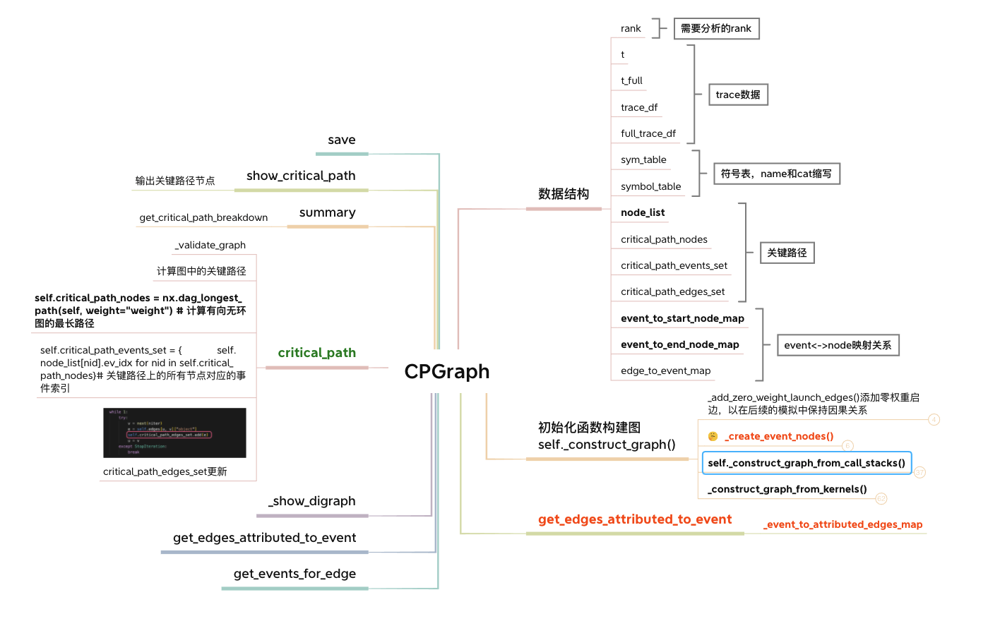

---

##### 1. CPGraph类及其属性
```python
CPGraph(
    t: Optional[ForwardRef('Trace')],
    t_full: 'Trace',
    rank: int,
    G=None,
) -> None
```

- **trace_df (pd.DataFrame)** ：
用于存储构建该图所依据的trace事件数据。它包含了程序执行过程中各种事件的信息，如事件类型、发生时间、相关资源等，是构建关键路径分析图的基础数据来源。
- **symbol_table (TraceSymbolTable)**：
这是一个符号表，用于对trace的符号进行编码。在程序执行的trace数据中，会涉及到各种符号，如函数名、变量名等，符号表的作用是将这些符号进行编码转换，便于在图结构中进行统一的处理和表示。
- **node_list (List[int])** ：
它是一个整数列表，列表中的每个元素代表一个关键路径节点对象。列表的索引对应的就是节点id，通过这个列表可以根据节点id快速地获取到对应的节点对象，节点对象中包含了与该节点相关的详细信息，如节点类型、执行时间等。
- **critical_path_nodes (List[int])**：
这是关键路径上的节点id列表。它明确标识了在关键路径上的各个节点，通过这些节点id可以在node_list中找到对应的节点对象，从而了解关键路径上各个节点的具体情况，这一列表有助于快速定位和分析关键路径上的关键节点。
- **critical_path_events_set (Set[int])**：
它是一个整数集合，存储了与关键路径节点对应的事件id。在trace数据中，每个事件都有一个唯一的id，这个集合中的事件id代表了关键路径上所涉及的事件。通过对这些事件的分析，可以了解关键路径上各个节点对应的事件的具体内容和执行情况。
- **critical_path_edges_set (Set[CPEdge])**：
这是一个CPEdge对象的集合，表示关键路径上的边。边代表了节点之间的依赖关系或执行顺序，CPEdge对象中包含了边的起始节点、结束节点以及边的相关属性等信息。通过这个集合可以了解到关键路径上各个节点之间的连接关系和依赖情况。


---
##### 2. CPGraph节点和边相关数据结构
```python
@dataclass
class CPNode:
    idx: int = -1 # 节点的唯一标识符
    ev_idx: int = -1 # 事件索引，用于关联到具体的事件记录
    ts: int = 0 # 时间戳
    is_start: bool = False # 表示该节点是一个operator或kernel的开始节点还是结束节点
    # Cache the is blocking calls in the object
    is_blocking: bool = False # 表示该节点是否是一个阻塞调用，用于区分某些操作是否会在执行过程中阻塞其他操作的执行

    # 调试
    def __repr__(self) -> str:
        ...

# 定义枚举变量
class CPEdgeType(Enum):
    OPERATOR_KERNEL = "critical_path_operator" # 该边代表一个operator或kernel的执行时间跨度
    DEPENDENCY = "critical_path_dependency" # 该边代表operator或kernel之间的依赖关系，这种依赖关系本身不带有时间权重，只是表示执行顺序上的依赖
    KERNEL_LAUNCH_DELAY = "critical_path_kernel_launch_delay" # 该边代表kernel启动的延迟时间，例如从CPU决定启动一个GPUkernel到kernel实际开始执行之间的时间间隔
    KERNEL_KERNEL_DELAY = "critical_path_kernel_kernel_delay" # 该边代表kernel之间的延迟，可能是在GPU上一个kernel结束后到下一个kernel开始前的延迟
    SYNC_DEPENDENCY = "critical_path_sync_dependency" # 该边代表同步操作导致的依赖关系，例如在CPU和GPU之间进行数据同步时产生的依赖

# 用于表示关键路径有向图中边的数据类，每条边连接两个节点，表示它们之间的时间跨度或依赖关系
@dataclass(frozen=True)
class CPEdge:
    # begin and end node indices
    begin: int # 边的起始节点索引
    end: int # 边的结束节点索引
    weight: int = 0 # 边的权重，代表时间。对于表示时间跨度的边（如operator或kernel的执行时间、延迟等），这个权重是一个非零的值；而对于表示依赖关系的边，权重通常为0
    type: CPEdgeType = CPEdgeType.OPERATOR_KERNEL

@dataclass(frozen=True)
class _CPGraphData:
    node_list: List[CPNode] # 关键路径节点列表
    critical_path_nodes: List[int] # 关键路径节点索引列表
    critical_path_events_set: Set[int] # 关键路径事件索引集合
    critical_path_edges_set: Set[CPEdge] # 关键路径边集合
    event_to_start_node_map: Dict[int, int] # 事件索引到起始节点索引的映射
    event_to_end_node_map: Dict[int, int] # 事件索引到结束节点索引的映射
    edge_to_event_map: Dict[Tuple[int, int], int] # 边索引到事件索引的映射

```
---

#### 3.3.5 CPGraph的两种初始化方法

1. **从头开始生成关键路径分析图**：这种方式是基于原始数据（如程序执行的trace数据等）来构建关键路径图。它会根据提供的trace信息、指定的rank等参数，从头创建关键路径图对象，包括构建图的节点、边以及相关的属性等。
2. **恢复序列化的CPGraph对象**：这里的CPGraph应该是指关键路径图对象。在这种方式下，会利用`networkx.DiGraph`对象G来恢复之前序列化的CPGraph对象，具体可以通过该文件中的`restore_cpgraph()`函数来实现。序列化是一种将对象转换为字节流的形式以便存储或传输的过程，而恢复序列化的对象则是将字节流重新转换为原来的对象，这在需要对之前生成的关键路径图进行重新加载和使用时非常有用。


CPGraph初始化函数`self._construct_graph()`负责根据trace数据生成CPNode以及node和event的映射关系。
##### 1. 创建节点

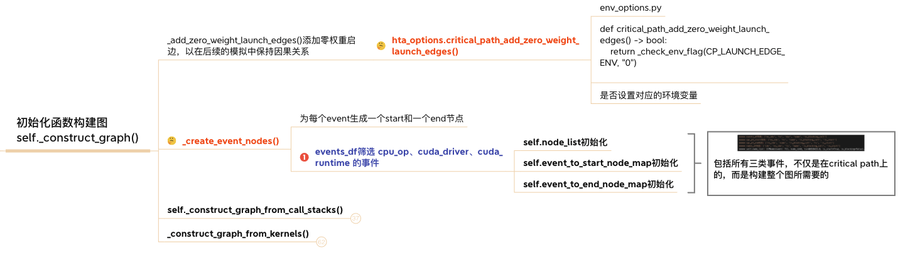
```python
    @timeit
    def _create_event_nodes(self) -> None:
        """Generates a start and end node for every event we would like
        to represent in our graph"""
        logger.debug(list(self.trace_df.columns))
        logger.debug(self.trace_df.head())

        events_df = (
            self.trace_df.query(
                self.symbol_table.get_operator_or_cuda_runtime_query() # (cat == 27 or cat == -128 or cat == 37)
                + " or (stream != -1 and index_correlation >= 0)"
            )[["index", "ts", "dur", "name"]]
        ).rename(columns={"index": "ev_idx"})

        # 确定阻塞调用
        blocking_calls = {
            s
            for b in self.BLOCKING_SYNC_CALLS
            if (s := self.symbol_table.sym_index.get(b)) is not None
        }
        logger.debug(f"Blocking calls: {blocking_calls}") # Blocking calls: {9, 52, 87} 过滤存在的阻塞调用

        events_df["is_blocking_call"] = events_df.name.isin(blocking_calls) 
        # 创建开始节点和结束节点的数据框
        ops_df_start = events_df.copy()  
        ops_df_end = events_df.copy()
        # start节点的ts和dur列
        ops_df_start.drop(axis=1, columns=["dur"], inplace=True) # 原地删除dur列
        ops_df_start["is_start"] =  True # 添加is_start列,值为True
        
        # end节点的ts和dur列
        ops_df_end["end"] = ops_df_end["ts"] + ops_df_end["dur"] # 计算结束时间
        ops_df_end.drop(axis=1, columns=["dur", "ts"], inplace=True) # 删除dur和ts列
        ops_df_end.rename(columns={"end": "ts"}, inplace=True) # 重命名end列为ts
        ops_df_end["is_start"] = False # 添加is_start列,值为False,表示这是事件的结束节点
        
        # 合并开始节点和结束节点的数据框
        nodes_df = (
            pd.concat([ops_df_start, ops_df_end])
            .sort_values(by="ts", axis=0) # 按ts列升序排序
            .reset_index(drop=True) # 重置索引
            .reset_index(names="idx") # 重置索引并命名为idx
        )

        # Create nodes
        _df = nodes_df
        self.node_list = [  # 使用_df中的数据创建CPNode对象
            CPNode(*args) 
            for args in zip(
                _df["idx"],
                _df["ev_idx"],
                _df["ts"],
                _df["is_start"],
                _df["is_blocking_call"],
            )
        ]

        _df = nodes_df[nodes_df.is_start]
        self.event_to_start_node_map = dict(zip(_df["ev_idx"], _df["idx"])) # 把ev_idx和idx两列提取出来作为字典的键值对
        _df = nodes_df[~nodes_df.is_start]
        self.event_to_end_node_map = dict(zip(_df["ev_idx"], _df["idx"]))
        # 确保开始节点映射和结束节点映射数量相同
        assert len(self.event_to_start_node_map) == len(self.event_to_end_node_map)
```
##### 2. 创建边
构建边的过程分为以下两种情况：
1. **`_construct_graph_from_call_stacks`**: CPU operators调用栈采用dfs维护调用栈状态，自动识别高低阶operator依赖关系，零权重边用于表示层级调用关系
    - 首先按照ts排列所有cpu_op事件，将start_node和end_node一起排序，采用`dfs_traverse`遍历整个协议栈,如果遇到start_node调用`enter_func`,如果遇到end_node调用`exit_func`
    - enter_func:
        - 如果 link_operators and op_depth=0 and last_highlevel_op!=None 调用`_add_edge_helper(last_highlevel_op,start_node, type=CPEdgeType.DEPENDENCY)`
        - 如果 last_node != None调用`_add_edge_helper(last_node, start_node)`

    - exit_func:
        - 如果 last_node != None 调用`_add_edge_helper(last_node, end_node, zero_weight)`
    
    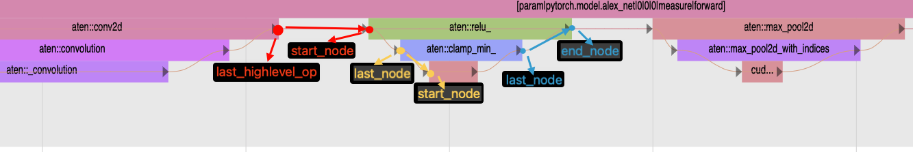
2. **`_construct_graph_from_kernels`**:GPU kernels graph，同步设备产生跨设备依赖边，保证首个GPU kernel有明确的CPU启动源
    - 遍历每行gpu_kernels
    - 如果是同步事件，调用`handle_cuda_sync`->`_add_gpu_cpu_sync_edge(gpu_end_node, row.index_correlation)`->`_add_edge_helper(gpu_node, end_node, type=CPEdgeType.SYNC_DEPENDENCY)`
    - 添加正常kernels执行过程所花费的时间,`_add_edge_helper(start_node, end_node) # OPERATOR_KERNEL`
    - 添加kernel同步边,`_add_edge_helper(kernel_sync_end, start_node, type=CPEdgeType.SYNC_DEPENDENCY)`
    - 判断是否需要添加kernel启动延迟,调用`_add_kernel_launch_delay_edge()->_add_edge_helper(runtime_start, kernel_start_node, type=CPEdgeType.KERNEL_LAUNCH_DELAY,zero_weight=zero_weight)`，添加零延迟启动边
    - 判断kernels间依赖情况,调用`_add_edge_helper(type=CPEdgeType.KERNEL_KERNEL_DELAY)`
    - 最后，如果需要重构关键路径图，如果最开始是一个GPU kernel事件，也要默认加一条启动边，表示实际由CPU启动对应的GPU事件

以上两种创建边的示意图如下图所示：
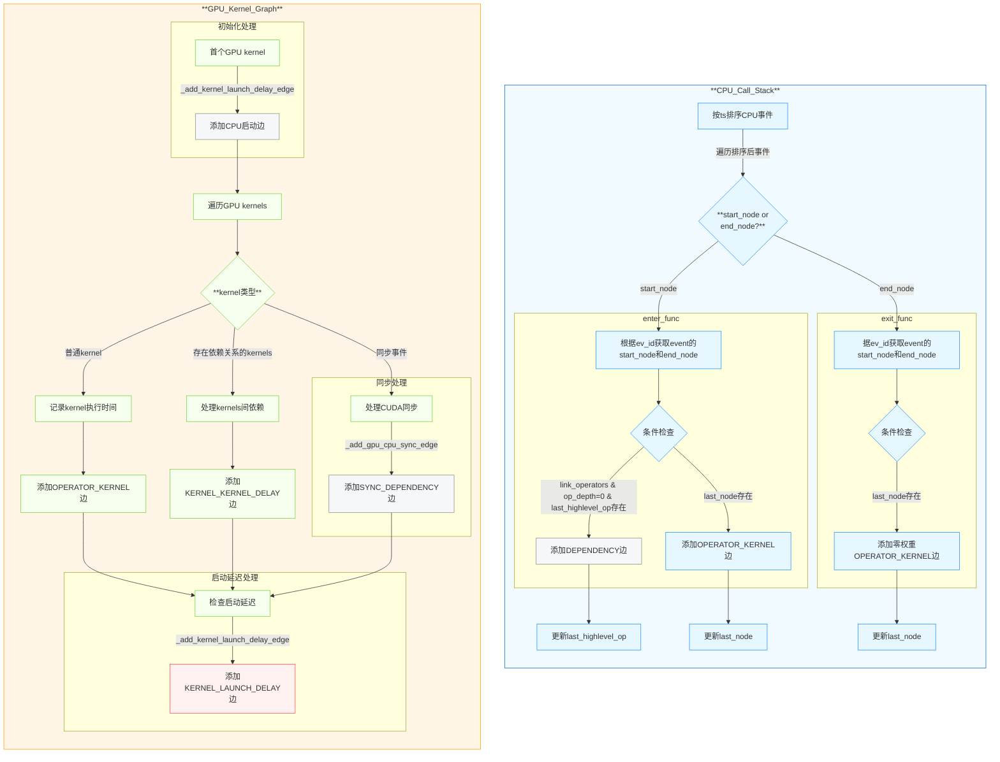

在DAG中添加边的`_add_edge_helper`函数细节如下：
```python
    # 在两个nodes之间添加edge
    def _add_edge_helper(
        self,
        src: CPNode,
        dest: CPNode,
        type: CPEdgeType = CPEdgeType.OPERATOR_KERNEL,
        zero_weight: bool = False, #TODO 为啥还要定义zero_weight?
    ) -> CPEdge:
        """Adds a edge between two nodes
        Args: src, dest (CPNode): node objects for source and dest."""
        if logger.isEnabledFor(logging.DEBUG):
            logger.debug(
                f"Adding an edge between nodes {src.idx} -> {dest.idx}"
                f" type = {type}"
            )
        # Check if src and dest are same
        assert src.idx != dest.idx, f"Src node {src} == Dest node {dest}" 

        weight = (
            0
            if (
                type in [CPEdgeType.DEPENDENCY, CPEdgeType.SYNC_DEPENDENCY]
                or zero_weight
            )
            else (dest.ts - src.ts)
        )

        e = CPEdge(begin=src.idx, end=dest.idx, weight=weight, type=type)
        self._add_edge(e)
        return e

```

##### **3. CPU调用栈及相关GPU事件方法分析**
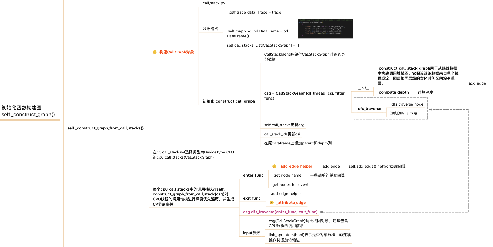
构建CPU调用栈函数细节如下:
```python
    @timeit
    def _construct_graph_from_call_stacks(self) -> None:
        cg = CallGraph(self.t, ranks=[self.rank]) # 构建调用图
        cpu_call_stacks = ( 
            csg for csg in cg.call_stacks if csg.device_type == DeviceType.CPU 
        )
        for csg in cpu_call_stacks:
            self._construct_graph_from_call_stack(csg)

```


##### **4. GPU kernels构建关键路径图方法分析**
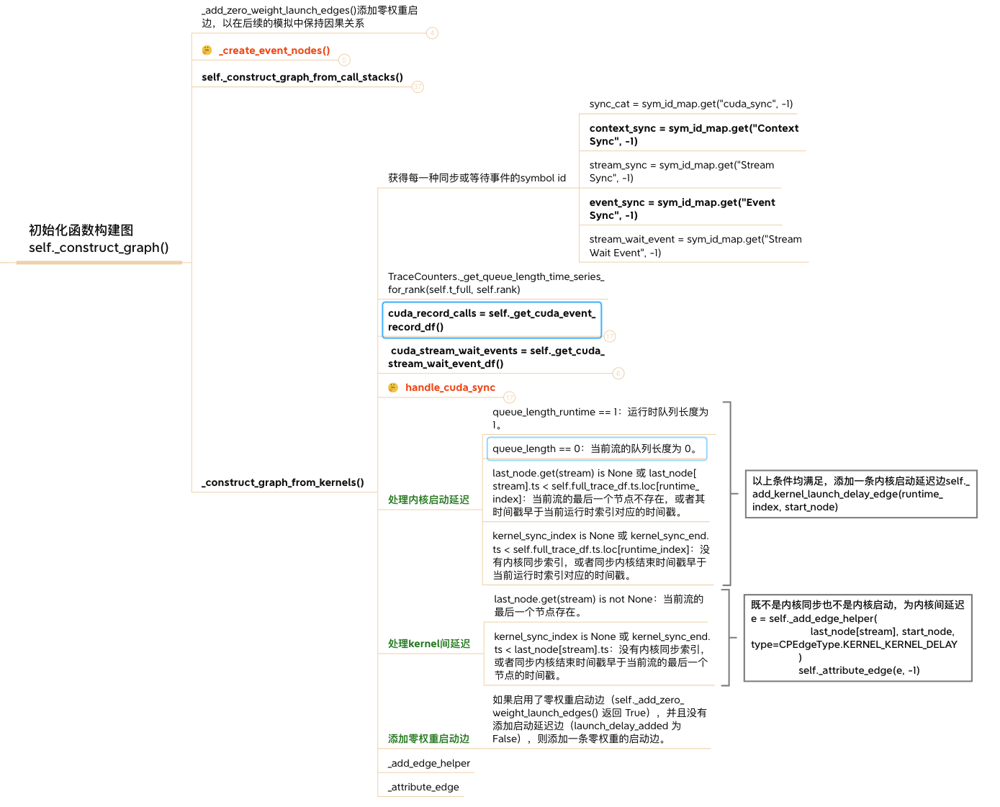
构建GPU Kernel Graph的函数细节如下:
```python
       # 从GPUkernel构建关键路径图
    def _construct_graph_from_kernels(self) -> None:
        """Create nodes and edges for GPU kernels"""
        # 获取同步事件符号ID
        sym_id_map = self.symbol_table.get_sym_id_map()
        sync_cat = sym_id_map.get("cuda_sync", -1)
        ...

        # 获取队列长度时间序列
        q = TraceCounters._get_queue_length_time_series_for_rank(...)
        gpu_kernels = (
            self.trace_df.query(...)
            .join(q[...])  # 关联队列长度数据
            ...
        )

        # 处理CUDA事件记录和流等待事件
        cuda_record_calls = self._get_cuda_event_record_df() 
        cuda_stream_wait_events = self._get_cuda_stream_wait_event_df()
        ...

        # 处理事件同步关联
        if ...:
            gpu_kernels = pd.merge(...)  # 合并事件记录数据

        # 按时间排序kernel和同步事件
        gpu_kernels["end_ts"] = ...  # 计算结束时间
        gpu_kernels.sort_values(...)  # 排序逻辑

        last_node: Dict[int, CPNode] = {}  # 流最后节点缓存
        kernel_sync: Dict[int, int] = {}   # GPU-GPU同步映射

        def handle_cuda_sync(row):
            # 处理各种同步事件
            if name == stream_wait_event or name == event_sync:
                if ...:  # 校验事件同步条件
                    return
                ...
                # 添加GPU-CPU同步边
                self._add_gpu_cpu_sync_edge(...)
            else:
                # 上下文同步和流同步处理
                for gpu_node in ...:  # 获取需要同步的节点
                    self._add_gpu_cpu_sync_edge(...)

        # 主循环处理所有kernel/同步事件
        for row in gpu_kernels.itertuples(...):
            if row.cat == sync_cat:  # 处理同步事件
                handle_cuda_sync(row)
                continue

            # 创建kernel节点和边
            start_node, end_node = self.get_nodes_for_event(...)
            self._add_edge_helper(...)  # 添加kernel执行边

            # 处理kernel间同步依赖
            if kernel_sync_index is not None:
                self._add_edge_helper(...)  # 添加SYNC_DEPENDENCY边

            # 处理kernel启动延迟
            if ...:  # 满足启动延迟条件
                self._add_kernel_launch_delay_edge(...)
            elif ...:  # 处理kernel间延迟
                self._add_edge_helper(...)  # KERNEL_KERNEL_DELAY边

            # 确保启动边存在
            if ...:
                self._add_kernel_launch_delay_edge(...)  # 0权值边

            last_node[stream] = end_node  # 更新流最后节点
```
##### **5. _get_cuda_event_record_df函数分析**
`_get_cuda_event_record_df`函数的主要目的是从追踪数据中提取**cudaEventRecord**事件，并将其与最近的 CUDA kernel启动事件相关联。
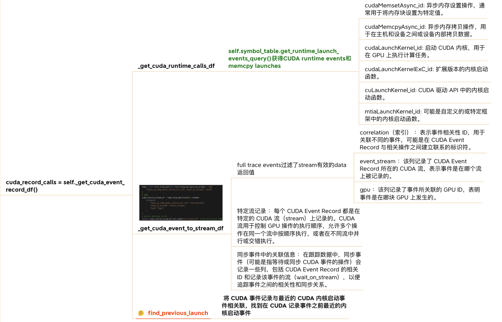

##### **6. _get_cuda_stream_wait_event_df函数分析**
`_get_cuda_stream_wait_event_df`函数的主要功能是识别**cudaStreamWaitEvent**事件之后，在相同CPU线程和CUDA流上启动的最近CUDA kernel或内存拷贝操作。该函数构建了一个数据框，其中包含这些流等待事件以及它们对应的下一个kernel启动信息。
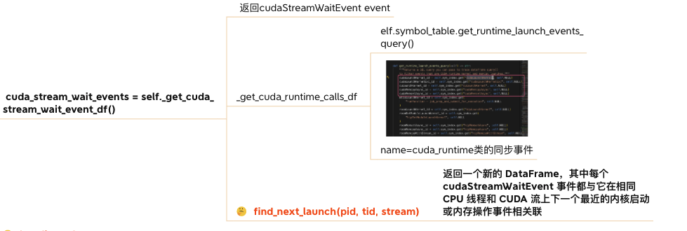

##### **7.handle_cuda_sync函数分析**
`handle_cuda_sync`函数主要负责处理不同的事件同步类型并添加同步边。
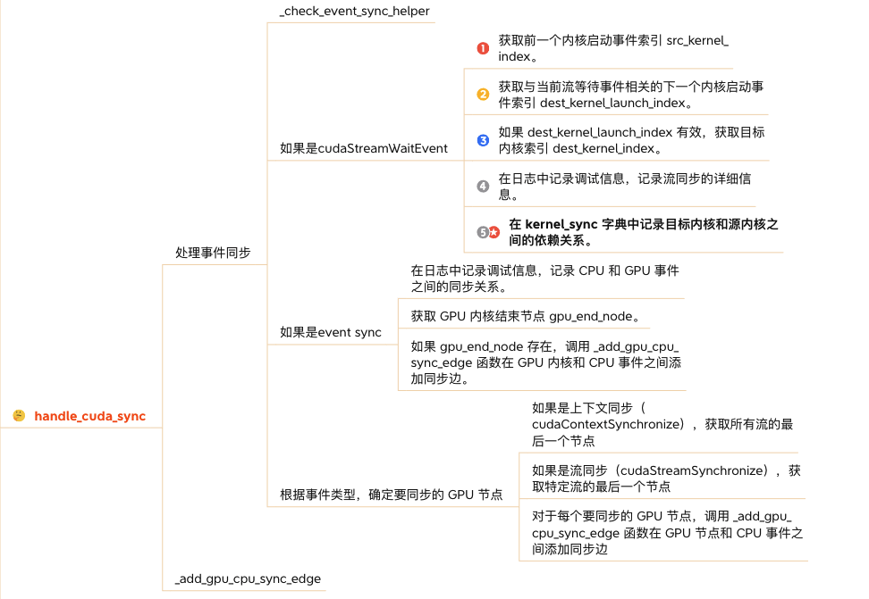

---

#### **3.3.6 关键路径搜索**  
利用networkx库中DiGraph关键路径搜索算法nx.dag_longest_path
```python
    def critical_path(self) -> bool:
        """Calculates the critical path across nodes"""
        t0 = time.perf_counter()
        if not self._validate_graph(): # 验证图的有效性
            raise ValueError(
                "Graph is not valid, see prints above for help on debugging"
            )
        try:
            self.critical_path_nodes = nx.dag_longest_path(self, weight="weight") # 计算有向无环图的最长路径
        except nx.NetworkXUnfeasible as err:
            logger.error(f"Critical path algorithm failed due to {err}")
            return False
        assert len(self.critical_path_nodes) >= 2 # 关键路径节点数大于等于2
        # 关键路径上的所有节点对应的事件索引
        self.critical_path_events_set = {
            self.node_list[nid].ev_idx for nid in self.critical_path_nodes
        }

        # Reset critical_path_edges_set across invocations
        self.critical_path_edges_set = set()

        # Add edges connecting the nodes along the critical path
        niter = iter(self.critical_path_nodes)
        u = next(niter)

        while 1:
            try:
                v = next(niter)
                e = self.edges[u, v]["object"]
                self.critical_path_edges_set.add(e)
                u = v
            except StopIteration:
                break

        t1 = time.perf_counter()
        logger.info(f"calculating critical path took {t1 - t0:2f} seconds")
        assert len(self.critical_path_edges_set) == (len(self.critical_path_nodes) - 1)
        return True
  
```


---

## **4. 应用案例分析**  
### **4.1 Large Training Job 2&3 iterations Traces**  
**问题场景**：分析真实训练任务的trace数据，识别不同迭代中的性能瓶颈，并确定哪些任务或阶段持续成为瓶颈，以及哪些依赖关系对关键路径的影响较大。

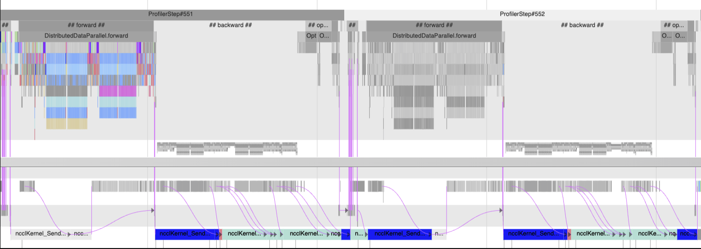

**关键路径分析结果**：  
- 最开始关键路径在CPU上，而且会发现有很多很小的GPU核，说明当前GPU不繁忙并未充分利用

- 然后关键路径转移到NCLL all_to_all和all_reduce，在当前的backward和下一个iteration的forward方法中，故而通信不平衡降低了这个工作流的整体性能。关键路径转移到了NCCL通信操作，说明通信操作的执行时间较长，可能是由于不同GPU之间的数据传输存在不平衡，或者可能是由于网络拥塞，不同GPU之间的数据传输速率差异，或者模型的通信模式不均匀等原因引起的

- 最后迭代尾声阶段，关键路径又出现在由优化器启动的GPU kernel上，说明参数更新阶段的GPU的计算任务也对整体的执行时间有显著影响。

> 为什么要分析多个iteration?
> 1. 不同iteration中的critical path可能涉及多个不同的流水线阶段或任务，通过分析多个iteration，可以识别出在不同阶段中影响效率的关键因素。
> 2. 数据集的分布可能会影响数据加载和预处理的时间，硬件资源的利用率也可能因为其他进程的干扰而产生波动，通过在多个迭代中进行分析，可以更好地适应这些变化。


**优化方案**：  
- 在初始阶段，通过增大 batch size 提高 GPU 的利用率，充分发挥其并行计算能力。
- 在中间阶段，采用更高效的通信策略如混合并行（mixed parallelism）或梯度压缩（gradient compression），或通过通信计算重叠减少对计算的阻塞，以减少通信操作对关键路径的影响。
- 在迭代尾声阶段，优化GPU kernel代码，减少计算复杂度，通过优化kernel调度或减少kernel启动的开销来提高执行效率。


---
## **5. 现有缺陷**
1. 目前不涉及算子之间的**数据依赖**关系，当前分析框架只能从任务的先后顺序和执行时间等角度来确定关键路径，而无法深入到数据层面去分析算子之间更细致的依赖情况？ 
2. CPEdgeType.*DEPENDENCY*类型的edge，如果是在GPU同步CPU类似的情况，是同时考虑的同步延迟和同步依赖关系，还是只考虑了同步依赖关系，忽略了同步带来的延迟？
3. 关键路径上CPU/GPU所花费的时间，并列出进一步的详细信息
4. 返回的networkx DiGraph对象，用户可以对改图进行修改，比如调整节点、边的属性和结构，以模拟硬件和的改变或优化措施
6. 重新绘制trace和关键路径，在模拟了优化或硬件变化之后，重新绘制图像可以让用户直观的看到优化前后的差异，更清晰地了解优化的效果以及硬件变化对系统行为的影响


---
## **6. 参考文献**  
有关轻量级关键路径分解：
https://hta.readthedocs.io/en/latest/source/features/lightweight_critical_path_analysis.html

Using Chakra execution traces for benchmarking and network performance optimization:
https://engineering.fb.com/2023/09/07/networking-traffic/chakra-execution-traces-benchmarking-network-performance-optimization/

critical path analysis脚本:
https://github.com/facebookresearch/HolisticTraceAnalysis/blob/main/examples/experimental/critical_path_analysis.ipynb

Scalable critical-path analysis and optimization guidance for hybrid MPICUDA applications:
https://www.hzdr.de/publications/PublDoc-9225.pdf

Critical path analysis CPU operator events :
https://github.com/facebookresearch/HolisticTraceAnalysis/pull/67

[2/n] Critical Path analysis for GPU events and CPU->GPU and GPU->CPU dependencies:
https://github.com/facebookresearch/HolisticTraceAnalysis/pull/68

[3/N] Add critical path analysis GPU->GPU sync dependencies
https://github.com/facebookresearch/HolisticTraceAnalysis/pull/69

Daydream:Accurately Estimating the Efficacy of Optimizations for DNN Training
https://www.usenix.org/system/files/atc20-zhu-hongyu.pdf

PyTorch Kineto：深入剖析CPU+GPU性能的利器:
https://blog.csdn.net/gitblog_00570/article/details/144285403

MLPerf:https://engineering.fb.com/2018/12/12/ml-applications/mask-r-cnn2go/

Chakra Execution Trace:
https://github.com/mlcommons/chakra

epoch和iteration的区别:
https://blog.csdn.net/liuyanfeier/article/details/60964475

API synchronization behavior:
https://docs.nvidia.com/cuda/cuda-runtime-api/api-sync-behavior.html#api-sync-behavior__memcpy-sync

Event Management:
https://docs.nvidia.com/cuda/cuda-runtime-api/group__CUDART__EVENT.html

networkx Docs:
https://www.osgeo.cn/networkx/reference/algorithms/generated/networkx.algorithms.dag.dag_longest_path.html

Tracer parser and loader backend:
https://github.com/facebookresearch/HolisticTraceAnalysis/pull/125

pyreverse和graphviz绘制python项目结构图:
https://lin-zone.github.io/2019/07/17/graphviz-pyreverse/