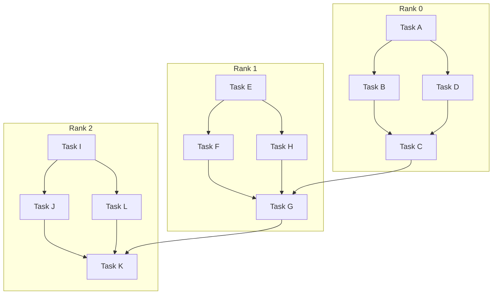
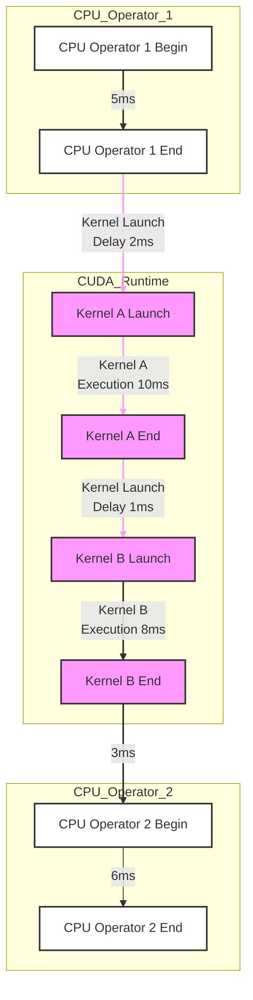
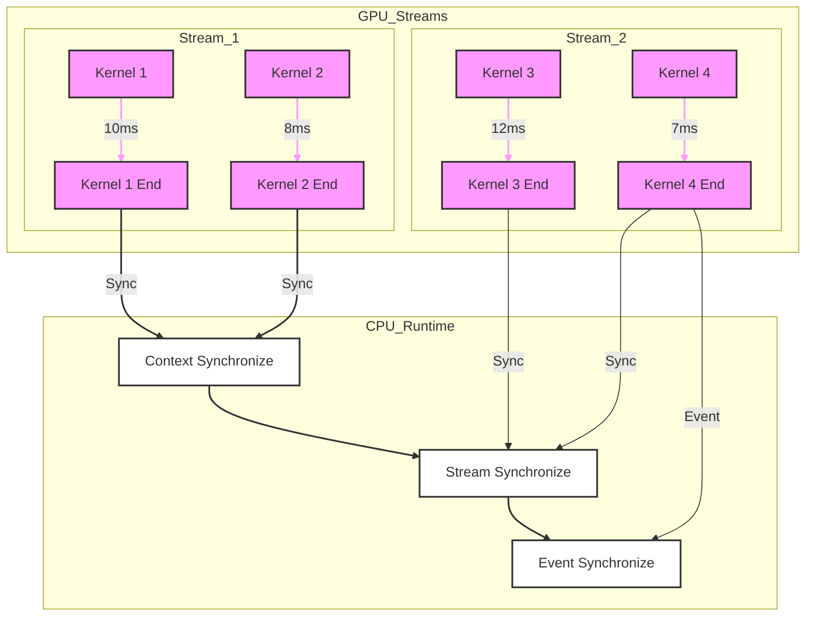

# 关键路径分解
有关轻量级关键路径分解：
https://hta.readthedocs.io/en/latest/source/features/lightweight_critical_path_analysis.html

Using Chakra execution traces for benchmarking and network performance optimization:
https://engineering.fb.com/2023/09/07/networking-traffic/chakra-execution-traces-benchmarking-network-performance-optimization/

critical path analysis脚本:
https://github.com/facebookresearch/HolisticTraceAnalysis/blob/main/examples/experimental/critical_path_analysis.ipynb

Scalable critical-path analysis and optimization guidance for hybrid MPICUDA applications:
https://www.hzdr.de/publications/PublDoc-9225.pdf

Critical path analysis CPU operator events :
https://github.com/facebookresearch/HolisticTraceAnalysis/pull/67

[2/n] Critical Path analysis for GPU events and CPU->GPU and GPU->CPU dependencies:
https://github.com/facebookresearch/HolisticTraceAnalysis/pull/68

[3/N] Add critical path analysis GPU->GPU sync dependencies
https://github.com/facebookresearch/HolisticTraceAnalysis/pull/69

PyTorch Kineto：深入剖析CPU+GPU性能的利器:
https://blog.csdn.net/gitblog_00570/article/details/144285403

MLPerf:https://engineering.fb.com/2018/12/12/ml-applications/mask-r-cnn2go/

Chakra Execution Trace:
https://github.com/mlcommons/chakra

epoch和iteration的区别:
https://blog.csdn.net/liuyanfeier/article/details/60964475

关键路径分析的核心思想是找出大型系统中构成起始和结束之间最长路径的操作。关键路径上的操作会显著影响程序的整体性能。

原有算子优化后，如果运算符的优化超出某个点，关键路径可能会发生变化；例如上图中的`mult()`变得比`add1()`短。此时`add1()`变成了关键操作。

关键路径分析是HPC和AI/ML优化中常用的技术。它可以通过两种方式利用：

- 性能/效率机会：关键路径上的操作/内核应该成为性能分析和优化的目标。它们可以为性能提升提供“最佳性价比”。关键路径可以让我们了解训练迭代是否受X%CPU限制、Y%GPU限制，或者分布式训练的Z%通信限制。分析不仅限于CPU/GPU内核计算部分。**启动或执行CUDA内核的延迟**也可能构成关键路径的很大一部分。这可以通过**运算符融合（Pytorch2.0）**和**CUDA图**等进行优化。
- 模拟改进/收益：确定关键路径后，我们可以通过简单地修改图表并重新运行关键路径查找算法来估计改进。

### 为什么是轻量级？

分析此类依赖关系的空间非常广阔。我们可以通过分析**多rank的关键路径**来更好地理解诸如**落后进程**stragglers等问题，并考虑**PyTorch操作符之间的张量输入/输出依赖关系**。这种关键路径分析的主要目的是识别训练循环中的主要性能瓶颈——是CPU,GPU计算还是GPU通信。

> 张量操作符之间的输入输出关系是指在深度学习框架（如 PyTorch 或 TensorFlow）中，张量（tensor）如何作为数据在不同的操作符（operator）之间流动和转换。这种关系是神经网络计算的核心，因为它描述了数据如何通过网络的各个层进行传播和变换。
操作符是指对张量进行操作的函数或层。例如，线性层（linear layer）、卷积层（convolutional layer）、激活函数（activation function）等都是操作符。每个操作符接收一个或多个张量作为输入，进行特定的计算，并输出一个或多个张量。

#### 核心假设

为了简化PyTorch操作符之间的依赖关系分析，我们做出了以下关键假设：

1. **CPU操作符的串行依赖关系**：假设所有PyTorch CPU操作符都依赖于在相应CPU线程上最后执行的操作符。这简化了分析，假设CPU操作是顺序执行的。
2. **CPU和GPU之间的依赖关系**：我们还考虑了CPU和GPU操作之间的依赖关系。这包括<mark>内核启动、内核之间的时间延迟以及同步事件</mark>。

关键路径分析的主要动机是识别training loop中的主要瓶颈是CPU, GPU计算还是GPU通信。

> 在深度学习框架（如 PyTorch）中，CPU操作符通常会顺序执行。假设一个CPU线程上的操作符会等待该线程上一个操作符完成后才开始执行。这简化了分析，因为可以将CPU操作视为顺序链，**无需考虑复杂的并行或重叠执行情况**。假设CPU线程上有操作符A、B和C。操作符B会等待操作符A完成后再开始，操作符C又会等待操作符B完成后再开始。这种顺序执行的假设使得分析CPU 操作符之间的依赖关系变得简单明了。

> 内核启动：CPU需要将内核（kernel）发送到GPU上执行。从CPU发出启动信号到GPU实际开始执行内核之间存在时间延迟。

> 内核之间的时间延迟：多个内核在GPU上执行时，内核之间可能存在时间延迟。这些延迟可能源于GPU的任务调度、资源分配或执行依赖等因素。

> 同步事件：在CPU和GPU之间可能会有同步操作，确保CPU和GPU操作按特定顺序执行。例如，CPU可能需要等待GPU完成某个内核后才能继续执行后续操作，或者GPU可能需要等待CPU完成数据准备后才能启动内核

#### 同步依赖

CPU 运行时（CPU Runtime）：
- 上下文同步（Context Synchronize）：表示全局同步，等待所有GPU流中的内核完成。
- 流同步（Stream Synchronize）：表示单一流同步，等待特定流中的内核完成。
- 事件同步（Event Synchronize）：表示基于事件的同步，通常用于GPU到GPU的同步。

同步边（Synchronization Edges）：
- 上下文同步边：从所有流中的最后一个内核（Kernel 1 End 和 Kernel 2 End）到 Context Synchronize。
- 流同步边：从流2中的最后一个内核（Kernel 4 End）到 Stream Synchronize。
- 事件同步边：从流2中的最后一个内核（Kernel 4 End）到 Event Synchronize，表示基于事件的同步。

#### 未来增强

操作符的数据依赖部分可以在以后添加，这将进一步使我们能够获得诸如操作和子图重新排序的见解。我们可以通过Chakra执行追踪来跟踪张量之间的数据依赖关系。此版本的关键路径分析不需要执行追踪。

总结来说，这种轻量级的关键路径分析提供了一种简化的方法，可以在不需要复杂的执行追踪的情况下，快速识别训练循环中的主要性能瓶颈。

操作符的数据依赖部分
含义：在深度学习框架（如PyTorch）中，操作符之间的数据依赖关系指的是一个操作符的输出张量作为另一个操作符的输入张量时所形成的依赖关系。例如，线性层操作符的输出张量会作为激活函数操作符的输入张量，这就是一种数据依赖关系。

获得诸如操作和子图重新排序的见解

含义：通过分析操作符之间的数据依赖关系，可以了解操作的执行顺序和依赖关系。这有助于优化操作的执行顺序，或者将相关的操作组合成子图进行优化。例如，如果发现某些操作之间存在数据依赖，但执行顺序不合理，可以重新排序以提高效率。

通过Chakra执行追踪来跟踪张量之间的数据依赖关系
含义：Chakra执行追踪是一种标准化的工作负载规范，用于捕获关键操作和依赖关系。它提供了一种图模式来表示AI/ML工作负载的执行过程，包括计算、内存和通信等核心操作，以及它们的依赖关系、时间和元数据。通过Chakra执行追踪，可以详细跟踪张量之间的数据依赖关系，这对于分析和优化深度学习模型的执行过程非常有用。

以下是关于如何实现上述功能以及重新排序子图含义的介绍：

### 实现功能的方法

- **集成Chakra执行跟踪**：
    - **收集执行跟踪数据**：在支持的机器学习框架（如PyTorch、TensorFlow等）中启用相应的工具来收集模型执行时的操作和依赖关系等信息，生成原始的执行跟踪数据。例如，在PyTorch中可以启用Execution Graph Observer来收集这些数据。
    - **转换为Chakra ET格式**：使用ET转换器将收集到的原始执行跟踪数据转换为Chakra定义的标准化ET格式。这样可以确保不同框架的执行跟踪数据具有统一的结构和语义，便于后续的分析和处理。
    - **利用Chakra工具链进行分析**：借助Chakra提供的执行跟踪可视化器、时间线可视化器等工具，对转换后的ET进行分析和理解，查看操作节点、依赖关系以及执行时间等信息，从而发现性能瓶颈和优化机会。

- **摘要统计关键路径上的时间及详细信息**：
    - **关键路径识别**：通过对Chakra ET的分析，确定整个执行过程中的关键路径。关键路径是指从开始节点到结束节点的最长路径，其决定了整个执行过程的最短完成时间。可以使用图算法来遍历Chakra ET所表示的有向无环图（DAG），计算每个节点到开始节点和结束节点的距离，从而找出关键路径。
    - **时间统计与信息提取**：在确定关键路径后，对路径上的各个节点（包括CPU和GPU操作节点）所花费的时间进行统计和汇总，分别计算CPU和GPU所花费的总时间。同时，进一步分析内核启动延迟、内核到内核延迟以及其他开销所花费的时间。这些详细信息可以通过解析Chakra ET中的节点属性和时间戳等信息来获取。

- **模拟新硬件和优化获胜**：
    - **修改Networkx DiGraph对象**：由于Chakra的分析器会返回一个Networkx DiGraph对象，用户可以直接对该对象进行修改，例如调整节点的执行顺序、添加或删除节点及边等，以模拟不同的优化方案或硬件配置下的执行图。
    - **重新计算关键路径**：在修改了DiGraph对象后，重新运行关键路径识别算法，计算新的关键路径以及对应的执行时间等信息，评估优化方案或新硬件配置对性能的影响。
    - **重新绘制轨迹和新的关键路径**：利用Chakra的执行跟踪可视化器等工具，将修改后的DiGraph对象重新绘制为执行轨迹图，并突出显示新的关键路径，以便更直观地观察和分析变化情况。同时，可以将模拟结果与其他相关工具（如性能模型或仿真器）结合，进一步评估其在实际系统中的表现。

### 重新排序子图的含义

重新排序子图是指在Chakra执行跟踪所表示的图结构中，对子图内的节点执行顺序进行调整和优化。子图可以是整个执行图中的一个相对独立的局部区域，其中包含了多个相互关联的操作节点。通过对子图重新排序，可以探索不同的执行顺序对整体性能的影响，以发现潜在的优化机会，例如减少数据依赖等待时间、提高并行执行效率等。常见的重新排序子图的方法包括基于依赖关系的调度优化、基于资源利用率的负载均衡调整等。

epoch——使用整个训练样本集传播一次。

一次传播 = 一次前向传播 + 一次后向传播。（所有的训练样本完成一次Forword运算以及一次BP运算）

但是考虑到内存不够用的问题，训练样本们往往并不是全都一起拿到内存中去训练，而是一次拿一个batch去训练，一个batch包含的样本数称为batch size。

iteration——使用batch size个样本传播一次。同样，一次传播 = 一次前向传播 + 一次后向传播。

eg. 我们有1000个训练样本，batch size为100，那么完成一次epoch就需要10个iteration。
                
