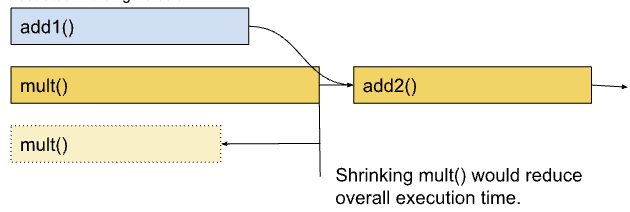

# 关键路径分解
有关轻量级关键路径分解：
https://hta.readthedocs.io/en/latest/source/features/lightweight_critical_path_analysis.html

Using Chakra execution traces for benchmarking and network performance optimization:
https://engineering.fb.com/2023/09/07/networking-traffic/chakra-execution-traces-benchmarking-network-performance-optimization/

critical path analysis脚本:
https://github.com/facebookresearch/HolisticTraceAnalysis/blob/main/examples/experimental/critical_path_analysis.ipynb

Scalable critical-path analysis and optimization guidance for hybrid MPICUDA applications:
https://www.hzdr.de/publications/PublDoc-9225.pdf

Critical path analysis CPU operator events :
https://github.com/facebookresearch/HolisticTraceAnalysis/pull/67

[2/n] Critical Path analysis for GPU events and CPU->GPU and GPU->CPU dependencies:
https://github.com/facebookresearch/HolisticTraceAnalysis/pull/68

[3/N] Add critical path analysis GPU->GPU sync dependencies
https://github.com/facebookresearch/HolisticTraceAnalysis/pull/69

关键路径分析的核心思想是找出大型系统中构成起始和结束之间最长路径的操作。关键路径上的操作会显著影响程序的整体性能。

原有算子优化后，如果运算符的优化超出某个点，关键路径可能会发生变化；例如上图中的`mult()`变得比`add1()`短。此时`add1()`变成了关键操作。

关键路径分析是HPC和AI/ML优化中常用的技术。它可以通过两种方式利用：

- 性能/效率机会：关键路径上的操作/内核应该成为性能分析和优化的目标。它们可以为性能提升提供“最佳性价比”。关键路径可以让我们了解训练迭代是否受X%CPU限制、Y%GPU限制，或者分布式训练的Z%通信限制。分析不仅限于CPU/GPU内核计算部分。**启动或执行CUDA内核的延迟**也可能构成关键路径的很大一部分。这可以通过**运算符融合（Pytorch2.0）**和**CUDA图**等进行优化。
- 模拟改进/收益：确定关键路径后，我们可以通过简单地修改图表并重新运行关键路径查找算法来估计改进。

### 为什么是轻量级？

分析此类依赖关系的空间非常广阔。我们可以通过分析**多rank的关键路径**来更好地理解诸如**落后进程**等问题，并考虑**PyTorch操作符之间的张量输入/输出依赖关系**。这种关键路径分析的主要目的是识别训练循环中的主要性能瓶颈——是CPU,GPU计算还是GPU通信。

> 张量操作符之间的输入输出关系是指在深度学习框架（如 PyTorch 或 TensorFlow）中，张量（tensor）如何作为数据在不同的操作符（operator）之间流动和转换。这种关系是神经网络计算的核心，因为它描述了数据如何通过网络的各个层进行传播和变换。
操作符是指对张量进行操作的函数或层。例如，线性层（linear layer）、卷积层（convolutional layer）、激活函数（activation function）等都是操作符。每个操作符接收一个或多个张量作为输入，进行特定的计算，并输出一个或多个张量。

#### 核心假设

为了简化PyTorch操作符之间的依赖关系分析，我们做出了以下关键假设：

1. **CPU操作符的串行依赖关系**：假设所有PyTorch CPU操作符都依赖于在相应CPU线程上最后执行的操作符。这简化了分析，假设CPU操作是顺序执行的。
2. **CPU和GPU之间的依赖关系**：我们还考虑了CPU和GPU操作之间的依赖关系。这包括<mark>内核启动、内核之间的时间延迟以及同步事件</mark>。

> 在深度学习框架（如 PyTorch）中，CPU操作符通常会顺序执行。假设一个CPU线程上的操作符会等待该线程上一个操作符完成后才开始执行。这简化了分析，因为可以将CPU操作视为顺序链，**无需考虑复杂的并行或重叠执行情况**。假设CPU线程上有操作符A、B 和 C。操作符 B 会等待操作符 A 完成后再开始，操作符 C 又会等待操作符 B 完成后再开始。这种顺序执行的假设使得分析 CPU 操作符之间的依赖关系变得简单明了。

> 内核启动：CPU需要将内核（kernel）发送到GPU上执行。从CPU发出启动信号到GPU实际开始执行内核之间存在时间延迟。

> 内核之间的时间延迟：多个内核在GPU上执行时，内核之间可能存在时间延迟。这些延迟可能源于GPU的任务调度、资源分配或执行依赖等因素。

>同步事件：在CPU和GPU之间可能会有同步操作，确保CPU和GPU操作按特定顺序执行。例如，CPU可能需要等待GPU完成某个内核后才能继续执行后续操作，或者GPU可能需要等待CPU完成数据准备后才能启动内核

#### 未来增强

操作符的数据依赖部分可以在以后添加，这将进一步使我们能够获得诸如操作和子图重新排序的见解。我们可以通过Chakra执行追踪来跟踪张量之间的数据依赖关系。此版本的关键路径分析不需要执行追踪。

总结来说，这种轻量级的关键路径分析提供了一种简化的方法，可以在不需要复杂的执行追踪的情况下，快速识别训练循环中的主要性能瓶颈。

操作符的数据依赖部分
含义：在深度学习框架（如PyTorch）中，操作符之间的数据依赖关系指的是一个操作符的输出张量作为另一个操作符的输入张量时所形成的依赖关系。例如，线性层操作符的输出张量会作为激活函数操作符的输入张量，这就是一种数据依赖关系。

获得诸如操作和子图重新排序的见解

含义：通过分析操作符之间的数据依赖关系，可以了解操作的执行顺序和依赖关系。这有助于优化操作的执行顺序，或者将相关的操作组合成子图进行优化。例如，如果发现某些操作之间存在数据依赖，但执行顺序不合理，可以重新排序以提高效率。

通过Chakra执行追踪来跟踪张量之间的数据依赖关系
含义：Chakra执行追踪是一种标准化的工作负载规范，用于捕获关键操作和依赖关系。它提供了一种图模式来表示AI/ML工作负载的执行过程，包括计算、内存和通信等核心操作，以及它们的依赖关系、时间和元数据。通过Chakra执行追踪，可以详细跟踪张量之间的数据依赖关系，这对于分析和优化深度学习模型的执行过程非常有用。