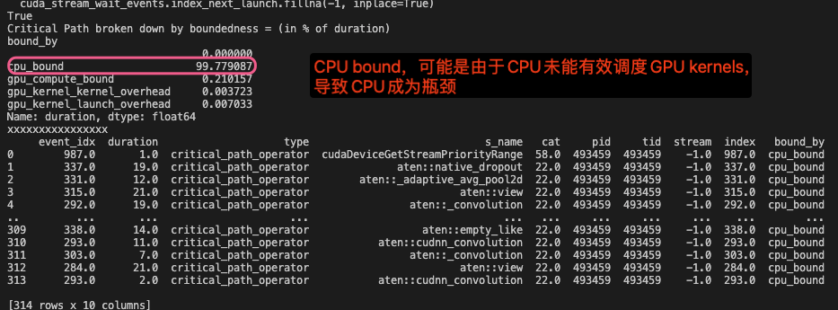
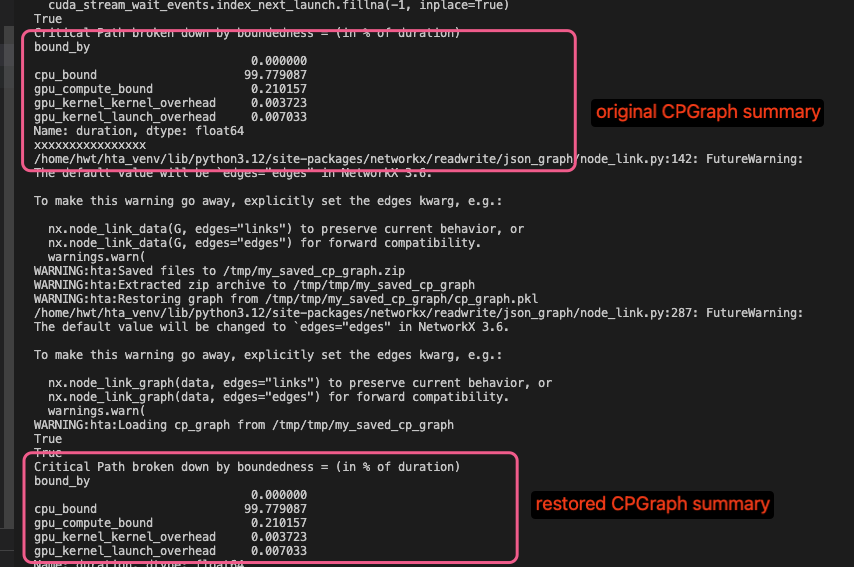

# 关键路径分解


关键路径分析的核心思想是找出大型系统中构成起始和结束之间最长路径的操作。关键路径上的操作会显著影响程序的整体性能。


原有算子优化后，如果运算符的优化超出某个点，关键路径可能会发生变化；例如上图中的`mult()`变得比`add1()`短。此时`add1()`变成了关键操作。

关键路径分析是HPC和AI/ML优化中常用的技术。它可以通过两种方式利用：

- 性能/效率机会：关键路径上的操作/内核应该成为性能分析和优化的目标。它们可以为性能提升提供“最佳性价比”。关键路径可以让我们了解训练迭代是否受X%CPU限制、Y%GPU限制，或者分布式训练的Z%通信限制。分析不仅限于CPU/GPU内核计算部分。**启动或执行CUDA内核的延迟**也可能构成关键路径的很大一部分。这可以通过**运算符融合（Pytorch2.0）**和**CUDA图**等进行优化。
- 模拟改进/收益：确定关键路径后，我们可以通过简单地修改图表并重新运行关键路径查找算法来估计改进。


### 为什么是轻量级？

分析此类依赖关系的空间非常广阔。我们可以通过分析**多rank的关键路径**来更好地理解诸如**落后进程**stragglers等问题，并考虑**PyTorch操作符之间的张量输入/输出依赖关系**。这种关键路径分析的主要目的是识别训练循环中的主要性能瓶颈——是CPU,GPU计算还是GPU通信。

> 张量操作符之间的输入输出关系是指在深度学习框架（如 PyTorch 或 TensorFlow）中，张量（tensor）如何作为数据在不同的操作符（operator）之间流动和转换。这种关系是神经网络计算的核心，因为它描述了数据如何通过网络的各个层进行传播和变换。
操作符是指对张量进行操作的函数或层。例如，线性层（linear layer）、卷积层（convolutional layer）、激活函数（activation function）等都是操作符。每个操作符接收一个或多个张量作为输入，进行特定的计算，并输出一个或多个张量。


#### 核心假设

为了简化PyTorch操作符之间的依赖关系分析，我们做出了以下关键假设：

1. **CPU操作符的串行依赖关系**：假设所有PyTorch CPU操作符都依赖于在相应CPU线程上最后执行的操作符。这简化了分析，假设CPU操作是顺序执行的。
2. **CPU和GPU之间的依赖关系**：我们还考虑了CPU和GPU操作之间的依赖关系。这包括<mark>内核启动、内核之间的时间延迟以及同步事件</mark>。

关键路径分析的主要动机是识别training loop中的主要瓶颈是CPU, GPU计算还是GPU通信。

> 在深度学习框架（如 PyTorch）中，CPU操作符通常会顺序执行。假设一个CPU线程上的操作符会等待该线程上一个操作符完成后才开始执行。这简化了分析，因为可以将CPU操作视为顺序链，**无需考虑复杂的并行或重叠执行情况**。假设CPU线程上有操作符A、B和C。操作符B会等待操作符A完成后再开始，操作符C又会等待操作符B完成后再开始。这种顺序执行的假设使得分析CPU 操作符之间的依赖关系变得简单明了。

> 内核启动：CPU需要将内核（kernel）发送到GPU上执行。从CPU发出启动信号到GPU实际开始执行内核之间存在时间延迟。

> 内核之间的时间延迟：多个内核在GPU上执行时，内核之间可能存在时间延迟。这些延迟可能源于GPU的任务调度、资源分配或执行依赖等因素。

> 同步事件：在CPU和GPU之间可能会有同步操作，确保CPU和GPU操作按特定顺序执行。例如，CPU可能需要等待GPU完成某个内核后才能继续执行后续操作，或者GPU可能需要等待CPU完成数据准备后才能启动内核


#### 同步依赖

CPU 运行时（CPU Runtime）：
- 上下文同步（Context Synchronize）：表示全局同步，等待所有GPU流中的内核完成。
- 流同步（Stream Synchronize）：表示单一流同步，等待特定流中的内核完成。
- 事件同步（Event Synchronize）：表示基于事件的同步，通常用于GPU到GPU的同步。

同步边（Synchronization Edges）：
- 上下文同步边：从所有流中的最后一个内核（Kernel 1 End 和 Kernel 2 End）到 Context Synchronize。
- 流同步边：从流2中的最后一个内核（Kernel 4 End）到 Stream Synchronize。
- 事件同步边：从流2中的最后一个内核（Kernel 4 End）到 Event Synchronize，表示基于事件的同步。


#### 未来增强

操作符的数据依赖部分可以在以后添加，这将进一步使我们能够获得诸如操作和子图重新排序的见解。我们可以通过Chakra执行追踪来跟踪张量之间的数据依赖关系。此版本的关键路径分析不需要执行追踪。

总结来说，这种轻量级的关键路径分析提供了一种简化的方法，可以在不需要复杂的执行追踪的情况下，快速识别训练循环中的主要性能瓶颈。


操作符的数据依赖部分
含义：在深度学习框架（如PyTorch）中，操作符之间的数据依赖关系指的是一个操作符的输出张量作为另一个操作符的输入张量时所形成的依赖关系。例如，线性层操作符的输出张量会作为激活函数操作符的输入张量，这就是一种数据依赖关系。

获得诸如操作和子图重新排序的见解

含义：通过分析操作符之间的数据依赖关系，可以了解操作的执行顺序和依赖关系。这有助于优化操作的执行顺序，或者将相关的操作组合成子图进行优化。例如，如果发现某些操作之间存在数据依赖，但执行顺序不合理，可以重新排序以提高效率。

通过Chakra执行追踪来跟踪张量之间的数据依赖关系
含义：Chakra执行追踪是一种标准化的工作负载规范，用于捕获关键操作和依赖关系。它提供了一种图模式来表示AI/ML工作负载的执行过程，包括计算、内存和通信等核心操作，以及它们的依赖关系、时间和元数据。通过Chakra执行追踪，可以详细跟踪张量之间的数据依赖关系，这对于分析和优化深度学习模型的执行过程非常有用。


以下是关于如何实现上述功能以及重新排序子图含义的介绍：

### 实现功能的方法

- **集成Chakra执行跟踪**：
    - **收集执行跟踪数据**：在支持的机器学习框架（如PyTorch、TensorFlow等）中启用相应的工具来收集模型执行时的操作和依赖关系等信息，生成原始的执行跟踪数据。例如，在PyTorch中可以启用Execution Graph Observer来收集这些数据。
    - **转换为Chakra ET格式**：使用ET转换器将收集到的原始执行跟踪数据转换为Chakra定义的标准化ET格式。这样可以确保不同框架的执行跟踪数据具有统一的结构和语义，便于后续的分析和处理。
    - **利用Chakra工具链进行分析**：借助Chakra提供的执行跟踪可视化器、时间线可视化器等工具，对转换后的ET进行分析和理解，查看操作节点、依赖关系以及执行时间等信息，从而发现性能瓶颈和优化机会。

- **摘要统计关键路径上的时间及详细信息**：
    - **关键路径识别**：通过对Chakra ET的分析，确定整个执行过程中的关键路径。关键路径是指从开始节点到结束节点的最长路径，其决定了整个执行过程的最短完成时间。可以使用图算法来遍历Chakra ET所表示的有向无环图（DAG），计算每个节点到开始节点和结束节点的距离，从而找出关键路径。
    - **时间统计与信息提取**：在确定关键路径后，对路径上的各个节点（包括CPU和GPU操作节点）所花费的时间进行统计和汇总，分别计算CPU和GPU所花费的总时间。同时，进一步分析内核启动延迟、内核到内核延迟以及其他开销所花费的时间。这些详细信息可以通过解析Chakra ET中的节点属性和时间戳等信息来获取。

- **模拟新硬件和优化获胜**：
    - **修改Networkx DiGraph对象**：由于Chakra的分析器会返回一个Networkx DiGraph对象，用户可以直接对该对象进行修改，例如调整节点的执行顺序、添加或删除节点及边等，以模拟不同的优化方案或硬件配置下的执行图。
    - **重新计算关键路径**：在修改了DiGraph对象后，重新运行关键路径识别算法，计算新的关键路径以及对应的执行时间等信息，评估优化方案或新硬件配置对性能的影响。
    - **重新绘制轨迹和新的关键路径**：利用Chakra的执行跟踪可视化器等工具，将修改后的DiGraph对象重新绘制为执行轨迹图，并突出显示新的关键路径，以便更直观地观察和分析变化情况。同时，可以将模拟结果与其他相关工具（如性能模型或仿真器）结合，进一步评估其在实际系统中的表现。

### 重新排序子图的含义

重新排序子图是指在Chakra执行跟踪所表示的图结构中，对子图内的节点执行顺序进行调整和优化。子图可以是整个执行图中的一个相对独立的局部区域，其中包含了多个相互关联的操作节点。通过对子图重新排序，可以探索不同的执行顺序对整体性能的影响，以发现潜在的优化机会，例如减少数据依赖等待时间、提高并行执行效率等。常见的重新排序子图的方法包括基于依赖关系的调度优化、基于资源利用率的负载均衡调整等。

## API
```python
analyzer.critical_path_analysis(
    rank: int, # rank to analyze for the critical path.
    annotation: str, # a trace annotation to limit the analysis to, for example "ProfilerStep" would match all annotations that match this string (ProfilerStep#100, ProfilerStep#101 etc)
    instance_id: Union[int, NoneType, Tuple[int, int]], # can be either of the following
        # (int) - specify which instance of the annotation to consider.
        #         Defaults to the first instance.
        # (Tuple(int, int)) - considers a range of annotation instances start to end,
        #         inclusive of both start and end instance.
) -> Tuple[hta.analyzers.critical_path_analysis.CPGraph, bool] 
       # A tuple of CPGraph object and a success or fail boolean value.
       #  True indicates that the critical path analysis algorithm succeeded.
```


```python
cp_graph.summary() -> pandas.core.series.Series
# Displays a summary or breakdown of the critical path into one of the following
# - cpu_bound
# - gpu_compute_bound
# - gpu_communication_bound (NCCL Collectives)
# - gpu_kernel_kernel_overhead (Gaps between GPU kernels)
# - gpu_kernel_launch_overhead (Delay launching kernels from CPU to GPU)

# Returns:
#     A summary pandas series with bottleneck type -> % of duration on critical path. Also see get_critical_path_breakdown().

cp_graph.get_critical_path_breakdown() #  more information on the specific events and edges involved in the critical path
```





原始文件上的关键路径：
```python
analyzer.overlay_critical_path_analysis(
    rank: int, #rank to generate the time series for.
    critical_path_graph: hta.analyzers.critical_path_analysis.CPGraph, # Critical Path Graph object generated previously
    output_dir: str, #  Output directory to store overlaid trace
    only_show_critical_events: bool = True, # When set the output trace will only have operators and GPU kernels on the critical path. It will still retain the user annotations.
    show_all_edges: bool = False, # When set this will add edge events for all types of edges in the critical path graph. This is useful for debugging the algorithm.
) -> str
# Returns: the overlaid trace file path. The generated trace file will
# have a prefix of "overlaid_critical_path\_" in its name compared
# to the original trace file.


# flow events的类别名通常以critical_path_开头,含义如下:
# critical_path_dependency: an inter operator dependency.
# critical_path_operator: an edge between start and end of a CPU operator or GPU kernel.
# critical_path_kernel_launch_delay: delay to launch a GPU kernel that is likely to be on the critical path.
# critical_path_kernel_kernel_delay: delay between running successive GPU kernels.
# critical_path_sync_dependency: these edges denote synchronization or control dependencies between events such as GPU->CPU, GPU->GPU synchronization.
```

当`only_show_critical_events=True`（默认值）时，输出轨迹仅包含关键路径上的CPU算子和GPU事件。可以将其与原始轨迹进​​行比较，以对比算法识别出的关键路径。当`only_show_critical_events=False`时，在输出跟踪文件中搜索“critical”以突出显示关键路径上的事件。但是现在perfetto用不了False的功能。关键路径图中的边将使用**箭头**或**流事件**显示。关键边使用`args`属性中的“critical”标志进行标记。

```python
WARNING:hta:Parsed /home/hwt/HolisticTraceAnalysis/tests/data/critical_path/simple_add/benchmark_result_493459_1694039959_trace.json.gz time = 0.00 seconds 
```

### 存储和恢复CPGraph对象
构造关键路径图（CPGraph）可能需要耗费一定的时间。如果用户希望在现有的关键路径图基础上模拟新的更改，频繁地重新构造整个图会使迭代过程变得缓慢。
为了加速这一过程，CPGraph 对象添加了`save()`和`restore()`功能：
- `save()`功能：用于保存已经构造好的关键路径图的状态。注意，只有在关键路径图构造完成后才能执行保存操作。
- `restore()`功能：允许用户将关键路径图恢复到之前保存的状态。这样，在模拟新的更改时，用户不需要重新构造整个图，而是可以从保存的状态开始，从而节省时间。

```python
# 将关键路径图对象保存到一个zip文件中，此save()操作只能在图表构建完成后执行！
cp_graph.save(out_dir: str) -> str #  path to the zip file containing the object.
# The directory used to first dump a collection of files used to save the state of CPGraph object. The directory is then compressed into a zipfile with the same name.

# 从zip文件中恢复CPGraph对象
# The graph will already be constructed in this case. You can however run critical_path() again and modify the graph etc.
restore_cpgraph(zip_filename: str, t_full: 'Trace', rank: int) -> hta.analyzers.critical_path_analysis.CPGraph
```

将数据保存到三个文件中然后再压缩:
1. trace_data保存为一个csv文件
2. networkx图使用python pickle序列化
3. 其他对象数据使用python pickle序列化




```python
# recompute critical path
rest_graph.critical_path()
```

### CPGraph
关键路径分析的图表示。CPGraph表示从一个rank（可以理解为进程、线程或某种执行单元）的trace进行关键路径分析的图结构。这种图表示形式能够利用networkx库来进行分析，networkx是一个用于创建、操作和研究复杂网络结构的Python库。它通过维护node id与CPNode对象之间的映射关系，使用整数作为networkx图数据结构中的节点标识。同时，边（edges）由于其类型是可哈希的，可以直接在图中使用。

```python
CPGraph(
    t: Optional[ForwardRef('Trace')],
    t_full: 'Trace',
    rank: int,
    G=None,
) -> None
```
#### Attributes
- trace_df (pd.DataFrame) ：
用于存储构建该图所依据的trace事件数据。它包含了程序执行过程中各种事件的信息，如事件类型、发生时间、相关资源等，是构建关键路径分析图的基础数据来源。
- symbol_table (TraceSymbolTable) ：
这是一个符号表，用于对trace的符号进行编码。在程序执行的trace数据中，会涉及到各种符号，如函数名、变量名等，符号表的作用是将这些符号进行编码转换，便于在图结构中进行统一的处理和表示。
- node_list (List[int]) ：
它是一个整数列表，列表中的每个元素代表一个关键路径节点对象。列表的索引对应的就是节点id，通过这个列表可以根据节点id快速地获取到对应的节点对象，节点对象中包含了与该节点相关的详细信息，如节点类型、执行时间等。
- critical_path_nodes (List[int]) ：
这是关键路径上的节点id列表。它明确标识了在关键路径上的各个节点，通过这些节点id可以在node_list中找到对应的节点对象，从而了解关键路径上各个节点的具体情况，这一列表有助于快速定位和分析关键路径上的关键节点。
- critical_path_events_set (Set[int]) ：
它是一个整数集合，存储了与关键路径节点对应的事件id。在trace数据中，每个事件都有一个唯一的id，这个集合中的事件id代表了关键路径上所涉及的事件。通过对这些事件的分析，可以了解关键路径上各个节点对应的事件的具体内容和执行情况。
- critical_path_edges_set (Set[CPEdge]) ：
这是一个CPEdge对象的集合，表示关键路径上的边。边代表了节点之间的依赖关系或执行顺序，CPEdge对象中包含了边的起始节点、结束节点以及边的相关属性等信息。通过这个集合可以了解到关键路径上各个节点之间的连接关系和依赖情况。


#### 两种初始化方法

1. 从头开始生成关键路径分析图：这种方式是基于原始数据（如程序执行的trace数据等）来构建关键路径图。它会根据提供的trace信息、指定的rank等参数，从头创建关键路径图对象，包括构建图的节点、边以及相关的属性等。
2. 恢复序列化的CPGraph对象：这里的CPGraph应该是指关键路径图对象。在这种方式下，会利用`networkx.DiGraph`对象G来恢复之前序列化的CPGraph对象，具体可以通过该文件中的`restore_cpgraph()`函数来实现。序列化是一种将对象转换为字节流的形式以便存储或传输的过程，而恢复序列化的对象则是将字节流重新转换为原来的对象，这在需要对之前生成的关键路径图进行重新加载和使用时非常有用。


https://github.com/facebookresearch/HolisticTraceAnalysis/blob/main/examples/experimental/critical_path_analysis.ipynb

## iteration和epoch的区别
epoch——使用整个训练样本集传播一次。

一次传播 = 一次前向传播 + 一次后向传播。（所有的训练样本完成一次Forword运算以及一次BP运算）

但是考虑到内存不够用的问题，训练样本们往往并不是全都一起拿到内存中去训练，而是一次拿一个batch去训练，一个batch包含的样本数称为batch size。

iteration——使用batch size个样本传播一次。同样，一次传播 = 一次前向传播 + 一次后向传播。

eg. 我们有1000个训练样本，batch size为100，那么完成一次epoch就需要10个iteration。

## 参考文献

有关轻量级关键路径分解：
https://hta.readthedocs.io/en/latest/source/features/lightweight_critical_path_analysis.html

Using Chakra execution traces for benchmarking and network performance optimization:
https://engineering.fb.com/2023/09/07/networking-traffic/chakra-execution-traces-benchmarking-network-performance-optimization/

critical path analysis脚本:
https://github.com/facebookresearch/HolisticTraceAnalysis/blob/main/examples/experimental/critical_path_analysis.ipynb

Scalable critical-path analysis and optimization guidance for hybrid MPICUDA applications:
https://www.hzdr.de/publications/PublDoc-9225.pdf

Critical path analysis CPU operator events :
https://github.com/facebookresearch/HolisticTraceAnalysis/pull/67

[2/n] Critical Path analysis for GPU events and CPU->GPU and GPU->CPU dependencies:
https://github.com/facebookresearch/HolisticTraceAnalysis/pull/68

[3/N] Add critical path analysis GPU->GPU sync dependencies
https://github.com/facebookresearch/HolisticTraceAnalysis/pull/69


PyTorch Kineto：深入剖析CPU+GPU性能的利器:
https://blog.csdn.net/gitblog_00570/article/details/144285403

MLPerf:https://engineering.fb.com/2018/12/12/ml-applications/mask-r-cnn2go/

Chakra Execution Trace:
https://github.com/mlcommons/chakra

epoch和iteration的区别:
https://blog.csdn.net/liuyanfeier/article/details/60964475

API synchronization behavior:
https://docs.nvidia.com/cuda/cuda-runtime-api/api-sync-behavior.html#api-sync-behavior__memcpy-sync

Event Management:
https://docs.nvidia.com/cuda/cuda-runtime-api/group__CUDART__EVENT.html

networkx Docs:
https://www.osgeo.cn/networkx/reference/algorithms/generated/networkx.algorithms.dag.dag_longest_path.html

Tracer parser and loader backend:
https://github.com/facebookresearch/HolisticTraceAnalysis/pull/125

整体上，这段代码先从原始的trace数据框中筛选出与GPU内核相关的事件，然后通过两次连接操作分别整合运行时和原始的队列长度信息，并对列名进行调整，最后删除一些不必要的列，得到一个专注于GPU内核事件及其相关队列长度信息的数据框。