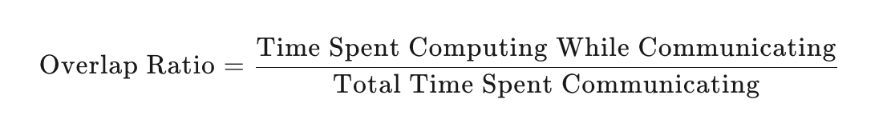

以下是一个阅读该源码的建议步骤：

### 1. 先看顶层目录和文件

  * **examples 文件夹** ：
    * 这里的 demo notebooks 是很好的学习入口。它们通常会包含如何使用 HTA 工具进行各种分析的示例代码和说明。通过阅读这些示例，你可以快速了解 HTA 能够完成哪些功能，以及这些功能的大致调用方式。比如，你可以看到如何加载一个追踪文件，然后使用不同的分析器来进行性能分析等操作。

  * **hta 包下的 trace_analysis.py 和 trace_diff.py** ：
    * 这两个文件是 TraceAnalysis API 和 TraceDiff API 的入口点。理解它们对于掌握 HTA 的核心使用方法至关重要。你可以查看它们是如何定义类和函数，以及如何接收参数、调用内部的 analyzers 等模块来完成分析任务的。trace_analysis.py 应该包含了启动各种性能分析流程的关键逻辑，而 trace_diff.py 则是用于比较不同追踪文件差异的核心文件，它们可以让你对 HTA 的主要功能调用流程有一个初步的认识。

### 2. 钻研 hta 包内部的子模块

  * **analyzers 模块** ：
    * 这是 HTA 的核心逻辑所在。它包含了各种不同的分析器，每个分析器对应一种特定的分析功能，比如之前提到的 temporal breakdown、kernel breakdown 等等。你可以逐个查看这些分析器的类定义，了解它们的属性和方法。研究它们是如何处理追踪数据，提取有用信息并进行分析的。例如，查看一个分析器是如何从追踪文件中读取时间戳信息来计算不同任务的时间分布的，或者如何解析 GPU 内核的调用信息来生成内核性能分析结果等。

  * **common 模块** ：
    * 这个模块包含多个分析器共用的代码。查看其中的内容可以帮助你了解不同分析功能之间共享的工具函数、数据结构或者通用的处理逻辑。比如，可能有一些用于解析追踪文件格式的通用函数，或者一些计算统计指标的工具类方法，这些在多个分析器中都会被调用。

  * **configs 模块** ：
    * 这里的配置文件定义了 HTA 的各种可配置参数，如日志记录级别等。了解这些配置文件的格式和内容，可以帮助你掌握如何调整 HTA 的运行时行为。例如，你可能需要修改日志级别来进行调试，或者调整一些分析相关的参数来适应特定的分析需求。

  * **utils 模块** ：
    * 工具模块通常包含一些辅助性的函数和类，它们可能用于文件操作、数据转换、可视化等多个方面。研究这个模块可以使你更全面地了解 HTA 的实现细节，比如它是如何读写追踪文件的，如何将分析结果转换为易于展示的格式，或者如何生成图表等可视化内容来呈现分析结果。

### 3. 查看 scripts 文件夹

  * 这里的通用工具脚本可能包含一些用于处理追踪文件的辅助工具。例如，可能有脚本可以用来合并多个追踪文件、对追踪文件进行预处理或者提取特定信息等。阅读这些脚本可以帮助你了解如何在更大的工作流程中利用 HTA 工具，以及如何对追踪数据进行一些基础的操作。

### 4. 最后看 tests 文件夹

  * 单元测试文件可以让你了解各个模块的预期行为。通过阅读测试用例，你可以看到每个函数或类在不同输入情况下的预期输出和行为，这有助于你更深入地理解源码的正确性和功能边界。同时，测试代码也可以作为示例，展示如何正确地调用 HTA 的各个组件来进行测试和验证。

在整个阅读源码的过程中，要注意结合实际的调试和运行。可以尝试修改一些简单的代码，观察程序的行为变化；也可以在关键函数中添加调试信息输出，来跟踪代码的执行流程和数据的处理过程。这样可以加深你对源码的理解，并且能够更快地掌握 HTA 工具的使用和开发方法。

- [] 如何设计，如何知道需要探测这些数据？

## ftrace_analysis_demo.ipynb

```python


# Idle time breakdown
idle_time_df = analyzer.get_idle_time_breakdown()


# Frequent CUDA kernel patterns
frequent_patterns_df = analyzer.get_frequent_cuda_kernel_patterns(operator_name="aten::linear", output_dir="/new/trace/path")


```

### Temporal breakdown
https://github.com/facebookresearch/HolisticTraceAnalysis/blob/main/examples/trace_analysis_demo.ipynb

Temporal breakdown将GPU时间划分为三部分：
1. Idle time：GPU处于空闲状态，没有执行任何任务
2. Compute time：GPU忙于执行计算任务，如同步计算内核
3. Non-compute time：非计算时间，GPU忙于执行分计算任务，如数据传输等通信任务，以及内存操作
```python
# Temporal breakdown
temporal_breakdown_df = analyzer.get_temporal_breakdown()
```
通过Temporal breakdown可以了解GPU的时间分配情况，进而优化程序以减少空闲时间，提高计算和非计算任务的效率。

- [ ] 代码中这三种时间爱你是如何计算的,输出结果包括了idle_time, compute_time, non-compute_time和kernel_time，以及后面时间对应的百分比, 输出数据的多样性


### Kernel breakdown
Kernel breakdown是一个用于分析GPU内核执行时间的功能，它提供了以下信息：
1. 不同内核类型的时间分布(所有rank的整体角度)
    - 计算内核：执行计算任务的内核，执行矩阵乘法和类似数值计算，负责模型执行所需的所有数字运算，如同步计算、矩阵乘法等
    - 通信内核：涉及数据传输任务的内核，在分布式训练作业中交换和同步不同GPU设备之间的数据，如GPU之间的数据传输、集合通信操作等。其所有kernel function都带有前缀`nccl`,比如`nccl_allgather`,`nccl_reducescatter`,`nccl_allreduce`等
    - 内存内核：涉及内存操作的内核，负责管理GPU设备上的内存分配与释放，以及主机和GPU熵的内存空间之间的数据移动，如内存分配、内存拷贝等，内存kernel fuction主要包括 `memcpy_H2D`  ,`memcpu_D2H`,`memcpy_D2D`, `memset`等
2. 每个Rank上最耗时的内核（顶级耗时内核，每个rank内部时间分布）
    - 对于每个rank，找出每种kernel类型中最耗时的具体kernel，有助于识别性能瓶颈，比如某个rank上的comm kernel可能特别耗时，表明可能存在通信瓶颈
    - [ ] 这里是将每个rank中的每种类型kernel的最耗时的都列出来，也就是1个rank->comp,comm,mem对应三个kernel
3. 最耗时内核的平均时间分布(不同rank之间相互比较)
    - 对于每个rank上最耗时的内核，计算其平均执行时间的分布。这可以反应不同rank之间执行时间的差异，可能表明负载不均衡或其他问题。

```python
# Kernel breakdown
kernel_breakdown_df = analyzer.get_gpu_kernel_breakdown(visualize=False[True], # 输出是pie/bar chart,还是dataFrame
num_kernels = 10, # 显示的内核数量，优先级高于duration_ratio
duration_ratio = 0.9,  # 分析总执行时间占总时间90%的内核
include_memory_kernels = True[False] # 是否包含对memory kernels相关内容的分析，False：分析仅包括通信和计算内核，计算方式为：(计算和通信重叠时间) / (通信时间 + 计算时间)。)
```
- 饼图（内核类型分布）：展示了计算、通信和内存内核所占的总时间百分比。
- 饼图（最耗时内核）：对于每个 rank，展示了每种内核类型中最耗时的内核所占的时间百分比。
- 柱状图（内核执行时间）：对于每个 rank，展示了每种内核类型中最耗时的内核的平均执行时间，并带有误差线，表示每个内核在不同 rank 上的最小和最大执行时间。


<mark>**[例子]**</mark>假设我们有一个分布式深度学习训练任务，使用了8个GPU进程（Rank 0到 Rank 7）。通过Kernel Breakdown功能，我们可能得到以下结果：
- 时间分布：通信内核在所有Rank上总共占用了60%的时间，计算内核占用了30%，内存内核占用了10%。这表明通信可能是一个主要的性能瓶颈。
- 顶级耗时内核（按类型）：
    - 在计算类内核中，`aten::linear`（线性层计算）在每个Rank上都是最耗时的计算内核.
    - 在通信类内核中，`nccl:all_reduce`（一种集体通信操作）在每个Rank上都是最耗时的通信内核,或者在rank1上`nccl:all_reduce`最耗时，但是rank2上`nccl:allgather`耗时最长。
    - 在内存类内核中，`cudaMemcpy`（内存拷贝操作）在每个Rank上都是最耗时的内存内核。
- 平均时间分布（指的是同一种kernel在不同rank上的分布情况）：
    - 对于`aten::linear`内核，其在Rank 0到Rank 7上的平均执行时间分别为 100ms、110ms、95ms、105ms、102ms、98ms、107ms、103ms。这显示出**不同Rank上该内核的执行时间存在一定的波动，可能需要进一步分析原因，比如数据分布、计算负载不均等**。
    - 对于`nccl:all_reduce`内核，平均执行时间在各个Rank上相对较为一致，但也可能发现某些Rank上由于网络延迟等因素导致该内核执行时间较长。


通过以上信息，开发者可以针对性地进行优化，比如优化通信策略、调整计算内核的实现、平衡内存操作负载等，从而提升整个分布式系统的性能。

- [] 为什么将内存kernel单独列出来？


### Kernel Attribtion to Annotations

“Kernel Attribution to Annotations”是PyTorch提供的一个功能，允许开发者将自定义的注释（annotations）与GPU内核相关联。这些注释可以为内核提供上下文信息，帮助开发者了解**每个内核属于哪个模块或组件**，可以更清晰地了解每个模块的性能贡献，从而实现更细致的性能分析和优化。

- 用户标记注释：开发者在代码中使用`torch.profiler.record_function`插入自定义注释，标记代码中的特定区域或操作。
- 内核与注释关联：PyTorch的分析工具将这些注释与GPU内核相关联，使每个内核的执行时间能够被归因到特定的模块或组件。
- 数据框返回：功能返回一个包含所有GPU内核的完整数据框，其中每个内核都与相应的用户注释相关联。用户可以在数据框上进行聚合操作，例如按模块或组件汇总内核的执行时间。

```python
analyzer.get_gpu_kernels_with_user_annotations(
    rank: int, # 获取特定进程的内核数据
    expand_names: bool = True, # 是否展开为完整名称，True则增加两列"s_name":内核的完整名称,"s_user_annotation":用户注释的完整名称。
    shortern_names: bool = True, # 是否缩短较长的CUDA内核名称
) -> Optional[pandas.core.frame.DataFrame]

gpu_kernels_df = analyzer_user_anno.get_gpu_kernels_with_user_annotations(rank=0, expand_names=True, shortern_names=False)

gpu_kernels_df[["s_name", "s_cat", "s_user_annotation", "stream", "ts", "dur"]] # 预先定义好的字段
#[内核名称, 内核类别, 用户提供的注释, 内核所属的CUDA stream, 时间戳, 内核的执行时间]
```

- [ ] 该函数无可视化功能
- [ ] 没有annotation的地方输出的部分写啥

当一个GPU内核与多个用户注释关联时，目前的实现会将其归因到堆栈中最底层的注释。这种行为可能是基于一种假设，即最底层的注释最能代表内核执行时的具体上下文。计划在未来支持一个堆栈列，这将允许用户查看内核关联的整个注释堆栈，而不仅仅是最低层的注释。这将为用户提供最丰富的信息，帮助他们更全面地理解内核执行的上下文。

注释堆栈列是指在性能分析工具中，记录每个内核执行时与之关联的所有用户注释的完整堆栈信息。例如，一个内核可能在一个函数注释内执行，而该函数注释又在一个模块注释内，模块注释又在一个阶段注释内。最底层的注释通常是在代码中离内核启动点最近的注释。因此，它更能准确反映内核的具体执行上下文。


- [ ] 缺少完整的堆栈列annotation的注释
```python
with torch.profiler.record_function("Training_Phase"):
    with torch.profiler.record_function("Model_Forward"):
        output = model(input)
```
以上对应的堆栈列可以增加一个annotation_stack字段而不只是annotation，显示全路径注释：
| s_name | s_cat | annotation_stack | 
| --- | --- | --- | 
| kernel1 | kernel | ['Training_Phase', 'Model_Forward'] | 
| kernel2 | kernel | ['Training_Phase', 'Model_Forward'] | 


当前要求用户必须指定一个rank才能获取该rank的GPU内核数据，因为在分布式计算环境中，每个rank是一个独立的进程，可能执行不同的代码路径并生成不同的内核调用。通过指定rank，可以确保返回的数据是特定于该进程的。由于每个rank的内核数据可能是独立的，将它们分开处理可以避免数据混淆，并使用户能够更精确地分析每个进程的性能。

```python
import torch
import torch.profiler
from hta.trace_analysis import TraceAnalysis

# 定义一个简单的线性层和激活函数
linear_layer = torch.nn.Linear(10, 10)
activation = torch.nn.ReLU()
input = torch.randn(10, 10)

# 使用 PyTorch Profiler 进行性能分析
with torch.profiler.profile(
    activities=[torch.profiler.ProfilerActivity.CPU, torch.profiler.ProfilerActivity.CUDA],
    record_shapes=True,
    profile_memory=True,
) as prof:
    # 标记模块的开始
    with torch.profiler.record_function("my_custom_module"):
        # 执行线性层计算
        output = linear_layer(input)
        # 执行激活函数计算
        output = activation(output)

# 查看分析结果
print(prof.key_averages().table(sort_by="cuda_time_total"))

# 获取内核与注释关联的数据框
kernel_annotation_df = analyzer.get_gpu_kernels_with_user_annotations(rank=0, expand_names=True, shortern_names=True)

# 对内核执行时间按注释进行聚合
aggregated_df = kernel_annotation_df.groupby('user_annotation')['time'].sum().reset_index()

# 显示结果
print(aggregated_df)
```


### Communication Computation Overlap
Communication Computation Overlap 是一个重要的性能指标，用于衡量在分布式计算中通信和计算重叠的程度。这个指标可以帮助开发者了解通信和计算任务是否高效地并行执行，从而优化程序性能。
Communication Computation Overlap 的计算公式为：

​
 
- Time Spent Computing While Communicating：在通信操作（如数据传输）进行的同时，GPU 或 CPU 仍在执行计算任务的时间。
- Total Time Spent Communicating：通信操作的总时间。

需要知道时间戳和duration。

```python
# Communication computation overlap
comm_comp_overlap_df = analyzer.get_comm_comp_overlap()
```
### Idle time breakdown(对第一个功能的进一步细分)
对GPU的idle time进行进一步分解，分为Host等待时间、内核等待时间和其他等待时间。可以据此定位导致GPU空闲的具体原因，从而采取针对性的优化措施。

- Host wait time：由于CPU线程没有向GPU队列中添加足够的内核任务，导致GPU流（stream）处于空闲状态的时间。通常是因为CPU的准备工作（如数据预处理、任务调度等）耗时较长，无法及时为GPU提供足够的任务。可以优化CPU代码，减少数据预处理时间，或者调整任务调度逻辑，使CPU能更高效地为GPU提供任务。也可以考虑增加 GPU的并行任务，减少GPU等待CPU的时间。
- Kernel wait time: 内核之间短暂的空闲时间，通常是因为启动多个小型内核的开销导致的。当多个小内核依次执行时，内核启动和切换会有一定的延迟，这些延迟累积起来就形成了内核等待时间。如果内核之间的间隔小于设定的阈值（如 30 毫秒），则将这些间隔归类为内核等待时间。尽量减少小型内核的使用频率，将多个小型内核合并为一个较大的内核，以减少内核启动和切换的开销。或者优化内核启动逻辑，降低内核启动的延迟。
- Other wait time:由于未知原因导致的GPU空闲时间。可能是因为计算内核在等待CUDA事件，或者其他未明确识别的原因。需要进一步分析和调试代码，找出导致GPU空闲的具体原因。可以使用更详细的性能分析工具或调试器，检查CUDA事件的同步逻辑，确保内核之间能够高效协作，减少不必要的等待时间。


- idle_tile_df = rank stream idle_category idle_time idle_time_ratio

- interval_stats_df = idle_category rank stream count(所有的idle intervals数量) mean(idle time/count) std min 25% 50% 75% max

### Augmented Counters(Queue Length and Memory Bandwidth)
向追踪数据中添加额外的计数器和时间序列信息，以便更全面地分析GPU的性能。
- 队列长度 (Queue Length)：表示在某个CUDA流中尚未完成的CUDA操作的数量。
- 内存带宽 (Memory copy bandwidth)：显示在不同内存之间（如主机到设备、设备到主机、设备到设备）的数据传输速率的时间序列。


```python
analyzer.generate_trace_with_counters(
    time_series: Optional[hta.trace_analysis.TimeSeriesTypes] = None, #指定要添加的时间序列类型。可选值为 TimeSeriesTypes.QUEUE_LENGTH（队列长度）和 TimeSeriesTypes.MEMCPY_BANDWIDTH（内存带宽）。默认情况下，两者都会被添加。
    ranks: Optional[List[int]] = None, # 指定要生成计数器的 rank 列表。默认为 [0]。
    output_suffix: str = '_with_counters', # 指定生成的追踪文件的后缀名。默认为 _with_counters.json.gz。
) -> None #该方法不返回值，而是生成新的追踪文件。
```
该API会为指定的rank生成新的追踪文件，并在文件名后添加指定的后缀（默认为 _with_counters.json.gz）。新文件中包含了额外的时间序列数据，用于更深入的性能分析。

为什么队列长度和内存带宽在这里是时序类型？


```python
# Memory bandwidth time series
memory_bw_series = analyzer.get_memory_bw_time_series()

# Memory bandwidth summary
memory_bw_summary = analyzer.get_memory_bw_summary()

# Queue length time series
ql_series = analyzer.get_queue_length_time_series()

# Queue length summary
ql_summary = analyzer.get_queue_length_summary()

```

### CUDA Kernel Launch Statistics

```python
# CUDA kernel launch statistics
cuda_launch_kernel_stats = analyzer.get_cuda_kernel_launch_stats()
```

### Most Frequent CUDA Kernel Sequences

```python

```


