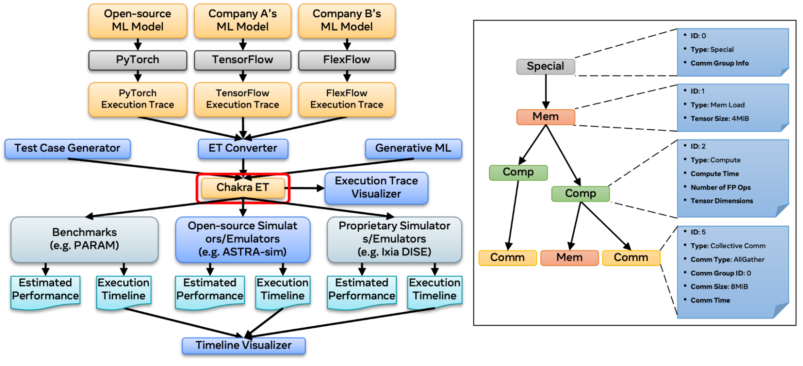
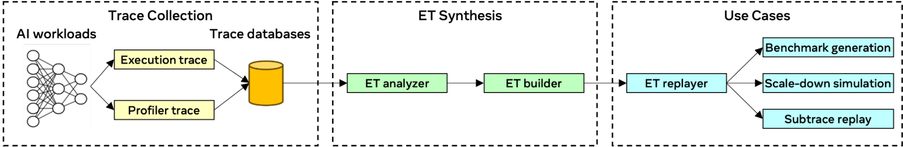

Question Definition

1. Integrating Chakra Execution Traces - Chakra Execution Traces helps to add real CPU operator dependency edges and can surface opportunities with re-ordering of subgraphs for instance.

2. Simulating New Hardware and Optimization wins: the analyzer today does return a Networkx DiGraph object that one can modify and recompute the critical path. Additionally, it would be great to re-draw the trace and new critical path on the simulated optimizations or changes.

3. Chakra Execution Trace Flowgraph
How to combine the simulators such as ASTRA-sim or else with the Chakra ET, and predict the performance of CXL expanded system?
scale-down simulation and subtrace replay?

4. How to generate execution traces that are representative of the primary characteristics observed with AI? And incorporate an obfuscation mechanism within the AI model?

2. Chakra Execution Trace
converts Pytorch ETs to Chakra ETs and use this to drive an open-source training system simulator(ASTRA-sim)
provide a generative ML model trained with production traces
    - **The execution trace converter** is responsible for converting execution traces in various schemas to the Chakra schema. 
    - **The execution trace visualizer** allows users to visualize the dependencies between nodes in a trace. 
    - **The timeline visualizer** provides a visualization of the execution of nodes when a trace is simulated in a simulator. 
    - **The test case generator** lets users generate arbitrary execution traces by offering libraries to describe traces. 
    - **The execution trace feeder** is a library that other simulators can use to parse traces and feed them into the simulator.

astra-sim 2.0 CXL expanded experiment

calculon CXL expanded experiment

2. References

https://engineering.fb.com/2023/09/07/networking-traffic/chakra-execution-traces-benchmarking-network-performance-optimization/

https://engineering.fb.com/2018/12/12/ml-applications/mask-r-cnn2go/

https://www.usenix.org/conference/osdi18/presentation/zhou

/bin/sh:protoc not found指的是缺少protobuf-compiler库
sudo apt-get install protobuf-compiler