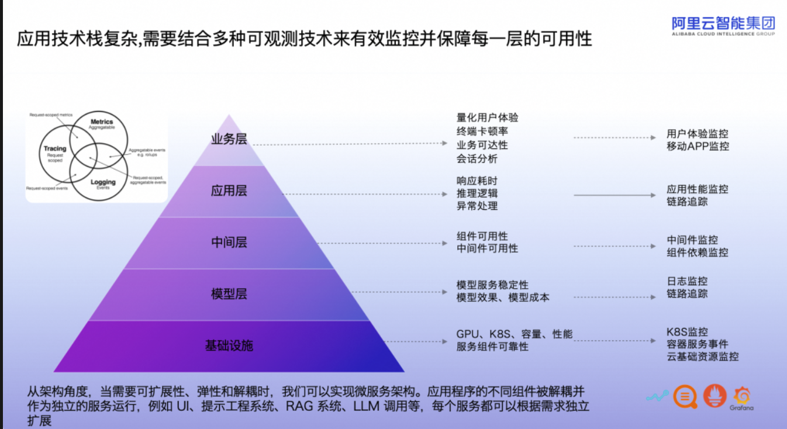

# Google Trace Analysis
(SoCC'12) Heterogeneity and dynamicity of clouds at scale: Google Trace Analysis:https://dl.acm.org/doi/10.1145/2391229.2391236

创新点:
对Trace中提供的各项信息进行了梳理，分析了workload的特征以及这些特征的成因，也分析了资源请求，任务优先级，约束对调度的影响。

可改进的地方:
只分析了Task被Evict的现象，对于各event的转变没有着墨，也没有探讨Task在磁盘使用、IO时长上的特征。重点分析了数值特征，实际上没有提出改进Scheduler的具体方法

# 大模型应用可观测全链路
https://mp.weixin.qq.com/s/X8m9AjMMEBk8J8B42-z9TA

LLM应用则是从**性能、成本、效果**三大方面来对可观测性提出了差异化的观测需求；AI推理服务的监控需求则不仅涉及**硬件资源和性能指标**，还包括模型行为和分布式架构的复杂性。

Arize 公司提出 LLM 可观测五大支柱(Evaluation、Trace&Spans、Prompt Engineering、Search&Retrieval、Fine-tuning)，从这五大支柱出发，一方面需要覆盖模型层基础设施的模型训练以及推理等水位指标，另外一方面需要满足 LLM 应用层的若干可观测述求，基于丰富的指标、调用链、日志、事件等数据集合可观测大盘以及告警能力，提供强大的可观测分析解决能力。

软件层面和LLM应用Metric层面，不是基础设施层面。

# LLM 应用可观测性：从 Trace 视角展开的探索与实践之旅
https://mp.weixin.qq.com/s/196g-2uUcLxSs-Db1gNOIg

从架构角度来讲，当需要可扩展性、弹性和解耦时，我们可以实现微服务架构。应用程序的不同组件被解耦并作为独立的服务运行，例如用户交互系统、提示工程系统、RAG 系统、LLM 处理等，每个服务都可以根据需求独立扩展。相应的会引入 K8s 以及各种中间件组件等依赖，进一步增加了整体技术栈研发以及运维的复杂性。完整技术栈可以分为：基础设施层：关注 GPU 资源的优化利用、K8s 的容量规划与性能调优，以及构建可靠的组件运行环境。模型服务层：侧重于模型服务的稳定运行、模型输出的质量控制，及其成本效益分析。中间件层：确保所有组件和服务间的通信高效且可靠，监测中间件的可用性以支撑上层应用。应用层：聚焦于代码性能优化、流程编排集成，逻辑严谨性以及建立健壮的异常处理机制。业务层：直接关联用户体验，通过量化分析终端响应速度、业务功能的可达性以及深入会话数据分析，持续提升服务质量。为了确保整个系统的顺畅运作，特别是满足模型层以及新的依赖组件稳定性需求，每一层级都需要精细的监控与可观测性策略。