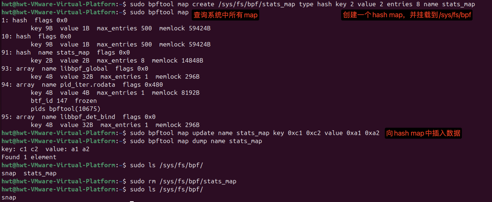
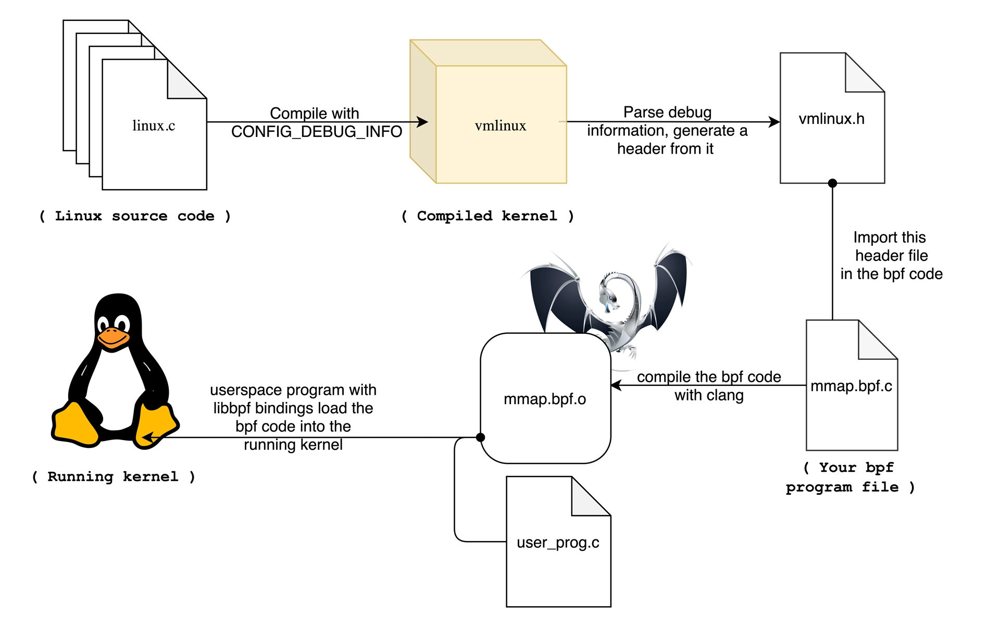
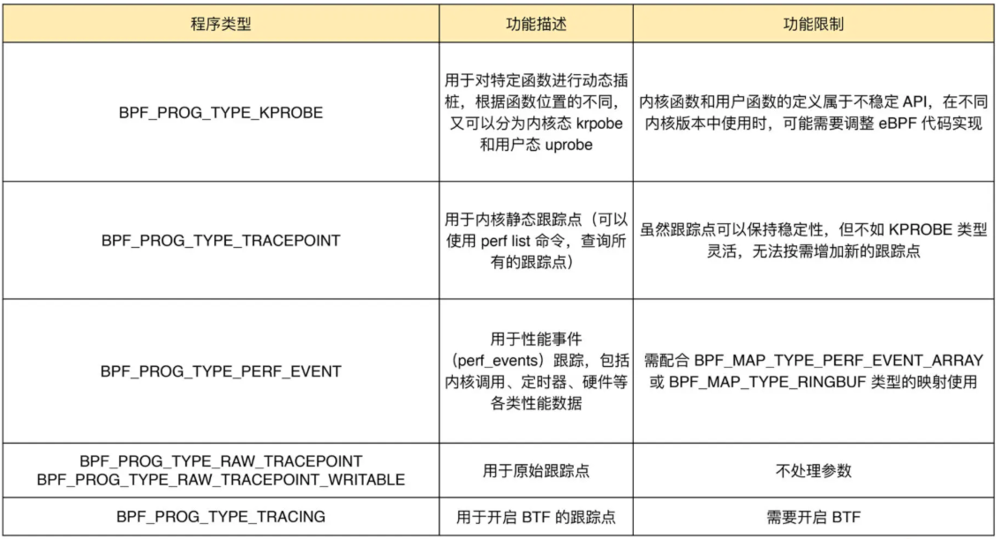

# eBPF编程范式(eBPF核心技术与实战笔记)

## eBPF内核运行时
eBPF程序并不像常规的线程那样，启动后就一直运行在那里，它需要事件触发后才会执行。这些事件包括系统调用、内核跟踪点、内核函数和用户态函数的调用退出、网络事件，等等。
eBPF内核运行时主要由5个部分组成：
1. 第一个模块是**eBPF辅助函数**。它提供了一系列用于eBPF程序与内核其他模块进行交互的函数。这些函数并不是任意一个eBPF程序都可以调用的，具体可用的函数集由**BPF程序类型**决定。
2. 第二个模块是*eBPF验证器**。它用于确保eBPF程序的安全。验证器会将待执行的指令创建为一个**有向无环图（DAG）**，确保程序中不包含不可达指令；接着再模拟指令的执行过程，确保不会执行无效指令。
3. 第三个模块是由11个64位寄存器、一个程序计数器(PC)和一个512字节的栈组成的存储模块。这个模块用于控制eBPF程序的执行。其中，<mark>R0寄存器用于存储函数调用和eBPF程序的返回值，这意味着函数调用最多只能有一个返回值</mark>；R1-R5 寄存器用于函数调用的参数，因此函数调用的参数最多不能超过 5 个；而 R10 则是一个只读寄存器，用于从栈中读取数据。
4. 第四个模块是即时编译器(JIT)，它**将eBPF字节码编译成本地机器指令**，以便更高效地在内核中执行。
5. 第五个模块是BPF maps，它用于提供大块的存储。这些存储可被用户空间程序用来进行访问，进而控制eBPF程序的运行状态。


bpftool可以查看eBPF程序的运行状态
```shell
sudo bpftool prog list # 可以查询系统中正在运行的eBPF程序
89: kprobe name hello_world tag 38dd440716c4900f gpl            
    loaded_at 2021-11-27T13:20:45+0000 uid 0 
    xlated 104B jited 70B memlock 4096B 
    btf_id 131 
    pids python3(152027)
```
89是eBPF程序的编号，kprobe是程序的类型，hello_world是程序的名字。获得eBPF程序编号之后，可以通过如下指令导出这个eBPF程序的指令：
```shell
sudo bpftool prog dump xlated id <num, 89> # 得到对应的eBPF字节码
```
;开头的部分是C代码，其他行是具体执行的BFP指令。
具体每一行的 BPF 指令又分为三部分：
- 第一部分，冒号前面的数字 0-12 ，代表BPF指令行数；
- 第二部分，括号中的16进制数值，表示BPF指令码。具体含义可以参考[IOVisor BPF ](https://github.com/iovisor/bpf-docs/blob/master/eBPF.md)文档，比如第0行的0xb7表示为64位寄存器赋值；
- 第三部分，括号后面的部分，就是BPF指令的伪代码。


## eBPF与内核交互——eBPF程序的编程接口
> eBPF是如何同内核事件进行绑定的？又该如何跟内核中的其他模块进行交互呢？

一个完整的eBPF程序通常包括用户态和内核态两部分。其中，用户态负责eBPF程序的加载、事件绑定以及eBPF程序运行结果的汇总输出；内核态运行在eBPF虚拟机中，负责定制和控制系统的运行状态。

不同版本的内核所支持的BPF命令是不同的，具体支持的命令列表可以参考内核头文件include/uapi/linux/bpf.h中bpf_cmd的定义。比如，v5.13内核已经支持36个BPF命令：
```ct
enum bpf_cmd {
  BPF_MAP_CREATE,
  BPF_MAP_LOOKUP_ELEM,
  BPF_MAP_UPDATE_ELEM,
  BPF_MAP_DELETE_ELEM,
  BPF_MAP_GET_NEXT_KEY,
  BPF_PROG_LOAD,
  BPF_OBJ_PIN,
  BPF_OBJ_GET,
  BPF_PROG_ATTACH,
  BPF_PROG_DETACH,
  BPF_PROG_TEST_RUN,
  BPF_PROG_GET_NEXT_ID,
  BPF_MAP_GET_NEXT_ID,
  BPF_PROG_GET_FD_BY_ID,
  BPF_MAP_GET_FD_BY_ID,
  BPF_OBJ_GET_INFO_BY_FD,
  BPF_PROG_QUERY,
  BPF_RAW_TRACEPOINT_OPEN,
  BPF_BTF_LOAD,
  BPF_BTF_GET_FD_BY_ID,
  BPF_TASK_FD_QUERY,
  BPF_MAP_LOOKUP_AND_DELETE_ELEM,
  BPF_MAP_FREEZE,
  BPF_BTF_GET_NEXT_ID,
  BPF_MAP_LOOKUP_BATCH,
  BPF_MAP_LOOKUP_AND_DELETE_BATCH,
  BPF_MAP_UPDATE_BATCH,
  BPF_MAP_DELETE_BATCH,
  BPF_LINK_CREATE,
  BPF_LINK_UPDATE,
  BPF_LINK_GET_FD_BY_ID,
  BPF_LINK_GET_NEXT_ID,
  BPF_ENABLE_STATS,
  BPF_ITER_CREATE,
  BPF_LINK_DETACH,
  BPF_PROG_BIND_MAP,
};
```
用户程序中常用的命令如下：
参考自：https://time.geekbang.org/column/article/482459s


### eBPF辅助函数
eBPF程序并不能随意调用内核函数，因此，内核定义了一系列辅助函数，用于eBPF程序与内核的其他模块进行交互。比如`bpf_trace_printk()`是最常用的一个辅助函数，用于向调试文件系统(`/sys/kernel/debug/tracing/trace_pipe`)写入调试信息。

可以使用如下指令查询当前系统支持的辅助函数列表：
```shell
sudo bpftool feature probe # 查询当前系统支持的辅助函数列表

# 有部分如下输出
eBPF helpers supported for program type kprobe:
	- bpf_map_lookup_elem
	- bpf_map_update_elem
	- bpf_map_delete_elem
	- bpf_probe_read
	- bpf_ktime_get_ns
	- bpf_get_prandom_u32
	- bpf_get_smp_processor_id
	- bpf_tail_call
	- bpf_get_current_pid_tgid
	- bpf_get_current_uid_gid
	- bpf_get_current_comm
	- bpf_perf_event_read
	- bpf_perf_event_output
	- bpf_get_stackid
	- bpf_get_current_task
	- bpf_current_task_under_cgroup
	- bpf_get_numa_node_id
	- bpf_probe_read_str
	- bpf_perf_event_read_value
	- bpf_override_return
	- bpf_get_stack
	- bpf_get_current_cgroup_id
	- bpf_map_push_elem
	- bpf_map_pop_elem
	- bpf_map_peek_elem
	- bpf_spin_lock
	- bpf_spin_unlock
	- bpf_strtol
	- bpf_strtoul
	- bpf_send_signal
	- bpf_probe_read_user
	- bpf_probe_read_kernel
	- bpf_probe_read_user_str
	- bpf_probe_read_kernel_str
	- bpf_send_signal_thread
	- bpf_jiffies64
	- bpf_get_ns_current_pid_tgid
	- bpf_get_current_ancestor_cgroup_id
	- bpf_ktime_get_boot_ns
	- bpf_ringbuf_output
	- bpf_ringbuf_reserve
	- bpf_ringbuf_submit
	- bpf_ringbuf_discard
	- bpf_ringbuf_query
	- bpf_get_task_stack
	- bpf_copy_from_user
	- bpf_snprintf_btf
	- bpf_per_cpu_ptr
	- bpf_this_cpu_ptr
	- bpf_task_storage_get
	- bpf_task_storage_delete
	- bpf_get_current_task_btf
	- bpf_for_each_map_elem
	- bpf_snprintf
	- bpf_timer_init
	- bpf_timer_set_callback
	- bpf_timer_start
	- bpf_timer_cancel
	- bpf_get_func_ip
	- bpf_get_attach_cookie
	- bpf_task_pt_regs
	- bpf_get_branch_snapshot
	- bpf_find_vma
	- bpf_loop
	- bpf_strncmp
	- bpf_copy_from_user_task
	- bpf_kptr_xchg
	- bpf_map_lookup_percpu_elem
	- bpf_dynptr_from_mem
	- bpf_ringbuf_reserve_dynptr
	- bpf_ringbuf_submit_dynptr
	- bpf_ringbuf_discard_dynptr
	- bpf_dynptr_read
	- bpf_dynptr_write
	- bpf_dynptr_data
	- bpf_ktime_get_tai_ns
	- bpf_user_ringbuf_drain
	- bpf_cgrp_storage_get
	- bpf_cgrp_storage_delete
```
辅助函数的详细定义可以通过`man bpf-helpers`查看，或者参考内核头文件`include/uapi/linux/bpf.h`,来查看它们的详细定义和使用说明。常用的helpers如下图所示：

其中需要特别注意的是以`bpf_probe_read`开头的一系列函数，eBPF内部的内存空间只有寄存器和栈。所以，要访问其他的内核空间或用户空间的地址，就需要借助`bpf_probe_read`这一系列辅助函数。这些函数会进行安全性检查，并禁止缺页中断的发生。而在eBPF程序需要大块存储时，就不能像常规的内核代码那样去直接分配内存了，而是必须通过BPF map来完成。eBPF map之前学了很多，eBPF map可以被用户空间程序访问，进而获取eBPF程序的运行状态。eBPF程序最多可以访问64个不同的eBPF maps，并且不同的eBPF程序也可以通过相同的BPF map来共享他们的状态。6.11内核支持如下map类型,内核头文件`include/uapi/linux/bpf.h`中的`bpf_map_type`定义了所有支持的map类型：
```shell
hwt@hwt-VMware-Virtual-Platform:~$ sudo bpftool feature probe | grep map_type
[sudo] password for hwt: 
eBPF map_type hash is available
eBPF map_type array is available
eBPF map_type prog_array is available
eBPF map_type perf_event_array is available
eBPF map_type percpu_hash is available
eBPF map_type percpu_array is available
eBPF map_type stack_trace is available
eBPF map_type cgroup_array is available
eBPF map_type lru_hash is available
eBPF map_type lru_percpu_hash is available
eBPF map_type lpm_trie is available
eBPF map_type array_of_maps is available
eBPF map_type hash_of_maps is available
eBPF map_type devmap is available
eBPF map_type sockmap is available
eBPF map_type cpumap is available
eBPF map_type xskmap is available
eBPF map_type sockhash is available
eBPF map_type cgroup_storage is available
eBPF map_type reuseport_sockarray is available
eBPF map_type percpu_cgroup_storage is available
eBPF map_type queue is available
eBPF map_type stack is available
eBPF map_type sk_storage is available
eBPF map_type devmap_hash is available
eBPF map_type struct_ops is available
eBPF map_type ringbuf is available
eBPF map_type inode_storage is available
eBPF map_type task_storage is available
eBPF map_type bloom_filter is available
eBPF map_type user_ringbuf is available
eBPF map_type cgrp_storage is available
eBPF map_type arena is available
```
以下是最常用的map类型：


map的创建是在用户程序中通过create系统调用创建的，而map的删除没有对应的BPF系统调用，这是因为BPF map会在用户态程序关闭文件描述符时自动删除(即`close(fd)`)，如果你想在程序推出后还保留映射，就需要调用`BPF_OBJ_PIN`命令，将映射挂载到`/sys/fs/bpf`中。

在调试BPF map相关的问题时，可以通过bpftool来查看或操作map的具体内容，比如，可以通过如下命令创建、更新、输出以及删除map：
```shell
sudo bpftool map create /sys/fs/bpf/stats_map type hash key 2 value 2 entries 8 name stats_map

sudo bpftool map

sudo bpftool map update name stats_map key 0xc1 0xc2 value 0xa1 0xa2

sudo bpftool map dump name stats_map # 查看hash map stats_map中的内容

sudo rm /sys/fs/bpf/stats_map
```



正确的内核数据结构定义可以在调用bpf_probe_read等工具时，能够从内存地址中提取到正确的数据类型。但是，编译时依赖内核头文件也会带来很多问题。主要有这三个方面：
1. 首先，在开发 eBPF 程序时，为了获得内核数据结构的定义，就需要引入一大堆的内核头文件；
2. 其次，内核头文件的路径和数据结构定义在不同内核版本中很可能不同。因此，你在升级内核版本时，就会遇到**找不到头文件和数据结构定义错误**的问题；
3. 最后，在很多生产环境的机器中，出于安全考虑，并不允许安装内核头文件，这时就无法得到内核数据结构的定义。在程序中重定义数据结构虽然可以暂时解决这个问题，但也很容易把使用着错误数据结构的 eBPF 程序带入新版本内核中运行。也有几种解决方案：
    - 将BCC和开发工具都安装到容器中，容器本身不提供对外服务，这样可以降低安全风险
    - Linux内核源码的samples/bpf目录下有eBPF示例，在那里开发一个匹配当前内核版本的eBPF程序，并编译为字节码，再分发到生产环境中；
    - 使用libbpf开发一个BPF程序，只要内核已经支持了BPF类型格式(BPF Type Format, BTF)，可以使用从内核源码抽离出来的libbpf进行开发，这样可以借助BTF获得更好的移植性CO-RE。从内核5.2开始，只要开启了`CONFIG_DEBUG_INFO_BTF`，在编译内核时，内核数据结构的定义就会自动内嵌在内核二进制文件`vmlinux.h`中。并且，还可以借助如下命令，将这些数据结构导出到一个头文件中(通常命名为vmlinux.h)
        ```shell
        bpftool bpf dump file /sys/kernel/btf/vmlinux format c > vmlinux.h
        ```


有了内核数据结构定义，在开发eBPF程序时只要引入一个vmlinux.h即可，不需要再引入一大堆头文件。
 参考： https://www.grant.pizza/blog/vmlinux-header/
借助BTF,btftool等工具，也可以更好地了解BPF程序的内部信息，这也会让调试变得更加方便。比如在查看BPF map的内容时，可以直接查看到结构化的数据，而不只是十六进制的数值：
```shell
# bpftool map dump id 386
[
  {
      "key": 0,
      "value": {
          "eth0": {
              "value": 0,
              "ifindex": 0,
              "mac": []
          }
      }
  }
]
```
内核数据结构问题定义解决之后，就是如何让eBPF程序在内核升级之后，不需要重新编译就可以直接运行。eBPF的CO-RE借助了BTF提供的调试信息，再通过如下两个步骤，使得eBPF程序可以适配不同版本的内核：
1. 通过对BPF代码中的访问偏移量进行重写，解决了不同内核版本中数据结构偏移量不同的问题；
2. 在libbpf中预定义不同内核版本中的数据结构修改，解决了不同内核中数据结构不兼容的问题。

虽然BTF和CO-RE很方便，但需要注意的是，它们都需要比较新的内核版本>=5.2，并且需要非常新的发行版(ubuntu20.10+等)才会默认打开内核配置CONFIG_DEBUG_INFO_BTF。对于旧版本内核，虽然它们不回再去内置BTF的支持，但开源社区正在尝试通过[BTFhub](https://github.com/aquasecurity/btfhub)等方法，为它们提供BTF调试信息。

## 各类eBPF程序的触发机制及其应用场景
eBPF程序类型决定了一个eBPF程序可以挂载的事件类型和事件参数，这也意味着，内核中不同事件会触发不同类型的eBPF程序。

注意在bpf_prog_type的定义中，`BPF_PROG_TYPE_UNSPEC`表示未定义(Reserve 0 as invalid program type)。对于具体的内核来说，因为不同内核的版本和编译配置选项不同，一个内核并不会支持所有的程序类型。
如下v6.11支持32种不同类型的eBPF程序：
```shell
hwt@hwt-VMware-Virtual-Platform:~$ sudo bpftool feature probe | grep program_type
eBPF program_type socket_filter is available
eBPF program_type kprobe is available
eBPF program_type sched_cls is available
eBPF program_type sched_act is available
eBPF program_type tracepoint is available
eBPF program_type xdp is available
eBPF program_type perf_event is available
eBPF program_type cgroup_skb is available
eBPF program_type cgroup_sock is available
eBPF program_type lwt_in is available
eBPF program_type lwt_out is available
eBPF program_type lwt_xmit is available
eBPF program_type sock_ops is available
eBPF program_type sk_skb is available
eBPF program_type cgroup_device is available
eBPF program_type sk_msg is available
eBPF program_type raw_tracepoint is available
eBPF program_type cgroup_sock_addr is available
eBPF program_type lwt_seg6local is available
eBPF program_type lirc_mode2 is NOT available
eBPF program_type sk_reuseport is available
eBPF program_type flow_dissector is available
eBPF program_type cgroup_sysctl is available
eBPF program_type raw_tracepoint_writable is available
eBPF program_type cgroup_sockopt is available
eBPF program_type tracing is available
eBPF program_type struct_ops is available
eBPF program_type ext is available
eBPF program_type lsm is available
eBPF program_type sk_lookup is available
eBPF program_type syscall is available
eBPF program_type netfilter is available
```


根据具体功能和应用场景的不同，这些程序类型大致可以划分为三类：
- 第一类是跟踪，即<mark>从**内核和程序的运行状态**中提取跟踪信息，来了解当前系统正在发生什么;</mark>
- 第二类是网络，即对网络数据包进行过滤和处理，以便了解和控制网络数据包的收发过程;
- 第三类是除跟踪和网络之外的其他类型，包括安全控制、BPF扩展等等。

### 跟踪类eBPF程序
跟踪类eBPF程序主要用于从系统中提取跟踪信息，进而为监控、排错、性能优化等提供数据支撑。常见的跟踪类BPF程序的主要功能以及使用限制如下：

这其中，KPROBE、TRACEPOINT以及PERF_EVENT都是最常用的eBPF程序类型，大量应用于监控跟踪、性能优化以及调试排错等场景中。BCC工具集中大多数工具属于这个类型。

暂且理解BTF tracepoint就是用SEC()指定跟踪点那种方式。

### 网络类eBPF程序
络类 eBPF 程序主要用于对网络数据包进行过滤和处理，进而实现网络的观测、过滤、流量控制以及性能优化等各种丰富的功能。根据事件触发位置的不同，网络类eBPF程序又可以分为**XDP（eXpress Data Path，高速数据路径）程序、TC（Traffic Control，流量控制）程序、套接字（Socket）程序以及cgroup程序**。

#### XDP程序
XDP程序的类型定义为`BPF_PROG_TYPE_XDP`，它在网络驱动程序刚刚收到数据包时触发执行。由于无需通过繁杂的内核网络协议栈，XDP程序可用来实现高性能的网络处理方案，常用于**DDoS防御、防火墙、4层负载均衡**等场景。


#### TC程序

#### Socket程序

#### cgroup程序

### 其他类eBPF程序


## 总结
一个完整的eBPF程序，通常包含用户态和内核态两部分：用户态程序需要通过BPF系统调用跟内核进行交互，进而完成eBPF程序加载、事件挂载以及映射创建和更新等任务；而在内核态中eBPF程序也不能任意调用内核函数，而是需要通过BPF辅助函数完成所需的任务。尤其是在访问内存地址的时候，必须要借助`bpf_probe_read`系列函数读取内存数据，以确保内存的安全和高效访问。在eBPF程序需要大块存储时，我们还需要根据应用场景，引入特定类型的BPF映射，并借助它向用户空间的程序提供运行状态的数据。

BTF和CO-RE项目，它们在提供轻量级调试信息的同时，还解决了跨内核版本的兼容性问题。很多开源社区的eBPF项目（如BCC等）也都在向BTF进行迁移。

## 其他思考

1. bpf系统调用一定程度上参考了`perf_event_open`设计，`bpf_attr`、`perf_event_attr`均包含了大量union，用于适配不同的cmd或者性能监控事件类型。因此，`bpf`、`perf_event_open`接口看似简单，其实是大杂烩。
    ```c
    bpf(int cmd, union bpf_attr *attr, ...) 
    perf_event_open(struct perf_event_attr *attr, ...)
    ```
2. bpftool命令设计风格重度参考了iproute2软件包中的ip命令，用法基本上一致。
    ```shell
    Usage: bpftool [OPTIONS] OBJECT { COMMAND | help }
    Usage: ip [ OPTIONS ] OBJECT { COMMAND | help }
    ```
    无论内核开发还是工具开发，都可以看到**设计思路借鉴**的影子。工作之余不妨多些学习与思考，也许就可以把大师们比较好的设计思路随手用于手头的任务之中。

3. 在支持BTF的内核中，利用CO-RE编译出的ebpf程序可执行文件，直接copy到低版本不支持BTF的内核版本的系统上能正常运行吗？
    不行的，它需要运行的内核也支持BTF。
    不过现在最新的bpftool已经支持导出BTF，跟eBPF程序一通分发后也可以执行了。具体可以参考这个博客 https://www.inspektor-gadget.io//blog/2022/03/btfgen-one-step-closer-to-truly-portable-ebpf-programs/

    从低版本到高版本的兼容性可以用CO-RE解决（CO-RE只在新版本内核才支持），而反过来就需要在eBPF内部加上额外的代码来处理了。比如根据内核版本作条件编译，低版本内核执行不同的逻辑。

4. 关于bpf内核态程序的成名周期，比如前几节课的例子，如果我通过ctrl-c终端用户态程序的时候在bpf虚拟机会发生什么呢？我理解应该会结束已经加载的bpf指令，清理map之类的资源等等，具体会有哪些，这些操作是如何在我们程序中自动插入和实现?

    ctrl-c其实终止的是用户空间的程序，终止后所有的文件描述符都会释放掉，对应的map和ebpf程序引用都会减到0，进而它们也就被自动回收了。这些都是自动的，不需要在程序里面增加额外的处理逻辑。

    当然，在需要长久保持eBPF程序的情境中（比如XDP和TC程序），eBPF程序和map的生命周期是可以在程序内控制的，比如通过 tc、ip 以及 bpftool 等工具（当然它们也都有相应的系统调用）。我们课程后面还会讲到相关的案例。
5. 例如第一个ebpf程序，通过trace open系统调用来监控应用的open动作。那我实际中，有没有什么快速的方案/套路来完成一些其他的trace，例如我想知道监控那些程序使用了socket/bind(尤其适用于有些短暂进程使用udp发送了一些报文就立马退出了）。当我想新增一个trace事件，我的.c需要去包含哪些头文件，我的.py需要跟踪那个系统调用。这些头文件与系统调用在哪可以找到，如何去找？

    https://github.com/iovisor/bpftrace。
    查询跟踪点函数、查询系统调用格式、快速跟踪一个系统调用、网络socket的跟踪等等它都是支持的，并且用起来就像SHELL脚本一样方便。


## 参考文献
1. 事件触发：各类eBPF程序的触发机制及其应用场景 https://time.geekbang.org/column/article/483364
2. 运行原理：eBPF是一个新的虚拟机吗？https://time.geekbang.org/column/article/481889
3. 内核源码中SYSCALL_DEFINE3的实现 https://elixir.bootlin.com/linux/v5.4/source/kernel/bpf/syscall.c#L2837
4. https://qiankunli.github.io/2022/01/07/ebpf.html
5. vmlinux-header https://www.grant.pizza/blog/vmlinux-header/
6. 编程接口 https://time.geekbang.org/column/article/482459

