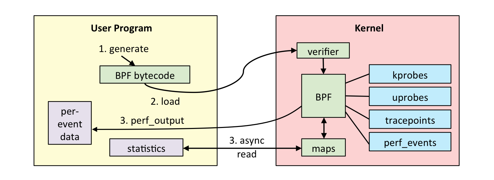
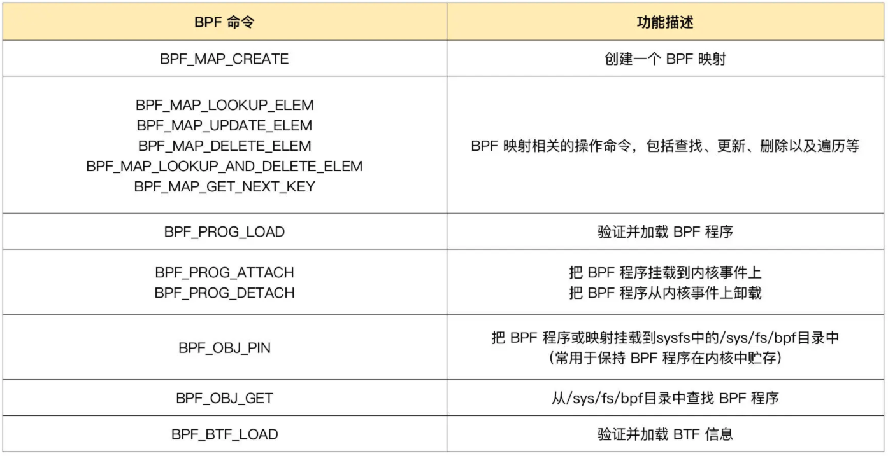
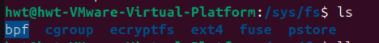
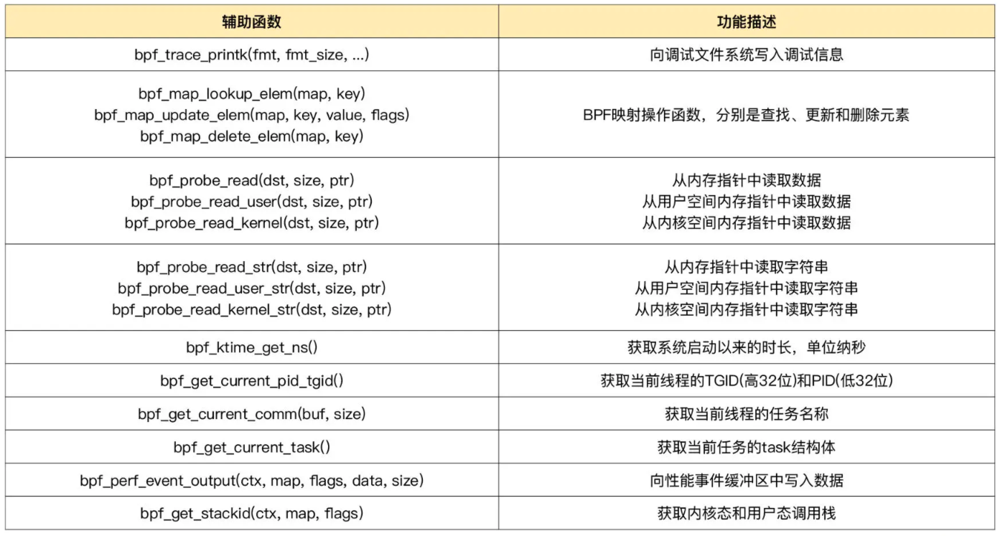
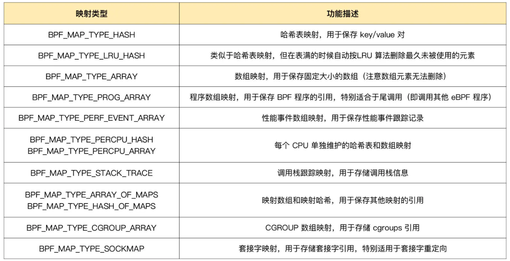

# eBPF编程范式

## eBPF内核运行时
eBPF程序并不像常规的线程那样，启动后就一直运行在那里，它需要事件触发后才会执行。这些事件包括系统调用、内核跟踪点、内核函数和用户态函数的调用退出、网络事件，等等。
eBPF内核运行时主要由5个部分组成：
1. 第一个模块是**eBPF辅助函数**。它提供了一系列用于eBPF程序与内核其他模块进行交互的函数。这些函数并不是任意一个eBPF程序都可以调用的，具体可用的函数集由**BPF程序类型**决定。
2. 第二个模块是*eBPF验证器**。它用于确保eBPF程序的安全。验证器会将待执行的指令创建为一个**有向无环图（DAG）**，确保程序中不包含不可达指令；接着再模拟指令的执行过程，确保不会执行无效指令。
3. 第三个模块是由11个64位寄存器、一个程序计数器(PC)和一个512字节的栈组成的存储模块。这个模块用于控制eBPF程序的执行。其中，<mark>R0寄存器用于存储函数调用和eBPF程序的返回值，这意味着函数调用最多只能有一个返回值</mark>；R1-R5 寄存器用于函数调用的参数，因此函数调用的参数最多不能超过 5 个；而 R10 则是一个只读寄存器，用于从栈中读取数据。
4. 第四个模块是即时编译器(JIT)，它**将eBPF字节码编译成本地机器指令**，以便更高效地在内核中执行。
5. 第五个模块是BPF maps，它用于提供大块的存储。这些存储可被用户空间程序用来进行访问，进而控制eBPF程序的运行状态。


bpftool可以查看eBPF程序的运行状态
```shell
sudo bpftool prog list # 可以查询系统中正在运行的eBPF程序
89: kprobe name hello_world tag 38dd440716c4900f gpl            
    loaded_at 2021-11-27T13:20:45+0000 uid 0 
    xlated 104B jited 70B memlock 4096B 
    btf_id 131 
    pids python3(152027)
```
89是eBPF程序的编号，kprobe是程序的类型，hello_world是程序的名字。获得eBPF程序编号之后，可以通过如下指令导出这个eBPF程序的指令：
```shell
sudo bpftool prog dump xlated id <num, 89> # 得到对应的eBPF字节码
```
;开头的部分是C代码，其他行是具体执行的BFP指令。
具体每一行的 BPF 指令又分为三部分：
- 第一部分，冒号前面的数字 0-12 ，代表BPF指令行数；
- 第二部分，括号中的16进制数值，表示BPF指令码。具体含义可以参考[IOVisor BPF ](https://github.com/iovisor/bpf-docs/blob/master/eBPF.md)文档，比如第0行的0xb7表示为64位寄存器赋值；
- 第三部分，括号后面的部分，就是BPF指令的伪代码。


## eBPF与内核交互——eBPF程序的编程接口
> eBPF是如何同内核事件进行绑定的？又该如何跟内核中的其他模块进行交互呢？

一个完整的eBPF程序通常包括用户态和内核态两部分。其中，用户态负责eBPF程序的加载、事件绑定以及eBPF程序运行结果的汇总输出；内核态运行在eBPF虚拟机中，负责定制和控制系统的运行状态。

不同版本的内核所支持的BPF命令是不同的，具体支持的命令列表可以参考内核头文件include/uapi/linux/bpf.h中bpf_cmd的定义。比如，v5.13内核已经支持36个BPF命令：
```ct
enum bpf_cmd {
  BPF_MAP_CREATE,
  BPF_MAP_LOOKUP_ELEM,
  BPF_MAP_UPDATE_ELEM,
  BPF_MAP_DELETE_ELEM,
  BPF_MAP_GET_NEXT_KEY,
  BPF_PROG_LOAD,
  BPF_OBJ_PIN,
  BPF_OBJ_GET,
  BPF_PROG_ATTACH,
  BPF_PROG_DETACH,
  BPF_PROG_TEST_RUN,
  BPF_PROG_GET_NEXT_ID,
  BPF_MAP_GET_NEXT_ID,
  BPF_PROG_GET_FD_BY_ID,
  BPF_MAP_GET_FD_BY_ID,
  BPF_OBJ_GET_INFO_BY_FD,
  BPF_PROG_QUERY,
  BPF_RAW_TRACEPOINT_OPEN,
  BPF_BTF_LOAD,
  BPF_BTF_GET_FD_BY_ID,
  BPF_TASK_FD_QUERY,
  BPF_MAP_LOOKUP_AND_DELETE_ELEM,
  BPF_MAP_FREEZE,
  BPF_BTF_GET_NEXT_ID,
  BPF_MAP_LOOKUP_BATCH,
  BPF_MAP_LOOKUP_AND_DELETE_BATCH,
  BPF_MAP_UPDATE_BATCH,
  BPF_MAP_DELETE_BATCH,
  BPF_LINK_CREATE,
  BPF_LINK_UPDATE,
  BPF_LINK_GET_FD_BY_ID,
  BPF_LINK_GET_NEXT_ID,
  BPF_ENABLE_STATS,
  BPF_ITER_CREATE,
  BPF_LINK_DETACH,
  BPF_PROG_BIND_MAP,
};
```
用户程序中常用的命令如下：
参考自：https://time.geekbang.org/column/article/482459s


### eBPF辅助函数
eBPF程序并不能随意调用内核函数，因此，内核定义了一系列辅助函数，用于eBPF程序与内核的其他模块进行交互。比如`bpf_trace_printk()`是最常用的一个辅助函数，用于向调试文件系统(`/sys/kernel/debug/tracing/trace_pipe`)写入调试信息。

可以使用如下指令查询当前系统支持的辅助函数列表：
```shell
sudo bpftool feature probe # 查询当前系统支持的辅助函数列表

# 有部分如下输出
eBPF helpers supported for program type kprobe:
	- bpf_map_lookup_elem
	- bpf_map_update_elem
	- bpf_map_delete_elem
	- bpf_probe_read
	- bpf_ktime_get_ns
	- bpf_get_prandom_u32
	- bpf_get_smp_processor_id
	- bpf_tail_call
	- bpf_get_current_pid_tgid
	- bpf_get_current_uid_gid
	- bpf_get_current_comm
	- bpf_perf_event_read
	- bpf_perf_event_output
	- bpf_get_stackid
	- bpf_get_current_task
	- bpf_current_task_under_cgroup
	- bpf_get_numa_node_id
	- bpf_probe_read_str
	- bpf_perf_event_read_value
	- bpf_override_return
	- bpf_get_stack
	- bpf_get_current_cgroup_id
	- bpf_map_push_elem
	- bpf_map_pop_elem
	- bpf_map_peek_elem
	- bpf_spin_lock
	- bpf_spin_unlock
	- bpf_strtol
	- bpf_strtoul
	- bpf_send_signal
	- bpf_probe_read_user
	- bpf_probe_read_kernel
	- bpf_probe_read_user_str
	- bpf_probe_read_kernel_str
	- bpf_send_signal_thread
	- bpf_jiffies64
	- bpf_get_ns_current_pid_tgid
	- bpf_get_current_ancestor_cgroup_id
	- bpf_ktime_get_boot_ns
	- bpf_ringbuf_output
	- bpf_ringbuf_reserve
	- bpf_ringbuf_submit
	- bpf_ringbuf_discard
	- bpf_ringbuf_query
	- bpf_get_task_stack
	- bpf_copy_from_user
	- bpf_snprintf_btf
	- bpf_per_cpu_ptr
	- bpf_this_cpu_ptr
	- bpf_task_storage_get
	- bpf_task_storage_delete
	- bpf_get_current_task_btf
	- bpf_for_each_map_elem
	- bpf_snprintf
	- bpf_timer_init
	- bpf_timer_set_callback
	- bpf_timer_start
	- bpf_timer_cancel
	- bpf_get_func_ip
	- bpf_get_attach_cookie
	- bpf_task_pt_regs
	- bpf_get_branch_snapshot
	- bpf_find_vma
	- bpf_loop
	- bpf_strncmp
	- bpf_copy_from_user_task
	- bpf_kptr_xchg
	- bpf_map_lookup_percpu_elem
	- bpf_dynptr_from_mem
	- bpf_ringbuf_reserve_dynptr
	- bpf_ringbuf_submit_dynptr
	- bpf_ringbuf_discard_dynptr
	- bpf_dynptr_read
	- bpf_dynptr_write
	- bpf_dynptr_data
	- bpf_ktime_get_tai_ns
	- bpf_user_ringbuf_drain
	- bpf_cgrp_storage_get
	- bpf_cgrp_storage_delete
```
辅助函数的详细定义可以通过`man bpf-helpers`查看，或者参考内核头文件`include/uapi/linux/bpf.h`,来查看它们的详细定义和使用说明。常用的helpers如下图所示：

其中需要特别注意的是以`bpf_probe_read`开头的一系列函数，eBPF内部的内存空间只有寄存器和栈。所以，要访问其他的内核空间或用户空间的地址，就需要借助`bpf_probe_read`这一系列辅助函数。这些函数会进行安全性检查，并禁止缺页中断的发生。而在eBPF程序需要大块存储时，就不能像常规的内核代码那样去直接分配内存了，而是必须通过BPF map来完成。eBPF map之前学了很多，eBPF map可以被用户空间程序访问，进而获取eBPF程序的运行状态。eBPF程序最多可以访问64个不同的eBPF maps，并且不同的eBPF程序也可以通过相同的BPF map来共享他们的状态。6.11内核支持如下map类型,内核头文件`include/uapi/linux/bpf.h`中的`bpf_map_type`定义了所有支持的map类型：
```shell
hwt@hwt-VMware-Virtual-Platform:~$ sudo bpftool feature probe | grep map_type
[sudo] password for hwt: 
eBPF map_type hash is available
eBPF map_type array is available
eBPF map_type prog_array is available
eBPF map_type perf_event_array is available
eBPF map_type percpu_hash is available
eBPF map_type percpu_array is available
eBPF map_type stack_trace is available
eBPF map_type cgroup_array is available
eBPF map_type lru_hash is available
eBPF map_type lru_percpu_hash is available
eBPF map_type lpm_trie is available
eBPF map_type array_of_maps is available
eBPF map_type hash_of_maps is available
eBPF map_type devmap is available
eBPF map_type sockmap is available
eBPF map_type cpumap is available
eBPF map_type xskmap is available
eBPF map_type sockhash is available
eBPF map_type cgroup_storage is available
eBPF map_type reuseport_sockarray is available
eBPF map_type percpu_cgroup_storage is available
eBPF map_type queue is available
eBPF map_type stack is available
eBPF map_type sk_storage is available
eBPF map_type devmap_hash is available
eBPF map_type struct_ops is available
eBPF map_type ringbuf is available
eBPF map_type inode_storage is available
eBPF map_type task_storage is available
eBPF map_type bloom_filter is available
eBPF map_type user_ringbuf is available
eBPF map_type cgrp_storage is available
eBPF map_type arena is available
```
以下是最常用的map类型：




## 参考文献
1. 事件触发：各类eBPF程序的触发机制及其应用场景 https://time.geekbang.org/column/article/483364
2. 运行原理：eBPF是一个新的虚拟机吗？https://time.geekbang.org/column/article/481889
3. 内核源码中SYSCALL_DEFINE3的实现 https://elixir.bootlin.com/linux/v5.4/source/kernel/bpf/syscall.c#L2837
4. https://qiankunli.github.io/2022/01/07/ebpf.html

