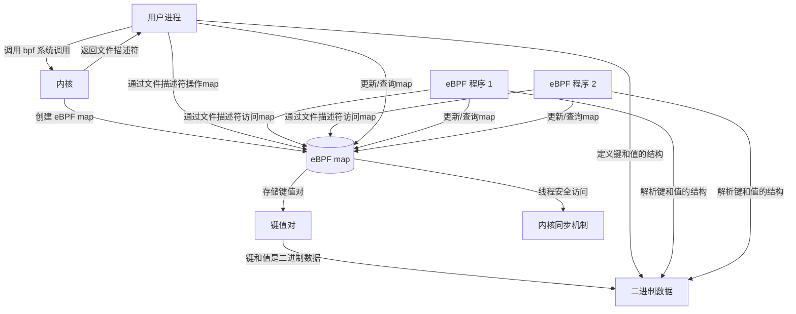
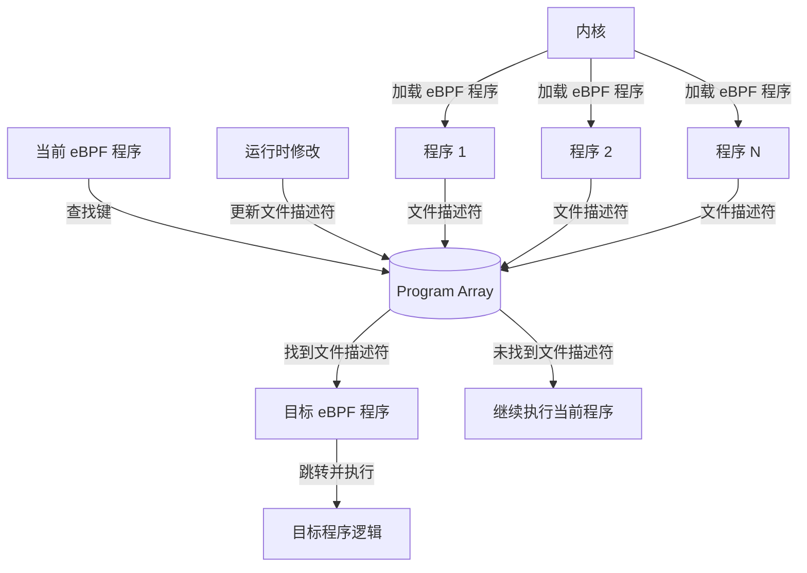
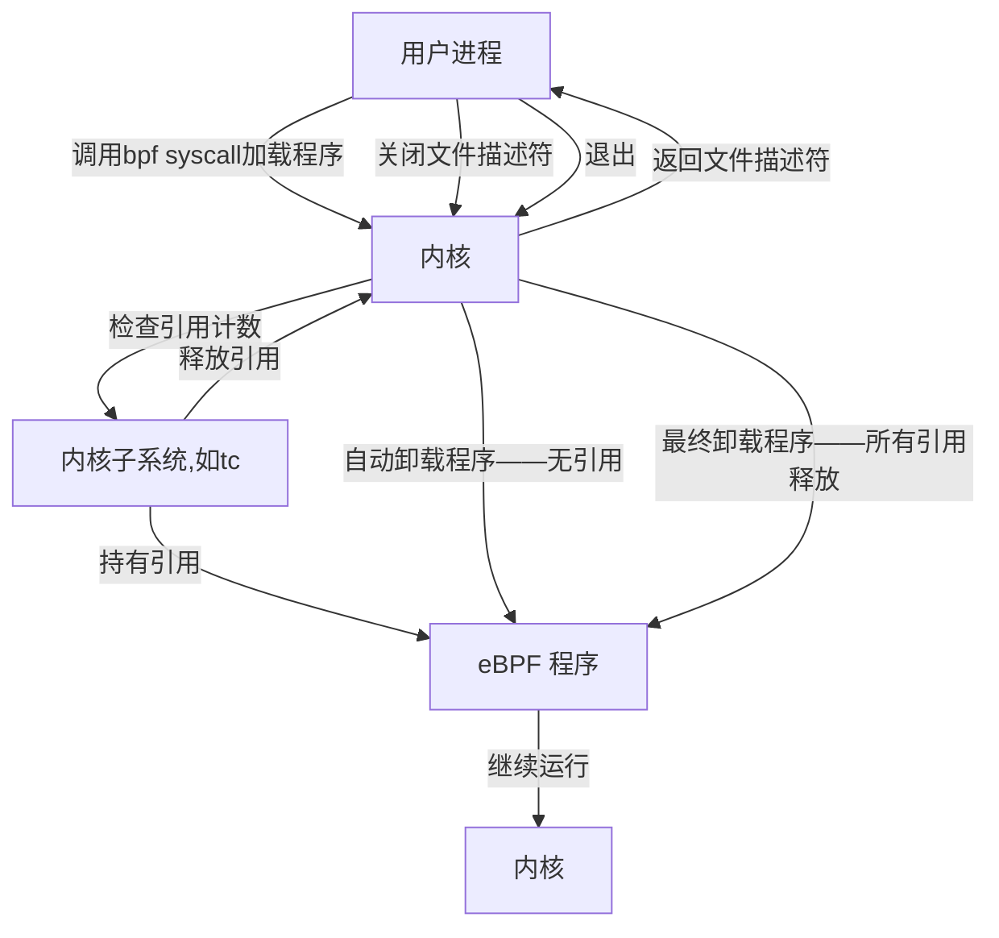
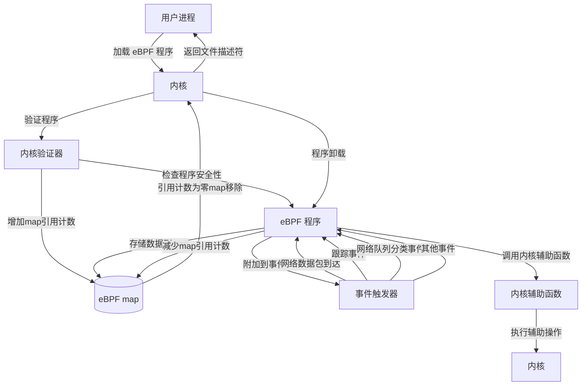
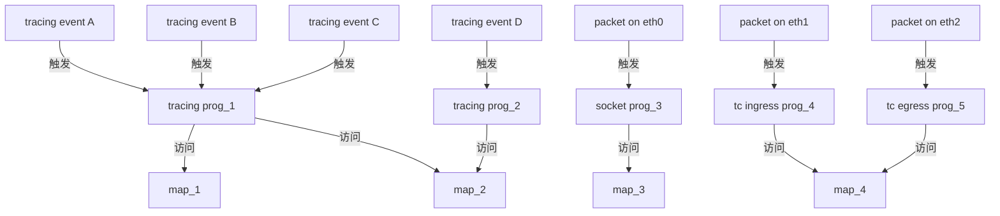

# BPF系统调用
## bpf syscall
用户空间所有bpf函数，归根结底都是对bpf系统调用的封装。这个工具可以帮助用户对 BPF 的map或程序进行各种操作，比如查询、修改、删除等，从而实现对 BPF 相关资源的管理和维护。
```c
#include <linux/bpf.h>
int bpf(int cmd, bpf_attr* attr, unsigned int size);
/*
cmd:指定要执行的命令
attr:执行操作所需的具体参数
size:参数所指向的union的大小
*/

// 此函数其实在linux/bpf.h中没有定义, 需要手动定义, 其实就是对于系统调用的包裹函数
int bpf(enum bpf_cmd cmd, union bpf_attr *attr, unsigned int size)
{
    return syscall(__NR_bpf, cmd, attr, size); 
}
```
eBPF会在内核加载前进行静态分析，以确保安全性。eBPF是cBPF的扩展, 包括调用一些**固定的内核帮助函数**(通过eBPF提供的`BPF_CALL`操作码扩展), 并能访问一些共享数据结构, 如eBPF maps
### syscall
syscall 函数允许用户空间程序直接调用内核提供的系统调用，而不需要通过标准的 C 库函数。这在某些情况下非常有用，例如：
- 调用未被标准 C 库封装的系统调用：有些系统调用可能没有被标准 C 库封装，或者封装的函数不符合需求，此时可以直接使用 syscall。
- 动态调用系统调用：在**运行时动态选择调用**的系统调用，而不需要在编译时确定。
- 性能优化：某些情况下，直接调用系统调用可以**减少标准库函数的开销**

```c
#include <unistd.h>
#include <sys/syscall.h>
long syscall(long number, ...); //number：系统调用号（syscall number），用于指定要调用的系统调用。每个系统调用都有一个唯一的编号，例如 SYS_write、SYS_read、SYS_open 等
/*
成功时，返回值通常为系统调用的结果（例如文件描述符、读取的字节数等）。
失败时，返回 -1，并通过 errno 设置错误码。
*/
```
#### 系统调用号的获取
系统调用号在不同的架构（如 x86、x86_64、ARM 等）上可能不同。通常可以通过查看头文件（如 <sys/syscall.h>）或使用 `man 2 syscall` 查看具体的系统调用号。

#### 内部实现
在用户空间程序中，调用 syscall 函数时，它会通过特定的指令（如 x86 架构上的 int 0x80 或 syscall 指令）触发一个中断，将控制权交给内核。
内核会根据传递的系统调用号和参数，执行相应的内核函数，并将结果返回给用户空间程序。

## eBPF Design/Architecture
eBPF map是一种存储数据的结构，用于在 BPF 程序和用户空间程序之间共享数据。 eBPF map是一种通用的数据存储结构，它将数据视为二进制块，用户在创建map时只需指定键和值的大小，而键和值的具体结构可以任意定义，只要这些数据可以表示为二进制形式。
eBPF map不会对数据的内部结构进行任何解析或限制，只要键和值的大小符合创建map时指定的大小即可。这种设计使得 eBPF map非常灵活，可以用于存储各种类型的数据。
```c
struct flow_key {
    uint32_t src_ip;
    uint32_t dst_ip;
    uint16_t src_port;
    uint16_t dst_port;
};

struct flow_value {
    uint64_t bytes;
    uint64_t packets;
    uint64_t last_seen;
};

// 创建map时指定键和值的大小
union bpf_attr attr = {
    .map_type = BPF_MAP_TYPE_HASH,
    .key_size = sizeof(struct flow_key),
    .value_size = sizeof(struct flow_value),
    .max_entries = 1024
};
```
键（flow_key）和值（flow_value）的**具体结构由用户定义**。
eBPF map只关心它们的大小（`sizeof(struct flow_key)` 和 `sizeof(struct flow_value)`），指定attr的时候只需要指定key_size和value_size，类似流数据传输，不关心类型。用户可以在 BPF 程序和用户空间程序中使用这些结构体来操作map中的数据。

用户进程可以创建多个eBPF maps,每个map可以存储不同的数据，具体内容/用途由用户定义，map中的键值对被视为不透明的二进制数据。“不透明的二进制数据”（opaque bytes of data）是指数据的具体内容和结构对 eBPF map来说是未知的，eBPF map只关心数据的大小，而不解析或解释数据的具体含义。它不会检查数据的格式、内容或结构，只将它们视为一组字节。
用户进程通过文件描述符访问 eBPF map。创建map时，内核会返回一个文件描述符，用户进程可以使用该文件描述符进行读写操作。不同的 eBPF 程序可以并行访问同一个map,这意味着多个 eBPF 程序可以共享数据，通过map进行通信,内核会确保对map的访问是线程安全的。而maps中具体存储什么内容是由用户进程和eBPF程序共同决定的。




### 一种特殊的map类型——program array
程序数组是一种特殊的eBPF map类型，其key是整数，value是指向其他 eBPF程序的文件描述符，指向另一个**已经加载到内核中**的eBPF程序（program array中引用的所有 eBPF 程序必须事先通过 bpf() 系统调用加载到内核中）。这些文件描述符在运行时可以被修改，从而动态改变程序的行为。当在program array中进行查找操作时，当前执行的eBPF程序会立即跳转到目标程序的起始位置，继续执行，不会返回到调用程序。为了防止无限循环，程序跳转的嵌套深度被限制为32层。在运行时，program array中的文件描述符可以被修改，从而动态改变程序的功能。如果程序数组中的查找操作失败（例如，键不存在），当前程序将继续执行，不会发生跳转。

### eBPF程序的生命周期
通常情况下，eBPF程序都是被用户进程加载，当加载 eBPF 程序的用户进程退出时，内核会自动卸载该 eBPF 程序。这是因为内核会跟踪文件描述符的引用计数，当最后一个文件描述符被关闭时，eBPF 程序会被卸载。在某些情况下，eBPF 程序不会在用户进程退出时被卸载。例如，使用 `tc-bpf(8)`（用于网络流量控制的工具）加载的 eBPF 程序。在这些情况下，内核的某个子系统（如 tc 子系统）会持有对 eBPF 程序的引用，即使用户空间程序已经关闭了文件描述符，eBPF 程序仍然会保留在内核中。如果 eBPF 程序被某个内核子系统（如 tc、XDP 等）引用，那么该子系统会持有对 eBPF 程序的引用计数。只有当所有引用计数都被释放时，eBPF 程序才会被卸载。
（也就是不只是用户态拥有文件描述符加引用，内核子系统如果也持有eBPF程序的引用计数也不会被卸载）
eBPF 程序是否继续在内核中运行，取决于它是否被某个内核子系统引用。
如果没有被任何内核子系统引用，eBPF 程序会在用户进程退出时被卸载。


### eBPF程序的安全性与关联事件
每个 eBPF 程序都是一组指令，这些指令在运行时是安全的。内核中的一个验证器（verifier）会静态地确定 eBPF 程序是否终止并且是安全的。验证器会检查程序的逻辑，确保它不会导致无限循环或访问非法内存。在验证过程中，内核会为 eBPF 程序使用的每个map增加引用计数，这确保了在 eBPF 程序卸载之前，map不会被移除。




eBPF 程序可以附加到不同的事件上，如：
- 网络数据包的到达
- tracing events
- 网络队列管理（如 tc(8) 分类器）的分类事件
- 其他未来可能添加的事件类型。

当一个新事件触发时，eBPF 程序会被执行。eBPF 程序可以将事件相关信息存储在 eBPF map中，这些map可以被多个 eBPF 程序共享，用于数据交换和持久化。**一个 eBPF 程序可以附加到多个不同的事件上，不同的 eBPF 程序可以访问同一个 eBPF map**，这使得多个程序可以共享数据，例如统计信息或配置参数。



除了存储数据，eBPF 程序还可以调用一组固定的内核辅助函数（helper functions）。这些辅助函数提供了与内核交互的能力，例如获取当前时间、发送网络数据包等。


## 系统调用参数
### bpf系统调用的工作方式
通过cmd参数指定操作，通过attr参数传递操作所需的参数，size表示attr指向的数据长度。

### cmd取值
- BPF_MAP_CREATE:创建一个map,返回一个引用此map的文件描述符，close-on-exec标志会自动设置
- BPF_MAP_LOOKUP_ELEM:在指定map中根据key查找value并返回
- BPF_MAP_UPDATE_ELEM:在指定map中创建或更新一个元素
- BPF_MAP_DELETE_ELEM:在指定map中删除一个元素
- BPF_MAP_GET_NEXT_KEY:在指定map中根据key查找一个元素，并返回下一个元素的key
- BPF_PROG_LOAD:验证并加载一个eBPF程序，返回一个与此程序关联的新文件描述符

#### BPF_MAP_CREATE
BPF_MAP_CREATE命令用于创建新的map，返回一个引用此map的文件描述符。
```shell
    eBPF map created with file descriptor: 3
    The close-on-exec flag is enabled for the file descriptor.
```
    
```c
    // 检查文件描述符的 close-on-exec 标志
    int flags = fcntl(map_fd, F_GETFD);
    if (flags == -1) {
        perror("fcntl failed");
        close(map_fd);
        return 1;
    }
    //检查 FD_CLOEXEC 标志是否启用，确保文件描述符在执行 exec 时会被自动关闭。
    if (flags & FD_CLOEXEC) {
        printf("The close-on-exec flag is enabled for the file descriptor.\n");
    } else {
        printf("The close-on-exec flag is NOT enabled for the file descriptor.\n");
    }
 ```
`close-on-exec`是一个文件描述符标志，用于控制文件描述符在进程执行exec系统调用时的行为。`exec`系统调用用于加载并运行一个新的程序，替换当前进程的代码和数据。

启用 close-on-exec 标志：
- 当文件描述符的 close-on-exec 标志被启用时，如果进程调用了 exec 系统调用，该文件描述符会被自动关闭。这意味着新程序不会继承这个文件描述符。

未启用 close-on-exec 标志：
- 如果文件描述符的 close-on-exec 标志未启用，那么在调用 exec 时，文件描述符会被保留，新程序可以继续使用这个文件描述符。

close-on-exec 标志的主要作用是防止文件描述符被意外保留。这在某些场景下非常重要，特别是涉及安全性和资源管理时。如果一个文件描述符被意外保留，新程序可能会访问到它不应该访问的资源。例如，一个网络套接字或一个敏感文件的描述符。文件描述符是有限的资源。如果文件描述符被意外保留，可能会导致资源泄漏。

```c
#include <stdio.h>
#include <stdlib.h>
#include <fcntl.h>
#include <unistd.h>

int main() {
    int fd;

    // 打开一个文件
    fd = open("example.txt", O_RDONLY);
    if (fd < 0) {
        perror("open failed");
        return 1;
    }

    // 检查文件描述符的标志
    int flags = fcntl(fd, F_GETFD);
    if (flags == -1) {
        perror("fcntl failed");
        close(fd);
        return 1;
    }

    // 检查 close-on-exec 标志是否启用
    if (flags & FD_CLOEXEC) {
        printf("The close-on-exec flag is enabled for the file descriptor.\n");
    } else {
        printf("The close-on-exec flag is NOT enabled for the file descriptor.\n");

        // 启用 close-on-exec 标志
        flags |= FD_CLOEXEC;
        if (fcntl(fd, F_SETFD, flags) == -1) {
            perror("fcntl failed");
            close(fd);
            return 1;
        }
        printf("The close-on-exec flag has been enabled.\n");
    }

    // 关闭文件描述符
    close(fd);
    return 0;
}
```
以下是对bpf系统调用的封装，用于创建eBPF map
```c
int bpf_create_map(enum bpf_map_type map_type,
                   unsigned int key_size,
                   unsigned int value_size,
                   unsigned int max_entries)
                  {
                      union bpf_attr attr = { // 设置指向的bpf_attr对象
                          .map_type    = map_type,
                          .key_size    = key_size,
                          .value_size  = value_size,
                          .max_entries = max_entries
                  };
                    return bpf(BPF_MAP_CREATE, &attr, sizeof(attr));//系统调用
                  }
```
- map_type：指定map的类型，例如 BPF_MAP_TYPE_HASH、BPF_MAP_TYPE_ARRAY 等。
- key_size：指定map中键的大小（以字节为单位）。
- value_size：指定map中值的大小（以字节为单位）。
- max_entries：指定map中允许的最大条目数。

成功时，返回一个文件描述符，用于引用新创建的map。
失败时，返回 -1，并通过 errno 设置错误码：
- EINVAL：无效参数。
- EPERM：权限不足。
- ENOMEM：内存不足。
- ENOENT:文件不存在导致的错误

键和值的大小检查。key_size 和 value_size这些属性在程序加载时被验证器（verifier）使用，以确保 eBPF 程序在调用 `bpf_map_*_elem()` 辅助函数时，键和值的大小是正确的。
例如，如果map的 key_size 为 8 字节，而 eBPF 程序尝试使用一个 4 字节的键调用 `bpf_map_lookup_elem()`，程序将被拒绝，因为这会导致键的大小不匹配。
同样，如果map的 value_size 为 1 字节，而 eBPF 程序尝试写入一个 4 字节的值，程序也会被拒绝，因为这会超出指定的 value_size 限制。

#### BPF_MAP_LOOKUP_ELEM
BPF_MAP_LOOKUP_ELEM用于在map中根据key查找对应元素，如果找到一个元素会返回0，并将元素的之保存在value中，value必须是指向value_size字节的缓冲区，如果没找到会返回-1，并将errno设置为ENOENT。
```c
int bpf_lookup_elem(int fd, const void* key, void* value)
{
    union bpf_attr attr = {
        .map_fd = fd,
        .key = ptr_to_u64(key),
        .value = ptr_to_u64(value),
    };

    return bpf(BPF_MAP_LOOKUP_ELEM, &attr, sizeof(attr));
}
```
#### BPF_MAP_UPDATE_ELEM
BPF_MAP_UPDATE_ELEM在fd引用的map中用给定的key/value去创建或者更新一个元素。
```c
int bpf_update_elem(int fd, const void* key, const void* value, uint64_t flags)
{
    union bpf_attr attr = {
        .map_fd = fd,
        .key = ptr_to_u64(key),
        .value = ptr_to_u64(value),
        .flags = flags,
    };

    return bpf(BPF_MAP_UPDATE_ELEM, &attr, sizeof(attr));
}
```
flags指定操作的标志，可以是以下值之一：
- BPF_ANY：创建一个新元素或更新一个已存在的元素。
- BPF_NOEXIST：仅在键不存在时创建一个新元素。
- BPF_EXIST：仅在键已存在时更新元素。

如果执行成功返回0，失败返回 -1，并通过 errno 设置错误码：
- EINVAL：无效参数。
- EPERM：权限不足。
- ENOMEM：内存不足。
- E2BIG：map中的元素数量达到了在创建map时指定的 max_entries 限制。
- EEXIST：如果 flags 指定了 BPF_NOEXIST，但键已经存在。
- ENOENT：如果 flags 指定了 BPF_EXIST，但键不存在。


#### BPF_MAP_DELETE_ELEM
BPF_MAP_DELETE_ELEM 用于从 fd引用的eBPF map中删除一个指定键的元素。成功的话返回0, 如果对应元素不存在那么会返回-1, 并且errno会被设置为ENOENT。
```c
int bpf_delete_elem(int fd, const void *key)
{
    union bpf_attr attr = {
        .map_fd = fd,
        .key    = ptr_to_u64(key),
    };

    return syscall(SYS_bpf, BPF_MAP_DELETE_ELEM, &attr, sizeof(attr));
}
```


#### BPF_MAP_GET_NEXT_KEY
BPF_MAP_GET_NEXT_KEY用于在fd指定的eBPF map中查找一个键，并将下一个键的值存储在 next_key指向的内存中。
```c
int bpf_get_next_key(int fd, const void *key, void *next_key)
{
    union bpf_attr attr = {
        .map_fd   = fd,
        .key      = ptr_to_u64(key),
        .next_key = ptr_to_u64(next_key),
    };

    return syscall(SYS_bpf, BPF_MAP_GET_NEXT_KEY, &attr, sizeof(attr));
}
```
成功返回0，失败返回-1，并通过errno设置错误码：
- ENOENT：当前键是最后一个元素，没有下一个键。
- ENOMEM：内存不足。
- EFAULT：指针无效。
- EPERM：权限不足。
- EINVAL：无效参数。


#### BPF_PROG_LOAD

BPF_PROG_LOAD 命令用于加载和验证一个 eBPF程序。如果验证通过，内核会返回一个文件描述符，用户空间程序可以通过该文件描述符引用和操作该eBPF程序。

```c
#include <stdio.h>
#include <stdlib.h>
#include <unistd.h>
#include <sys/syscall.h>
#include <linux/bpf.h>
#include <string.h>

// 定义一个简单的 eBPF 程序
static const struct bpf_insn prog[] = {
    BPF_MOV64_IMM(BPF_REG_0, 0), // 返回 0
    BPF_EXIT_INSN(),
};

int bpf_load_program(enum bpf_prog_type type, const struct bpf_insn *insns, int insn_cnt, const char *license)
{
    union bpf_attr attr = {
        .prog_type = type,
        .insn_cnt = insn_cnt,
        .insns = ptr_to_u64(insns),
        .license = ptr_to_u64(license),
    };

    return syscall(SYS_bpf, BPF_PROG_LOAD, &attr, sizeof(attr));
}

int main() {
    int prog_fd;

    // 加载 eBPF 程序
    prog_fd = bpf_load_program(BPF_PROG_TYPE_SOCKET_FILTER, prog, ARRAY_SIZE(prog), "GPL");
    if (prog_fd < 0) {
        perror("bpf_load_program failed");
        return 1;
    }

    printf("eBPF program loaded with file descriptor: %d\n", prog_fd);

    // 关闭文件描述符
    close(prog_fd);
    return 0;
}
```

#### close(map_fd)

在 Linux 中，文件描述符是通过`close()`系统调用来关闭的。当你关闭一个eBPFmap的文件描述符时，内核会减少该map的引用计数。如果引用计数变为零，内核会自动删除该map。当创建map的用户空间程序退出时，内核会关闭该程序持有的所有文件描述符，从而减少map的引用计数。如果map的引用计数变为零，map将被自动删除。如果map被内核子系统引用，map不会被自动删除，直到内核子系统释放引用。


## eBPF maps
eBPF maps是一种通用的数据结构，用于存储不同类型的数据。它们允许在eBPF内核程序之间共享数据，也可以在内核和用户空间应用程序之间共享数据。

每个 eBPF map有以下属性：
- 类型（type）：map的类型，例如 BPF_MAP_TYPE_HASH、BPF_MAP_TYPE_ARRAY 等。
- 最大元素数量（maximum number of elements）：map中允许的最大条目数。
- 键大小（key size in bytes）：键的大小，以字节为单位。
- 值大小（value size in bytes）：值的大小，以字节为单位。


### eBPF map types
```c
enum bpf_map_type {
    BPF_MAP_TYPE_UNSPEC,  /* Reserve 0 as invalid map type */
    BPF_MAP_TYPE_HASH,
    BPF_MAP_TYPE_ARRAY,
    BPF_MAP_TYPE_PROG_ARRAY,
    BPF_MAP_TYPE_PERF_EVENT_ARRAY,
    BPF_MAP_TYPE_PERCPU_HASH,
    BPF_MAP_TYPE_PERCPU_ARRAY,
    BPF_MAP_TYPE_STACK_TRACE,
    BPF_MAP_TYPE_CGROUP_ARRAY,
    BPF_MAP_TYPE_LRU_HASH,
    BPF_MAP_TYPE_LRU_PERCPU_HASH,
    BPF_MAP_TYPE_LPM_TRIE,
    BPF_MAP_TYPE_ARRAY_OF_MAPS,
    BPF_MAP_TYPE_HASH_OF_MAPS,
    BPF_MAP_TYPE_DEVMAP,
    BPF_MAP_TYPE_SOCKMAP,
    BPF_MAP_TYPE_CPUMAP,
    BPF_MAP_TYPE_XSKMAP,
    BPF_MAP_TYPE_SOCKHASH,
    BPF_MAP_TYPE_CGROUP_STORAGE,
    BPF_MAP_TYPE_REUSEPORT_SOCKARRAY,
    BPF_MAP_TYPE_PERCPU_CGROUP_STORAGE,
    BPF_MAP_TYPE_QUEUE,
    BPF_MAP_TYPE_STACK,
    /* See /usr/include/linux/bpf.h for the full list. */
};
```
- BPF_MAP_TYPE_HASH：哈希表map，键值对存储在哈希表中。
- BPF_MAP_TYPE_ARRAY：数组map，键值对存储在数组中。
- BPF_MAP_TYPE_PROG_ARRAY：程序数组map，存储指向其他 eBPF 程序的文件描述符。
- BPF_MAP_TYPE_PERF_EVENT_ARRAY：用于存储 perf 事件的map。
- BPF_MAP_TYPE_PERCPU_HASH：每个 CPU 核心都有一个哈希表的map。
- BPF_MAP_TYPE_PERCPU_ARRAY：每个 CPU 核心都有一个数组的map。
- BPF_MAP_TYPE_STACK_TRACE：用于存储栈跟踪的map。
- BPF_MAP_TYPE_CGROUP_ARRAY：用于存储 cgroup 的map。
- BPF_MAP_TYPE_LRU_HASH：最近最少使用（LRU）哈希表map。
- BPF_MAP_TYPE_LRU_PERCPU_HASH：每个 CPU 核心都有一个 LRU 哈希表的map。
- BPF_MAP_TYPE_LPM_TRIE：最长前缀匹配（LPM）Trie map。
- BPF_MAP_TYPE_ARRAY_OF_MAPS：存储其他map的数组map。
- BPF_MAP_TYPE_HASH_OF_MAPS：存储其他map的哈希表map。
- BPF_MAP_TYPE_DEVMAP：设备map。
- BPF_MAP_TYPE_SOCKMAP：套接字map。
- BPF_MAP_TYPE_CPUMAP：CPU map。
- BPF_MAP_TYPE_XSKMAP：用于 XDP Socket 的map。
- BPF_MAP_TYPE_SOCKHASH：套接字哈希表map。
- BPF_MAP_TYPE_CGROUP_STORAGE：用于存储 cgroup 数据的map。
- BPF_MAP_TYPE_REUSEPORT_SOCKARRAY：用于存储重用端口套接字的数组map。
- BPF_MAP_TYPE_PERCPU_CGROUP_STORAGE：每个 CPU 核心都有一个 cgroup 存储的map。
- BPF_MAP_TYPE_QUEUE：队列map。
- BPF_MAP_TYPE_STACK：栈map。

```c
#include <stdio.h>
#include <stdlib.h>
#include <unistd.h>
#include <sys/syscall.h>
#include <linux/bpf.h>

int bpf_create_map(enum bpf_map_type map_type,
                   unsigned int key_size,
                   unsigned int value_size,
                   unsigned int max_entries)
{
    union bpf_attr attr = {
        .map_type    = map_type,
        .key_size    = key_size,
        .value_size  = value_size,
        .max_entries = max_entries
    };

    return syscall(SYS_bpf, BPF_MAP_CREATE, &attr, sizeof(attr));
}

int main() {
    int map_fd;

    // 创建一个哈希表map
    map_fd = bpf_create_map(BPF_MAP_TYPE_HASH, sizeof(int), sizeof(int), 1024);
    if (map_fd < 0) {
        perror("bpf_create_map failed");
        return 1;
    }

    printf("eBPF map created with file descriptor: %d\n", map_fd);

    // 关闭文件描述符
    close(map_fd);
    return 0;
}
```
#### BPF_MAP_TYPE_HASH
BPF_MAP_TYPE_HASH类型的map使用Hash表来存储键值对，这种映射类型具有如下特性：
- 用户空间和内核空间的交互。映射由用户空间程序创建和销毁，用户空间程序和 eBPF 内核程序都可以执行查找、更新和删除操作。
- 内核管理内存。内核负责分配和释放键值对的内存，用户空间程序不需要直接管理内存分配。
- 最大条目限制。当达到max_entries限制时，`map_update_elem()`辅助函数将无法插入新元素。这确保了eBPF程序不会耗尽内存。
- 原子更新。`map_update_elem()`会原子性地替换现有元素，确保在更新过程中不会出现竞态条件。
- 优化查找速度。哈希表映射针对查找速度进行了优化，适合需要快速查找的场景。
```c
#include <stdio.h>
#include <stdlib.h>
#include <unistd.h>
#include <sys/syscall.h>
#include <linux/bpf.h>

// 封装的 bpf_create_map 函数
int bpf_create_map(enum bpf_map_type map_type,
                   unsigned int key_size,
                   unsigned int value_size,
                   unsigned int max_entries)
{
    union bpf_attr attr = {
        .map_type    = map_type,
        .key_size    = key_size,
        .value_size  = value_size,
        .max_entries = max_entries
    };

    return syscall(SYS_bpf, BPF_MAP_CREATE, &attr, sizeof(attr));
}

// 封装的 bpf_update_elem 函数
int bpf_update_elem(int fd, const void *key, const void *value, uint64_t flags)
{
    union bpf_attr attr = {
        .map_fd = fd,
        .key    = ptr_to_u64(key),
        .value  = ptr_to_u64(value),
        .flags  = flags,
    };

    return syscall(SYS_bpf, BPF_MAP_UPDATE_ELEM, &attr, sizeof(attr));
}

// 封装的 bpf_delete_elem 函数
int bpf_delete_elem(int fd, const void *key)
{
    union bpf_attr attr = {
        .map_fd = fd,
        .key    = ptr_to_u64(key),
    };

    return syscall(SYS_bpf, BPF_MAP_DELETE_ELEM, &attr, sizeof(attr));
}

// 封装的 bpf_get_next_key 函数
int bpf_get_next_key(int fd, const void *key, void *next_key)
{
    union bpf_attr attr = {
        .map_fd   = fd,
        .key      = ptr_to_u64(key),
        .next_key = ptr_to_u64(next_key),
    };

    return syscall(SYS_bpf, BPF_MAP_GET_NEXT_KEY, &attr, sizeof(attr));
}

int main() {
    int map_fd;
    int key = 1;
    int value = 42;
    int next_key;

    // 创建一个哈希表映射
    map_fd = bpf_create_map(BPF_MAP_TYPE_HASH, sizeof(int), sizeof(int), 1024);
    if (map_fd < 0) {
        perror("bpf_create_map failed");
        return 1;
    }

    printf("eBPF map created with file descriptor: %d\n", map_fd);

    // 更新映射中的键值对
    if (bpf_update_elem(map_fd, &key, &value, BPF_ANY) < 0) {
        perror("bpf_update_elem failed");
        close(map_fd);
        return 1;
    }

    printf("Key-value pair updated in the map.\n");

    // 获取下一个键
    if (bpf_get_next_key(map_fd, &key, &next_key) == 0) {
        printf("Next key: %d\n", next_key);
    } else {
        if (errno == ENOENT) {
            printf("End of map reached.\n");
        } else {
            perror("bpf_get_next_key failed");
        }
    }

    // 删除映射中的键值对
    if (bpf_delete_elem(map_fd, &key) < 0) {
        if (errno == ENOENT) {
            printf("Key not found in the map.\n");
        } else {
            perror("bpf_delete_elem failed");
        }
        close(map_fd);
        return 1;
    }

    printf("Key-value pair deleted from the map.\n");

    // 关闭文件描述符
    close(map_fd);
    return 0;
}
```
#### BPF_MAP_TYPE_ARRAY
BPF_MAP_TYPE_ARRAY使用数组来存储键值对，这种类型的映射具有以下特性：
- 优化查找速度。数组映射针对最快的查找速度进行了优化。在未来，验证器/JIT编译器可能会识别使用常量键的`lookup()`操作，并将其优化为常量指针。即使键不是常量，也可以通过直接指针算术进行优化，因为指针和value_size在eBPF程序的生命周期内是固定的。`array_map_lookup_elem()`可能会被验证器/JIT编译器内联，同时保留用户空间对映射的并发访问。
    - 如果键是一个常量（例如，硬编码的索引），编译器可以提前知道访问的地址。编译器可以将`lookup()`操作优化为直接访问常量指针，从而避免运行时计算。
    ```c
    int key = 0;
    int value;
    if (bpf_map_lookup_elem(map_fd, &key, &value) == 0) {
        // 使用 value
    }
    ```
    如果 key 是一个常量，编译器可以将其优化为：
    ```c
    int value = *(int *)(map_base + key * value_size);
    ```
    - 如果键是一个非常量键，编译器也可以通过指针算术优化访问。因为数组的指针和value_size在eBPF程序的生命周期内是固定的，编译器可以预先计算偏移量。
    ```c
    int key;
    int value;
    if (bpf_map_lookup_elem(map_fd, &key, &value) == 0) {
        // 使用 value
    }
    ```
    编译器可以将其优化为：
    ```c
    int value = *(int *)(map_base + key * value_size);
    ```
    - 内联优化。内联是指将函数调用替换为函数体本身，从而减少函数调用的开销。编译器可以将`array_map_lookup_elem()`内联到调用点，直接生成访问数组的代码。
    ```c
    int value = array_map_lookup_elem(map_fd, key);
    // 内联为如下代码
    int value = *(int *)(map_base + key * value_size);
    ```
    - 并发访问。即使`array_map_lookup_elem()`被内联，用户空间程序仍然可以并发访问映射。内核会确保对映射的并发访问是安全的。
- 预分配和初始化。所有数组元素在初始化时预分配并零初始化。
- key是数组索引。key必须是一个**4字节**的数组索引。
- 删除元素失败。`map_delete_elem()`会失败，并返回EINVAL错误，因为数组映射中的元素不能被删除。
- 非原子更新。`map_update_elem()`以非原子方式替换元素；如果需要原子更新，应使用哈希表映射。然而，有一个特殊情况也可以用于数组：原子内置函数`__sync_fetch_and_add()`可以用于32位和64位原子计数器。如，它可以应用于整个值本身（如果它表示一个单一计数器），或者在包含多个计数器的结构中，可以应用于个别计数器,这对于聚合和统计事件非常有用。意思是如果映射的值是一个单一的计数器，可以直接对整个值使用 __sync_fetch_and_add()。如果映射的值是一个结构体，包含多个计数器，可以对结构体中的个别计数器使用 __sync_fetch_and_add()。
    ```c
    struct counters {
        int counter1;
        int counter2;
    };

    struct counters value = {0, 0};
    int result1 = __sync_fetch_and_add(&value.counter1, 1);
    int result2 = __sync_fetch_and_add(&value.counter2, 2);
    ```

使用场景如下：
- 全局eBPF变量：一个包含1个元素的数组，键（索引）为0，值是eBPF程序可以用来在事件之间保持状态的“全局”变量集合。在 eBPF 程序中，可以使用数组映射（BPF_MAP_TYPE_ARRAY）来实现全局变量。这种全局变量通常用于在不同的事件处理函数之间共享状态。
    - 数组映射：创建一个包含单个元素的数组映射，键（索引）为 0，值是 eBPF 程序可以用来在事件之间保持状态的“全局”变量集合。
    - 应用场景：这种全局变量可以用于在不同的事件处理函数之间共享数据，例如，统计某些事件的次数、记录最近一次事件的时间戳等。
- 聚合跟踪事件：将跟踪事件聚合到一组固定的桶中。
    - 固定桶：创建一个数组映射，每个桶对应一个数组索引，用于存储特定类型的事件数据。
    - 应用场景：这种聚合方式可以用于统计不同类型的系统调用次数、网络事件（如不同协议的流量统计）、内核函数的调用次数等。通过将事件数据聚合到固定的桶中，可以快速查询和分析特定类型的事件数据。
- 统计网络事件：例如，统计数据包数量和数据包大小。


#### BPF_MAP_TYPE_PROG_ARRAY(since Linux4.2)
BPF_MAP_TYPE_PROG_ARRAY是一种特殊的eBPF映射类型，自Linux 4.2起引入。这种映射类型用于存储指向其他eBPF程序的文件描述符，通常与`bpf_tail_call()`辅助函数一起使用，以实现程序间的跳转。以下是对这种映射类型的详细解释和使用示例。
BPF_MAP_TYPE_PROG_ARRAY具有以下特性：
- 键和值的大小：键大小（key_size）和值大小（value_size）必须都是4字节。键是一个32位的索引，值是一个32位的文件描述符。
- 程序跳转：使用`bpf_tail_call()`辅助函数，可以从当前eBPF程序跳转到程序数组中的另一个eBPF程序。跳转后，当前程序的执行流将被替换为跳转目标程序的执行流。跳转的目标程序将重用当前程序的栈，且不会返回到原程序。
- 跳转失败：如果在指定的索引处没有找到有效的eBPF程序（例如，映射槽位不包含有效的文件描述符，指定的索引超出范围，或者嵌套调用的限制32次被超过），则继续执行当前eBPF程序。这可以作为默认情况的回退机制。
- 用途：在跟踪（tracing）或网络（networking）场景中，可以使用程序数组映射来处理不同的系统调用或协议。每个子程序可以处理一个特定的系统调用或协议，其标识符可以用作映射的索引。这种方法可以提高性能，并且可以克服单个eBPF程序的最大指令限制。在动态环境中，用户空间守护进程可以在运行时原子性地替换个别子程序，以改变整体程序的行为，例如，当全局策略发生变化时。

## bpf_attr结构体
bpf_attr 联合体包含多个匿名结构体，这些结构体用于不同的 bpf() 命令。对于 BPF_PROG_LOAD 命令，使用以下结构体：
```c
struct {
    __u32         prog_type; //程序类型，例如 BPF_PROG_TYPE_SOCKET_FILTER、BPF_PROG_TYPE_KPROBE 等
    __u32         insn_cnt; //指令数量
    __aligned_u64 insns;      /* 'const struct bpf_insn *' */ //指向 eBPF 指令数组的指针
    __aligned_u64 license;    /* 'const char *' */ //指向许可证字符串的指针，例如 "GPL"
    __u32         log_level;  /* verbosity level of verifier */ //验证器的日志级别
    __u32         log_size;   /* size of user buffer */ //用户提供的日志缓冲区大小
    __aligned_u64 log_buf;    /* user supplied 'char *' buffer */ //用户提供的日志缓冲区指针
    __u32         kern_version; //内核版本，仅在程序类型为 kprobe 时需要（自 Linux 4.1 起）。
};
```

```c
union bpf_attr {
   struct {    /* 被BPF_MAP_CREATE使用 */
       __u32         map_type;    /* map的类型 */
       __u32         key_size;    /* key有多少字节 size of key in bytes */
       __u32         value_size;  /* value有多少字节 size of value in bytes */
       __u32         max_entries; /* 一个map中最多多少条mapmaximum number of entries in a map */
   };

   struct {    /* 被BPF_MAP_*_ELEM和BPF_MAP_GET_NEXT_KEY使用  */
       __u32         map_fd;
       __aligned_u64 key;
       union {
           __aligned_u64 value;
           __aligned_u64 next_key;
       };
       __u64         flags;
   };

   struct {    /* 被BPF_PROG_LOAD使用  */
       __u32         prog_type;
       __u32         insn_cnt;
       __aligned_u64 insns;      /* 'const struct bpf_insn *' */
       __aligned_u64 license;    /* 'const char *' */
       __u32         log_level;  /* 验证器的详细级别 */ //值为零表示验证器不会提供日志；在这种情况下，log_buf 必须是空指针，log_size 必须为零。
       __u32         log_size;   /* 用户缓冲区的大小 size of user buffer */
       __aligned_u64 log_buf;    /* 用户提供的char*缓冲区 user supplied 'char *' buffer */ //指向调用者分配的缓冲区的指针，内核验证器可以将验证日志存储在此缓冲区中。验证日志是一个多行字符串，程序作者可以查看它以了解验证器如何得出 eBPF 程序不安全的结论。输出格式可能会随着验证器的演变而改变。
       __u32         kern_version;
                                 /* checked when prog_type=kprobe  (since Linux 4.1) */
   };
} __attribute__((aligned(8)));
```
## eBPF programs
eBPF映射的作用如下：
1. 在eBPF程序之间共享数据。eBPF程序可以将处理事件（如 kprobe、网络数据包等）的结果存储到映射中。其他eBPF程序可以访问这些映射，从而实现数据共享。
2. 在eBPF程序和用户空间程序之间交换数据。eBPF程序可以将数据存储到映射中，用户空间程序可以从中读取数据。用户空间程序可以将配置数据写入映射，eBPF程序可以读取这些配置数据并根据这些数据动态调整行为。

用户空间代码：
```c
#include <stdio.h>
#include <stdlib.h>
#include <unistd.h>
#include <sys/syscall.h>
#include <linux/bpf.h>

// 封装的 bpf_create_map 函数
int bpf_create_map(enum bpf_map_type map_type,
                   unsigned int key_size,
                   unsigned int value_size,
                   unsigned int max_entries)
{
    union bpf_attr attr = {
        .map_type    = map_type,
        .key_size    = key_size,
        .value_size  = value_size,
        .max_entries = max_entries
    };

    return syscall(SYS_bpf, BPF_MAP_CREATE, &attr, sizeof(attr));
}

// 封装的 bpf_update_elem 函数
int bpf_update_elem(int fd, const void *key, const void *value, uint64_t flags)
{
    union bpf_attr attr = {
        .map_fd = fd,
        .key    = ptr_to_u64(key),
        .value  = ptr_to_u64(value),
        .flags  = flags,
    };

    return syscall(SYS_bpf, BPF_MAP_UPDATE_ELEM, &attr, sizeof(attr));
}

// 封装的 bpf_get_elem 函数
int bpf_get_elem(int fd, const void *key, void *value)
{
    union bpf_attr attr = {
        .map_fd = fd,
        .key    = ptr_to_u64(key),
        .value  = ptr_to_u64(value),
    };

    return syscall(SYS_bpf, BPF_MAP_LOOKUP_ELEM, &attr, sizeof(attr));
}

int main() {
    int map_fd;
    __u32 key = 0;
    __u32 value = 1024; // 阈值
    __u32 retrieved_value;

    // 创建一个数组映射
    map_fd = bpf_create_map(BPF_MAP_TYPE_ARRAY, sizeof(key), sizeof(value), 1);
    if (map_fd < 0) {
        perror("bpf_create_map failed");
        return 1;
    }

    printf("eBPF array map created with file descriptor: %d\n", map_fd);

    // 更新映射中的键值对
    if (bpf_update_elem(map_fd, &key, &value, BPF_ANY) < 0) {
        perror("bpf_update_elem failed");
        close(map_fd);
        return 1;
    }

    printf("Key-value pair updated in the map.\n");

    // 获取映射中的值
    if (bpf_get_elem(map_fd, &key, &retrieved_value) < 0) {
        perror("bpf_get_elem failed");
        close(map_fd);
        return 1;
    }

    printf("Retrieved value: %u\n", retrieved_value);

    // 关闭文件描述符
    close(map_fd);
    return 0;
}
```

```c
// eBPF 程序代码
struct bpf_map_def SEC("maps") ip_count_map = {
    .type = BPF_MAP_TYPE_HASH,
    .key_size = sizeof(__u32),
    .value_size = sizeof(__u64),
    .max_entries = 1024,
};

SEC("socket")
int count_ip(struct __sk_buff *skb) {
    void *data = (void *)(long)skb->data;
    void *data_end = (void *)(long)skb->data_end;
    struct iphdr *ip = data + ETH_HLEN;

    if (ip + 1 > data_end)
        return TC_ACT_OK;

    __u32 src_ip = ip->saddr;
    __u64 *count;

    count = bpf_map_lookup_elem(&ip_count_map, &src_ip);
    if (count)
        *count += 1;
    else
        bpf_map_update_elem(&ip_count_map, &src_ip, &one, BPF_ANY);

    return TC_ACT_OK;
}
```

```c
// eBPF 程序代码
struct bpf_map_def SEC("maps") config_map = {
    .type = BPF_MAP_TYPE_ARRAY,
    .key_size = sizeof(__u32),
    .value_size = sizeof(__u32),
    .max_entries = 1,
};

SEC("socket")
int check_threshold(struct __sk_buff *skb) {
    __u32 key = 0;
    __u32 *threshold;

    threshold = bpf_map_lookup_elem(&config_map, &key);
    if (!threshold)
        return TC_ACT_OK;

    // 根据阈值调整行为
    if (skb->len > *threshold)
        return TC_ACT_SHOT; // 超过阈值，丢弃数据包
    else
        return TC_ACT_OK;   // 未超过阈值，正常处理
}

// eBPF 程序代码
struct bpf_map_def SEC("maps") config_map = {
    .type = BPF_MAP_TYPE_ARRAY,
    .key_size = sizeof(__u32),
    .value_size = sizeof(__u32),
    .max_entries = 1,
};

SEC("socket")
int check_threshold(struct __sk_buff *skb) {
    __u32 key = 0;
    __u32 *threshold;

    threshold = bpf_map_lookup_elem(&config_map, &key);
    if (!threshold)
        return TC_ACT_OK;

    // 根据阈值调整行为
    if (skb->len > *threshold)
        return TC_ACT_SHOT; // 超过阈值，丢弃数据包
    else
        return TC_ACT_OK;   // 未超过阈值，正常处理
}


```

### eBPF program types
eBPF程序类型决定了以下两个主要方面：
1. 可调用的内核辅助函数：每种类型的eBPF程序只能调用特定的内核辅助函数。
2. 程序输入（上下文）：每种类型的eBPF程序接收的输入数据格式不同。
```c
enum bpf_prog_type {
    BPF_PROG_TYPE_UNSPEC, /* Reserve 0 as invalid program type */
    BPF_PROG_TYPE_SOCKET_FILTER,
    BPF_PROG_TYPE_KPROBE,
    BPF_PROG_TYPE_SCHED_CLS,
    BPF_PROG_TYPE_SCHED_ACT,
    BPF_PROG_TYPE_TRACEPOINT,
    BPF_PROG_TYPE_XDP,
    BPF_PROG_TYPE_PERF_EVENT,
    BPF_PROG_TYPE_CGROUP_SKB,
    BPF_PROG_TYPE_CGROUP_SOCK,
    BPF_PROG_TYPE_LWT_IN,
    BPF_PROG_TYPE_LWT_OUT,
    BPF_PROG_TYPE_LWT_XMIT,
    BPF_PROG_TYPE_SOCK_OPS,
    BPF_PROG_TYPE_SK_SKB,
    BPF_PROG_TYPE_CGROUP_DEVICE,
    BPF_PROG_TYPE_SK_MSG,
    BPF_PROG_TYPE_RAW_TRACEPOINT,
    BPF_PROG_TYPE_CGROUP_SOCK_ADDR,
    BPF_PROG_TYPE_LWT_SEG6LOCAL,
    BPF_PROG_TYPE_LIRC_MODE2,
    BPF_PROG_TYPE_SK_REUSEPORT,
    BPF_PROG_TYPE_FLOW_DISSECTOR,
    /* See /usr/include/linux/bpf.h for the full list. */
};
```
- BPF_PROG_TYPE_SOCKET_FILTER(since Linux 3.19)
    - 可调用的内核辅助函数：
        - `bpf_map_lookup_elem(map_fd, void *key)`：在指定的映射中查找键。
        - `bpf_map_update_elem(map_fd, void *key, void *value)`：在指定的映射中更新键值对。
        - `bpf_map_delete_elem(map_fd, void *key)`：在指定的映射中删除键。
    - 程序输入（上下文）：
        - 输入是一个指向`struct __sk_buff`的指针，表示网络数据包。
- BPF_PROG_TYPE_KPROBE(since Linux 4.1)
    - 程序输入（上下文）：输入是一组寄存器值，表示内核函数调用的上下文。
- BPF_PROG_TYPE_SCHED_CLS(since Linux 4.1)
- BPF_PROG_TYPE_SCHED_ACT(since Linux 4.1)
## events
加载的程序可以附加到不同的事件上，不同的内核子系统提供了不同的方法来附加eBPF程序。

自Linux 3.19起，可以使用`setsockopt`系统调用将eBPF程序附加到套接字上。具体步骤如下：
1. 创建套接字：使用 socket(2) 系统调用创建一个套接字。
2. 加载eBPF程序：使用BPF_PROG_LOAD命令加载eBPF程序，获取程序的文件描述prog_fd。
3. 附加eBPF程序到套接字：使用setsockopt系统调用将 eBPF 程序附加到套接字上。

```c
#include <stdio.h>
#include <stdlib.h>
#include <unistd.h>
#include <sys/socket.h>
#include <linux/bpf.h>

#define LOG_BUF_SIZE 4096

char bpf_log_buf[LOG_BUF_SIZE];

int bpf_prog_load(enum bpf_prog_type type,
                  const struct bpf_insn *insns, int insn_cnt,
                  const char *license)
{
    union bpf_attr attr = {
        .prog_type = type,
        .insns     = ptr_to_u64(insns),
        .insn_cnt  = insn_cnt,
        .license   = ptr_to_u64(license),
        .log_buf   = ptr_to_u64(bpf_log_buf),
        .log_size  = LOG_BUF_SIZE,
        .log_level = 1,
    };

    return syscall(SYS_bpf, BPF_PROG_LOAD, &attr, sizeof(attr));
}

int main() {
    int sockfd, prog_fd;

    // 创建一个套接字
    sockfd = socket(AF_INET, SOCK_STREAM, 0);
    if (sockfd < 0) {
        perror("socket creation failed");
        return 1;
    }

    // 定义一个简单的 eBPF 程序
    struct bpf_insn insns[] = {
        BPF_MOV64_IMM(BPF_REG_0, 0), // 返回 0
        BPF_EXIT_INSN(),
    };

    // 加载 eBPF 程序
    prog_fd = bpf_prog_load(BPF_PROG_TYPE_SOCKET_FILTER, insns, ARRAY_SIZE(insns), "GPL");
    if (prog_fd < 0) {
        perror("bpf_prog_load failed");
        close(sockfd);
        return 1;
    }

    // 将 eBPF 程序附加到套接字
    if (setsockopt(sockfd, SOL_SOCKET, SO_ATTACH_BPF, &prog_fd, sizeof(prog_fd)) < 0) {
        perror("setsockopt failed");
        close(sockfd);
        close(prog_fd);
        return 1;
    }

    printf("eBPF program attached to socket with file descriptor: %d\n", sockfd);

    // 关闭文件描述符
    close(sockfd);
    close(prog_fd);
    return 0;
}
```

自Linux 4.1起，可以使用ioctl系统调用将eBPF程序附加到perf事件上。具体步骤如下：
1. 创建perf事件文件描述符：使用`perf_event_open(2)`系统调用创建一个perf事件文件描述符。
2. 加载eBPF程序：使用BPF_PROG_LOAD命令加载eBPF程序，获取程序的文件描述符 prog_fd。
3. 附加eBPF程序到perf事件：使用ioctl系统调用将eBPF程序附加到perf事件上。
```c
#include <stdio.h>
#include <stdlib.h>
#include <unistd.h>
#include <sys/ioctl.h>
#include <linux/bpf.h>
#include <linux/perf_event.h>

#define LOG_BUF_SIZE 4096

char bpf_log_buf[LOG_BUF_SIZE];

int bpf_prog_load(enum bpf_prog_type type,
                  const struct bpf_insn *insns, int insn_cnt,
                  const char *license)
{
    union bpf_attr attr = {
        .prog_type = type,
        .insns     = ptr_to_u64(insns),
        .insn_cnt  = insn_cnt,
        .license   = ptr_to_u64(license),
        .log_buf   = ptr_to_u64(bpf_log_buf),
        .log_size  = LOG_BUF_SIZE,
        .log_level = 1,
    };

    return syscall(SYS_bpf, BPF_PROG_LOAD, &attr, sizeof(attr));
}

int main() {
    int event_fd, prog_fd;

    // 创建一个 perf 事件文件描述符
    event_fd = syscall(SYS_perf_event_open, &attr, 0, -1, -1, 0);
    if (event_fd < 0) {
        perror("perf_event_open failed");
        return 1;
    }

    // 定义一个简单的 eBPF 程序
    struct bpf_insn insns[] = {
        BPF_MOV64_IMM(BPF_REG_0, 0), // 返回 0
        BPF_EXIT_INSN(),
    };

    // 加载 eBPF 程序
    prog_fd = bpf_prog_load(BPF_PROG_TYPE_PERF_EVENT, insns, ARRAY_SIZE(insns), "GPL");
    if (prog_fd < 0) {
        perror("bpf_prog_load failed");
        close(event_fd);
        return 1;
    }

    // 将 eBPF 程序附加到 perf 事件
    if (ioctl(event_fd, PERF_EVENT_IOC_SET_BPF, prog_fd) < 0) {
        perror("ioctl failed");
        close(event_fd);
        close(prog_fd);
        return 1;
    }

    printf("eBPF program attached to perf event with file descriptor: %d\n", event_fd);

    // 关闭文件描述符
    close(event_fd);
    close(prog_fd);
    return 0;
}
```

## return value
对于一次成功的调用, 返回值取决于操作。
- BPF_MAP_CREATE: 返回与eBPF映射关联的文件描述符
- BPF_PROG_LOAD: 返回与eBPF程序关联的文件描述符
- 其他命令: 0
如果发生错误就返回-1, errno设置为错误原因，错误原因如下：
```c
E2BIG  The eBPF program is too large or a map reached the 
       max_entries limit (maximum number of elements).

EACCES For BPF_PROG_LOAD, even though all program instructions are
       valid, the program has been rejected because it was deemed
       unsafe.  This may be because it may have accessed a
       disallowed memory region or an uninitialized stack/register
       or because the function constraints don't match the actual
       types or because there was a misaligned memory access.  In
       this case, it is recommended to call bpf() again with
       log_level = 1 and examine log_buf for the specific reason
       provided by the verifier.

EAGAIN For BPF_PROG_LOAD, indicates that needed resources are
       blocked.  This happens when the verifier detects pending
       signals while it is checking the validity of the bpf
       program.  In this case, just call bpf() again with the same
       parameters.

EBADF  fd is not an open file descriptor.

EFAULT One of the pointers (key or value or log_buf or insns) is
       outside the accessible address space.

EINVAL The value specified in cmd is not recognized by this
       kernel.

EINVAL For BPF_MAP_CREATE, either map_type or attributes are
       invalid.

EINVAL For BPF_MAP_*_ELEM commands, some of the fields of union
       bpf_attr that are not used by this command are not set to
       zero.

EINVAL For BPF_PROG_LOAD, indicates an attempt to load an invalid
       program.  eBPF programs can be deemed invalid due to
       unrecognized instructions, the use of reserved fields,
       jumps out of range, infinite loops or calls of unknown
       functions.

ENOENT For BPF_MAP_LOOKUP_ELEM or BPF_MAP_DELETE_ELEM, indicates
       that the element with the given key was not found.

ENOMEM Cannot allocate sufficient memory.

EPERM  The call was made without sufficient privilege (without the
       CAP_SYS_ADMIN capability).
```
## Others
[权限要求]
在Linux 4.4之前，所有bpf()命令都需要调用者具有CAP_SYS_ADMIN能力(capability)。CAP_SYS_ADMIN是一个强大的能力，通常只有root用户或具有特定权限的用户才拥有。Linux 4.4之后，未特权用户（unprivileged users）可以创建有限类型的eBPF程序和相关的映射。允许的程序类型包括BPF_PROG_TYPE_SOCKET_FILTER。
这些程序和映射有一些限制，例如不能在映射中存储内核指针，并且只能使用以下辅助函数：
- `get_random()`
- `get_smp_processor_id()`
- `tail_call()`
- `ktime_get_ns()`

非特权访问可以通过向/proc/sys/kernel/unprivileged_bpf_disabled写入1来阻止。这个文件提供了一个开关，用于控制未特权用户是否可以使用eBPF功能。

[共享机制]eBPF对象(映射和程序)可以在进程之间共享, 例如, 在`fork()`之后, 子进程会继承同一个指向eBPF对象的文件描述符。另外, 引用eBPF对象的文件描述符也可以通过UNIX domin socket传递。引用eBPF对象的文件描述符也通过普通的方式使用`dup(2)`和类似的调用进行复制. 一个eBPF对象只在所有的文件描述符引用都关闭之后才会被析构。


[编程限制]eBPF程序可以使用受限的C语言编写，然后使用clang编译器编译为eBPF字节码。这种受限的C语言省略了一些特性，例如：循环（loops）,全局变量（global variables）,可变参数函数（variadic functions）,浮点数（floating-point numbers）,作为函数参数传递的结构体（passing structures as function arguments）。内核源码树中的 samples/bpf/*_kern.c 文件包含了一些eBPF程序的示例。

[eBPF JIT编译器]
- 即时编译：JIT编译器将eBPF字节码转换为原生机器代码，从而提高性能。
- 性能优化：原生机器代码的执行速度比解释执行的字节码更快，因此JIT编译器可以显著提升eBPF程序的性能。

JIT 编译器的行为可以通过写入特定的整数值到 /proc/sys/net/core/bpf_jit_enable 文件来控制。配置选项：
- 0：禁用 JIT 编译（默认值）。
- 1：正常编译。
- 2：调试模式。生成的机器码将以十六进制形式输出到内核日志中。这些机器码可以使用内核源码树中的 tools/net/bpf_jit_disasm.c 程序进行反汇编。

从4.15开始, 内核可以用CONFIG_BPF_JIT_ALWAYS_ON选项进行配置, 在这种情况下, JIT编译器总是会开启, 并且bpf_jit_enable也初始化为1并且不可改变. (内核配置选项可以缓解潜在的针对BPF解释器的Spectre攻击)


eBPF的JIT编译器目前对下列架构可用:
```c
       •  x86-64 (since Linux 3.18; cBPF since Linux 3.0);
       •  ARM32 (since Linux 3.18; cBPF since Linux 3.4);
       •  SPARC 32 (since Linux 3.18; cBPF since Linux 3.5);
       •  ARM-64 (since Linux 3.18);
       •  s390 (since Linux 4.1; cBPF since Linux 3.7);
       •  PowerPC 64 (since Linux 4.8; cBPF since Linux 3.1);
       •  SPARC 64 (since Linux 4.12);
       •  x86-32 (since Linux 4.18);
       •  MIPS 64 (since Linux 4.18; cBPF since Linux 3.16);
       •  riscv (since Linux 5.1).
```