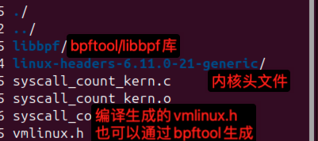

# 使用libbpf开发eBPF程序

libbpf是一个C语言库，伴随内核版本分发，用于辅助eBPF程序的加载和运行。它提供了用于与eBPF系统交互的一组C API，使开发者能够轻松地编写用户态程序来加载和管理eBPF程序。这些用户态程序通常用于分析、监控或优化系统性能。


参考自：https://zhuanlan.zhihu.com/p/596058784

生成eBPF程序字节码，字节码最终被内核中的「虚拟机」执行。 通过系统调用加载eBPF字节码到内核中，将eBPF程序attach到各个事件、函数。 创建map，用于在内核态与用户态进行数据交互。「事件」、TP点触发时，调用attach的eBPF字节码并执行其功能。

- syscall_count_kern.c为eBPF程序的C代码，使用clang编译为eBPF字节码
- syscall_count_user.cpp为用户态程序，用于调用libbpf加载eBPF字节码

字节码生成有多种方式：
1. 手动编写字节码（手写汇编指令），使用libbpf中的内存加载模式。
2. 编写c代码，由clang生成，使用libbpf解析elf文件获取相关字节码信息。
3. 一些其他工具能够解析脚本语言生成字节码（bpftrace）。

"vmlinux.h"是一个包含了完整的内核数据结构的头文件，是从vmlinux内核二进制中提取的。使用这个头文件，eBPF程序可以访问内核的数据结构，不用手动引入内核头文件。如果内核不支持生成该头文件，请手动引入所需要的内核头文件。

"bpf_helpers.h"中定义了一系列的宏，这些宏是eBPF程序使用的BPF辅助函数的封装。

源码编译安装bpftool：
```shell
sudo apt update
sudo apt upgrade
sudo apt install -y git build-essential libelf-dev clang llmv
sudo apt install linux-tools-$(uname -r)
git clone --recurse-submodules https://github.com/libbpf/bpftool.git
cd bpftool/src
make
sudo make install
bpftool --version # 验证是否成功
sudo ln -s /usr/local/sbin/bpftool /usr/sbin/bpftool # 创建符号链接，使得bpftool在系统范围内可用
bpftool --help # 查看bpftool可用的命令和选项
```
编译syscall_count_kern.c:
```shell
clang -g -O2 -target bpf -c syscall_count_kern.c -o syscall_count_kern.o -I$PWD/libbpf/include/
```


使用系统自带的内核头文件，或者通过内核源码编译`make headers_install`安装的内核头文件



确定交叉编译工具链是否存在libelf和zlib
- zlib源码 http://www.zlib.net/
- elfutils源码 https://sourceware.org/elfutils/

```shell
wget http://www.zlib.net/zlib-1.3.1.tar.gz
tar -xvf zlib-1.3.1.tar.gz


# wget https://sourceware.org/elfutils/ftp/elfutils-latest.tar.bz2
git clone git://sourceware.org/git/elfutils.git

```


## libbpf例子
1. 【eBPF】使用libbpf开发eBPF程序
https://zhuanlan.zhihu.com/p/596058784
2. libbpf
https://github.com/libbpf/libbpf
3. libbpf https://docs.ebpf.io/ebpf-library/libbpf/
4. 使用libbpf-bootstrap构建BPF程序 https://forsworns.github.io/zh/blogs/20210627/
5. 使用libbpf编写BPF应用程序进阶技巧 https://www.ebpf.top/post/top_and_tricks_for_bpf_libbpf/
6. libbpf-tools https://github.com/iovisor/bcc/tree/master/libbpf-tools
7. libbpf-bootstrap交叉编译 https://blog.csdn.net/qq_38232169/article/details/135398623
