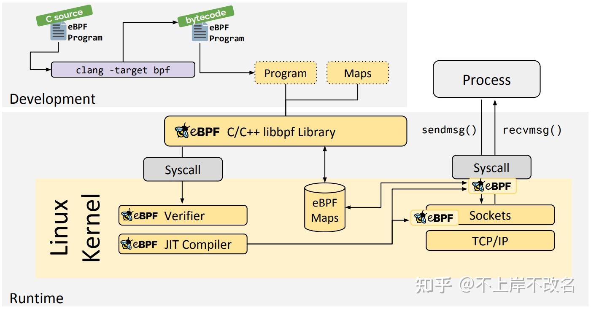

# 使用libbpf开发eBPF程序

libbpf是一个C语言库，伴随内核版本分发，用于辅助eBPF程序的加载和运行。它提供了用于与eBPF系统交互的一组C API，使开发者能够轻松地编写用户态程序来加载和管理eBPF程序。这些用户态程序通常用于分析、监控或优化系统性能。


参考自：https://zhuanlan.zhihu.com/p/596058784


使用libbpf开发eBPF程序也是需要内核态的eBPF程序和用户态的加载、挂载、映射读取以及输出程序的，可以通过以下步骤完成：
1. 内核头文件生成`vmlinux.h`
2. eBPF程序开发，`<app>.bpf.c`主要包含要在内核上下文中执行的逻辑
3. 编译eBPF程序为字节码
4. 用户态程序开发，`<app>.c/cpp`在应用程序的整个生命周期中加载BPF代码并与其交互
    - 可选的`<app>.h`代码是具有常见类型定义的头文件，并且由应用程序的BPF和用户空间代码共享；
5. 编译用户态程序

> 有了eBPF程序，就可以使用clang和bpftool将其编译成BPF字节码，然后再生成其头文件编译内核态文件

生成eBPF程序字节码，字节码最终被内核中的「虚拟机」执行。 通过系统调用加载eBPF字节码到内核中，将eBPF程序attach到各个事件、函数。 创建map，用于在内核态与用户态进行数据交互。「事件」、TP点触发时，调用attach的eBPF字节码并执行其功能。

字节码生成有多种方式：
1. 手动编写字节码（手写汇编指令），使用libbpf中的内存加载模式。
2. 编写c代码，由clang生成，使用libbpf解析elf文件获取相关字节码信息。
3. 一些其他工具能够解析脚本语言生成字节码（bpftrace）。


## BTF
BTF（BPF 类型格式）是一种元数据格式，对与BPF programs/maps有关的调试信息进行编码。BTF这个名字最初是用来描述数据类型。后来，BTF被扩展到包括已定义的子程序的函数信息和行信息。

BTF文件是在内核编译时生成的，具体取决于内核的配置选项（如 `CONFIG_DEBUG_INFO_BTF`）。如果启用了相关选项，内核会自动生成并暴露这些信息

检查内核是否开启BTF调试：

返回`CONFIG_DEBUG_INFO_BTF=y`表示内核已经开启的BTF。内核开启BTF 启用`CONFIG_DEBUG_INFO_BTF=y`内核选项即可。内核本身可以使用BTF功能，用于增强BPF验证程序自身的功能。

在eBPF程序中，由于内核已经支持了BTF，不再需要引入众多的内核头文件来获取内核数据结构的定义。取而代之的是一个通过bpftool生成的`vmlinux.h`头文件，其中包含了内核数据结构的定义。
检查内核是否BTF vmlinux：


## 开发步骤
### 1. 内核头文件生成
"vmlinux.h"是一个包含了完整的内核数据结构的头文件，是从vmlinux内核二进制中提取的。使用这个头文件，eBPF程序可以访问内核的数据结构，不用手动引入内核头文件。如果内核不支持生成该头文件，请手动引入所需要的内核头文件。

"bpf_helpers.h"中定义了一系列的宏，这些宏是eBPF程序使用的BPF辅助函数的封装。

源码编译安装bpftool：
```shell
sudo apt update
sudo apt upgrade
sudo apt install -y git build-essential libelf-dev clang llmv
sudo apt install linux-tools-$(uname -r)
git clone --recurse-submodules https://github.com/libbpf/bpftool.git
cd bpftool/src
make
sudo make install
bpftool --version # 验证是否成功
sudo ln -s /usr/local/sbin/bpftool /usr/sbin/bpftool # 创建符号链接，使得bpftool在系统范围内可用
bpftool --help # 查看bpftool可用的命令和选项
```

利用/sys/kernel/vmlinux生成vmlinux.h
```shell
sudo bpftool btf dump file /sys/kernel/btf/vmlinux format c > vmlinux.h
```
如果运行失败，需要根据提示使用apt安装`linux-tools-xxx-generic`和`linux-cloud-tools-xxx-generic`包。

### 2.eBPF程序开发
在eBPF程序中，`SEC()`宏是一个非常重要的工具，用于将特定的数据结构和函数分配到**ELF文件的特定段**中。这样在加载BPF字节码时，内核可以识别这些段并提取所需的元数据。


### 3. 

### 4. 


### 5.结果
```shell
sudo ./execsnoop
# 另起一个终端，execsnoop下会出现对应采样数据
```

## 相关工具和依赖
- bpftool:用于管理eBPF程序和BPF对象的工具 https://github.com/libbpf/bpftool.git
- libbpf: eBPF程序的开发库 https://github.com/libbpf/libbpf
    - 检测libbpf是否安装成功：
    
- libbpf-dev: eBPF程序的开发库
- elfutils:一组用于处理ELF文件的工具 `sudo apt install elfutils`
- kernel-source:内核源码 `sudo apt install linux-source`或者特定版本`sudo apt install linux-headers-$(uname -r)`
- 其他依赖:`sudo apt install -y git build-essential libelf-dev clang llvm`


## debug
```shell
hwt@hwt-VMware-Virtual-Platform:~/workspace$ clang -Wall -O2 -g execsnoop.o -static -lbpf -lelf -lz -o execsnoop
/usr/bin/ld: /lib/x86_64-linux-gnu/libelf.a(elf_compress.o): in function `__libelf_compress':
(.text+0x113): undefined reference to `ZSTD_createCCtx'
/usr/bin/ld: (.text+0x2a9): undefined reference to `ZSTD_compressStream2'
/usr/bin/ld: (.text+0x2b4): undefined reference to `ZSTD_isError'
/usr/bin/ld: (.text+0x2db): undefined reference to `ZSTD_freeCCtx'
/usr/bin/ld: (.text+0x5a0): undefined reference to `ZSTD_compressStream2'
/usr/bin/ld: (.text+0x5ab): undefined reference to `ZSTD_isError'
/usr/bin/ld: (.text+0x6b9): undefined reference to `ZSTD_freeCCtx'
/usr/bin/ld: (.text+0x835): undefined reference to `ZSTD_freeCCtx'
/usr/bin/ld: (.text+0x86f): undefined reference to `ZSTD_freeCCtx'
/usr/bin/ld: (.text+0x91b): undefined reference to `ZSTD_freeCCtx'
/usr/bin/ld: (.text+0xa12): undefined reference to `ZSTD_freeCCtx'
/usr/bin/ld: /lib/x86_64-linux-gnu/libelf.a(elf_compress.o): in function `__libelf_decompress':
(.text+0xbfc): undefined reference to `ZSTD_decompress'
/usr/bin/ld: (.text+0xc04): undefined reference to `ZSTD_isError'
/usr/bin/ld: /lib/x86_64-linux-gnu/libelf.a(elf_compress.o): in function `__libelf_decompress_elf':
(.text+0xd45): undefined reference to `ZSTD_decompress'
/usr/bin/ld: (.text+0xd4d): undefined reference to `ZSTD_isError'
clang: error: linker command failed with exit code 1 (use -v to see invocation)
```
由于链接时缺少libzstd库导致的。libzstd是一个用于快速压缩和解压缩的库，而libelf可能依赖于libzstd。

```shell
sudo apt install zstd libzstd-dev
# clang -Wall -O2 -g execsnoop.o -static -lbpf -lelf -lz -o execsnoop
clang -Wall -O2 -g execsnoop.o -static -lbpf -lelf -lzstd -lz -o execsnoop
# 确保libzstd库已正确安装并可用
ldconfig -p | grep zstd
```


## 解决编译依赖错误问题的通用方法
> 拿到工作或者所在领域的问题后，先看自己能否快速想出完整的解决方案，并确认自己能动手下场解决好。

步骤如下：
1. 先看报错信息
2. 然后看文档
3. `apt search <package name>`查找报错包名，快速找到要安装的候选库
    - 编译版本问题
        ```shell
        eibudev-dev:Depends:libpulseo(=1:15.99+dfsg1-ubuntu1) but 1:15.99+dfsg1-1ubuntu2.1 is to be installed 
        ```
        依赖低版本但是现在是高版本
4. `sudo apt install <searched package>`尝试安装找到的包名
5. 找到对应OS有哪些解决冲突的工具，以ubuntu为例：
    ```shell
    sudo apt install aptitude
    sudo aptitude install libsd12-dev # 实际上是一个apt工具，读出apt依赖问题再帮你解决
    ```
    但是要仔细阅读aptitude给出的解决方案是什么，会给出很多个解决方案！
6. 仍然不能解决去找对应的issues（记得把前面的open关掉），看看官方问题中有没有什么问题
7. 再用GPT去解决
8. 最后再用搜索引擎，搜索的时候不要直接复制粘贴，只放有用的信息
    - tldr unzip 看工具作用
    - web archive, Wayback Machine https://web.archive.org/ 找古老的网站，内链都能点击
9. 找论坛，找文章解决


## 参考文献
1. 【eBPF】使用libbpf开发eBPF程序
https://zhuanlan.zhihu.com/p/596058784
2. libbpf
https://github.com/libbpf/libbpf
3. libbpf https://docs.ebpf.io/ebpf-library/libbpf/
4. 使用libbpf-bootstrap构建BPF程序 https://forsworns.github.io/zh/blogs/20210627/
5. 使用libbpf编写BPF应用程序进阶技巧 https://www.ebpf.top/post/top_and_tricks_for_bpf_libbpf/
6. libbpf-tools https://github.com/iovisor/bcc/tree/master/libbpf-tools
7. libbpf-bootstrap交叉编译 https://blog.csdn.net/qq_38232169/article/details/135398623
8. libelf开源库用法详解 https://tinylab.org/libelf/
9. BPF BTF 详解 https://www.ebpf.top/post/kernel_btf/
10. Kernel开启BTF方式 https://kubeservice.cn/2023/10/08/kernel-enable-btf/
11. libbpf-bootstrap交叉编译 https://blog.csdn.net/qq_38232169/article/details/135398623
12. Ubuntu安装libbpf教程
https://blog.csdn.net/qq_43472789/article/details/130839929
13. eBPF学习记录（四）使用libbpf开发eBPF程序 https://blog.csdn.net/sinat_22338935/article/details/123318084
14. eBPF代码入门 https://blog.spoock.com/2023/08/14/eBPF-Helloworld/

