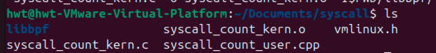
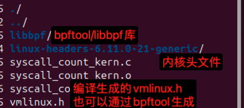
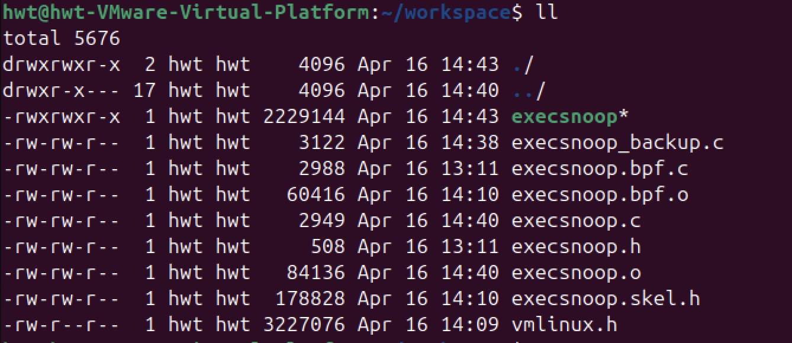

编译syscall_count_kern.c:
```shell
clang -g -O2 -target bpf -c syscall_count_kern.c -o syscall_count_kern.o -I$PWD/libbpf/include/
```



使用系统自带的内核头文件，或者通过内核源码编译`make headers_install`安装的内核头文件



确定交叉编译工具链是否存在libelf和zlib
- zlib源码 http://www.zlib.net/
- elfutils源码 https://sourceware.org/elfutils/

```shell
sudo apt install g++-riscv64-linux-gnu gcc-riscv64-linux-gnu
wget http://www.zlib.net/zlib-1.3.1.tar.gz
tar -xvf zlib-1.3.1.tar.gz
CC=riscv64-linux-gnu-gcc CXX=riscv64-linux-gnu-g++ ./configure --prefix=$PWD/install
make 
make install


wget https://sourceware.org/elfutils/ftp/elfutils-latest.tar.bz2
git clone git://sourceware.org/git/elfutils.git
cd elfutils-0.188 && mkdir install
CC=riscv64-linux-gnu-gcc CXX=riscv64-linux-gnu-g++ LDFLAGS="-L$PWD/../zlib-1.2.13/install/lib" LIBS="-lz" ./configure --prefix=$PWD/install --build=x86_64-linux-gnu --host=riscv64-linux-gnu --disable-libdebuginfod --disable-debuginfod
make -j8
make -C libelf install

```
编译用户态eBPF加载程序，链接之前编译好的依赖库：
```shell
riscv64-linux-gnu-g++ -o syscall_count syscall_count_user.cpp ./libbpf/libbpf.a -lelf -lz -I$PWD/libbpf/include -I$PWD/linux-headers/include/ -L$PWD/zlib-1.2.13/install/lib -L$PWD/elfutils-0.188/install/lib

```
注意：内核要开启相关功能（若加载失败可以使用 gdb 进行内核调试，定位根因）

```shell
# Kernel hacking
#   -> Tracers 这里开启
# 还需要挂载 debugfs
mount -t debugfs none /sys/kernel/debug
```

将syscall_count_kern.o、syscall_count和动态库拷贝到之前搭建的内核调试环境中。


- execsnoop.bpf.c为eBPF程序的C代码，使用clang编译为eBPF字节码
- execsnoop.c为用户态程序，用于调用libbpf加载eBPF字节码



