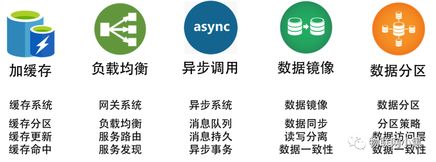
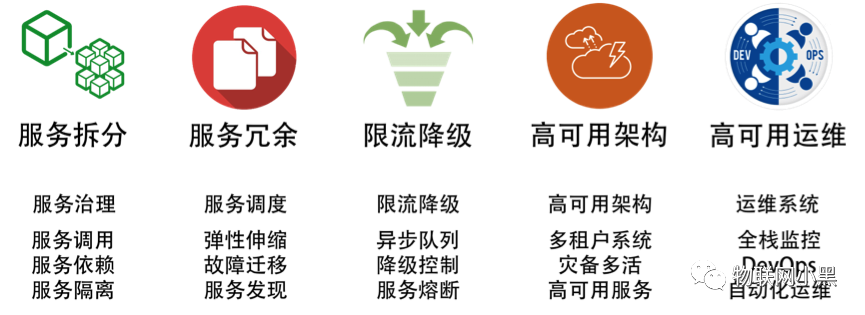
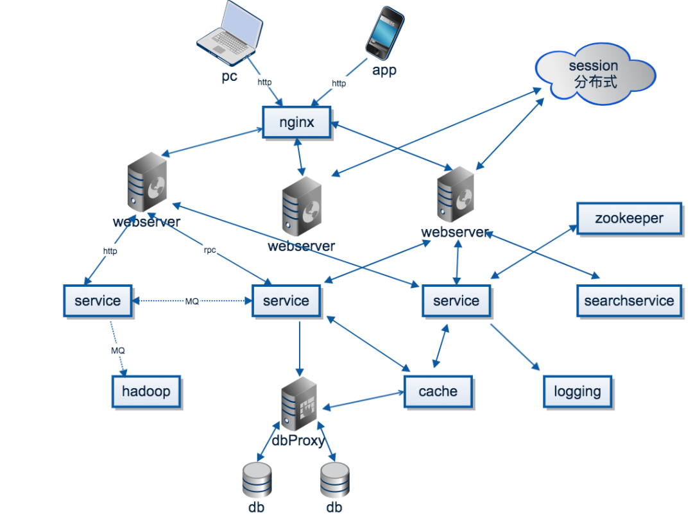
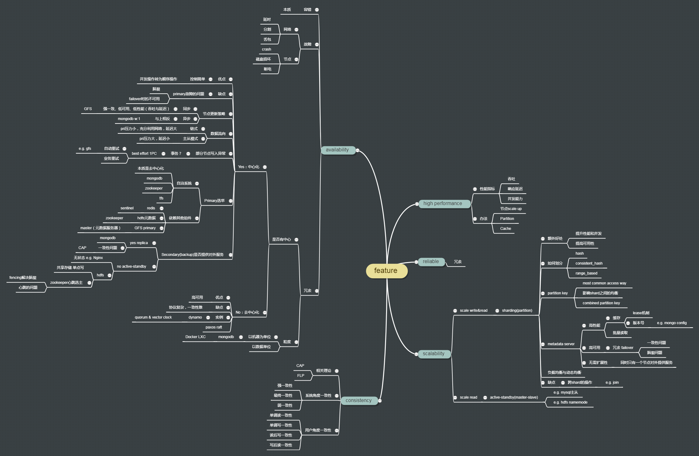

# 分布式系统学习路线
> 分布式系统学习是一场持久战，我们要知道一个知识是为了解决什么问题而产生的，后面又经过了怎样的迭代和优化，最终演变成了什么样子。

> 分布式系统的核心就是数据的分散和聚合。

> <font color=#fda>**先有一个整体的把握，然后自己思考会有什么问题，带着问题去寻求答案，在寻求答案的时候再去看论文。**</font>


1. 为什么需要分布式系统？单机性能瓶颈+可用性+避免单机故障
2. 分布式系统带来哪些问题？故障处理+异步网络+时钟同步+共识协调
```
- 故障处理
    - 单体服务系统:全部失败
    - 分布式系统:部分失败(通过软件来容错，构建高可用的分布式系统)
- 异步网络
    - 单机系统:本地调用
    - 分布式系统:远程调用
        - 采用超时机制
        - 响应超时(增加重试机制，增加幂等机制，增加退避策略)
- 时钟同步
    - 单机系统:全局时钟
    - 分布式系统:多个时钟(系统中各个节点的本地时钟是存在误差的，不能依赖各自的时钟事件进行排序)
- 共识协调
    - 单体系统:一言堂
    - 分布式系统:共识(分布式系统中参与同步的进程之间能达成共识)
```
3. 分布式架构是什么？分布式计算+分布式存储
```
- 分布式计算
    - 怎么找到服务 - 正常情况下的路由问题
    - 怎么找到实例 - 正常情况下的路由问题
    - 怎么避免雪崩 - 异常情况下的路由问题
    - 怎么管理配置 - 运维问题
    - 怎么监控告警和故障恢复 - 运维问题
- 分布式存储
    - 怎么做数据分片 - 带状态的路由问题
    - 怎么做数据复制 - 共识问题 
    - 怎么做分布式事务 - 共识问题
    - 怎么做分布式锁 - 共识问题
```

**提升系统架构性能的技术**:



**提升系统稳定性的技术**:




---

## 用一个请求串起组件、理论和协议

> 一个实际的大型网络出发，思考会遇到哪些问题，需要哪些分布式协议与组件。

假设这是一个对外提供服务的大型分布式系统，用户连接到系统，做一些操作，产生一些需要存储的数据，那么在这个过程中，会遇到哪些组件、理论与协议呢？

用户使用Web、APP、SDK，通过HTTP、TCP连接到系统。在分布式系统中，为了高并发、高可用，一般都是多个节点提供相同的服务。那么，第一个问题就是具体选择哪个节点来提供服务，这个就是**负载均衡（load balance）**。负载均衡的思想很简单，但使用非常广泛，在分布式系统、大型网站的方方面面都有使用，或者说，只要涉及到多个节点提供同质的服务，就需要负载均衡。通过负载均衡找到一个节点，接下来就是真正处理用户的请求，请求有可能简单，也有可能很复杂。简单的请求，比如读取数据，那么很可能是有缓存的，即**分布式缓存**，如果缓存没有命中，那么需要去**数据库**拉取数据。对于复杂的请求，可能会调用到系统中其他的服务。

承上，假设服务A需要调用服务B的服务，首先两个节点需要通信，网络通信都是建立在TCP/IP协议的基础上，但是，每个应用都手写socket是一件冗杂、低效的事情，因此需要应用层的封装，因此有了HTTP、FTP等各种应用层协议。当系统愈加复杂，提供大量的http接口也是一件困难的事情。因此，有了更进一步的抽象，那就是**RPC（remote produce call）**，是的远程调用就跟本地过程调用一样方便，屏蔽了网络通信等诸多细节，增加新的接口也更加方便。一个请求可能包含诸多操作，即在服务A上做一些操作，然后在服务B上做另一些操作。比如简化版的网络购物，在订单服务上发货，在账户服务上扣款。这两个操作需要**保证原子性**，要么都成功，要么都不操作。这就涉及到**分布式事务**的问题，分布式事务是从应用层面保证一致性：某种守恒关系。

上面说到一个请求包含多个操作，其实就是涉及到多个服务，分布式系统中有大量的服务，每个服务又是多个节点组成。那么一个服务怎么找到另一个服务（的某个节点呢）？通信是需要地址的，怎么获取这个地址，最简单的办法就是配置文件写死，或者写入到数据库，但这些方法在节点数据巨大、节点动态增删的时候都不大方便，这个时候就需要服务注册与发现：提供服务的节点向一个**协调中心**注册自己的地址，使用服务的节点去协调中心拉取地址。从上可以看见，协调中心提供了**中心化的服务**：以一组节点提供类似单点的服务，使用非常广泛，比如命令服务、分布式锁。协调中心最出名的就是chubby，zookeeper。

回到用户请求这个点，请求操作会产生一些数据、日志，通常为信息，其他一些系统可能会对这些消息感兴趣，比如个性化推荐、监控等，这里就抽象出了两个概念，**消息的生产者与消费者**。那么生产者怎么讲消息发送给消费者呢，RPC并不是一个很好的选择，因为RPC肯定得指定消息发给谁，但实际的情况是生产者并不清楚、也不关心谁会消费这个消息，这个时候**消息队列**就出马了。简单来说，生产者只用往消息队列里面发就行了，队列会将消息按主题（topic）分发给关注这个主题的消费者。消息队列起到了异步处理、应用解耦的作用。

上面提到，用户操作会产生一些数据，这些数据忠实记录了用户的操作习惯、喜好，是各行各业最宝贵的财富。比如各种推荐、广告投放、自动识别。这就催生了**分布式计算平台**，比如Hadoop，Storm等，用来处理这些海量的数据。

最后，用户的操作完成之后，用户的数据需要持久化，但数据量很大，大到按个节点无法存储，那么这个时候就需要**分布式存储**：将数据进行划分放在不同的节点上，同时，为了防止数据的丢失，每一份数据会保存多份。传统的关系型数据库是单点存储，为了在应用层透明的情况下分库分表，会引用额外的代理层。而对于NoSql，一般天然支持分布式。



---

## 分布式系统的特征

在延伸feature（分布式系统需要考虑的特性）的时候，我逐渐明白，这是因为要满足这些feature，才设计了很多协议与算法，也提出了一些理论。比如说，这是因为要解决去中心化副本的一致性问题，才引入了Paxos（raft）协议。而每一个分布式系统，如分布式存储、分布式计算、分布式消息队列、分布式RPC框架，根据业务的不同，会使用不同的方法来满足这些feature，对这些feature的支持也可能会有权衡，比如一致性与可用性的权衡。


**分布式的世界中涉及到大量的协议（raft、2pc、lease、quorum等）、大量的理论（FLP， CAP等）、大量的系统（GFS、MongoDB、MapReduce、Spark、RabbitMQ等）**。这些大量的知识总是让我们无从下手，任何一个东西都需要花费大量的时间，特别是在没有项目、任务驱动的时候，没有一个明确的目标，真的很难坚持下去。


> 所以，我一直在思考，能有什么办法能把这些东西串起来？当我掌握了知识点A的时候，能够自然地想到接下来要学习B知识，A和B的关系，也许是递进的，也许是并列的。我也这样尝试了，那就是《什么是分布式系统，如何学习分布式系统》一文中我提到的，思考一个大型网站的架构，然后把这些协议、理论串起来。按照这个想法，我的计划就是去逐个学习这些组件。但是，其实在这里有一个**误区**，我认为一个大型网站就是一个分布式系统，包含诸多组件，这些组件是分布式系统的组成部分；而我现在认为，<font color=#fad>**一个大型网站包含诸多组件，每一个组件都是一个分布式系统**</font>，比如分布式存储就是一个分布式系统，消息队列就是一个分布式系统。

为什么说从思考分布式的特征出发，是一个可行的、系统的、循序渐进的学习方式呢，因为：

1. **先有问题，才会去思考解决问题的办法**：由于我们要提高可用性，所以我们才需要冗余；由于需要扩展性，所以我们才需要分片
2. **解决一个问题，常常会引入新的问题**：比如，为了提高可用性，引入了冗余；而冗余又带来了副本之间的一致性问题，所以引入了中心化副本协议(primary/secondary)；那么接下来就要考虑primary(节点)故障时候的选举问题等
3. **这是一个金字塔结构，或者说，也是一个深度优先遍历的过程**：在这个过程中，我们始终知道自己已经掌握了哪些知识；还有哪些是已经知道，但未了解的知识；也能知道，哪些是空白，即我们知道这里可能有很多问题，但是具体是什么，还不知道。

　　
那么，各个分布式系统如何与这些特征相关联呢？不难发现，每个分布式系统都会或多或少的体现出这些特征，只是使用的方法、算法可能不大一样。所以，我们应该思考，**某一个问题，在某个特定系统中是如何解决的**。比如元数据管理的强一致性，在MongoDB中是如何实现的，在HDFS中是如何实现的。这也指导了我们如何去学习一个具体的分布式系统：**带着问题，只关注关心的部分，而不是从头到尾看一遍。**




### 分布式系统的一般特征

 　　任何介绍分布式系统的文章或者书籍都会提到分布式系统的几个特性：可扩展性、高性能、高可用、一致性。这几个特性也是分布式系统的衡量指标，正是为了在不同的程度上满足这些特性（或者说达到这些指标），才会设计出各种各样的算法、协议，然后根据业务的需求在这些特性间平衡。那么为什么要满足这些特性，要满足这些特性需要解决什么问题，有什么好的解决方案？

#### 一、可扩展性

> Scalability is the capability of a system, network, or process to handle a growing amount of work, or its potential to be enlarged to accommodate that growth.

　　可扩展性是指当系统的任务（work）增加的时候，通过增加资源来应对任务增长的能力。可扩展性是任何分布式系统必备的特性，这是由分布式系统的概念决定的：
- 分布式系统是由一组通过网络进行通信、为了完成共同的任务而协调工作的计算机节点组成的系统;
- 分布式系统的出现是为了解决单个计算机无法完成的计算、存储任务。那么当任务规模增加的时候，必然就需要添加更多的节点，这就是可扩展性;
- 扩展性的目标是使得系统中的节点都在一个较为稳定的负载下工作，这就是负载均衡，当然，在动态增加节点的时候，需要进行任务（可能是计算，可能是数据存储）的迁移，以达到动态均衡。

那么首先要考虑的问题就是，如何对任务进行拆分，将任务的子集分配到每一个节点，我们称这个过程为**Partition（Sharding）**。

1. 分片分式，即按照什么算法对任务进行拆分？

    常见的算法包括：<font color=#fad>**哈希（hash），一致性哈希（consistency hash），基于数据范围（range based）**</font>。每一种算法有各自的优缺点，也就有各自的适用场景。

2. 分片的键，partition key是数据的特征值，上面提到的任何分片方式都依赖于这个partition key，那么该如何选择呢?

    > based on what you think the primary access pattern will be
    
    partition key会影响到**任务在分片之间的均衡**，而且一些系统中（mongodb）几乎是不能重新选择partition key的，因此在设计的时候就得想清楚

3. 分片的额外好处?

    - 提升性能和并发：不同的请求分发到不同的分片
    - 提高可用性：一个分片挂了不影响其他的分片

4. 分片带来的问题？

    如果一个操作需要跨越多个分片，那么效率就会很低下，比如数据中的join操作

5. 元数据管理？

    元数据记录了分片与节点的映射关系、节点状态等核心信息，分布式系统中，有专门的节点（节点集群）来管理元数据，我们称之为元数据服务器。元数据服务器有以下特点：
    - 高性能：cache
    - 高可用：冗余+快速failover
    - 强一致性（同时只有一个节点对外提供服务）

6. 任务的动态均衡？
    
    为了达到动态均衡，需要进行数据的迁移，如何保证在迁移的过程中保持对外提供服务，这也是一个需要精心设计的复杂问题。

#### 二、可用性
　　

可用性（Availability）是**系统不间断对外提供服务的能力**，可用性是一个度的问题，最高目标就是7 * 24，即永远在线。但事实上做不到的，一般是用几个9来衡量系统的可用性。为什么分布式系统中必须要考虑可用性呢？这是因为分布式系统中故障的概率很高。分布式系统由大量异构的节点和网络组成，节点可能会crash、断电、磁盘损坏，网络可能丢包、延迟、网络分割。系统的规模放大了出故障的概率，因此分布式系统中，故障是常态。那么分布式系统的其中一个设计目标就是容错，在部分故障的情况下仍然对外提供服务，这就是可用性。

<font color=#fda>**冗余是提高可用性、可靠性的法宝。**</font> 冗余就是说多个节点负责相同的任务，在需要状态维护的场景，比如分布式存储中使用非常广泛。在分布式计算，如MapReduce中，当一个worker运行异常缓慢时，master会将这个worker上的任务重新调度到其它worker，以提高系统的吞吐，这也算一种冗余。但存储的冗余相比计算而言要复杂许多，因此主要考虑存储的冗余。维护同一份数据的多个节点称之为多个副本。我们考虑一个问题，当向这个副本集写入数据的时候，怎么保证并发情况下数据的一致性，是否有一个节点有决定更新的顺序，这就是 **中心化,去中心化副本协议** 的区别。

#### 中心化与去中心化
　　中心化就是有一个主节点（primary master）负责调度数据的更新，其优点是协议简单，将并发操作转变为顺序操作，缺点是primary可能成为瓶颈，且在primary故障的时候重新选举会有一段时间的不可用。

　　去中心化就是所有节点地位平等，都能够发起数据的更新，优点是高可用，缺点是协议复杂，要保证一致性很难。

　　提到去中心化，比较有名的是dynamo，cassandra，使用了quorum、vector clock等算法来尽量保证去中心化环境下的一致性。对于去中心化这一块，目前还没怎么学习，所以下面主要讨论中心化副本集。

1. 节点更新策略。<font color=#fda>**primary节点到secondary节点的数据是同步还是异步**</font>，即客户端是否需要等待数据落地到副本集中的所有节点。同步的优点在于强一致性，但是可用性和性能（响应延迟）比较差；异步则相反。

2. 数据流向。即<font color=#fda>**数据是如何从Primary节点到secondary节点的，有链式和主从模式**</font>。链式的优点时充分利用网络带宽，减轻primary压力，但缺点是写入延迟会大一些。GFS，MongoDB（默认情况下）都是链式。

3. 部分节点写入异常。理论上，副本集中的多个节点的数据应该保持一致，因此多个数据的写入理论上应该是一个事务：要么都发生，要么都不发生。但是分布式事务（如2PC）是一个复杂的、低效的过程，因此副本集的更新一般都是best effort 1pc，如果失败，则重试，或者告诉应用自行处理。

4. primary的选举。在中心化副本协议中，primary节点是如何选举出来的，当primary节点挂掉之后，又是如何选择出新的primary节点呢，有两种方式：自治系统，依赖其他组件的系统。（ps，这两个名字是我杜撰的 。。。）所谓的自治系统，就是节点内部自行投票选择，比如mongodb，tfs，zookeeper。依赖其他组件的系统，是指primary由副本集之后的组件来任命，比如GFS中的primary由master（GFS的元数据服务器）任命，hdfs的元数据namenode由zookeeper心跳选出。

5. secondary是否对外提供服务（读服务）。中心化复制集中，secondary是否对外提供读服务，取决于系统对一致性的要求。比如前面介绍到节点更新策略时，可能是异步的，那么secondary上的数据相比primary会有一定延迟，从secondary上读数据的话无法满足强一致性要求。比如元数据，需要强一致性保证，所以一般都只会从primary读数据。而且，一般称主节点为active（master），从节点为standby（slave）。在这种情况下，是通过**冗余和快速的failover**来保证可用性。

#### 三、一致性
　　
从上面可以看到，为了高可用性，引入了冗余（副本）机制，而副本机制就带来了一致性问题。当然，如果没有冗余机制，或者不是数据（状态）的冗余，那么不会出现一致性问题，比如MapReduce。

一致性与可用性在分布式系统中的关系，已经有足够的研究，形成了**CAP理论**。CAP理论就是说**分布式数据存储，最多只能同时满足一致性（C，Consistency）、可用性（A， Availability）、分区容错性（P，Partition Tolerance）中的两者。**但一致性和可用性都是一个度的问题，是0到1，而不是只有0和1两个极端。

一致性从系统的角度和用户的角度有不同的等级。
- 系统角度的一致性：强一致性、弱一致性、最终一致性
- 用户角度的一致性：单调读一致性，单调写一致性，读后写一致性，写后读一致性

#### 四、高性能
　　

正式因为单个节点的scale up不能完成任务，因此我们才需要scale out，用大量的节点来完成任务，分布式系统的理想目标是任务与节点按一定的比例线性增长。高性能的衡量指标：
- 高并发
- 高吞吐
- 低延迟

不同的系统关注的核心指标不一样，比如MapReduce，本身就是离线计算，无需低延迟。

可行的办法：
- 单个节点的scaleup
- 分片（partition）
- 缓存：比如元数据
- 短事务


---

## 业界实现


那么对于上面的各种技术与理论，业界有哪些实现呢，下面进行简单罗列。
常见的分布式系统分为数据存储系统如hdfs，hbase；数据处理计算系统如storm、spark、flink；数据存储兼分析混合系统，这类系统在数据存储的基础上提供了复杂的数据搜索查询功能，如elastic search、druid。对于存储兼计算的系统，我们仍然可以分开分析。

当然，下面的这些实现，小部分我用过，知其所以然；大部分听说过，知其然；还有一部分之前闻所未闻，分类也不一定正确，只是从其他文章抄过来的。罗列在这里，以便日后或深或浅的学习。

- 负载均衡：
    - Nginx：高性能、高并发的web服务器；功能包括负载均衡、反向代理、静态内容缓存、访问控制；工作在应用层
    - LVS：Linux virtual server，基于集群技术和Linux操作系统实现一个高性能、高可用的服务器；工作在网络层
- webserver：
    - Java：Tomcat，Apache，Jboss
    - Python：gunicorn、uwsgi、twisted、webpy、tornado
- service：SOA、微服务、spring boot，django
- 容器：docker，kubernetes
- cache：memcache、redis等
- 协调中心：
    - zookeeper、etcd等
    - zookeeper使用了Paxos协议。Paxos是强一致性，高可用的去中心化分布式。zookeeper的使用场景非常广泛。
- rpc框架：
    - grpc、dubbo、brpc
    - dubbo是阿里开源的Java语言开发的高性能RPC框架，在阿里系的诸多架构中，都使用了dubbo + spring boot
- 消息队列：
    - kafka、rabbitMQ、rocketMQ、QSP
    - 消息队列的应用场景：异步处理、应用解耦、流量削锋和消息通讯
- 实时数据平台：storm、akka
- 离线数据平台：hadoop、spark 
    - PS: apark、akka、kafka都是scala语言写的，看到这个语言还是很牛逼的
- dbproxy：
    - cobar也是阿里开源的，在阿里系中使用也非常广泛，是关系型数据库的sharding + replica 代理
- db：mysql、oracle、MongoDB、HBase
- 搜索：elasticsearch、solr
- 日志：rsyslog、elk、flume


---


## 初步学习计划(2025.06.06-2025.07.06)

1. 存储引擎相关知识(单机，关注存储引擎和数据模型)0606-0616
    - 关系型数据库
    - 非关系型数据库(NoSQL)
        - 文件数据库
        - 图数据库
        - 列族存储:HBase,Cassandra，时序数据
        - **键值存储相关存储引擎:lsm-tree, B-tree, hash, skiplist**，比如leveldb:https://github.com/google/leveldb 
    - **对象存储**(替代硬盘的存储系统)0807-0907：海量非结构化数据的存储系统比如文件和图片等，存储原始的文件，每个对象包含数据,元数据,和全局唯一ID。不支持数据库的查询能力，仅支持接口存取对象。
    - **向量存储**(高性能内存数据库)0807-0907：面向AI的高维数向量检索专用存储存储高维浮点数组，执行相似性搜索ANNS，支持AI应用。<font color=#fda>（单出）</font>
        - https://github.com/CaucherWang/ANN-Papers
        - https://github.com/datawhalechina/what-is-vs?tab=readme-ov-file
    - **数据模型:文件模型, 关系模型, 键值模型**(包含在上面内容中)
    - **事务与并发控制**
2. Linux存储基础0606-0616
    - 文件系统相关基础
    - I/O模式
    - 并发I/O模型
    - 缓存模式
3. 分布式相关基础知识0617-0626
    - 《大规模分布式存储系统——原理解析与架构实战》第三章
    - 《分布式存储系统——核心技术、系统实现与Go项目实战》第10-12章
    - raft paper https://raft.github.io/raft.pdf 
    - paxos paper https://lamport.azurewebsites.net/pubs/paxos-simple.pdf https://lamport.azurewebsites.net/pubs/lamport-paxos.pdf
    - Spanner paper https://www.usenix.org/system/files/conference/osdi12/osdi12-final-16.pdf
    - F1  https://static.googleusercontent.com/media/research.google.com/zh-CN//pubs/archive/41344.pdf
    - Percolator paper https://www.usenix.org/legacy/event/osdi10/tech/full_papers/Peng.pdf
4. 数据库基础知识《数据库系统概念》(暂时不想看，讨厌理论)
    - 第 3 章：SQL
    - 第 11 章：索引与散列
    - 第 12 章：查询处理
    - 第 13 章：查询优化
    - 第 14 章：事务
    - 第 15 章：并发控制
    - 第 18 章：并行数据库
    - 第 19 章：分布式数据库
5. 实践
    - KV store:skip list 0606-0616

        https://programmercarl.com/ke/kvcplus.html
    - MIT 6.824：0627-0706
       
       https://csdiy.wiki/%E5%B9%B6%E8%A1%8C%E4%B8%8E%E5%88%86%E5%B8%83%E5%BC%8F%E7%B3%BB%E7%BB%9F/MIT6.824/

        https://pdos.csail.mit.edu/6.824/
    - PingCAP Talent Plan计划

        https://zhuanlan.zhihu.com/p/61340679

        https://docs.google.com/document/d/1UG0OHuL6l_hHWs3oyT9gA2n7LuYUfV23nmz0tRvXq2k/edit?tab=t.0#heading=h.ywlair765ic9

        https://learn.pingcap.cn/learner/talent-plan

        https://github.com/pingcap/talent-plan
    - oceanbase练习:0707-0807

        《大规模分布式存储系统——原理解析与架构实战》第8-11章
        
        https://open.oceanbase.com/competition

6. 分布式范型业界实现分析:0707-0807
    1. 先分析该系统是数据存储还是计算系统(分布式文件系统，分布式键值系统，分布式表格系统，分布式数据库):
        - 如果是数据存储系统，从数据分布和副本策略开始入手；
        - 如果是数据处理问题，从数据投递策略入手。

    2. 读对应系统架构图，对应着常用的架构模型，每个组件和已有的系统进行类比，想一下这个组件类似于hdfs的namenode等等，最后在脑海里梳理下数据流的整个流程。

    3. 在了解了系统的大概，着重看下文档中fault tolerence章节，看系统如何容错，或者自己可以预先问些问题，比如如果一个节点挂了、一个任务挂了系统是如何处理这些异常的，带着问题看文档。

    4. 文档详细读了一遍，就可以按照官方文档写些hello world的例子了，详细查看下系统配置项，随着工作的深入就可以看些系统的细节和关键源码了。

7. Go和Rust:0707-0807


---


### 参考


https://pdos.csail.mit.edu/6.824/

https://csdiy.wiki/%E5%B9%B6%E8%A1%8C%E4%B8%8E%E5%88%86%E5%B8%83%E5%BC%8F%E7%B3%BB%E7%BB%9F/MIT6.824/

https://mp.weixin.qq.com/s/y8ECRO36OZ32ZPujOdRNBw

https://mp.weixin.qq.com/s/KbG7cTiRhRsrvPSNvf3AQA

如何学习分布式系统？
https://mp.weixin.qq.com/s/oYLVhKppgYx7nOTkHzcw5A

什么是分布式系统，如何学习分布式系统？
https://mp.weixin.qq.com/s/MKvqFz_qZSY9twB8bv9DDg

分布式学习最佳实践：从分布式系统的特征开始（附思维导图）
https://www.cnblogs.com/xybaby/p/8544715.html

《分布式存储系统——核心技术、系统实现与Go项目实战》

《分布式对象存储》

《大规模分布式存储系统》