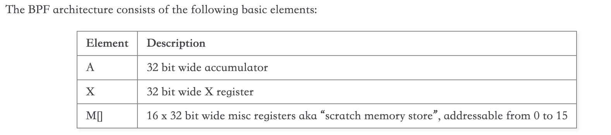
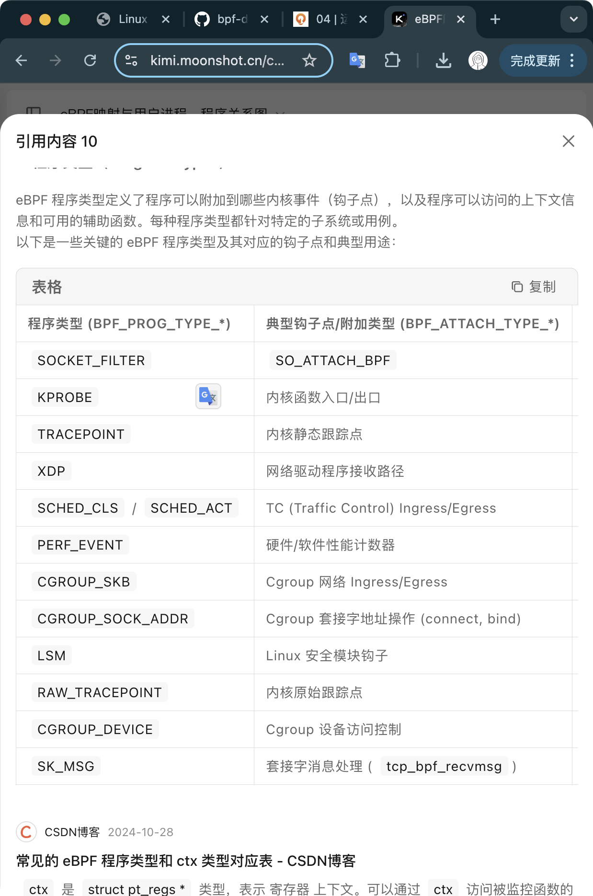

原始的BPF又称之为class BPF(cBPF), BPF与eBPF类似于i386与amd64的关系, 最初的BPF只能用于套接字的过滤,内核源码树中tools/bpf/bpf_asm可以用于编写这种原始的BPF程序。

类似于一个`int32_t M[16];`的小内存。

由于性能有限，后面cBPF发展成为eBPF,有新的指令和架构，原始的BPF指令会被自动翻译为新的eBPF指令。

## eBPF虚拟机

eBPF虚拟机是一个轻量级的RISC风格寄存器虚拟机，负责运行通过eBPF编译器生成的字节码。它提供了一个与硬件无关的中间层，使得eBPF程序可以在不同架构的Linux内核中运行。eBPF虚拟机的主要功能包括：
- 执行eBPF字节码，提供高效的指令集。
- 支持即时编译（JIT），将字节码转换为本地机器码，实现接近原生性能。
- 提供安全的执行环境，通过内核验证器确保程序的安全性。

> eBPF 虚拟机并不是在最初的 BPF 实现中就存在的。最初的 BPF（Berkeley Packet Filter）主要用于网络数据包过滤，其字节码是解释执行的。随着 eBPF 的发展，为了提高性能，内核开发者引入了 JIT 编译器。Linux 内核 3.18 版本（2014 年 12 月）标志着 eBPF 的诞生，引入了多项关键增强，如更多的寄存器、新的指令、映射（maps）数据结构、辅助函数（helper functions）和尾调用（tail calls）等。

eBPF虚拟机的架构设计如下：
- 寄存器（64位）：拥有11个64位通用寄存器（R0-R10），其中R10是**只读**的栈指针寄存器，指向512字节的栈。虚拟机寄存器总是64位的(就算是32位物理机也是这样的), 并且支持32位子寄存器寻址(寄存器高32位自动设置为0)
- 指令集：支持加载/存储操作、算术逻辑运算（ALU）、跳转指令等。
- 调用约定：
    - R0 用于函数返回值和程序退出值。
    - R1-R5 用于函数调用参数。当程序开始运行时, r1包含一个指向context参数的指针。
    - R6-R9 是被调用者保存的寄存器，在内核函数调用之间得到保留。
    - R10 是只读的栈指针寄存器，指向栈帧。
- 栈：提供一个固定大小的 512 字节栈，用于局部变量存储和函数调用。
- 程序计数器（PC）：隐含的程序计数器，用于指令跳转。

11个64位寄存器，一个PC以及一个512字节的固定大小的栈。 9个通用寄存器可以读写, 一个是只能读的栈指针寄存器(SP), 以及一个隐含的程序计数器, 我们只能根据PC进行固定偏移的跳转。

```mermaid
graph TD
    A[EBPF 虚拟机] -->|包含| B[指令集]
    A -->|包含| C[寄存器]
    A -->|包含| D[栈]
    A -->|包含| E[程序计数器PC]
    A -->|包含| F[内核辅助函数]
    A -->|包含| G[验证器]
    A -->|包含| H[即时编译器JIT]

    B --> B1[加载/存储操作]
    B --> B2[算术逻辑运算ALU]
    B --> B3[跳转指令]
    B --> B4[函数调用]
    B --> B5[尾调用Tail Call]

    C --> C1[R0: 返回值]
    C --> C2[R1-R5: 函数调用参数]
    C --> C3[R6-R9: 保留寄存器]
    C --> C4[R10: 栈指针SP]

    D --> D1[512 字节固定大小]
    D --> D2[局部变量存储]
    D --> D3[函数调用栈]

    E --> E1[指令跳转]
    E --> E2[隐含寄存器]

    F --> F1[bpf_map_lookup_elem]
    F --> F2[bpf_map_update_elem]
    F --> F3[bpf_tail_call]

    G --> G1[验证 eBPF 程序的安全性]
    G --> G2[检查指令和寄存器使用]
    G --> G3[防止潜在的安全漏洞]

    H --> H1[将字节码转换为本地机器码]
    H --> H2[提高执行效率]

    style A fill:#f9f,stroke:#333,stroke-width:2px
    style B fill:#ccf,stroke:#333,stroke-width:1px
    style C fill:#ccf,stroke:#333,stroke-width:1px
    style D fill:#ccf,stroke:#333,stroke-width:1px
    style E fill:#ccf,stroke:#333,stroke-width:1px
    style F fill:#ccf,stroke:#333,stroke-width:1px
    style G fill:#ccf,stroke:#333,stroke-width:1px
    style H fill:#ccf,stroke:#333,stroke-width:1px
```




加载eBPF程序时提供的prog_type决定了内核里面哪些函数子集可以调用，也决定了程序启动时通过r1提供的context参数，r0中保存的返回值定义也由prog_type决定。

> prog_type -> kernel_function subset + r1 context + r0 return value

eBPF->eBPF, eBPF->kernel, 每个函数调用最多5个参数，保存在寄存器r1~r5中，并且传递参数时，r1~r5只能保存常数或指向堆栈的指针，不能直接指向任意内存。所有的内存访问必须先加数据加载的eBPF栈中，以简化内存模型并帮助验证器进行正确性检查。

eBPF程序可以调用内核提供的辅助函数，这些函数类似于系统调用。辅助函数在内核中通过 BPF_CALL_* 宏定义，bpf.h 文件提供了所有可访问的内核辅助函数的声明。



以bpf_trace_printk为例子, 这个函数在内核中通过`BPF_CALL_5`进行定义, 并且有5对类型与参数名, 定义参数的类型对于eBPF很重要, 因为每一个eBPF程序加载时eBPF验证器都要确保寄存器数据类型与被调用函数的参数类型匹配。

```c
BPF_CALL_5(bpf_trace_printk, char *, fmt, u32, fmt_size, u64, arg1, u64, arg2, u64, arg3)
{
    ...
}
```

这样设计是为了让虚拟机指令与原生的指令集(x86 arm)尽可能匹配, 这样JIT编译出的指令可以更简单高效, 所有寄存器都一对一地映射到硬件寄存器。例如，x86_64 JIT 编译器可以将它们映射为：


| eBPF 寄存器 | x86_64 硬件寄存器 | 说明 | 
| --- | --- | --- | 
| R0 | rax | 函数返回值和程序退出值 | 
| R1 | rdi | 第一个参数 | 
| R2 | rsi | 第二个参数 | 
| R3 | rdx | 第三个参数 | 
| R4 | rcx | 第四个参数 | 
| R5 | r8 | 第五个参数 | 
| R6 | rbx | 被调用者保存的寄存器 | 
| R7 | r13 | 被调用者保存的寄存器 | 
| R8 | r14 | 被调用者保存的寄存器 | 
| R9 | r15 | 被调用者保存的寄存器 | 
| R10 | rbp | 只读的栈帧指针寄存器 | 

在x86_64架构上，函数调用时前6个参数分别存放在rdi、rsi、rdx、rcx、r8、r9寄存器中。eBPF寄存器R1-R5直接映射到这些硬件寄存器，使得函数参数在正确的寄存器中，减少了指令的复杂性和执行时间。例如，当eBPF程序调用内核辅助函数时，JIT编译器可以直接将eBPF寄存器R1-R5的值传递给硬件寄存器rdi-r8，而不需要额外的移动指令。

## eBPF指令编码
一个eBPF程序就是64位指令的序列, 所有的eBPF指令都有同样的基础格式。每个eBPF指令都是固定的8字节, 大概有100条指令, 被划分为8个类型。 虚拟机支持从通用内存(映射, 栈, contexts比如数据包, ..)中进行1-8字节的读写, 支持前后有无条件的跳转, 支持数据与逻辑操作(ALU指令), 支持函数调用。

```c
msb                                                        lsb
+------------------------+----------------+----+----+--------+
|immediate               |offset          |src |dst |opcode  |
+------------------------+----------------+----+----+--------+
```
From least significant to most significant bit:
- 8 bit opcode
- 4 bit destination register (dst)
- 4 bit source register (src)
- 16 bit offset
- 32 bit immediate (imm)

bpf.h中使用`struct bpf_insn`来描述一个eBPF指令, 其定义与上文是一致的。因此一段eBPF程序也可以用一个`struct bpf_insn`数组来描述。
```c
struct bpf_insn {
    __u8    code;        /* 操作码 opcode */
    __u8    dst_reg:4;    /* 目标寄存器 dest register */
    __u8    src_reg:4;    /* 源寄存器 source register */
    __s16    off;        /* 有符号的偏移 signed offset */
    __s32    imm;        /* 有符号的立即数 signed immediate constant */
};
```

大多数指令并不会使用全部的区域, 不使用的区域应该设置为0。
```c
msb      lsb
+---+--+---+
|mde|sz|cls|
+---+--+---+
```
操作码的最低3bit表示指令类别, 这个把相关的操作码组合在一起。
LD/LDX/ST/STX操作码有如下结构：
```c
msb      lsb
+---+--+---+
|mde|sz|cls|
+---+--+---+
| 3 |2 | 3 |
```
sz区域表示目标内存区域的大小, mde区域是内存访问模式, uBPF只支持通用MEM访问模式。
ALU/ALU64/JMP操作码有如下结构：
```c
msb      lsb
+----+-+---+
|op  |s|cls|
+----+-+---+
| 4  |1| 3 |
```
如果s是0, 那么源操作数就是imm, 如果s是1, 那么源操作数就是src. op部分指明要执行哪一个ALU或者分支操作。

## ALU指令 64-bit
| Opcode | Mnemonic | Pseudocode | 
| --- | --- | --- | 
| 0x07 | add dst, imm |  | 
| 0x0f | add dst, src |  | 
| 0x17 | sub dst, imm |  | 
| 0x1f | sub dst, src |  | 
| 0x27 | mul dst, imm |  | 
| 0x2f | mul dst, src |  | 
| 0x37 | div dst, imm |  | 
| 0x3f | div dst, src |  | 
| 0x47 | or dst, imm | `dst | = imm` | 
| 0x4f | or dst, src | `dst | = src` | 
| 0x57 | and dst, imm |  | 
| 0x5f | and dst, src |  | 
| 0x67 | lsh dst, imm |  | 
| 0x6f | lsh dst, src |  | 
| 0x77 | rsh dst, imm |  (logical) | 
| 0x7f | rsh dst, src |  (logical) | 
| 0x87 | neg dst |  | 
| 0x97 | mod dst, imm |  | 
| 0x9f | mod dst, src |  | 
| 0xa7 | xor dst, imm |  | 
| 0xaf | xor dst, src |  | 
| 0xb7 | mov dst, imm |  | 
| 0xbf | mov dst, src |  | 
| 0xc7 | arsh dst, imm |  (arithmetic) | 
| 0xcf | arsh dst, src |  (arithmetic) | 

## ALU指令 32-bit
这些指令仅使用操作数的低32位，并将目标寄存器的高32位清零。
| Opcode | Mnemonic | Pseudocode | 
| --- | --- | --- | 
| 0x04 | add32 dst, imm |  | 
| 0x0c | add32 dst, src |  | 
| 0x14 | sub32 dst, imm |  | 
| 0x1c | sub32 dst, src |  | 
| 0x24 | mul32 dst, imm |  | 
| 0x2c | mul32 dst, src |  | 
| 0x34 | div32 dst, imm |  | 
| 0x3c | div32 dst, src |  | 
| 0x44 | or32 dst, imm | `dst | = imm` | 
| 0x4c | or32 dst, src | `dst | = src` | 
| 0x54 | and32 dst, imm |  | 
| 0x5c | and32 dst, src |  | 
| 0x64 | lsh32 dst, imm |  | 
| 0x6c | lsh32 dst, src |  | 
| 0x74 | rsh32 dst, imm |  (logical) | 
| 0x7c | rsh32 dst, src |  (logical) | 
| 0x84 | neg32 dst |  | 
| 0x94 | mod32 dst, imm |  | 
| 0x9c | mod32 dst, src |  | 
| 0xa4 | xor32 dst, imm |  | 
| 0xac | xor32 dst, src |  | 
| 0xb4 | mov32 dst, imm |  | 
| 0xbc | mov32 dst, src |  | 
| 0xc4 | arsh32 dst, imm |  (arithmetic) | 
| 0xcc | arsh32 dst, src |  (arithmetic) | 

## Byteswap Instructions
| Opcode | Mnemonic | Pseudocode | 描述 | 
| --- | --- | --- | --- | 
| 0xd4 (imm == 16) | le16 dst |  | 将目标寄存器  的值转换为小端格式的 16 位值 | 
| 0xd4 (imm == 32) | le32 dst |  | 将目标寄存器  的值转换为小端格式的 32 位值 | 
| 0xd4 (imm == 64) | le64 dst |  | 将目标寄存器  的值转换为小端格式的 64 位值 | 
| 0xdc (imm == 16) | be16 dst |  | 将目标寄存器  的值转换为大端格式的 16 位值 | 
| 0xdc (imm == 32) | be32 dst |  | 将目标寄存器  的值转换为大端格式的 32 位值 | 
| 0xdc (imm == 64) | be64 dst |  | 将目标寄存器  的值转换为大端格式的 64 位值 | 

小端（LE）转换
- 0xd4 (imm == 16)：le16 dst - 将目标寄存器 dst 的值转换为小端格式的 16 位值。
- 0xd4 (imm == 32)：le32 dst - 将目标寄存器 dst 的值转换为小端格式的 32 位值。
- 0xd4 (imm == 64)：le64 dst - 将目标寄存器 dst 的值转换为小端格式的 64 位值。

大端（BE）转换
- 0xdc (imm == 16)：be16 dst - 将目标寄存器 dst 的值转换为大端格式的 16 位值。
- 0xdc (imm == 32)：be32 dst - 将目标寄存器 dst 的值转换为大端格式的 32 位值。
- 0xdc (imm == 64)：be64 dst - 将目标寄存器 dst 的值转换为大端格式的 64 位值。

## Memory Instructions

| Opcode | Mnemonic | Pseudocode | 描述 | 
| --- | --- | --- | --- | 
| 0x18 | lddw dst, imm |  | 将 64 位立即数  加载到寄存器  | 
| 0x20 | ldabsw src, dst, imm | 见内核文档 | 从绝对地址加载 32 位数据到寄存器  | 
| 0x28 | ldabsh src, dst, imm | 见内核文档 | 从绝对地址加载 16 位数据到寄存器  | 
| 0x30 | ldabsb src, dst, imm | 见内核文档 | 从绝对地址加载 8 位数据到寄存器  | 
| 0x38 | ldabsdw src, dst, imm | 见内核文档 | 从绝对地址加载 64 位数据到寄存器  | 
| 0x40 | ldindw src, dst, imm | 见内核文档 | 从间接地址加载 32 位数据到寄存器  | 
| 0x48 | ldindh src, dst, imm | 见内核文档 | 从间接地址加载 16 位数据到寄存器  | 
| 0x50 | ldindb src, dst, imm | 见内核文档 | 从间接地址加载 8 位数据到寄存器  | 
| 0x58 | ldinddw src, dst, imm | 见内核文档 | 从间接地址加载 64 位数据到寄存器  | 
| 0x61 | ldxw dst, [src+off] |  | 从内存地址  加载 32 位数据到寄存器  | 
| 0x69 | ldxh dst, [src+off] |  | 从内存地址  加载 16 位数据到寄存器  | 
| 0x71 | ldxb dst, [src+off] |  | 从内存地址  加载 8 位数据到寄存器  | 
| 0x79 | ldxdw dst, [src+off] |  | 从内存地址  加载 64 位数据到寄存器  | 
| 0x62 | stw [dst+off], imm |  | 将 32 位立即数  存储到内存地址  | 
| 0x6a | sth [dst+off], imm |  | 将 16 位立即数  存储到内存地址  | 
| 0x72 | stb [dst+off], imm |  | 将 8 位立即数  存储到内存地址  | 
| 0x7a | stdw [dst+off], imm |  | 将 64 位立即数  存储到内存地址  | 
| 0x63 | stxw [dst+off], src |  | 将寄存器  的 32 位值存储到内存地址  | 
| 0x6b | stxh [dst+off], src |  | 将寄存器  的 16 位值存储到内存地址  | 
| 0x73 | stxb [dst+off], src |  | 将寄存器  的 8 位值存储到内存地址  | 
| 0x7b | stxdw [dst+off], src |  | 将寄存器  的 64 位值存储到内存地址  | 


## Branch Instructions

| Opcode | Mnemonic            | Pseudocode                          |
|--------|---------------------|-------------------------------------|
| 0x05   | ja +off             | PC += off                           |
| 0x15   | jeq dst, imm, +off  | PC += off if dst == imm             |
| 0x1d   | jeq dst, src, +off  | PC += off if dst == src             |
| 0x25   | jgt dst, imm, +off  | PC += off if dst > imm              |
| 0x2d   | jgt dst, src, +off  | PC += off if dst > src              |
| 0x35   | jge dst, imm, +off  | PC += off if dst >= imm             |
| 0x3d   | jge dst, src, +off  | PC += off if dst >= src             |
| 0xa5   | jlt dst, imm, +off  | PC += off if dst < imm              |
| 0xad   | jlt dst, src, +off  | PC += off if dst < src              |
| 0xb5   | jle dst, imm, +off  | PC += off if dst <= imm             |
| 0xbd   | jle dst, src, +off  | PC += off if dst <= src             |
| 0x45   | jset dst, imm, +off | PC += off if dst & imm              |
| 0x4d   | jset dst, src, +off | PC += off if dst & src              |
| 0x55   | jne dst, imm, +off  | PC += off if dst != imm             |
| 0x5d   | jne dst, src, +off  | PC += off if dst != src             |
| 0x65   | jsgt dst, imm, +off | PC += off if dst > imm (signed)     |
| 0x6d   | jsgt dst, src, +off | PC += off if dst > src (signed)     |
| 0x75   | jsge dst, imm, +off | PC += off if dst >= imm (signed)    |
| 0x7d   | jsge dst, src, +off | PC += off if dst >= src (signed)    |
| 0xc5   | jslt dst, imm, +off | PC += off if dst < imm (signed)     |
| 0xcd   | jslt dst, src, +off | PC += off if dst < src (signed)     |
| 0xd5   | jsle dst, imm, +off | PC += off if dst <= imm (signed)    |
| 0xdd   | jsle dst, src, +off | PC += off if dst <= src (signed)    |
| 0x85   | call imm            | Function call                        |
| 0x95   | exit                | return r0                            |


## 汇编编写eBPF程序
可以直接根据以上信息编写eBPF字节码，然后利用prog_load加载BPF程序。但是直接使用字节码很不直观，可以通过对初始化struct bpf_insn进行封装，方便编写。
```c
/* 指令类型sc定义，表示指令属于哪个大类 */
#define BPF_CLASS(code) ((code) & 0x07) //指令种类为指令操作码的低3bit
#define BPF_ALU64        0x07    /* 操作64位对象的ALU指令种类 */
#define BPF_JMP          0x05  //跳转指令类别

/* 操作码op部分的定义, 这部分表示具体是哪个操作码, 也就是指令要干什么 */
#define BPF_OP(code)    ((code) & 0xf0)  //操作数为操作码的高4bit
#define BPF_MOV        0xb0    /* 把寄存器移动到寄存器 */
#define  BPF_ADD        0x00     //加法操作
#define BPF_EXIT    0x90    /* 从函数中返回 */


/* 1bit s 表示操作的来源 */
#define BPF_SRC(code)   ((code) & 0x08)    //只占用第4bit一个bit
#define        BPF_K        0x00    //源操作数是立即数, 立即数的值在imm中表示
#define        BPF_X        0x08    //源操作数是寄存器,具体是哪一个寄存器在src字段表示
enum {
    BPF_REG_0 = 0,
    BPF_REG_1,
    BPF_REG_2,
    BPF_REG_3,
    BPF_REG_4,
    BPF_REG_5,
    BPF_REG_6,
    BPF_REG_7,
    BPF_REG_8,
    BPF_REG_9,
    BPF_REG_10,
    __MAX_BPF_REG,
};
/*
    给寄存器赋值, mov DST, IMM
    操作码: BPF_ALU64 | BPF_MOV表示要进行赋值操作, BPF_K表示要源是立即数IMM
*/
#define BPF_MOV64_IMM(DST, IMM)                    \
    ((struct bpf_insn) {                    \
        .code  = BPF_ALU64 | BPF_MOV | BPF_K,        \
        .dst_reg = DST,                    \
        .src_reg = 0,                    \
        .off   = 0,                    \
        .imm   = IMM })


/*
    两个寄存器之间的ALU运算指令: OP DST, SRC; 
    OP可以是加减乘除..., DST SRC表示是那个寄存器
    操作码: BPF_ALU64|BPF_OP(OP)表示执行什么ALU64操作, BPF_X表示源操作数是寄存器
*/
#define BPF_ALU64_REG(OP, DST, SRC)                \
    ((struct bpf_insn) {                    \
        .code  = BPF_ALU64 | BPF_OP(OP) | BPF_X,    \
        .dst_reg = DST,                    \
        .src_reg = SRC,                    \
        .off   = 0,                    \
        .imm   = 0 })

/*
    退出指令: exit
    操作码: BPF_JMP|BPF_EXIT表示要进行跳转指令类比中的退出指令
*/
#define BPF_EXIT_INSN()                        \
    ((struct bpf_insn) {                    \
        .code  = BPF_JMP | BPF_EXIT,            \
        .dst_reg = 0,                    \
        .src_reg = 0,                    \
        .off   = 0,                    \
        .imm   = 0 })


struct bpf_insn bpf_prog[] = {
        BPF_MOV64_IMM(BPF_REG_0, 0x123),                 //{ 0xb7, 0, 0, 0, 0x123 },  mov r0, 0x123
        BPF_MOV64_IMM(BPF_REG_1, 0x456),                 //{ 0xb7, 1, 0, 0, 0x456 },  mov r1, 0x456
        BPF_ALU64_REG(BPF_ADD, BPF_REG_0, BPF_REG_1),    //{ 0x0F, 0, 1, 0, 0 }, add r0, r1
        BPF_EXIT_INSN()                                  //{ 0x95, 0, 0, 0, 0x0 } exit 
    };

```
实际上, 在#include <linux/bpf.h>中含有指令操作码等常数的定义, 在内核的源码目录samples/bpf/bpf_insn.h就含有上述指令的宏定义, 而且更全面, 我们只要把此文件与源码放在同一目录, 然后#include "./bpf_insn.h"就可以直接使用这些宏来定义eBPF指令的字节码

## C编写eBPF程序
还是一样的程序换成C写, 由于gcc不支持编译BPF程序, 因此要用**clang**或者**llvm**来编译,  `-target bpf`表示编译为**eBPF字节码**, -c表示编译为目标文件即可, 因为eBPF是没有入口点的, 没法编译为可执行文件. 转换过程: C---llvm--->eBPF---JIT--->本机指令
```c
//clang -target bpf -c ./prog.c -o ./prog.o
unsigned long prog(void){
    unsigned long a=0x123;
    unsigned long b=0x456;
    return a+b;
}
```
```shell
(base) ➜  ebpf git:(master) ✗ clang -target bpf -c ./prog.c -o ./prog.o
(base) ➜  ebpf git:(master) ✗ readelf -x .text ./prog.o # 查看目标文件prog.o中.text节的内容，-x显示指定节的内容，以十六进制和ASCII形式输出指定节的数据
# .text是elf文件中的一个节，通常包含程序的可执行代码

#objdump不支持反汇编eBPF, 可以使用llvm-objdump对字节码进行反编译, r10是栈指针, *(u32 *)(r10-4) = r1是在向栈中写入局部变量, 整体结构与之前用汇编写的类似
(base) ➜  ebpf git:(master) ✗ llvm-objdump -d ./prog.o        

./prog.o:       file format elf64-bpf

Disassembly of section .text:

0000000000000000 <prog>:
       0:       b7 01 00 00 23 01 00 00 r1 = 291
       1:       7b 1a f8 ff 00 00 00 00 *(u64 *)(r10 - 8) = r1
       2:       b7 01 00 00 56 04 00 00 r1 = 1110
       3:       7b 1a f0 ff 00 00 00 00 *(u64 *)(r10 - 16) = r1
       4:       79 a0 f8 ff 00 00 00 00 r0 = *(u64 *)(r10 - 8)
       5:       79 a1 f0 ff 00 00 00 00 r1 = *(u64 *)(r10 - 16)
       6:       0f 10 00 00 00 00 00 00 r0 += r1
       7:       95 00 00 00 00 00 00 00 exit

# 从elf格式的目标文件中提取.text段，然后利用llvm-objcopy将.text段提取输出到文件中
(base) ➜  ebpf git:(master) ✗  llvm-objcopy-8 --dump-section .text=prog.text ./prog.o
(base) ➜  ebpf git:(master) ✗ hexdump ./prog.text -C
```
> objcopy --dump-section:
https://stackoverflow.com/questions/3925075/how-to-extract-only-the-raw-contents-of-an-elf-section

之后编写一个加载器负责从prog.text中读入字节码, 放入缓冲区中, 然后使用BPF_PROG_LOAD命令进行bpf系统调用, 从而把字节码注入内核。