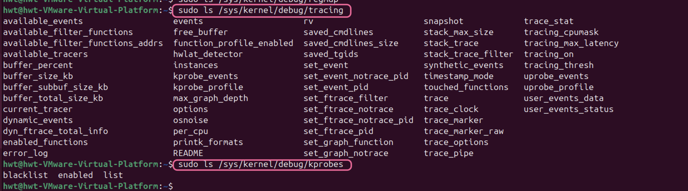

# /sys/kernel/debug/

在 /sys/kernel/debug/ 目录下列出的这些子目录和文件是 debugfs 文件系统的一部分，它们提供了内核中各种调试和诊断信息的接口。每个子目录通常对应一个内核子系统或模块，用于导出该模块的调试信息。

1. accel：与加速器（如GPU或其他硬件加速器）相关的调试信息。通常用于查看和调整加速器的运行状态。
2. acpi：Advanced Configuration and Power Interface（高级配置与电源接口）相关的调试信息。用于检查和调试 ACPI 设备的配置和电源管理状态。
3. bdi：Block Device Interface（块设备接口）相关的调试信息。用于监控块设备的性能和状态。
4. block：块设备（如硬盘、SSD 等）的调试信息。用于查看块设备的 I/O 请求、调度器状态等。
5. bluetooth：蓝牙子系统的调试信息。用于监控蓝牙设备的连接状态和数据传输。
6. check_wx_pages：检查和调试内核中同时具有写和执行权限的页面。通常用于安全相关的调试。
7. clear_warn_once：用于清除内核中 WARN_ONCE 警告的调试工具。通过写入特定值可以清除警告计数。
8. clk：时钟管理相关的调试信息。用于查看和调整内核中时钟的配置和状态。
9. devfreq：设备频率管理相关的调试信息。用于动态调整设备的频率以优化性能和功耗。
10. device_component：设备组件管理相关的调试信息。用于监控和调试设备组件的状态。
11. dma_buf：DMA缓冲区相关的调试信息。用于查看和调试DMA缓冲区的使用情况。
12. dmaengine：DMA引擎相关的调试信息。用于监控和调试DMA引擎的运行状态。
13. dma_pools：DMA池相关的调试信息。用于查看和调试DMA池的分配和使用情况。
14. dri：Direct Rendering Infrastructure（直接渲染架构）相关的调试信息。用于调试图形设备的渲染状态。
15. dynamic_debug：动态调试接口。通过这个接口可以动态控制内核调试信息的输出，例如启用或禁用特定的调试消息。
16. energy_model：能量模型相关的调试信息。用于监控和调试内核的能量管理策略。
17. **extfrag：内存碎片化相关的调试信息。用于查看和调试内存碎片化的情况。**
18. **fault_around_bytes：用于调试内核中的页面错误处理。通过调整这个值可以控制内核在处理页面错误时的行为。**
19. gpio：GPIO（通用输入输出）相关的调试信息。用于查看和调试GPIO引脚的状态和配置。
20. hte：硬件跟踪扩展（Hardware Trace Extensions）相关的调试信息。用于调试硬件跟踪功能。
21. i2c：I2C总线相关的调试信息。用于查看和调试I2C设备的通信状态。
22. **interconnect：内核中互连设备的调试信息。用于监控和调试互连设备的带宽和性能。**
23. iosf_sb：**Intel On-Die System Fabric Sideband（Intel 芯片内部系统总线）相关的调试信息。用于调试Intel平台的内部通信。**
24. **kprobes：内核探针（kprobes）相关的调试信息。用于在内核代码中插入探针，动态捕获运行时信息。**
25. **lru_gen：内存页回收策略（LRU 生成器）相关的调试信息。用于监控和调试内存页的回收策略。**
26. **lru_gen_full：LRU生成器的完整调试信息。提供更详细的内存页回收策略信息。**
27. mce：Machine Check Exception（机器检查异常）相关的调试信息。用于监控和调试硬件错误检测。
28. pinctrl：引脚控制（Pin Control）相关的调试信息。用于查看和调试引脚的配置和状态。
29. pm_genpd：电源管理通用电源域（Power Management Generic Power Domain）相关的调试信息。用于监控和调试电源管理策略。
30. phy：物理层（PHY）设备的调试信息。用于查看和调试物理层设备的状态。
31. pwm：脉宽调制（PWM）相关的调试信息。用于查看和调试 PWM 设备的配置和状态。
32. **regmap：寄存器映射（Regmap）相关的调试信息。用于查看和调试寄存器映射的状态。**
33. **remoteproc：远程处理器（Remote Processor）相关的调试信息。用于调试和监控远程处理器的状态。**
34. regulator：电源管理调节器（Regulator）相关的调试信息。用于查看和调试电源管理调节器的状态。
35. **sched：调度器相关的调试信息。用于监控和调试内核调度器的行为。**
36. sleep_time：睡眠时间相关的调试信息。用于查看和调试设备的睡眠时间。
37. **split_huge_pages：分割大页面（Split Huge Pages）相关的调试信息。用于查看和调试大页面的分割策略。**
38. **stackdepot：栈沉积（Stack Depot）相关的调试信息。用于监控和调试内核栈的使用情况。**stack depot 是 Linux 内核中用于存储和管理堆栈跟踪（stack traces）的一种机制。它通过使用哈希表来避免重复存储相同的堆栈跟踪，从而节省内存。
39. suspend_stats：挂起统计（Suspend Statistics）相关的调试信息。
用于查看和调试系统挂起的统计信息。
40. **swiotlb：软件 I/O TLB（Software I/O Translation Lookaside Buffer）相关的调试信息。用于查看和调试软件 I/O TLB 的使用情况。**
41. **sync：同步相关的调试信息。用于查看和调试同步操作的状态。**
42. ttm：Translation Table Maps（翻译表映射）相关的调试信息。用于调试图形设备的内存管理。
43. **tracing：内核跟踪（Tracing）相关的调试信息。用于监控和调试内核事件的跟踪。**
44. usb：USB 子系统的调试信息。用于查看和调试 USB 设备的状态。
45. virtio-ports：Virtio 端口相关的调试信息。用于调试虚拟设备的端口状态。
46. **vmmemctl：虚拟内存控制相关的调试信息。用于查看和调试虚拟内存的配置和状态。**
47. wakeup_sources：唤醒源相关的调试信息。用于查看和调试系统唤醒的源。
48. x86：x86 架构相关的调试信息。用于调试 x86 平台的特定功能。
49. ras：可靠性、可用性和可维护性（Reliability, Availability, and Serviceability）相关的调试信息。用于监控和调试硬件错误检测和处理。
50. **split_huge_pages：分割大页面相关的调试信息。用于查看和调试大页面的分割策略。**

## /sys/kernel/debug/tracing

## /sys/kernel/debug/kprobes

