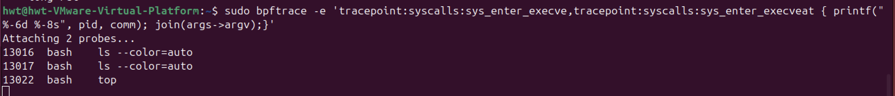

# 使用eBPF跟踪内核状态


跟踪类eBPF程序主要包括内核插桩`BPF_PROG_TYPE_KPROBE`、跟踪点`BPF_PROG_TYPE_TRACEPOINT`以及性能事件`BPF_PROG_TYPE_PERF_EVENT`等程序类型，而每类eBPF程序又可以挂载到不同的内核函数(kprobe)、内核跟踪点(tracepoint)或性能事件(perf event)上。当这些内核函数、内核跟踪点或性能事件被调用的时候，挂载到其上的eBPF程序就会自动执行。

> 我不知道内核中都有哪些内核函数(kprobe)、内核跟踪点(tracepoint)或性能事件(perf events)的时候，可以在哪里查询到它们的列表呢？对于内核函数(kprobe)和内核跟踪点(tracepoint)，在需要跟踪它们的传入参数和返回值的时候，又该如何查询这些数据结构的定义格式呢？


## 查询内核跟踪点tracepoint和性能事件perf event

### 方法一: /proc/kallsyms  内核符号表
为了方便调试，内核将**所有函数以及非栈变量的地址**都抽取到了`/proc/kallsyms`中，这样调试器就可以根据地址找出对应的函数和变量。当调试器（如 gdb 等调试工具）需要知道某个内核函数或者非栈变量的地址时，就可以通过查询这个 “地址簿” 来获取。

假设内核中有一个名为`sys_write`的函数，它用于处理写操作的系统调用。在内核编译完成后，这个函数会被加载到内存中的某个地址，比如 0xc1000000（这个地址是假设的，实际地址会根据内核的加载情况等因素而变化）。同时，内核中有一个全局变量`task_struct`，它用于描述一个进程的结构，这个变量被分配在内存地址 0xc2000000 处（同样也是假设的地址）。这些函数和变量的地址信息会被记录在`/proc/kallsyms`文件中。

当开发人员使用调试器进行内核调试时，例如在调试一个与写操作相关的内核问题时，他们可以使用调试器的命令来查看/proc/kallsyms 文件，找到`sys_write`函数的地址 0xc1000000。然后，调试器可以根据这个地址来定位到`sys_write`函数的代码位置，查看函数的执行流程、参数传递等信息，从而帮助开发人员分析和解决内核中的问题。对于`task_struct`变量也是如此，通过其在`/proc/kallsyms`中的地址，可以方便地查看和修改这个变量的值，以用于调试目的。


```shell
# 变量地址/函数入口地址 符号类型 符号名称
c1000000 T sys_write
c1000100 T sys_read
c2000000 D task_struct
c2000100 R kernel_version
```

`/proc/kallsyms` 文件中的符号类型用于描述内核符号的特性和用途，以下是一些常见的符号类型：

1.  函数和代码相关
    * **T** ：表示该符号是一个全局函数，位于代码段，可以被其他代码调用。
    * **t** ：表示该符号是一个局部函数，位于代码段，只能在当前文件中使用。

2. 变量相关

    * **D** ：表示该符号是一个全局变量，位于已初始化的数据段，可以被其他代码访问和修改。
    * **d** ：表示该符号是一个局部变量，位于已初始化的数据段，只能在当前文件中使用。
    * **B** ：表示该符号是一个未初始化的全局变量，位于未初始化数据段（BSS 段），它的值在程序启动时被初始化为 0。
    * **b** ：表示该符号是一个未初始化的局部变量，位于未初始化数据段，只能在当前文件中使用。

3. 只读数据相关

    * **R** ：表示该符号是一个全局只读变量，位于只读数据段，不能被修改。
    * **r** ：表示该符号是一个局部只读变量，位于只读数据段，只能在当前文件中使用。

4. 其他类型

    * **A** ：表示该符号是一个可读写的全局变量，可以被其他代码访问和修改。
    * **a** ：表示该符号是一个可读写的局部变量，只能在当前文件中使用。
    * **C** ：表示该符号是一个未初始化的公共符号，通常用于在链接时合并未初始化的全局数据。
    * **G** ：表示该符号是一个已初始化的小对象全局变量，某些目标文件格式允许对小数据对象进行更有效的访问。
    * **I** ：表示该符号是对另一个符号的间接引用。
    * **N** ：表示该符号是一个调试符号，通常用于调试信息。
    * **S** ：表示该符号是一个未初始化的小对象局部变量。
    * **U** ：表示该符号是一个未定义的外部符号，其值为 0。
    * **V** ：表示该符号是一个弱符号，弱符号在链接时可以被其他同名的非弱符号覆盖。
    * **W** ：也表示弱符号，与 V 类似，弱符号在链接时如果存在同名的非弱符号，则会被覆盖。
     * **?** ：表示该符号的类型未知。

如果内核崩溃日志中提到地址0xc1000000,调试器可以通过/proc/kallsyms确定这是sys_write函数的地址;也可以通过该文件分析内核的内存布局，了解内核函数和变量的分布情况。很显然，具有实际含义的名称要比16进制的地址易读得多。对内核插桩类的eBPF程序(kprobe)来说，它们要挂载的内核函数就可以从/proc/kallsyms这个文件中查到。

注意，**内核函数是一个非稳定API**，在新版本中可能会发生变化，并且内核函数的数量也在不断增长中。

这些符号表不仅包括了内核函数，还包含了非栈数据变量。而且<font color=blue>**并不是所有内核函数都是可跟踪的**</font>，只有<font color=red>**显式导出的内核函数**</font>才可以被eBPF进行动态跟踪。因而，**通常我们并不直接从内核符号表查询可跟踪点**。

在Linux内核中，**显式导出的内核函数**是指通过使用`EXPORT_SYMBOL`宏明确向外界（如其他内核模块或eBPF程序）公开的内核函数。这些函数会被添加到内核的符号表中，使得其他模块或程序能够引用和调用它们。主要用于内核模块之间或内核与 eBPF 程序之间。**内核模块是独立的二进制文件**，通常在运行时动态加载到内核中。显式导出使得这些模块可以访问内核或其他模块中定义的符号。

- `EXPORT_SYMBOL` ：用于导出普通内核函数，使其在内核符号表中可见。例如，EXPORT_SYMBOL(my_function) 会将 my_function 函数导出。
- `EXPORT_SYMBOL_GPL` ：与 EXPORT_SYMBOL 类似，但导出的函数只能被GPL许可的模块使用。
- `EXPORT_SYMBOL_GPL_FUTURE` ：用于导出未来可能会被修改的函数，提醒开发者谨慎使用。

为什么要显式导出？
- 模块间通信 ：内核由多个模块组成，这些模块需要相互通信和协作。通过显式导出函数或变量，模块可以共享功能和数据。例如，一个模块可以导出一些工具函数，供其他模块在需要时调用，从而实现代码复用和模块化设计。
- 支持 eBPF 程序跟踪 ：eBPF 程序需要挂载到内核函数上进行动态跟踪。只有显式导出的内核函数才会出现在内核符号表中，eBPF 程序才能通过 kprobe 等机制在这些函数的入口或返回处插入探针，实现对内核行为的监控和分析。
- 内核扩展性 ：显式导出允许内核模块扩展内核功能。第三方模块可以通过调用内核导出的函数来实现特定的功能，而无需修改内核源代码。这增强了内核的灵活性和可扩展性。
---
### 方法二:内核调试文件系统DebugFS

为了方便内核开发者获取所需的跟踪点信息，内核调试文件系统DebugFS还向用户空间提供了内核调试所需的基本信息，如内核符号列表、跟踪点、函数跟踪ftrace状态以及参数格式等。

```shell
sudo cat /sys/kernel/debug/tracing/events/syscalls/sys_enter_execve/format # 查询execve系统调用的参数格式
```

如果遇到/sys/kernel/debug目录不存在的错误，说明你的系统没有自动挂载调试文件系统。只需要执行下面的mount命令即可挂载：
```shell
sudo mount -t debugfs debugfs /sys/kernel/debug
```
注意，eBPF程序的执行也依赖于DebugFS。如果你的系统没有自动挂载它，那么我推荐你把它加入到系统开机启动脚本里面，这样机器重启后eBPF程序也可以正常运行。

可以从`/sys/kernel/debug/tracing`l中找到所有内核预定义的跟踪点(tracepoint)，进而可以在需要时把eBPF程序挂载到对应的跟踪点。

---

### 方法三:查询性能事件 perf event

可以使用perf来查询性能事件，可以不带参数查询所有性能事件,也可以加入可选的事件类型参数进行过滤：
```shell
sudo perf list [hw|sw|cache|tracepoint|pmu|sdt|metric|metricgroup]
```

---

### 方法四:利用bpftrace查询跟踪点

虽然你可以利用内核调试信息DebugFS和perf工具查询内核函数、跟踪点以及性能事件的列表，但它们的位置比较分散，并且用这种方法也不容易查询内核函数的定义格式。在此使用bpftrace工具简化过程。

bpftrace在eBPF和BCC之上构建了一个简化的跟踪语言，通过简单的几行脚本，就可以实现复杂的跟踪功能。并且，多行的跟踪指令也可以放到脚本文件中执行（脚本后缀通常为`.bt`）。bpftrace会把你开发的脚本借助BCC编译加载到内核中执行，再通过BPF map获取执行的结果:


因此，在编写简单的eBPF程序，特别是编写的eBPF程序用于临时的调试和排错时，可以考虑直接使用bpftrace，而不需要用C或Python去开发一个复杂的程序。可以通过执行`sudo bpftrace -l`来查询内核插桩和跟踪点:
```shell
# 查询所有内核插桩和跟踪点
sudo bpftrace -l

# 使用通配符查询所有的系统调用跟踪点
sudo bpftrace -l 'tracepoint:syscalls:*'

# 使用通配符查询所有名字包含"execve"的跟踪点
sudo bpftrace -l '*execve*'
```

对于**tracepoints**来说，还可以**加上`-v`参数查询函数的入口参数或返回值**。而**由于内核函数属于不稳定的API，在bpftrace中只能通过`arg0、arg1`这样的参数来访问，具体的参数格式还需要参考内核源代码**。

比如，下面就是一个查询系统调用`execve`入口参数（对应系统调用`sys_enter_execve`）和返回值（对应系统调用`sys_exit_execve`）的示例:
```shell
# 查询execve入口参数格式
$ sudo bpftrace -lv tracepoint:syscalls:sys_enter_execve
tracepoint:syscalls:sys_enter_execve
    int __syscall_nr
    const char * filename
    const char *const * argv
    const char *const * envp

# 查询execve返回值格式
$ sudo bpftrace -lv tracepoint:syscalls:sys_exit_execve
tracepoint:syscalls:sys_exit_execve
    int __syscall_nr
    long ret
```

某个系统调用的入口参数和返回值分别去找`sys_enter_xxx`和`sys_exit_xxx`。

---

所以，既可以通过`内核调试信息`和`perf`来查询`内核函数、跟踪点以及性能事件`的列表，也可以使用`bpftrace`工具来查询。

更推荐使用更简单的bpftrace进行查询。因为，我们通常只需要在开发环境查询这些列表，以便去准备eBPF程序的挂载点。也就是说，虽然bpftrace依赖BCC和LLVM开发工具，但开发环境本来就需要这些库和开发工具。综合来看，用bpftrace工具来查询的方法显然更简单快捷。

> 在开发eBPF程序之前，你还需要在这些长长的函数列表中进行选择，确定你应该挂载到哪一个上。那么，具体该如何选择呢?


## 如何利用内核跟踪点排查短时进程问题？（主要学思路）

在排查系统CPU使用率高的问题时，明明通过top命令发现系统的CPU使用率（特别是用户CPU使用率）特别高，但是通过ps, pidstat等工具都找不到CPU使用率高的问题，这是什么原因的导致的呢？

一般情况下，这类问题很可能是以下两个原因导致的：
1. 应用程序里面直接调用其他二进制程序，并且这些程序的运行时间很短，通过top工具不容易发现；
2. 应用程序自身在不停地崩溃重启中，且重启间隔较短，启动过程中资源的初始化导致了高CPU使用率；

使用top,ps等性能工具很难发现这类短时进程，这是因为它们都**只会按照给定的时间间隔采样，而不会实时采集到所有新创建的进程**。那要如何才能采集到所有的短时进程呢？那就是<mark>利用eBPF的事件触发机制，跟踪内核每次新创建的进程</mark>，这样就可以揪出这些短时进程。(感觉有点边沿触发的感觉)


要跟踪内核新创建的进程，首先得找到要跟踪的内核函数(kprobe)或跟踪点(tracepoint)。创建一个新进程通常需要调用`fork()`和`execve()`这两个标准函数，它们的调用过程如下图所示:


要获取新创建进程的基本信息，比如进程名称和参数，这些信息通常在`execve()`系统调用的参数中。`execve()`是用户态程序用来执行新程序的系统调用。所以，为了在内核中跟踪这些信息，我们需要找到与`execve()`相关的内核函数或跟踪点：


从输出中可以发现这些函数可以分为内核插桩（`kprobe`）和跟踪点（`tracepoint`）两类。内核插桩属于不稳定接口，而跟踪点则是稳定接口。因而，**在内核插桩和跟踪点两者都可用的情况下，应该选择更稳定的跟踪点**，以保证eBPF程序的可移植性（即在不同版本的内核中都可以正常执行）。

排除掉kprobe类型之后，剩下的`tracepoint:syscalls:sys_enter_execve`、`tracepoint:syscalls:sys_enter_execveat`、`tracepoint:syscalls:sys_exit_execve`以及  `tracepoint:syscalls:sys_exit_execveat` 就是我们想要的eBPF跟踪点。其中，<mark>`sys_enter_`和`sys_exit_`分别表示在**系统调用的入口和出口**执行</mark>。


只有跟踪点的列表还不够，因为我们还想知道**具体启动的进程名称、命令行选项以及返回值**，而这些也都可以通过bpftrace来查询。在命令行中执行下面的命令，即可查询：
```shell
# 查询sys_enter_execve入口参数
$ sudo bpftrace -lv tracepoint:syscalls:sys_enter_execve
tracepoint:syscalls:sys_enter_execve
    int __syscall_nr
    const char * filename
    const char *const * argv
    const char *const * envp

# 查询sys_exit_execve返回值
$ sudo bpftrace -lv tracepoint:syscalls:sys_exit_execve
tracepoint:syscalls:sys_exit_execve
    int __syscall_nr
    long ret

# 查询sys_enter_execveat入口参数
$ sudo bpftrace -lv tracepoint:syscalls:sys_enter_execveat
tracepoint:syscalls:sys_enter_execveat
    int __syscall_nr
    int fd
    const char * filename
    const char *const * argv
    const char *const * envp
    int flags

# 查询sys_exit_execveat返回值
$ sudo bpftrace -lv tracepoint:syscalls:sys_exit_execveat
tracepoint:syscalls:sys_exit_execveat
    int __syscall_nr
    long ret
```


从输出中可以看到，`sys_enter_execveat()`比`sys_enter_execve()`多了两个参数，而文件名filename、命令行选项argv以及返回值ret的定义都是一样的。

---

### 开发eBPF的3种不同方式
使用3种不同方式开发eBPF：
- bpftrace通常用在<mark>**快速排查和定位系统**</mark>上，它支持用单行脚本的方式来快速开发并执行一个eBPF程序。不过，bpftrace的功能有限，不支持特别复杂的eBPF程序，也依赖于BCC和LLVM动态编译执行。
- BCC通常用在开发复杂的eBPF程序中，其内置的各种小工具也是目前应用最为广泛的eBPF小程序。不过，BCC也不是完美的，它依赖于LLVM和内核头文件才可以动态编译和加载eBPF程序。
- libbpf是从内核中抽离出来的标准库，用它开发的eBPF程序可以直接分发执行，这样就不需要每台机器都安装LLVM和内核头文件了。不过，它要求内核开启BTF特性，需要非常新的发行版才会默认开启（如RHEL 8.2+和Ubuntu 20.10+等）。

在实际应用中，你可以根据你的内核版本、内核配置、eBPF程序复杂度，以及是否允许安装内核头文件和LLVM等编译工具等，来选择最合适的方案。

### 方法一:bpftrace方法
由于`execve()`和`execveat()`这两个系统调用的入口参数文件名  filename和命令行选项argv，以及返回值ret的定义都是一样的，因而我们可以把这两个跟踪点放到一起来处理。


首先，我们先忽略返回值，只看入口参数。打开一个终端，执行下面的 bpftrace 命令：
```shell
sudo bpftrace -e 'tracepoint:syscalls:sys_enter_execve,tracepoint:syscalls:sys_enter_execveat { printf("%-6d %-8s", pid, comm); join(args->argv);}'
```
在另一个终端输入ls，就会看到如下输出：


- `bpftrace -e`表示直接从后面的字符串参数中读入bpftrace程序（除此之外，它还支持从文件中读入bpftrace程序,`.bt`脚本）；
- `tracepoint:syscalls:sys_enter_execve`,`tracepoint:syscalls:sys_enter_execveat`表示用逗号分隔的多个跟踪点，其后的**中括号表示跟踪点的处理函数**；
- `printf()`表示向终端中打印字符串，其用法类似于C语言中的  printf()  函数；
- **pid和comm是bpftrace内置的变量，分别表示进程PID和进程名称（你可以在其官方文档中找到其他的内置变量）**；
- `join(args->argv)` 表示把字符串数组格式的参数用空格拼接起来，再打印到终端中。对于tracepoints来说，可以使用`args->参数名`的方式直接读取参数（比如这里的`args->argv`就是读取系统调用中的`argv`参数）。

不过，这个程序还不够完善，因为它的返回值还没有处理。一个最简单的思路就是在系统调用的入口把参数保存到BPF映射中，然后再在系统调用出口获取返回值后一起输出。

```shell
# 其中，tid表示线程ID，@execs[tid]表示创建一个哈希map
sudo bpftrace -e 'tracepoint:syscalls:sys_enter_execve,tracepoint:syscalls:sys_enter_execveat {@execs[tid] = join(args->argv);}'

# another choice
sudo bpftrace -e '
tracepoint:syscalls:sys_enter_execve, tracepoint:syscalls:sys_enter_execveat {
    @execs[tid] = join(args->argv);
}

tracepoint:syscalls:sys_exit_execve, tracepoint:syscalls:sys_exit_execveat {
    if (@execs[tid] != NULL) {
        printf("Executed command: %s, Return value: %d\n", @execs[tid], args->ret);
        delete(@execs[tid]);
    }
}'
```


实际上，在bpftrace的GitHub页面上，已经有其他用户汇报了同样的问题，并且到现在还是没有解决。bpftrace本身并不适用于所有的eBPF应用。如果是复杂的应用，还是推荐使用BCC或者libbpf开发。


### 方法二:BCC方法（后续再看）


为了在系统调用入口跟踪点和出口跟踪点间共享进程信息等数据，我们可以定义一个哈希映射（比如命名为tasks）；同样地，因为我们想要在用户空间实时获取跟踪信息，这就需要一个性能事件映射。哈希映射（BPF_HASH）和性能事件映射（BPF_PERF_OUTPUT）在内核跟踪中扮演不同的角色，各自有不同的功能和用途。
哈希映射用于内核空间的数据共享，在系统调用的入口和出口之间传递数据（如参数和返回值）。例如，在 sys_enter_execve 时保存参数，在 sys_exit_execve 时获取这些参数并结合返回值进行处理。
性能事件映射用于将数据实时传递到用户空间，将处理后的数据（如系统调用的参数和返回值）实时发送到用户空间。用户空间的程序可以立即获取这些数据，而无需等待内核缓冲区填满或进行主动查询。

源码：
https://github.com/feiskyer/ebpf-apps/blob/main/bcc-apps/python/execsnoop.c

性能事件子系统（如 BPF_PERF_OUTPUT）相比直接使用 BPF 映射（如 BPF_HASH）更高效，主要体现在以下几个方面：

1. 减少数据复制：
BPF_PERF_OUTPUT使用`perf ring buffer`机制，可以避免多次数据复制。数据直接从内核空间传递到用户空间，减少了中间的拷贝步骤。
而 BPF 映射需要用户空间主动查询数据，可能涉及更多的数据复制和处理步骤。
2. 高效的数据传递：
BPF_PERF_OUTPUT 与 Linux 内核的 perf_event 子系统集成，能够高效地将数据从内核空间传递到用户空间。
这种机制特别适合需要实时监控和分析的场景，因为它可以实时捕获和处理性能事件数据。
3. 避免锁竞争：
BPF_PERF_OUTPUT 使用的 perf ring buffer 机制可以避免锁竞争，提高并发性能。
BPF 映射在高并发场景下可能会遇到锁竞争问题，影响性能。
4. 实时性和低延迟：
BPF_PERF_OUTPUT 允许数据实时传递到用户空间，适合需要低延迟的应用场景。
BPF 映射需要用户空间程序主动读取数据，可能会引入额外的延迟。
5. 更高的吞吐量：
实验证明，BPF_PERF_OUTPUT 在高吞吐量场景下表现更好，能够支持每秒数百万个事件。
BPF 映射在处理大量数据时可能会受到性能限制。
6. 更好的内存管理：
BPF_PERF_OUTPUT 使用的 perf ring buffer 机制可以更高效地管理内存，减少内存浪费。
BPF 映射需要手动管理内存，可能会导致内存使用效率较低。
7. 适用性：
BPF_PERF_OUTPUT 特别适合需要实时监控和分析的场景，如性能分析工具。
BPF 映射更适合在内核空间中存储和共享数据，特别是在系统调用的入口和出口之间传递数据。


#### 1. 数据结构定义
BPF map的作用：
- 保存数据：在系统调用的入口，可以将系统调用的参数（如进程 ID、命令名、参数列表等）保存到 BPF map中。
- 获取数据：在系统调用的出口，可以从 BPF map中获取之前保存的参数，并结合系统调用的返回值一起输出。

实现步骤：
- 步骤 1：在入口事件中保存参数到 BPF map
在系统调用的入口事件（如 sys_enter_execve）中，将参数保存到 BPF ma p中。BPF map通常使用进程 ID（PID）作为键，参数数据作为值。
- 步骤 2：在出口事件中从 BPF map获取参数并输出
在系统调用的出口事件（如 sys_exit_execve）中，使用相同的键（如 PID）从 BPF map中获取之前保存的参数，并结合系统调用的返回值一起输出。

#### 2. 入口跟踪点处理

注意，argv  是一个用户空间的字符串数组（指针数组），这就需要调用  bpf_probe_read  系列的辅助函数，去这些指针中读取数据。并且，字符串的数量（即参数的个数）和每个字符串的长度（即每个参数的长度）都是未知的，由于 eBPF 栈大小只有 512 字节，如果想要把它们读入一个临时的字符数组中，必须要保证每次读取的内容不超过栈的大小。这类问题有很多种不同的处理方法，其中一个比较简单的方式就是把多余的参数截断，使用...代替过长的参数。一般来说，知道了进程的名称和前几个参数，对调试和排错来说就足够了。

有了这个辅助函数之后，因为 eBPF 在老版本内核中并不支持循环（有界循环在 5.3 之后才支持），要访问字符串数组，还需要一个小技巧：使用  #pragma unroll  告诉编译器，把源码中的循环自动展开。这就避免了最终的字节码中包含循环。

#### 3. 出口跟踪点处理
#### 4. Python前端处理


### 方法三:libbpf方法
使用libbpf开发eBPF程序就可以通过以下四个步骤完成：
1. 使用bpftool生成内核数据结构定义头文件。BTF开启后，你可以在系统中找到/sys/kernel/btf/vmlinux这个文件，bpftool正是从它生成了内核数据结构头文件。
2. 开发eBPF程序部分。为了方便后续通过统一的Makefile编译，eBPF程序的源码文件一般命名为<程序名>.bpf.c。
3. 编译eBPF程序为字节码，然后再调用`bpftool gen skeleton`为eBPF 字节码生成**脚手架头文件（Skeleton Header）**。这个头文件包含了eBPF字节码以及相关的加载、挂载和卸载函数，可在用户态程序中直接调用。
4. 最后就是用户态程序引入上一步生成的头文件，开发用户态程序，包括eBPF程序加载、挂载到内核函数和跟踪点，以及通过BPF映射获取和打印执行结果等。


通常，这几个步骤里面的编译、库链接、执行bpftool命令等，都可以放到Makefile中，这样就可以通过一个`make`命令去执行所有的步骤。比如，下面是一个简化版本的Makefile：
```shell
APPS = execsnoop

.PHONY: all
all: $(APPS)

$(APPS):
    clang -g -O2 -target bpf -D__TARGET_ARCH_x86_64 -I/usr/include/x86_64-linux-gnu -I. -c $@.bpf.c -o $@.bpf.o
    bpftool gen skeleton $@.bpf.o > $@.skel.h
    clang -g -O2 -Wall -I . -c $@.c -o $@.o
    clang -g -O2 -Wall $@.o -static -lbpf -lelf -lz -o $@

vmlinux:
    $(bpftool) btf dump file /sys/kernel/btf/vmlinux format c > vmlinux.h
```
执行`make vmlinux`命令就可以生成vmlinux.h文件，再执行`make`就可以编译APPS里面配置的所有eBPF程序（多个程序之间以空格分隔）。

## 思考
虽然使用bpftrace时还有很多的限制，但这个跟踪程序，其实已经可以用到短时进程问题的排查中了。因为通常来说，在解决短时进程引发的性能问题时，找出短时进程才是最重要的。至于短时进程的执行结果，我们一般可以通过日志看到详细的运行过程。不过，这个跟踪程序还是有一些比较大的限制，比如：
- 没有输出时间戳，这样去大量日志里面定位问题就比较困难；
- 没有父进程PID，还需要一些额外的工具或经验，才可以找出父进程。
那么，这些问题该如何解决呢？你可以在今天的bpftrace脚本基础上改进，把时间戳和父进程PID也输出到结果中吗？

```shell
sudo bpftrace -e 'tracepoint:syscalls:sys_enter_execve,tracepoint:syscalls:sys_enter_execveat { time("%H:%M:%S ");printf("%-6d %-6d %-8s ", pid,curtask->parent->pid, comm); join(args->argv)}'
```


找内置变量。


## 参考文献
1. 内核跟踪 https://time.geekbang.org/column/article/484207
2. DebugFS https://www.kernel.org/doc/html/latest/filesystems/debugfs.html
3. bpftrace https://github.com/bpftrace/bpftrace/blob/master/docs/reference_guide.md