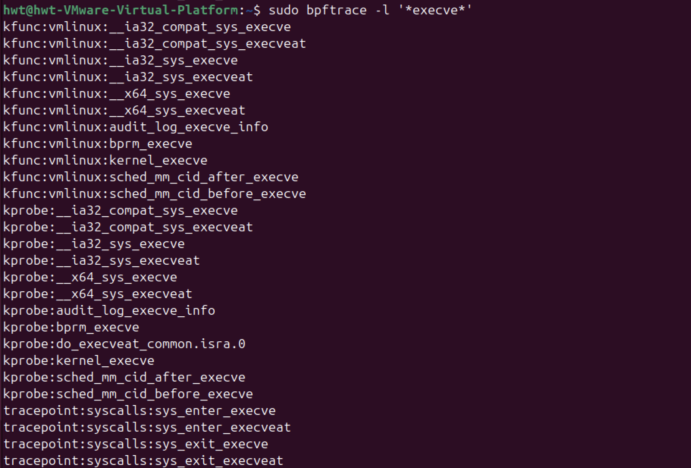

# 使用eBPF跟踪内核状态

bpftrace

跟踪类eBPF程序主要包括内核插桩`BPF_PROG_TYPE_KPROBE`、跟踪点`BPF_PROG_TYPE_TRACEPOINT`以及性能事件`BPF_PROG_TYPE_PERF_EVENT`等程序类型，而每类eBPF程序又可以挂载到不同的内核函数、内核跟踪点或性能事件上。当这些内核函数、内核跟踪点或性能事件被调用的时候，挂载到其上的eBPF程序就会自动执行。

> 我不知道内核中都有哪些内核函数、内核跟踪点或性能事件的时候，可以在哪里查询到它们的列表呢？对于内核函数和内核跟踪点，在需要跟踪它们的传入参数和返回值的时候，又该如何查询这些数据结构的定义格式呢？


## 查询内核跟踪点
为了方便调试，内核将**所有函数以及非栈变量的地址**都抽取到了`/proc/kallsyms`中，这样调试器就可以根据地址找出对应的函数和变量。当调试器（如 gdb 等调试工具）需要知道某个内核函数或者非栈变量的地址时，就可以通过查询这个 “地址簿” 来获取。假设内核中有一个名为`sys_write`的函数，它用于处理写操作的系统调用。在内核编译完成后，这个函数会被加载到内存中的某个地址，比如 0xc1000000（这个地址是假设的，实际地址会根据内核的加载情况等因素而变化）。同时，内核中有一个全局变量`task_struct`，它用于描述一个进程的结构，这个变量被分配在内存地址 0xc2000000 处（同样也是假设的地址）。这些函数和变量的地址信息会被记录在`/proc/kallsyms`文件中。当开发人员使用调试器进行内核调试时，例如在调试一个与写操作相关的内核问题时，他们可以使用调试器的命令来查看/proc/kallsyms 文件，找到`sys_write`函数的地址 0xc1000000。然后，调试器可以根据这个地址来定位到`sys_write`函数的代码位置，查看函数的执行流程、参数传递等信息，从而帮助开发人员分析和解决内核中的问题。对于`task_struct`变量也是如此，通过其在`/proc/kallsyms`中的地址，可以方便地查看和修改这个变量的值，以用于调试目的。


```shell
# 变量地址/函数入口地址 符号类型 符号名称
c1000000 T sys_write
c1000100 T sys_read
c2000000 D task_struct
c2000100 R kernel_version
```
符号类型：T代表是函数/代码地址，D代表是一个已经初始化的全局变量，R代表一个只读变量。
如果内核崩溃日志中提到地址0xc1000000,调试器可以通过/proc/kallsyms确定这是sys_write函数的地址;也可以通过该文件分析内核的内存布局，了解内核函数和变量的分布情况。很显然，具有实际含义的名称要比16进制的地址易读得多。对内核插桩类的eBPF程序来说，它们要挂载的内核函数就可以从/proc/kallsyms这个文件中查到。

注意，内核函数是一个非稳定API，在新版本中可能会发生变化，并且内核函数的数量也在不断增长中。

这些符号表不仅包括了内核函数，还包含了非栈数据变量。而且并不是所有内核函数都是可跟踪的，只有显式导出的内核函数才可以被eBPF进行动态跟踪。因而，通常我们并不直接从内核符号表查询可跟踪点。


为了方便内核开发者获取所需的跟踪点信息，内核调试文件系统DebugFS还向用户空间提供了内核调试所需的基本信息，如内核符号列表、跟踪点、函数跟踪ftrace状态以及参数格式等。

```shell
sudo cat /sys/kernel/debug/tracing/events/syscalls/sys_enter_execve/format # 查询execve系统调用的参数格式
```

如果遇到/sys/kernel/debug目录不存在的错误，说明你的系统没有自动挂载调试文件系统。只需要执行下面的mount命令即可挂载：
```shell
sudo mount -t debugfs debugfs /sys/kernel/debug
```
注意，eBPF程序的执行也依赖于DebugFS。如果你的系统没有自动挂载它，那么我推荐你把它加入到系统开机启动脚本里面，这样机器重启后eBPF程序也可以正常运行。

可以从/sys/kernel/debug/tracing中找到所有内核预定义的跟踪点，进而可以在需要时把eBPF程序挂载到对应的跟踪点。

## 查询性能事件
可以使用perf来查询性能事件，可以不带参数查询所有性能事件也可以加入可选的事件类型参数进行过滤：
```shell
sudo perf list [hw|sw|cache|tracepoint|pmu|sdt|metric|metricgroup]
```

## 利用bpftrace查询跟踪点

虽然你可以利用内核调试信息和perf工具查询内核函数、跟踪点以及性能事件的列表，但它们的位置比较分散，并且用这种方法也不容易查询内核函数的定义格式。在此使用bpftrace工具简化过程。bpftrace在eBPF和BCC之上构建了一个简化的跟踪语言，通过简单的几行脚本，就可以实现复杂的跟踪功能。并且，多行的跟踪指令也可以放到脚本文件中执行（脚本后缀通常为`.bt`）bpftrace 会把你开发的脚本借助 BCC 编译加载到内核中执行，再通过 BPF 映射获取执行的结果:


因此，在编写简单的eBPF程序，特别是编写的eBPF程序用于临时的调试和排错时，可以考虑直接使用bpftrace，而不需要用C或Python去开发一个复杂的程序。可以通过执行`sudo bpftrace -l`来查询内核插桩和跟踪点:
```shell
# 查询所有内核插桩和跟踪点
sudo bpftrace -l

# 使用通配符查询所有的系统调用跟踪点
sudo bpftrace -l 'tracepoint:syscalls:*'

# 使用通配符查询所有名字包含"execve"的跟踪点
sudo bpftrace -l '*execve*'
```

对于tracepoints来说，还可以加上`-v`参数查询函数的入口参数或返回值。而由于内核函数属于不稳定的API，在bpftrace中只能通过`arg0、arg1`这样的参数来访问，具体的参数格式还需要参考内核源代码。

比如，下面就是一个查询系统调用`execve`入口参数（对应系统调用`sys_enter_execve`）和返回值（对应系统调用`sys_exit_execve`）的示例:
```shell
# 查询execve入口参数格式
$ sudo bpftrace -lv tracepoint:syscalls:sys_enter_execve
tracepoint:syscalls:sys_enter_execve
    int __syscall_nr
    const char * filename
    const char *const * argv
    const char *const * envp

# 查询execve返回值格式
$ sudo bpftrace -lv tracepoint:syscalls:sys_exit_execve
tracepoint:syscalls:sys_exit_execve
    int __syscall_nr
    long ret
```

所以，既可以通过内核调试信息和perf来查询内核函数、跟踪点以及性能事件的列表，也可以使用bpftrace工具来查询。更推荐使用更简单的bpftrace进行查询。因为，我们通常只需要在开发环境查询这些列表，以便去准备eBPF程序的挂载点。也就是说，虽然bpftrace依赖BCC和LLVM开发工具，但开发环境本来就需要这些库和开发工具。综合来看，用bpftrace工具来查询的方法显然更简单快捷。


> 在开发eBPF程序之前，你还需要在这些长长的函数列表中进行选择，确定你应该挂载到哪一个上。那么，具体该如何选择呢?

## 如何利用内核跟踪点排查短时进程问题？

在排查系统CPU使用率高的问题时，明明通过top命令发现系统的CPU使用率（特别是用户CPU使用率）特别高，但是通过ps, pidstat等工具都找不到CPU使用率高的问题，这是什么原因的导致的呢？

一般情况下，这类问题很可能是以下两个原因导致的：
1. 应用程序里面直接调用其他二进制程序，并且这些程序的运行时间很短，通过top工具不容易发现；
2. 应用程序自身在不停地崩溃重启中，且重启间隔较短，启动过程中资源的初始化导致了高CPU使用率；

使用top,ps等性能工具很难发现这类短时进程，这是因为它们都**只会按照给定的时间间隔采样，而不会实时采集到所有新创建的进程**。那要如何才能采集到所有的短时进程呢？那就是<mark>利用eBPF的事件触发机制，跟踪内核每次新创建的进程</mark>，这样就可以揪出这些短时进程。(感觉有点边沿触发的感觉)


## 参考文献
1. 内核跟踪 https://time.geekbang.org/column/article/484207
2. DebugFS https://www.kernel.org/doc/html/latest/filesystems/debugfs.html
3. bpftrace https://github.com/bpftrace/bpftrace/blob/master/docs/reference_guide.md