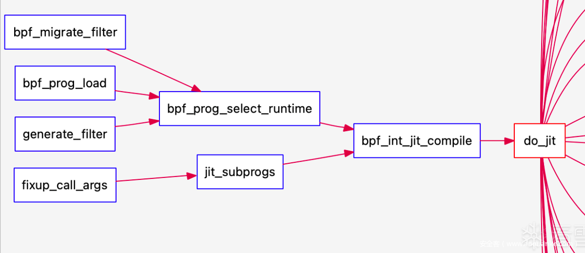
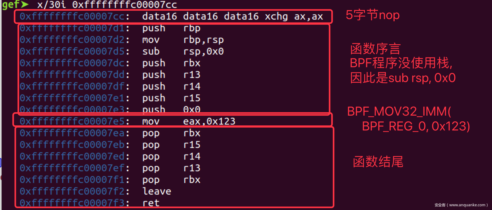

# eBPF虚拟机
eBPF是使用虚拟机来执行eBPF字节码的，但执行字节码是一个模拟CPU执行机器码的过程，所以比执行机器码的效率低很多。

从上图可以看出，执行中间码时，虚拟机需要将中间码解析成机器码来执行，而这个解析的过程就需要消耗更多的CPU时间。eBPF使用JIT技术来解决中间码效率不高的问题。JIT技术就是在执行中间码前，先把中间码编译成对应的机器码，然后缓存起来，运行时直接通过执行机器码即可。这样就解决了每次执行中间码都需要解析的过程，如下图所示：


verifier:eBPF的验证器，实现了一个本模块下的CFI/CFG(完整控制流)机制。

JIT:Just-In-Time,即时编译，eBPF汇编会在内核中被规则替换成真正的x86_64指令。主要用于解决虚拟机运行中间码时效率不高的问题。

所有的eBPF汇编指令在内核中定义为一个struct bpf_insn，使用时一般将连续的指令放置成一个结构体数组，然后通过内核态的bpf_prog_load载入编译运行。而内核态的程序对应struct bpf_prog结构体。bpf_prog_load函数主要执行以下关键操作：单bpf函数调用`bpf_prog_select_runtime(prog,&err)`jit编译prog,多bpf函数的prog调用`jit_subprog`。两者都会统一到针对`do_jit`的调用。


## eBPF JIT实现原理
当eBPF字节码被加载到内核时，内核会根据是否开启了JIT功能选项，来决定是否将eBPF字节码编译成机器码。由于不同架构CPU的指令集并不相同（也就是运行的机器码不相同），所以对于不同架构的CPU，把eBPF字节码编译成机器码的过程并不相同。

> 以x86架构的CPU进行分析

### struct bpf_prog
内核中的一个BPF程序使用struct bpf_prog来表示：
```c
struct bpf_prog {
    u16 pages; /* 占据了多少页 */
    u16 jited : 1, /* 是否被JIT翻译过 */
        jit_requested : 1, /* 架构要求对程序进行 */
        gpl_compatible : 1, /* 是否匹配GPL许可 */
        cb_access : 1, /* 是否访问控制块 */
        dst_needed : 1, /* 是否需要dst条目 Do we need dst entry? */
        blinded : 1, /* 是否进行过常数致盲 */
        is_func : 1, /* 程序是一个bpf函数*/
        kprobe_override : 1, /* 是否覆盖了一个kprobe */
        has_callchain_buf : 1, /* callchain buffer allocated? */
        enforce_expected_attach_type : 1; /* Enforce expected_attach_type checking at attach time */
    enum bpf_prog_type type; /* BPF程序的类型 */
    enum bpf_attach_type expected_attach_type; /* 要附着的类型 */
    u32 len; /* BPF程序长多少字节 */
    u32 jited_len; /* jit之后程序长多少字节  */
    u8 tag[BPF_TAG_SIZE];
    struct bpf_prog_aux* aux; /* 辅助字段 */
    struct sock_fprog_kern* orig_prog; /* 原BPF程序*/
    unsigned int (*bpf_func)(const void* ctx, const struct bpf_insn* insn); //执行BPF程序的函数指针, 第一个参数为执行环境
    /* 伪数组, 后面存放的是给解释器的BPF指令 */
    union {
        struct sock_filter insns[0];
        struct bpf_insn insnsi[0];
    };
};
```

### bpf_prog_load()
首先，内核通过bpf_prog_load()来加载eBPF字节码,bpf_prog_load()会分配一个prog对象并进行初始化，然后调用bpf_check()检查程序，最后调用bpf_prog_select_runtime()进行JIT编译，至此BPF程序已经翻译为x86指令注入到内核中. 后续分配id与fd供用户使用
```c
static int bpf_prog_load(union bpf_attr * attr){
    ...
    /* 1. 分配一个bpf_prog对象, 所需大小 = bpf_prog对象大小 + BPF程序大小 */
    prog = bpf_prog_alloc(bpf_prog_size(attr->insn_cnt), GFP_USER);
    if (!prog)
        return -ENOMEM;

    // 2. 初始化bpf_prog对象
    prog->expected_attach_type = attr->expected_attach_type; //程序期望附着的事件的类型
    ...;
    prog->len = attr->insn_cnt;


    // 3. 从用户空间复制BPF程序到内核空间
    err = -EFAULT;
    if (copy_from_user(prog->insns, u64_to_user_ptr(attr->insns), bpf_prog_insn_size(prog))
        != 0)
        goto free_prog;

    prog->orig_prog = NULL; 
    prog->jited = 0;        //还未进行jit

    atomic64_set(&prog->aux->refcnt, 1);    //设置引用计数为1
    ...;

    /* 4. 进行BPF验证 */
    err = bpf_check(&prog, attr, uattr);
    if (err < 0)
        goto free_used_maps;


    prog = bpf_prog_select_runtim(prog);//为eBPF选择一个运行时
    if(err < 0)
        goto free_used_maps;
    
    //为BPF程序分配ID
    err = bpf_prog_alloc_id(prog);
    if (err)
        goto free_used_maps;
    ...;

    err = bpf_prog_new_fd(prog);    //为BPF程序分配一个fd, 现在开始就可以使用了
    if (err < 0)
        bpf_prog_put(prog);
    return err;

    ...// 错误处理
}
```

### bpf_prog_select_runtime()
<font color=blue>什么是eBPF runtime？其实就是使用<mark>虚拟机运行还是使用JIT运行</mark>。</font>

```c
// Linux 3.18
void bpf_prog_select_runtime(struct bpf_prog *fp){//bpf_prog保存eBPF程序信息
    //1. 设置eBPF字节码的执行函数为__bpf_prog_run()函数
    fp->bpf_func = (void*) __bpf_prog_run;//bpf_func字段用于指向eBPF字节码的执行函数
    
    //2. 判断是否需要将eBPF字节码编译成机器码
    bpf_init_jit_compile(fp);
    //3. 将eBPF程序的某些数据结构和字节码设置为只读状态，增强安全性，防止 eBPF程序在运行时被意外修改
    bpf_prog_lock_ro(fp);
}

// Linux 5.5.6
struct bpf_prog* bpf_prog_select_runtime(struct bpf_prog* fp, int* err)
{
    // 验证器已经完成了与JIT相关的所有准备工作, 直接结束
    if (fp->bpf_func)
        goto finalize;

    // 根据栈的深度从interpreters中选择一个作为fp->bpf_func
    bpf_prog_select_func(fp);

    //在开启常数致盲得到情况下eBPF JIT会重写程序. 
    //然而为防止致盲时发生错误, bpf_int_jit_compile()必须返回一个有效的程序, 此时就不会被JIT, 而转交给解释器
    if (!bpf_prog_is_dev_bound(fp->aux)) {  // if(!fp->aux->offload_requested)
        ...;
        fp = bpf_int_jit_compile(fp);   //进行JIT编译
        ...;

    } else {
        ...;
    }

    ...;
    //尾调用兼容性检查只能在最后阶段进行. 
    //因为我们要确定, 如果我们处理JITed或者非JITed程序的链接, 并且不是所有的eBPF JIT都能立刻支持所有的特性
    *err = bpf_check_tail_call(fp);

    return fp;
}
```
> 常数致盲是一种安全机制，它通过将 eBPF 程序中的常量值替换为随机生成的值，从而使得程序在每次运行时的行为都略有不同。这使得攻击者难以预测程序的具体行为，从而增加了攻击的难度。

> JIT重写过程：在eBPF程序被加载到内核后，`bpf_int_jit_compile`函数会调用 `do_jit`函数来编译eBPF字节码。在这个过程中，如果启用了常数致盲，JIT编译器会：
遍历eBPF字节码，查找其中的常量值。将这些常量值替换为随机生成的值。在编译后的机器码中，确保这些随机值在运行时被正确还原。

### bpf_prog_select_func()

bpf_prog_select_func()根据栈深度从解释器数组interpreters中选择，interpreters中的解释器函数的第一个参数为eBPF运行上下文，第二个参数为eBPF指令。
JIT编译会直接令fp->bpf_func指向编译出的函数. 这样执行fp->bpf_func(ctx, insn)就可以涵盖解释器执行与JIT编译两种情况。
```c
//解释器数组
static unsigned int (*interpreters[])(const void* ctx, const struct bpf_insn* insn)
    = {
          EVAL6(PROG_NAME_LIST, 32, 64, 96, 128, 160, 192) //支持最大栈深度为32，64, etc等的解释器函数
              EVAL6(PROG_NAME_LIST, 224, 256, 288, 320, 352, 384)
                  EVAL4(PROG_NAME_LIST, 416, 448, 480, 512)
      };//eBPF 程序在执行时可能需要使用栈空间。不同的解释器函数可能支持不同大小的栈空间。这个数组根据栈深度的不同，提供了多个解释器函数的指针。


static void bpf_prog_select_func(struct bpf_prog* fp)
{
#ifndef CONFIG_BPF_JIT_ALWAYS_ON //内核配置选项，用于控制是否总是启用 JIT 编译。如果这个选项被启用，内核会尝试将 eBPF 字节码编译为原生机器码。
    u32 stack_depth = max_t(u32, fp->aux->stack_depth, 1); // eBPF程序所需的栈深度，最少是1

    fp->bpf_func = interpreters[(round_up(stack_depth, 32) / 32) - 1]; // 选择合适的解释器函数
#else
    fp->bpf_func = __bpf_prog_ret0_warn; //如果 JIT 编译总是启用，但 JIT 编译失败，内核会使用一个默认的解释器函数，该函数直接返回 0 并发出警告。
#endif
}
```
### bpf_init_jit_compile()
bpf_init_jit_compile()函数首先会判断内核是否打开了eBPF的JIT功能，也就是bpf_jit_enable全局变量是否大于0，如果没有开启，那么内核将不会对eBPF字节码进行JIT处理。如果打开了JIT功能，那么bpf_init_jit_compile()函数将会调用do_jit()把字节码编译成本地机器码，然后将bpf_prog结构的bpf_func字段设置成编以后的字节码。这样，当内核调用bpf_func字段指向的函数时，就能直接执行eBPF字节码编译后的机器码。具体代码如下所示：
```c
// Linux 3.18
void bpf_init_jit_compile(struct bpf_prog* prog){
    ...
    struct jit_context ctx = {};
    u8 *image = NULL; // 用于保存eBPF字节码编以后的机器码
    ...

    //如果没有开启JIT功能，不需要将eBPF字节码编译成机器码
    if(!bpf_jit_enable){
        return;
    }

    ...
    for(pass = 0; pass < 10; pass++){
        //将eBPF字节码编译成本地机器码
        proglen = do_jit(prog, addrs, image, oldproglen, &ctx);
        ...
    }

    if(bpf_jit_enable > 1) //打印eBPF字节码编码后的机器码
        bpf_jit_dump(prog->len, proglen, 0, image);
    
    // 如果成功将eBPF字节码编译成本地机器码
    if(image){
        ...
        // 那么将eBPF字节码执行函数设置成编以后的机器码
        prog->bpf_func = (void *)image;
        prog->jited = true;
    }
}
```
在Linux 5.5.6中，bpf_init_jit_compile(fp)在core.c中是一个弱符号，仅是一个占位符。链接时如果有同名的函数则会被替换掉，类似于重载的概念。
```c
//这是只支持cBPF的JIT的占位符. eBPF程序可以被解释执行. 应尽量去实现此函数, 这样eBPF和cBPF都可以JIT执行
struct bpf_prog* __weak bpf_int_jit_compile(struct bpf_prog* prog)
{
    return prog;
}
```
在`arch/x86/net/bpf_jit_comp.c`中定义了一个强符号bpf_init_jit_compile()，编译时会链接到此函数，此函数负责真正的JIT工作。bpf_init_jit_compile()可以分为三部分：首先调`bpf_jit_blind_constants(prog)`对eBPF指令中的立即数进行致盲，然后循环调用`do_jit()`进行编译，直到收敛为止，最后调用`bpf_jit_binary_alloc()`分配可执行内存image保存JIT编译出的函数，下一次调用`do_jit()`时JIT就会向image中写入指令。
```c
// Linux 5.5.6
struct bpf_prog* bpf_int_jit_compile(struct bpf_prog* prog)
{
    struct bpf_binary_header* header = NULL;
    struct bpf_prog *tmp, *orig_prog = prog;
    struct x64_jit_data* jit_data;
    int proglen, oldproglen = 0;
    struct jit_context ctx = {};
    bool tmp_blinded = false;
    bool extra_pass = false;
    u8* image = NULL;
    int* addrs;
    int pass;
    int i;

    if (!prog->jit_requested) //是否被翻译过了
        return orig_prog;

    tmp = bpf_jit_blind_constants(prog); //致盲eBPF指令中的立即数

    //如果要求致盲, 但是有又失败了, 那么就不能进行JIT, 直接调用解释器
    if (IS_ERR(tmp))
        return orig_prog;
    if (tmp != prog) { //切换到致盲后的程序
        tmp_blinded = true;
        prog = tmp;
    }
    ...;

    //addrs[i]表示编译完第i条eBPF指令后, x86指令的总长度. addrs[i]-addrs[i-1]=第i条eBPF指令编译为x86指令的长度
    //由于x86指令是变长的, 因此eBPF在相对跳转时需要根据addrs修改偏移量
    // 注意不是eBPF指令的偏移，而是编译为x86指令后的偏移
    addrs = kmalloc_array(prog->len + 1, sizeof(*addrs), GFP_KERNEL);

    //在首次pass之前, 对于addrs[]进行一个大概的估计. 每一个BPF指令翻译成x86指令后都小于64字节, 因此就都按64计算
    for (proglen = 0, i = 0; i <= prog->len; i++) {
        proglen += 64;
        addrs[i] = proglen; // 存储每条eBPF指令翻译后的x86地址
    }
    ctx.cleanup_addr = proglen; //清理函数的地址, 也就是函数序言的地址, 位于eBPF最后一条指令翻译为x86指令的后面 

skip_init_addrs:

    //每次pass之后JIT镜像都会缩小, 迭代会持续到JIT镜像停止缩小位置
    //非常大的BPF程序可能在最后一次pass还在收敛. 这种情况下再多一次pass来产最终的JIT镜像
    for (pass = 0; pass < 20 || image; pass++) {
        proglen = do_jit(prog, addrs, image, oldproglen, &ctx); //进行一趟JIT
        ...
        if (image) { //程序长度停止收敛后会设置image, 再次迭代后就会进入这里
            ...;
            break; //不然就结束迭代
        }
        if (proglen == oldproglen) { //本次pass之后长度与原来的长度一样, 停止迭代

            u32 align = __alignof__(struct exception_table_entry);
            u32 extable_size = prog->aux->num_exentries * sizeof(struct exception_table_entry);
            /* 为x86指令和异常表分配可执行内存, image为JIT后执行写入的地址, 返回的bpf_binary_header对象后面会介绍 */
            header = bpf_jit_binary_alloc(roundup(proglen, align) + extable_size, &image, align, jit_fill_hole);
            ...;
            prog->aux->extable = (void*)image + roundup(proglen, align); //异常函数表
        }
        oldproglen = proglen;
        cond_resched();
    }

    if (bpf_jit_enable > 1) //在内核日志中输出JIT之后的程序
        bpf_jit_dump(prog->len, proglen, pass + 1, image);

    if (image) { //JIT成功会生成一个镜像
        ...;
        prog->bpf_func = (void*)image; //image为函数指针
        prog->jited = 1; //已进行过jit
        prog->jited_len = proglen; //程序长度
    } else { //失败, 则解释运行原程序
        prog = orig_prog;
    }

    ...;

    return prog;
}
```
在JIT编译过程中，每次迭代可能会优化代码，导致生成的X86指令长度发生变化，这种变化称为收敛，如果当前迭代后的程序长度与上一次迭代后的程序长度相同，说明程序长度已经收敛，可以停止迭代，如果image被设置，说明JIT编译已经完成，可以停止迭代。

### eBPF字节码编译过程do_init()
主要就是do_jit()函数的实现过程。由于eBPF程序会被编译成一个函数调用，所以do_jit()函数首先会构建一个函数调用的环境，如：申请函数栈空间，将一些寄存器压栈等操作。然后do_jit()函数会遍历eBPF字节码，并且对其进行编译成本地机器码。例如对eBPF的BPF_ALU64|BPF_MOV|BPF_X字节码，内核会将其编译成`mov %目标寄存器, %源寄存器`的机器码，其他eBPF字节码的编译过程类似。所以，当内核没有开启JIT功能时，将会使用__bpf_prog_run()函数来执行eBPF字节码。而当内核开启了JIT功能时，内核首先会将eBPF字节码编译成本地机器码，然后直接执行机器码即可。

do_jit()可能的调用路径如下：


do_jit()要处理所有的BPF指令, 我们这里只用两条指令为例子, 不开启常数致盲。
```c
 struct bpf_insn bpf_prog[]={
        BPF_MOV32_IMM(BPF_REG_0, 0x123),    //mov32 R0, 0x123;
        BPF_EXIT_INSN()                     //exit
    };
```
do_jit()首先会调用`emit_prologue()`构建函数序言, 然后遍历每一条eBPF指令翻译为x86-64中的指令. 本例子只涉及函数序言, mov指令,函数收尾三部分的翻译工作。

函数序言（Function Prologue） 是函数开始执行时执行的一段代码。它的主要作用是为函数的执行准备环境，包括保存调用者的上下文信息(包括调用者的寄存器状态，特别是那些可能会被当前函数修改的寄存器；保存返回地址，通常存储在栈上)、分配局部变量所需的栈空间(通常通过调整栈指针SP来完成)，初始化函数的基指针(BP)等。函数序言通常在函数的入口点执行，并且是函数调用约定（Calling Convention）的一部分。

在x86-64架构中的函数序言如下所示：
```assembly
push rbp          ; 保存调用者的基指针
mov rbp, rsp      ; 设置当前函数的基指针
sub rsp, 32       ; 为局部变量分配栈空间（假设需要 32 字节）
```

```c
static int do_jit(struct bpf_prog* bpf_prog, int* addrs, u8* image, int oldproglen, struct jit_context* ctx)
{
    struct bpf_insn* insn = bpf_prog->insnsi;
    int insn_cnt = bpf_prog->len;
    bool seen_exit = false;
    u8 temp[BPF_MAX_INSN_SIZE + BPF_INSN_SAFETY]; //保存编译出的指令
    int i, cnt = 0, excnt = 0;
    int proglen = 0;
    u8* prog = temp;    //指向下一条指令写入的位置, 也就是已写入的最后一条指令的末尾

    emit_prologue(&prog, bpf_prog->aux->stack_depth, bpf_prog_was_classic(bpf_prog)); //插入本地指令的函数前言, 主要是保存寄存器等工作
    //addrs[i]表示编译完第i条eBPF指令后, x86指令的总长度. addrs[i]-addrs[i-1]=第i条eBPF指令编译为x86指令的长度
    //由于x86指令是变长的, 因此eBPF在相对跳转时需要根据addrs修改偏移量
    //由于在第一条eBPF指令前插入了函数前言, 因此addrs[0]=函数前言的长度
    addrs[0] = prog - temp; 
     for (i = 1; i <= insn_cnt; i++, insn++) {   //遍历eBPF指令, 每次只编译一条eBPF指令, 结果放入temp
        const s32 imm32 = insn->imm;    //立即数
        u32 dst_reg = insn->dst_reg;    //目标寄存器
        u32 src_reg = insn->src_reg;    //源寄存器
        ...;

        switch (insn->code) {
        ...;

        case BPF_ALU | BPF_MOV | BPF_K:     //mov32 reg, imm;
            emit_mov_imm32(&prog, BPF_CLASS(insn->code) == BPF_ALU64, dst_reg, imm32);
            break;

       ...;
        case BPF_JMP | BPF_EXIT:    //exit, BPF程序结束
            ...;

            /* 更新cleanup_addr, 也就是函数收尾指令的地址 */
            ctx->cleanup_addr = proglen;
            if (!bpf_prog_was_classic(bpf_prog))    //如果不是cBPF
                EMIT1(0x5B); /* 增加一条pop rbx; 摆脱tail_call_cnt */
            EMIT2(0x41, 0x5F); /* pop r15 */
            EMIT2(0x41, 0x5E); /* pop r14 */
            EMIT2(0x41, 0x5D); /* pop r13 */
            EMIT1(0x5B); /* pop rbx */
            EMIT1(0xC9); /* leave */
            EMIT1(0xC3); /* ret */
            break;

        }
        ilen = prog - temp; //本次翻译出的x86指令长度
        ...

        if (image) {    //如果非空, 则要写入JIT得到的指令
            memcpy(image + proglen, temp, ilen);
        }
        proglen += ilen;
        addrs[i] = proglen;
        prog = temp;
    }

    return proglen;
}


```
写入x86指令的过程通过emit_code()函数完成, 后续又封装为多个EMIT宏, 如下
```c
//发射len字节指令bytes到ptr中, 返回下一个写入地址
static u8* emit_code(u8* ptr, u32 bytes, unsigned int len)
{
    if (len == 1)
        *ptr = bytes;
    else if (len == 2)
        *(u16*)ptr = bytes;
    else {
        *(u32*)ptr = bytes;
        barrier();
    }
    return ptr + len;
}
//向prog写入len字节长的bytes
#define EMIT(bytes, len)                    \
    do {                                    \
        prog = emit_code(prog, bytes, len); \
        cnt += len;                         \
    } while (0)

//EMITn(...) 向prog写入n字节
#define EMIT1(b1) EMIT(b1, 1)
#define EMIT2(b1, b2) EMIT((b1) + ((b2) << 8), 2)
...

//EMITn_off32(..., off) 向prog写入n字节然后写入4字节的off
#define EMIT1_off32(b1, off) \
    do {                     \
        EMIT1(b1);           \
        EMIT(off, 4);        \
    } while (0)
#define EMIT2_off32(b1, b2, off) \
    do {                         \
        EMIT2(b1, b2);           \
        EMIT(off, 4);            \
    } while (0)
...

```
翻译时使用表reg2hex来描述BPF寄存器如何映射到x86-64的寄存器, 表中的值为x86中寄存器的编码. 可以直接用于操作码中
```c
/*
    下列表描述了BPF寄存器是如何映射到x86-64的寄存器
    x86-64寄存器的R12未使用, 因为他常用与load store指令的基址寄存器, 而且需要1字节额外编码, 需要callee保存
    x86-64寄存器的R9也没使用, 但是可以作为BPF的trampoline. 
    x86-64寄存器的R10用于常数致盲
*/
static const int reg2hex[] = {
    [BPF_REG_0] = 0, /* RAX */
    [BPF_REG_1] = 7, /* RDI */
    [BPF_REG_2] = 6, /* RSI */
    [BPF_REG_3] = 2, /* RDX */
    [BPF_REG_4] = 1, /* RCX */
    [BPF_REG_5] = 0, /* R8  */
    [BPF_REG_6] = 3, /* RBX callee saved */
    [BPF_REG_7] = 5, /* R13 callee saved */
    [BPF_REG_8] = 6, /* R14 callee saved */
    [BPF_REG_9] = 7, /* R15 callee saved */
    [BPF_REG_FP] = 5, /* RBP readonly */
    [BPF_REG_AX] = 2, /* R10 temp register */
    [AUX_REG] = 3, /* R11 temp register */
    [X86_REG_R9] = 1, /* R9 register, 6th function argument */
};

/* 编码dst_reg寄存器到x86-64的操作码字节中 */
static u8 add_1reg(u8 byte, u32 dst_reg)
{
    return byte + reg2hex[dst_reg];
}
/* 编码dst_reg和src_reg寄存器到x86-64的操作码中 */
static u8 add_2reg(u8 byte, u32 dst_reg, u32 src_reg)
{
    return byte + reg2hex[dst_reg] + (reg2hex[src_reg] << 3);
}
```
在x86中, r8..r15属于扩展寄存器, 操作码需要特殊处理, 如下

```c
// 如果BPF寄存器映射到x86-64的r8..r15, 那么is_ereg()==true. 
//r8..r15属于扩展寄存器, 需要额外1字节编码. rax,rcx,...,rbp编码更简单
static bool is_ereg(u32 reg)
{
    return (1 << reg) & (BIT(BPF_REG_5) | BIT(AUX_REG) | BIT(BPF_REG_7) | BIT(BPF_REG_8) | BIT(BPF_REG_9) | BIT(X86_REG_R9) | BIT(BPF_REG_AX));
}

/* 如果reg映射到R8-R15那么就增加修饰符 */
static u8 add_1mod(u8 byte, u32 reg)
{
    if (is_ereg(reg))
        byte |= 1;
    return byte;
}
```
emit_proglogue()多次调用EMIT向prog写入指令, 负责开辟栈帧和保存callee寄存器这两项工作。详细过程如下：
```c
//为BPF程序插入x86-64前言指令, 并检查大小. bpf_tail_call()助手会在跳转到另一程序时跳过这部分
static void emit_prologue(u8** pprog, u32 stack_depth, bool ebpf_from_cbpf)
{
    u8* prog = *pprog;
    int cnt = X86_PATCH_SIZE;

    //没有这些nop BPF trampoline也能工作, 但是先浪费5字节, 之后再优化
    memcpy(prog, ideal_nops[NOP_ATOMIC5], cnt);
    prog += cnt;

    //为函数开辟新栈帧
    EMIT1(0x55); /* push rbp */
    EMIT3(0x48, 0x89, 0xE5); /* mov rbp, rsp */

    /* 根据BPF程序栈空间的深度开辟栈空间: sub rsp, rounded_stack_depth */
    EMIT3_off32(0x48, 0x81, 0xEC, round_up(stack_depth, 8));

    //保存callee寄存器
    EMIT1(0x53); /* push rbx */
    EMIT2(0x41, 0x55); /* push r13 */
    EMIT2(0x41, 0x56); /* push r14 */
    EMIT2(0x41, 0x57); /* push r15 */

    if (!ebpf_from_cbpf) {
        /* 0初始化tail_call_cnt */
        EMIT2(0x6a, 0x00);  //push 0;
        BUILD_BUG_ON(cnt != PROLOGUE_SIZE);
    }
    *pprog = prog;
}
```
对于指令BPF_MOV32_IMM(BPF_REG_0, 0x123)则会调用emit_mov_imm32()进行翻译, 其中会进行一些优化以缩短x86指令. 详细过程如下:

```c
//发射mov 32位立即数的指令
static void emit_mov_imm32(u8** pprog, bool sign_propagate, u32 dst_reg, const u32 imm32)
{
    u8* prog = *pprog;
    u8 b1, b2, b3;
    int cnt = 0;

    //优化: 如果imm32是正数, 使用'mov %eax, imm32', 避免0扩展, 剩下2字节
    if (sign_propagate && (s32)imm32 < 0) {
        /* 如果imm32是负数就用 'mov %rax, imm32' 对齐进行符号扩展 */
        b1 = add_1mod(0x48, dst_reg);
        b2 = 0xC7;
        b3 = 0xC0;
        EMIT3_off32(b1, b2, add_1reg(b3, dst_reg), imm32);
        goto done;
    }

    //优化: 如果imm32是0, 那么使用'xor %eax, %eax'节约3字节
    if (imm32 == 0) {
        if (is_ereg(dst_reg))
            EMIT1(add_2mod(0x40, dst_reg, dst_reg));
        b2 = 0x31; /* xor */
        b3 = 0xC0;
        EMIT2(b2, add_2reg(b3, dst_reg, dst_reg));
        goto done;
    }

    /* 不优化直接翻译: mov %eax, imm32 */
    if (is_ereg(dst_reg)) //如果目标寄存器是R8-R12这种扩展寄存器, 那么x86指令还需要额外1B前缀
        EMIT1(add_1mod(0x40, dst_reg));

    //add_1reg(0xB8, dst_reg): 表示把目标寄存器编码到操作符0xB8中, 这一步相当于mov dst_reg
    //EMIT1_off32(add_1reg(0xB8, dst_reg), imm32): 先写入1B操作码再写入4B立即数, 相当于 mov dst_reg, imm;
    EMIT1_off32(add_1reg(0xB8, dst_reg), imm32);
done:
    *pprog = prog;
}
```
最终do_jit()编译出的结果如下：



### 常数致盲bpf_jit_blind_constants()

JIT（Just-In-Time）编译器在运行时将高级语言（如eBPF）编译为原生机器码，并将其存储在内核分配的可执行内存中。这种机制虽然提高了性能，但也带来了安全风险。攻击者可以利用JIT编译器的特性，将恶意代码gadget注入到JIT内存中，从而绕过内核的安全机制。
常数致盲（Constant Blinding）是一种安全技术，用于防止攻击者通过 JIT 编译器注入恶意代码。具体来说，常数致盲通过以下方式实现：
- 随机化常数：在使用常数之前，将常数与一个随机生成的值进行异或操作。这样，即使攻击者能够控制某些输入值，也无法直接预测最终的常数值。
- 破坏立即数的可预测性：通过这种方式，攻击者难以在JIT编译后的代码中嵌入特定的指令序列（gadget），从而提高了内核的安全性

一种流行的技术是把所需的指令序列编码为立即数的一部分,因为x86的CISC架构提供了一种把长字节编码为一条指令的方法. 常量盲区, 也称之为常量折叠, 是一种打破立即数值得到方法, 避免在可执行内存中使用攻击者提供了常量.

值得注意的是还有许多其他计数(例如, 控制直接分支的恒定偏移量), 但是用户空间中的大多数众所周知的攻击在内核空间中可能不太有效, 因为BPF只提供了较小的内核和可利用的指令集。常数致盲法的实现很简单, 在使用常数前把选择的立即数与随机常数进行异或。

`bpf_jit_blind_constants()`会遍历每一条指令, 并对其调用`bpf_jit_blind_insn()`插入能致盲立即数的指令, 插入的结果放在insn_buf中, 然后调用`bpf_patch_insn_single()`修改eBPF程序.
```c
struct bpf_prog* bpf_jit_blind_constants(struct bpf_prog* prog)
{
    struct bpf_insn insn_buff[16], aux[2];
    struct bpf_prog *clone, *tmp;
    int insn_delta, insn_cnt;
    struct bpf_insn* insn;
    int i, rewritten;

    if (!bpf_jit_blinding_enabled(prog) || prog->blinded) //未启用立即数致盲 || 已经被致盲过
        return prog;

    clone = bpf_prog_clone_create(prog, GFP_USER); //复制一个bpf_prog对象
    if (!clone)
        return ERR_PTR(-ENOMEM);

    insn_cnt = clone->len; //多少个指令
    insn = clone->insnsi; //指向指令数组

    for (i = 0; i < insn_cnt; i++, insn++) { //遍历每一条指令
        /*
            加载64位立即数的指令lddw reg, imm; 比较特殊, 
            由于一个8B的指令只能放32位立即数, 因此lddw指令由2个8B指令组成, 后一个指令的code为0, 存放64为立即数的高32位
            eg: 
                lddw r1, 0x0102030405060708
                18 01 00 00 08 07 06 05 00 00 00 00 04 03 02 01     r1 = 72623859790382856 ll
            所以这条指令需要aux额外保存后一条指令给bpg_jit_blind_insn()使用
        */
        if (insn[0].code == (BPF_LD | BPF_IMM | BPF_DW) && insn[1].code == 0)
            memcpy(aux, insn, sizeof(aux));

        //修改当前指令, 结果写到insn_buff中, 返回写入了多少条指令
        rewritten = bpf_jit_blind_insn(insn, aux, insn_buff, clone->aux->verifier_zext);
        if (!rewritten)
                   continue;

        //根据insn_buff去修改clone中的eBPF程序, 保护两部分工作: 插入insn_buff中的指令, 调整跳转指令的偏移
        //i为第几条指令, rewritten为写入了多少条指令
        tmp = bpf_patch_insn_single(clone, i, insn_buff, rewritten);
        ...;

        clone = tmp;    //clone=patch过的程序
        insn_delta = rewritten - 1; //插入了多少条指令

        /* 遍历新程序, 跳过刚刚插入的指令  */
        insn = clone->insnsi + i + insn_delta;
        insn_cnt += insn_delta;
        i += insn_delta;
    }

    clone->blinded = 1; //已经完成立即数致盲
    return clone;
}
```

致盲的过程如下, 基本思路是把指令中的立即数imm转换为imm^随机数. 然后再xor随机数, 从而避免指令中出现原立即数
```c
static int bpf_jit_blind_insn(const struct bpf_insn* from,
    const struct bpf_insn* aux,
    struct bpf_insn* to_buff,
    bool emit_zext)
{
    struct bpf_insn* to = to_buff;
    u32 imm_rnd = get_random_int(); //获取一个32位随机数
    s16 off;

    if (from->dst_reg == BPF_REG_AX || from->src_reg == BPF_REG_AX) //如果源或者目标寄存器是AX就不致盲
        goto out;

    // mov32 reg, 0; 与 mov64 reg, 0; 指直接优化为: xor64 reg, reg; 也能避免立即数的出现
    if (from->imm == 0 && (from->code == (BPF_ALU | BPF_MOV | BPF_K) || from->code == (BPF_ALU64 | BPF_MOV | BPF_K))) {
        *to++ = BPF_ALU64_REG(BPF_XOR, from->dst_reg, from->dst_reg);
        goto out;
    }

    //改写指令, 达到不出现用户给的常数(imm)的效果
    switch (from->code) {

    //改写32位的ALU运算
    case BPF_ALU | BPF_ADD | BPF_K: //add32 reg, imm;
    case BPF_ALU | BPF_SUB | BPF_K: //sub32 reg, imm;
    case BPF_ALU | BPF_AND | BPF_K: //and32 reg, imm;
    case BPF_ALU | BPF_OR | BPF_K: //or32 reg, imm;
    case BPF_ALU | BPF_XOR | BPF_K: //xor32 reg, imm;
    case BPF_ALU | BPF_MUL | BPF_K: //mul32 reg, imm;
    case BPF_ALU | BPF_MOV | BPF_K: //mov32 reg, imm;
    case BPF_ALU | BPF_DIV | BPF_K: //div32 reg, imm;
    case BPF_ALU | BPF_MOD | BPF_K: //mod32 reg, imm;
    *to++ = BPF_ALU32_IMM(BPF_MOV, BPF_REG_AX, imm_rnd ^ from->imm); //编码原imm: mov32 AX, imm_rnd^imm;
        *to++ = BPF_ALU32_IMM(BPF_XOR, BPF_REG_AX, imm_rnd); //解码原imm: xor32 AX, imm_rnd
        *to++ = BPF_ALU32_REG(from->code, from->dst_reg, BPF_REG_AX); //执行原算术运算, 但是数据源变成了AX: ALU32 reg, AX;
        break;

    //同上, 这边是64位算术运算
    case BPF_ALU64 | BPF_ADD | BPF_K:
    case BPF_ALU64 | BPF_SUB | BPF_K:
    case BPF_ALU64 | BPF_AND | BPF_K:
    case BPF_ALU64 | BPF_OR | BPF_K:
    case BPF_ALU64 | BPF_XOR | BPF_K:
    case BPF_ALU64 | BPF_MUL | BPF_K:
    case BPF_ALU64 | BPF_MOV | BPF_K:
    case BPF_ALU64 | BPF_DIV | BPF_K:
    case BPF_ALU64 | BPF_MOD | BPF_K:
        *to++ = BPF_ALU64_IMM(BPF_MOV, BPF_REG_AX, imm_rnd ^ from->imm);
        *to++ = BPF_ALU64_IMM(BPF_XOR, BPF_REG_AX, imm_rnd);
        *to++ = BPF_ALU64_REG(from->code, from->dst_reg, BPF_REG_AX);
        break;

    //跳转指令
    case BPF_JMP | BPF_JEQ | BPF_K: //jeq dst, imm, +off, 含义: if dst==imm then PC+=off;
    case BPF_JMP | BPF_JNE | BPF_K: //jne dst, imm, +off
    case BPF_JMP | BPF_JGT | BPF_K: //jgt dst, imm, +off
    case BPF_JMP | BPF_JLT | BPF_K: //同理
    case BPF_JMP | BPF_JGE | BPF_K:
    case BPF_JMP | BPF_JLE | BPF_K:
    case BPF_JMP | BPF_JSGT | BPF_K:
    case BPF_JMP | BPF_JSLT | BPF_K:
    case BPF_JMP | BPF_JSGE | BPF_K:
    case BPF_JMP | BPF_JSLE | BPF_K:
    case BPF_JMP | BPF_JSET | BPF_K:
        /* 
            如果off>=0, 说明是相对原PC往后跳, 偏移不受影响
            如果off<0, 说下是相对原PC往前跳, 由于额外插入了两条eBPF指令, 因此要多往前2
        */
        off = from->off;
        if (off < 0)
            off -= 2;
        *to++ = BPF_ALU64_IMM(BPF_MOV, BPF_REG_AX, imm_rnd ^ from->imm); //编码imm: mov64 AX, imm_rnd^imm;
        *to++ = BPF_ALU64_IMM(BPF_XOR, BPF_REG_AX, imm_rnd); //解码imm: xor64 AX, imm_rnd
        *to++ = BPF_JMP_REG(from->code, from->dst_reg, BPF_REG_AX, off); //条件跳转, 比较dst与AX: j[..] dst, AX, +off
        break;

    //32位的条件相对跳转指令, 同上
    case BPF_JMP32 | BPF_JEQ | BPF_K:
    case BPF_JMP32 | BPF_JNE | BPF_K:
    case BPF_JMP32 | BPF_JGT | BPF_K:
    case BPF_JMP32 | BPF_JLT | BPF_K:
    case BPF_JMP32 | BPF_JGE | BPF_K:
    case BPF_JMP32 | BPF_JLE | BPF_K:
    case BPF_JMP32 | BPF_JSGT | BPF_K:
    case BPF_JMP32 | BPF_JSLT | BPF_K:
    case BPF_JMP32 | BPF_JSGE | BPF_K:
    case BPF_JMP32 | BPF_JSLE | BPF_K:
    case BPF_JMP32 | BPF_JSET | BPF_K:
    /* 同上, 往前的话要多跳两条指令 */
        off = from->off;
        if (off < 0)
            off -= 2;
        *to++ = BPF_ALU32_IMM(BPF_MOV, BPF_REG_AX, imm_rnd ^ from->imm);
        *to++ = BPF_ALU32_IMM(BPF_XOR, BPF_REG_AX, imm_rnd);
        *to++ = BPF_JMP32_REG(from->code, from->dst_reg, BPF_REG_AX, off);
        break;

    //这个case属于 lddw reg, imm; 前8B指令保存了imm的低32位imm0, 后8B指令保存了imm的高32为imm1
    case BPF_LD | BPF_IMM | BPF_DW:
        *to++ = BPF_ALU64_IMM(BPF_MOV, BPF_REG_AX, imm_rnd ^ aux[1].imm); //编码imm1: mov64 AX, imm_rnd^imm1;
        *to++ = BPF_ALU64_IMM(BPF_XOR, BPF_REG_AX, imm_rnd); //解码imm1: xor64 AX, imm_rnd
        *to++ = BPF_ALU64_IMM(BPF_LSH, BPF_REG_AX, 32); //左移32位: lsh64 AX, 32;
        *to++ = BPF_ALU64_REG(BPF_MOV, aux[0].dst_reg, BPF_REG_AX); //放入指定寄存器: mov64 dst0, AX;
        break;
    case 0: /* lddw reg, imm; 的后半部分: 0 0, imm1 */
        *to++ = BPF_ALU32_IMM(BPF_MOV, BPF_REG_AX, imm_rnd ^ aux[0].imm); //编码imm0: mov32 AX, imm_rnd^imm0;
        *to++ = BPF_ALU32_IMM(BPF_XOR, BPF_REG_AX, imm_rnd); //解码imm0: xor32 AX, imm_rnd
        if (emit_zext)
            *to++ = BPF_ZEXT_REG(BPF_REG_AX);
        *to++ = BPF_ALU64_REG(BPF_OR, aux[0].dst_reg, BPF_REG_AX); //写入寄存器低3位: or64 dst0, AX;
        break;

    //写入内存指令
    case BPF_ST | BPF_MEM | BPF_DW: //stdw [dst+off], imm
    case BPF_ST | BPF_MEM | BPF_W: //stw [dst+off], imm
    case BPF_ST | BPF_MEM | BPF_H: //sth [dst+off], imm
    case BPF_ST | BPF_MEM | BPF_B: //stb [dst+off], imm
        *to++ = BPF_ALU64_IMM(BPF_MOV, BPF_REG_AX, imm_rnd ^ from->imm); //编码imm: mov64 AX, imm_rnd^imm;
        *to++ = BPF_ALU64_IMM(BPF_XOR, BPF_REG_AX, imm_rnd); //解码imm: xor64 AX, imm_rnd;
        *to++ = BPF_STX_MEM(from->code, from->dst_reg, BPF_REG_AX, from->off); //写入内存: st[..] [ds+off], AX;
        break;
    }
out:
    return to - to_buff; //返回插入了多少条指令
}

```

### bpf_jit_binary_alloc()
所有JIT之后的程序都保存在struct bpf_binary_header中
```c
struct bpf_binary_header {
    u32 pages;      //包含多少页
    u8 image[] __aligned(BPF_IMAGE_ALIGNMENT);  //伪数组, 剩余部分保存JIT编译出的x86程序镜像, 其实就是指令了
};
```

`bpf_jit_binary_alloc()`计算出所需空间后, 通过`bpf_jit_alloc_exec()=>vmalloc()`分配一片可执行内存作为hdr, 然后添加一个随机偏移作为JITed程序所在的位置.
```c
struct bpf_binary_header* bpf_jit_binary_alloc(unsigned int proglen, u8** image_ptr, unsigned int alignment, bpf_jit_fill_hole_t bpf_fill_ill_insns)
{
    struct bpf_binary_header* hdr;
    u32 size, hole, start, pages;

    //大多数BPF过滤器很小, 但是如果能填充满一页,只要留128字节额外空间来插入随机的的不合法指令
    size = round_up(proglen + sizeof(*hdr) + 128, PAGE_SIZE);   //所需空间
    pages = size / PAGE_SIZE;   //所需页数

    if (bpf_jit_charge_modmem(pages))   //增加bpf_jit_current, 表示JIT使用的页数
        return NULL;
    hdr = bpf_jit_alloc_exec(size); //分配可执行内存
    if (!hdr) {
        bpf_jit_uncharge_modmem(pages);
        return NULL;
    }

    /* 调用填充函数, 写满不合法指令 */
    bpf_fill_ill_insns(hdr, size);  

    hdr->pages = pages; //占据多少页
    //size根据PAGE_SIZE向上对齐, 为真正分配的内存, (proglen + sizeof(*hdr)为真正使用的内存, 两者的差就可作为随机偏移的范围
    hole = min_t(unsigned int, size - (proglen + sizeof(*hdr)), PAGE_SIZE - sizeof(*hdr)); 
    start = (get_random_int() % hole) & ~(alignment - 1);   // start为hole中随机偏移的结果

    /* *image_ptr为hdr中JIT指令真正开始写入的位置 */
        *image_ptr = &hdr->image[start];

    return hdr;
}
```


## 其他
1. JIT Spray ROP
JIT Spray 是一种攻击技术，利用 Just-In-Time (JIT) 编译器的特性来绕过内核安全机制。具体来说，攻击者通过构造特定的 eBPF 程序，使得 JIT 编译器生成包含恶意代码的可执行指令。这些指令被注入到内核的可执行内存中，攻击者可以通过控制程序的执行流跳转到这些恶意代码，从而绕过内核保护机制。
2. RIP（Instruction Pointer）
RIP 是 x86-64 架构中的指令指针寄存器，用于存储当前执行指令的地址。在内核态和用户态切换时，RIP 的值会被保存和恢复。
3. KPTI（Kernel Page Table Isolation）
KPTI 是一种内核安全机制，用于隔离内核空间和用户空间的页表。它通过创建两套页表（一套用于用户态，一套用于内核态）来防止用户态代码访问内核内存。KPTI 还会禁止内核页表中用户地址空间部分的执行权限（NX），从而防止内核代码被恶意利用。
4. SMAP（Supervisor Mode Access Prevention）
SMAP 是一种内核安全机制，防止内核模式下的代码访问用户空间内存。这有助于防止内核代码被恶意利用。
SMEP（Supervisor Mode Execution Prevention）
SMEP 是一种内核安全机制，防止内核模式下的代码执行用户空间内存中的代码。这有助于防止内核代码被恶意利用。