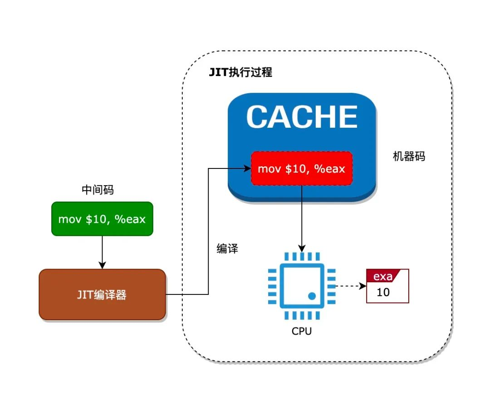

# eBPF虚拟机
eBPF是使用虚拟机来执行eBPF字节码的，但执行字节码是一个模拟CPU执行机器码的过程，所以比执行机器码的效率低很多。

从上图可以看出，执行中间码时，虚拟机需要将中间码解析成机器码来执行，而这个解析的过程就需要消耗更多的CPU时间。eBPF使用JIT技术来解决中间码效率不高的问题。JIT技术就是在执行中间码前，先把中间码编译成对应的机器码，然后缓存起来，运行时直接通过执行机器码即可。这样就解决了每次执行中间码都需要解析的过程，如下图所示：



verifier:eBPF的验证器，实现了一个本模块下的CFI/CFG(完整控制流)机制。

JIT:Just-In-Time,即时编译，eBPF汇编会在内核中被规则替换成真正的x86_64指令。主要用于解决虚拟机运行中间码时效率不高的问题。

所有的eBPF汇编指令在内核中定义为一个struct bpf_insn，使用时一般将连续的指令放置成一个结构体数组，然后通过内核态的bpf_prog_load载入编译运行。而内核态的程序对应struct bpf_prog结构体。bpf_prog_load函数主要执行以下关键操作：单bpf函数调用`bpf_prog_select_runtime(prog,&err)`jit编译prog,多bpf函数的prog调用`jit_subprog`。两者都会统一到针对`do_jit`的调用。


## eBPF JIT实现原理
当eBPF字节码被加载到内核时，内核会根据是否开启了JIT功能选项，来决定是否将eBPF字节码编译成机器码。由于不同架构CPU的指令集并不相同（也就是运行的机器码不相同），所以对于不同架构的CPU，把eBPF字节码编译成机器码的过程并不相同。

> 以x86架构的CPU进行分析

内核中的一个BPF程序使用struct bpf_prog来表示：
```c
struct bpf_prog {
    u16 pages; /* 占据了多少页 */
    u16 jited : 1, /* 是否被JIT翻译过 */
        jit_requested : 1, /* 架构要求对程序进行 */
        gpl_compatible : 1, /* 是否匹配GPL许可 */
        cb_access : 1, /* 是否访问控制块 */
        dst_needed : 1, /* 是否需要dst条目 Do we need dst entry? */
        blinded : 1, /* 是否进行过常数致盲 */
        is_func : 1, /* 程序是一个bpf函数*/
        kprobe_override : 1, /* 是否覆盖了一个kprobe */
        has_callchain_buf : 1, /* callchain buffer allocated? */
        enforce_expected_attach_type : 1; /* Enforce expected_attach_type checking at attach time */
    enum bpf_prog_type type; /* BPF程序的类型 */
    enum bpf_attach_type expected_attach_type; /* 要附着的类型 */
    u32 len; /* BPF程序长多少字节 */
    u32 jited_len; /* jit之后程序长多少字节  */
    u8 tag[BPF_TAG_SIZE];
    struct bpf_prog_aux* aux; /* 辅助字段 */
    struct sock_fprog_kern* orig_prog; /* 原BPF程序*/
    unsigned int (*bpf_func)(const void* ctx, const struct bpf_insn* insn); //执行BPF程序的函数指针, 第一个参数为执行环境
    /* 伪数组, 后面存放的是给解释器的BPF指令 */
    union {
        struct sock_filter insns[0];
        struct bpf_insn insnsi[0];
    };
};
```


首先，内核通过bpf_prog_load()来加载eBPF字节码,bpf_prog_load()会分配一个prog对象并进行初始化，然后调用bpf_check()检查程序，最后调用bpf_prog_select_runtime()进行JIT编译，至此BPF程序已经翻译为x86指令注入到内核中. 后续分配id与fd供用户使用
```c
static int bpf_prog_load(union bpf_attr * attr){
    ...
    /* 1. 分配一个bpf_prog对象, 所需大小 = bpf_prog对象大小 + BPF程序大小 */
    prog = bpf_prog_alloc(bpf_prog_size(attr->insn_cnt), GFP_USER);
    if (!prog)
        return -ENOMEM;

    // 2. 初始化bpf_prog对象
    prog->expected_attach_type = attr->expected_attach_type; //程序期望附着的事件的类型
    ...;
    prog->len = attr->insn_cnt;


    // 3. 从用户空间复制BPF程序到内核空间
    err = -EFAULT;
    if (copy_from_user(prog->insns, u64_to_user_ptr(attr->insns), bpf_prog_insn_size(prog))
        != 0)
        goto free_prog;

    prog->orig_prog = NULL; 
    prog->jited = 0;        //还未进行jit

    atomic64_set(&prog->aux->refcnt, 1);    //设置引用计数为1
    ...;

    /* 4. 进行BPF验证 */
    err = bpf_check(&prog, attr, uattr);
    if (err < 0)
        goto free_used_maps;


    prog = bpf_prog_select_runtim(prog);//为eBPF选择一个运行时
    if(err < 0)
        goto free_used_maps;
    
    //为BPF程序分配ID
    err = bpf_prog_alloc_id(prog);
    if (err)
        goto free_used_maps;
    ...;

    err = bpf_prog_new_fd(prog);    //为BPF程序分配一个fd, 现在开始就可以使用了
    if (err < 0)
        bpf_prog_put(prog);
    return err;

    ...// 错误处理
}
```
<font color=blue>什么是eBPF runtime？其实就是使用<mark>虚拟机运行还是使用JIT运行</mark>。</font>

```c
// Linux 3.18
void bpf_prog_select_runtime(struct bpf_prog *fp){//bpf_prog保存eBPF程序信息
    //1. 设置eBPF字节码的执行函数为__bpf_prog_run()函数
    fp->bpf_func = (void*) __bpf_prog_run;//bpf_func字段用于指向eBPF字节码的执行函数
    
    //2. 判断是否需要将eBPF字节码编译成机器码
    bpf_init_jit_compile(fp);
    //3. 将eBPF程序的某些数据结构和字节码设置为只读状态，增强安全性，防止 eBPF程序在运行时被意外修改
    bpf_prog_lock_ro(fp);
}

// Linux 5.5.6
struct bpf_prog* bpf_prog_select_runtime(struct bpf_prog* fp, int* err)
{
    // 验证器已经完成了与JIT相关的所有准备工作, 直接结束
    if (fp->bpf_func)
        goto finalize;

    // 根据栈的深度从interpreters中选择一个作为fp->bpf_func
    bpf_prog_select_func(fp);

    //在开启常数致盲得到情况下eBPF JIT会重写程序. 
    //然而为防止致盲时发生错误, bpf_int_jit_compile()必须返回一个有效的程序, 此时就不会被JIT, 而转交给解释器
    if (!bpf_prog_is_dev_bound(fp->aux)) {  // if(!fp->aux->offload_requested)
        ...;
        fp = bpf_int_jit_compile(fp);   //进行JIT编译
        ...;

    } else {
        ...;
    }

    ...;
    //尾调用兼容性检查只能在最后阶段进行. 
    //因为我们要确定, 如果我们处理JITed或者非JITed程序的链接, 并且不是所有的eBPF JIT都能立刻支持所有的特性
    *err = bpf_check_tail_call(fp);

    return fp;
}
```
> 常数致盲是一种安全机制，它通过将 eBPF 程序中的常量值替换为随机生成的值，从而使得程序在每次运行时的行为都略有不同。这使得攻击者难以预测程序的具体行为，从而增加了攻击的难度。

> JIT重写过程：在eBPF程序被加载到内核后，`bpf_int_jit_compile`函数会调用 `do_jit`函数来编译eBPF字节码。在这个过程中，如果启用了常数致盲，JIT编译器会：
遍历eBPF字节码，查找其中的常量值。将这些常量值替换为随机生成的值。在编译后的机器码中，确保这些随机值在运行时被正确还原。


bpf_prog_select_func()根据栈深度从解释器数组interpreters中选择，interpreters中的解释器函数的第一个参数为eBPF运行上下文，第二个参数为eBPF指令。
JIT编译会直接令fp->bpf_func指向编译出的函数. 这样执行fp->bpf_func(ctx, insn)就可以涵盖解释器执行与JIT编译两种情况。
```c
//解释器数组
static unsigned int (*interpreters[])(const void* ctx, const struct bpf_insn* insn)
    = {
          EVAL6(PROG_NAME_LIST, 32, 64, 96, 128, 160, 192) //支持最大栈深度为32，64, etc等的解释器函数
              EVAL6(PROG_NAME_LIST, 224, 256, 288, 320, 352, 384)
                  EVAL4(PROG_NAME_LIST, 416, 448, 480, 512)
      };//eBPF 程序在执行时可能需要使用栈空间。不同的解释器函数可能支持不同大小的栈空间。这个数组根据栈深度的不同，提供了多个解释器函数的指针。


static void bpf_prog_select_func(struct bpf_prog* fp)
{
#ifndef CONFIG_BPF_JIT_ALWAYS_ON //内核配置选项，用于控制是否总是启用 JIT 编译。如果这个选项被启用，内核会尝试将 eBPF 字节码编译为原生机器码。
    u32 stack_depth = max_t(u32, fp->aux->stack_depth, 1); // eBPF程序所需的栈深度，最少是1

    fp->bpf_func = interpreters[(round_up(stack_depth, 32) / 32) - 1]; // 选择合适的解释器函数
#else
    fp->bpf_func = __bpf_prog_ret0_warn; //如果 JIT 编译总是启用，但 JIT 编译失败，内核会使用一个默认的解释器函数，该函数直接返回 0 并发出警告。
#endif
}
```
bpf_init_jit_compile()函数首先会判断内核是否打开了eBPF的JIT功能，也就是bpf_jit_enable全局变量是否大于0，如果没有开启，那么内核将不会对eBPF字节码进行JIT处理。如果打开了JIT功能，那么bpf_init_jit_compile()函数将会调用do_jit()把字节码编译成本地机器码，然后将bpf_prog结构的bpf_func字段设置成编以后的字节码。这样，当内核调用bpf_func字段指向的函数时，就能直接执行eBPF字节码编译后的机器码。具体代码如下所示：
```c
// Linux 3.18
void bpf_init_jit_compile(struct bpf_prog* prog){
    ...
    struct jit_context ctx = {};
    u8 *image = NULL; // 用于保存eBPF字节码编以后的机器码
    ...

    //如果没有开启JIT功能，不需要将eBPF字节码编译成机器码
    if(!bpf_jit_enable){
        return;
    }

    ...
    for(pass = 0; pass < 10; pass++){
        //将eBPF字节码编译成本地机器码
        proglen = do_jit(prog, addrs, image, oldproglen, &ctx);
        ...
    }

    if(bpf_jit_enable > 1) //打印eBPF字节码编码后的机器码
        bpf_jit_dump(prog->len, proglen, 0, image);
    
    // 如果成功将eBPF字节码编译成本地机器码
    if(image){
        ...
        // 那么将eBPF字节码执行函数设置成编以后的机器码
        prog->bpf_func = (void *)image;
        prog->jited = true;
    }
}

// Linux 5.5.6
struct bpf_prog* bpf_int_jit_compile(struct bpf_prog* prog)
{
    struct bpf_binary_header* header = NULL;
    struct bpf_prog *tmp, *orig_prog = prog;
    struct x64_jit_data* jit_data;
    int proglen, oldproglen = 0;
    struct jit_context ctx = {};
    bool tmp_blinded = false;
    bool extra_pass = false;
    u8* image = NULL;
    int* addrs;
    int pass;
    int i;

    if (!prog->jit_requested) //是否被翻译过了
        return orig_prog;

    tmp = bpf_jit_blind_constants(prog); //致盲eBPF指令中的立即数

    //如果要求致盲, 但是有又失败了, 那么就不能进行JIT, 直接调用解释器
    if (IS_ERR(tmp))
        return orig_prog;
    if (tmp != prog) { //切换到致盲后的程序
        tmp_blinded = true;
        prog = tmp;
    }
    ...;

    //addrs[i]表示编译完第i条eBPF指令后, x86指令的总长度. addrs[i]-addrs[i-1]=第i条eBPF指令编译为x86指令的长度
    //由于x86指令是变长的, 因此eBPF在相对跳转时需要根据addrs修改偏移量
    addrs = kmalloc_array(prog->len + 1, sizeof(*addrs), GFP_KERNEL);

    //在首次pass之前, 对于addrs[]进行一个大概的估计. 每一个BPF指令翻译成x86指令后都小于64字节, 因此就都按64计算
    for (proglen = 0, i = 0; i <= prog->len; i++) {
        proglen += 64;
        addrs[i] = proglen;
    }
    ctx.cleanup_addr = proglen; //清理函数的地址, 也就是函数序言的地址, 位于eBPF最后一条指令翻译为x86指令的后面 

skip_init_addrs:

    //每次pass之后JIT镜像都会缩小, 迭代会持续到JIT镜像停止缩小位置
    //非常大的BPF程序可能在最后一次pass还在收敛. 这种情况下再多一次pass来产最终的JIT镜像
    for (pass = 0; pass < 20 || image; pass++) {
        proglen = do_jit(prog, addrs, image, oldproglen, &ctx); //进行一趟JIT
        ...
        if (image) { //程序长度停止收敛后会设置image, 再次迭代后就会进入这里
            ...;
            break; //不然就结束迭代
        }
        if (proglen == oldproglen) { //本次pass之后长度与原来的长读一样, 停止迭代

            u32 align = __alignof__(struct exception_table_entry);
            u32 extable_size = prog->aux->num_exentries * sizeof(struct exception_table_entry);
 /* 为x86指令和异常表分配可执行内存, image为JIT后执行写入的地址, 返回的bpf_binary_header对象后面会介绍 */
            header = bpf_jit_binary_alloc(roundup(proglen, align) + extable_size, &image, align, jit_fill_hole);
            ...;
            prog->aux->extable = (void*)image + roundup(proglen, align); //异常函数表
        }
        oldproglen = proglen;
        cond_resched();
    }

    if (bpf_jit_enable > 1) //在内核日志中输出JIT之后的程序
        bpf_jit_dump(prog->len, proglen, pass + 1, image);

    if (image) { //JIT成功会生成一个镜像
        ...;
        prog->bpf_func = (void*)image; //image为函数指针
        prog->jited = 1; //已进行过jit
        prog->jited_len = proglen; //程序长度
    } else { //失败, 则解释运行原程序
        prog = orig_prog;
    }

    ...;

    return prog;
}
```
### eBPF字节码编译过程
主要就是do_jit()函数的实现过程。由于eBPF程序会被编译成一个函数调用，所以do_jit()函数首先会构建一个函数调用的环境，如：申请函数栈空间，将一些寄存器压栈等操作。然后do_jit()函数会遍历eBPF字节码，并且对其进行编译成本地机器码。例如对eBPF的BPF_ALU64|BPF_MOV|BPF_X字节码，内核会将其编译成`mov %目标寄存器, %源寄存器`的机器码，其他eBPF字节码的编译过程类似。所以，当内核没有开启JIT功能时，将会使用__bpf_prog_run()函数来执行eBPF字节码。而当内核开启了JIT功能时，内核首先会将eBPF字节码编译成本地机器码，然后直接执行机器码即可。
```c
static int do_jit(struct bpf_prog* bpf_prog, int* addrs, u8* image, int oldproglen, struct jit_context* ctx)
{
    struct bpf_insn* insn = bpf_prog->insnsi;
    int insn_cnt = bpf_prog->len;
    bool seen_exit = false;
    u8 temp[BPF_MAX_INSN_SIZE + BPF_INSN_SAFETY]; //保存编译出的指令
    int i, cnt = 0, excnt = 0;
    int proglen = 0;
    u8* prog = temp;    //指向下一条指令写入的位置, 也就是已写入的最后一条指令的末尾

    emit_prologue(&prog, bpf_prog->aux->stack_depth, bpf_prog_was_classic(bpf_prog)); //插入本地指令的函数前言, 主要是保存寄存器等工作
    //addrs[i]表示编译完第i条eBPF指令后, x86指令的总长度. addrs[i]-addrs[i-1]=第i条eBPF指令编译为x86指令的长度
    //由于x86指令是变长的, 因此eBPF在相对跳转时需要根据addrs修改偏移量
    //由于在第一条eBPF指令前插入了函数前言, 因此addrs[0]=函数前言的长度
    addrs[0] = prog - temp; 
     for (i = 1; i <= insn_cnt; i++, insn++) {   //遍历eBPF指令, 每次只编译一条eBPF指令, 结果放入temp
        const s32 imm32 = insn->imm;    //立即数
        u32 dst_reg = insn->dst_reg;    //目标寄存器
        u32 src_reg = insn->src_reg;    //源寄存器
        ...;

        switch (insn->code) {
        ...;

        case BPF_ALU | BPF_MOV | BPF_K:     //mov32 reg, imm;
            emit_mov_imm32(&prog, BPF_CLASS(insn->code) == BPF_ALU64, dst_reg, imm32);
            break;

       ...;
        case BPF_JMP | BPF_EXIT:    //exit, BPF程序结束
            ...;

            /* 更新cleanup_addr, 也就是函数收尾指令的地址 */
            ctx->cleanup_addr = proglen;
            if (!bpf_prog_was_classic(bpf_prog))    //如果不是cBPF
                EMIT1(0x5B); /* 增加一条pop rbx; 摆脱tail_call_cnt */
            EMIT2(0x41, 0x5F); /* pop r15 */
            EMIT2(0x41, 0x5E); /* pop r14 */
            EMIT2(0x41, 0x5D); /* pop r13 */
            EMIT1(0x5B); /* pop rbx */
            EMIT1(0xC9); /* leave */
            EMIT1(0xC3); /* ret */
            break;

        }
        ilen = prog - temp; //本次翻译出的x86指令长度
        ...

        if (image) {    //如果非空, 则要写入JIT得到的指令
            memcpy(image + proglen, temp, ilen);
        }
        proglen += ilen;
        addrs[i] = proglen;
        prog = temp;
    }

    return proglen;
}


```

