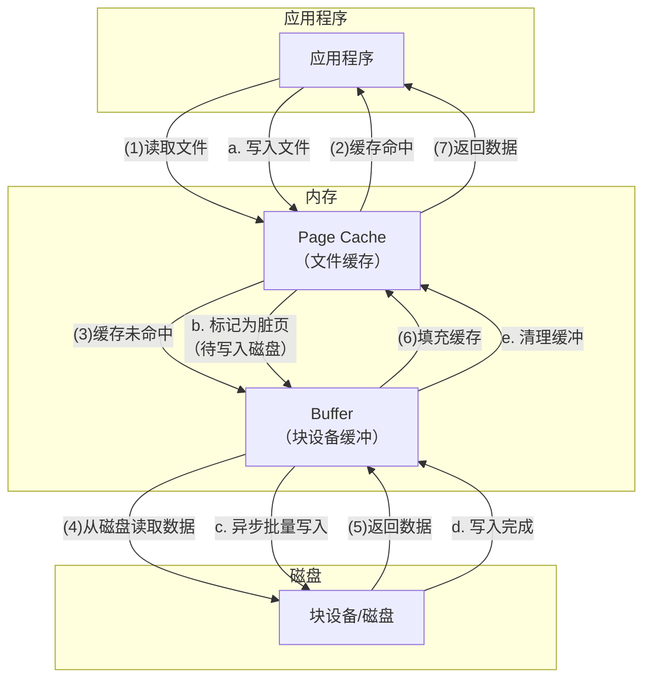

Linux系统中的Page cache和Buffer cache:
https://www.cnblogs.com/Courage129/p/14311675.html
linux文件读取中的Readahead预读机制:
https://blog.csdn.net/jinking01/article/details/106547862

```mermaid
flowchart TB
    subgraph 应用程序
        App[应用程序]
    end

    subgraph 内存
        Cache[Page Cache\n（文件缓存）]
        Buffer[Buffer\n（块设备缓冲）]
    end

    subgraph 磁盘
        Disk[块设备/磁盘]
    end

    %% 读流程
    App -- (1)读取文件 --> Cache
    Cache -- (2)缓存命中 --> App
    Cache -- (3)缓存未命中 --> Buffer
    Buffer -- (4)从磁盘读取数据 --> Disk
    Disk -- (5)返回数据 --> Buffer
    Buffer -- (6)填充缓存 --> Cache
    Cache -- (7)返回数据 --> App

    %% 写流程
    App -- a. 写入文件 --> Cache
    Cache -- b. 标记为脏页\n（待写入磁盘） --> Buffer
    Buffer -- c. 异步批量写入 --> Disk
    Disk -- d. 写入完成 --> Buffer
    Buffer -- e. 清理缓冲 --> Cache

  
```