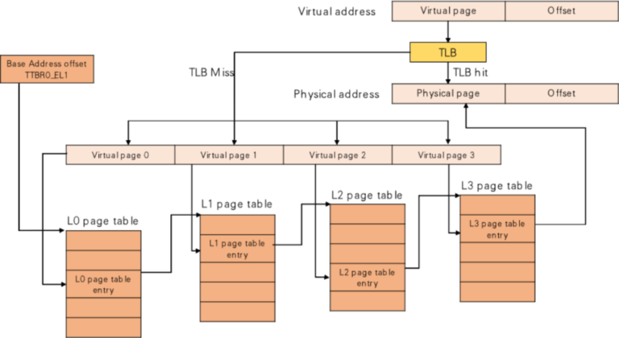
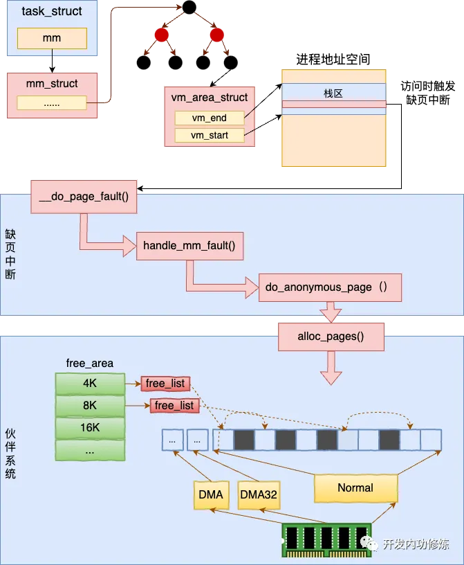
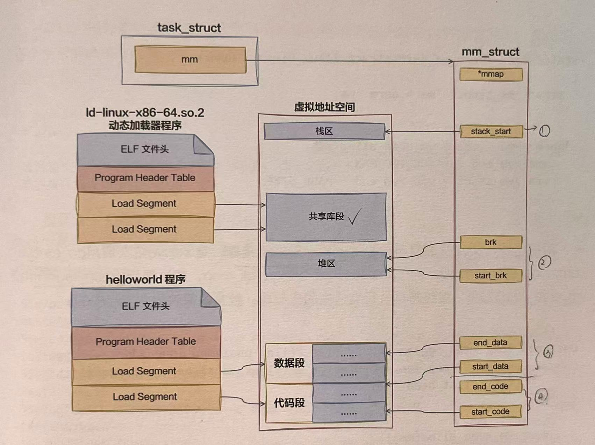
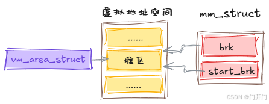
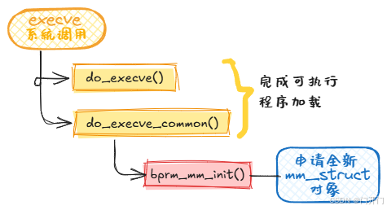
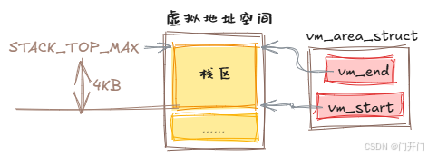
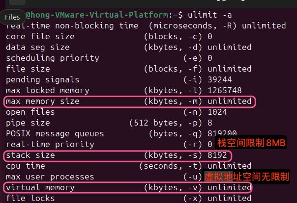
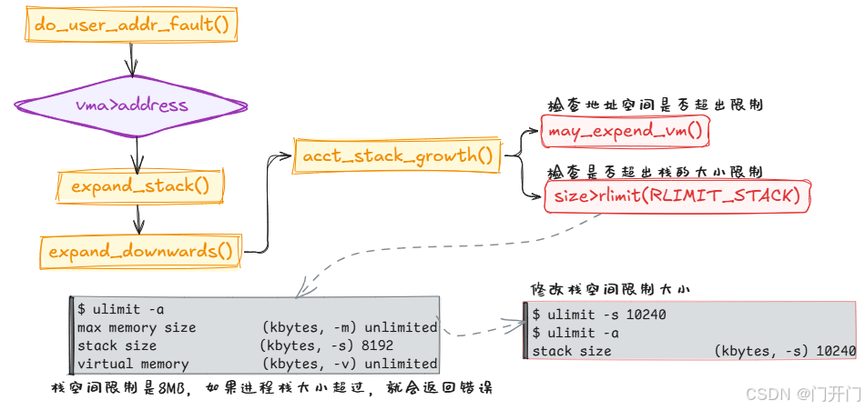
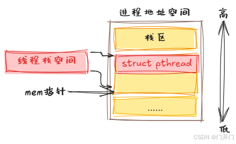

# 进程如何使用内存
进程的运行过程中离不开对内存的使用。进程在启动过程中对代码段，数据段的加载，栈的初始化都涉及对内存的申请和使用。另外，程序运行过程中在堆中申请的各种变量也都依赖内存的分配。所以内存是进程的核心资源。

1. 申请内存得到的真的是物理内存吗？不是，malloc先得到vm_area_struct虚拟页面，当真正访问变量时才会分配物理内存。
2. 对虚拟内存的申请如何转换为对物理内存的访问？触发缺页中断page fault,使用伙伴系统提供的函数接口alloc_page分配实际的物理内存。
3. top命令输出进程的内存指标中VIRT和RES分别是什么含义？
4. 栈的大小限制是多少？这个限制可以调整吗？
5. 当栈发生溢出后应用程序会发生什么？
6. 进程栈和线程栈是相同的东西吗？
7. malloc大致是如何工作的？


## 虚拟内存和物理页

虚拟内存的管理以进程为单位，每个进程都有一个虚拟地址空间。进程的task_struct都有**mm_struct类型的mm**，用来**代表进程的虚拟地址空间**。

```c
// file:include/linux/sched.h
struct task_struct{
    ...
    struct mm_struct;
};
```

在虚拟地址空间中，每段已经分出去的虚拟内存区域用VMA表示，结构体为`vm_area_struct`。mm表示的是一整块范围，vm_area_struct表示的是这块范围内被用掉的虚拟内存。

```c
// file:include/linux/mm_types.h
struct vm_area_struct{
    unsigned long vm_start; // 虚拟地址范围的开始
    unsigned long vm_end; //虚拟地址范围的结束
    ...
};
```
当进程运行一段时间后，会分配出去很多段地址范围，存在许多vm_area_struct对象。许多个vm_area_struct对象各自所指明的一分配出去的内存地址加起来就是对整个虚拟地址空间的占用情况。同时，内核也会保证**各个vm_area_struct之间的地址范围不会存在交叉**的情况。

进程运行过程中不断分配和释放vm_area_struct，在内存访问的过程中，也需要经常查找虚拟地址和某个vm_area_struct之间的关系。所以所有的vm_area_struct对象需要使用合适的数据结构进行维护，才能做到**高性能的遍历或查询**。

Linux 6.1版本之前，一直使用红黑树管理vm_area_struct对象，使用红黑树查询、插入、删除可能做到O(logn)的复杂度,效率比较高但是遍历性能比较低。所以除了红黑树还使用了双向链表来加速遍历过程。

> 平时我们思考某种应用场景，往往想到的是采用哪一种数据结构更合适。但是如果任何一种数据结构都不能满足所有需求，同时采用两种数据结构来管理也是一个很好的选择。

```c
// file:linux-5.4.56:include/linux/mm_types.h
struct mm_struct{
    // 双向链表
    struct vm_area_struct * mmap;
    // 红黑树
    struct rb_root mm_rb;
    // 锁
    struct rw_semaphore mmap_sem;
};
```
但是以上方法存在最明显的缺陷是**近些年服务器上的核数越来越多，应用程序的线程也越来越多，多线程情况下锁争用问题**开始浮现出来。2019年的LFSMM(Linux Storage, Filesystem, and Memory-Management Summit)峰会上多次讨论了这个问题。需要加锁的原因是，红黑树由于需要平衡操作，可能会影响多个红黑树的节点。还有需要将修改同步到双向链表。所以基于红黑树+双向链表的结构就必须加锁。

在Linux6.1版本中对VMA的管理替换成了mapple tree，这种数据结构一开始就是按照无锁的方式设计的，使用Linux中现的线程安全——read-copy-update(RCU)无锁编程方式实现。这样做降低了锁开销。

```c
// file:include/linux/mm_types.h
struct mm_struct{
    struct{
        struct maple_tree  mm_mt;
        ...
    }
};

// file:include/linux/maple_tree.h
struct maple_tree{
    ...
    void __rcu *ma_root;
    unsigned int ma_flags;
};
```

当进程申请内存的时候，申请到的是vm_area_struct，只是一段地址范围。不会立即分配物理内存，而是要**等到实际访问的时候。等进程在运行中在栈上开始分配和访问变量的时候**，如果物理页还没有分配，会触发缺页中断，分配真正的内存。

用户态缺页中断的入口函数为`do_user_addr_fault`。在这个函数中调用`find_vma`找到地址所在vma对象。凡是用户空间的地址，都调用`do_user_addr_fault`进行缺页中断的处理。6.1之前是遍历双向链表。6.1之后变成了在maple tree的查找函数mas_walk中查询。

```c
// file:arch/x86/mm/fault.c
static inline void do_user_addr_fault(..., unsigned long address){
    ...
    // 根据新的address查找到对应的vma
    vma = find_vma(mm, address);
    ...
good_area:
    // 调用handle_mm_fault来完成真正的内存申请
    fault = handle_mm_fault(mm, vma, address, flags);
}

// file:mm/nommu.c
struct vm_area_struct *find_vma(struct mm_struct *mm, unsigned long addr){
    MA_STATE(mas,  &mm->mm_mt,addr ,addr);
    return mas_walk(&mas);
}

// file:include/linux/maple_tree.h
#define MA_STATE(name, mt, first, end) \
    struct ma_state name={
        .tree = mt,
        .index = first, 
        .last = end,
        .node = MAS_START,
        .min = 0, 
        .max = ULONG_MAX,
        .alloc = NULL,
    }

// file:lib/maple_tree.c
void *mas_walk(struct ma_state *mas){
retry:
    entry = mas_state_walk(mas);
    ...

return entry;
}
```
MAS_STATE宏的作用是构造一个查找用的参数对象，把要用的maple tree的地址，还有要查找的地址都放到一个变量里，然后把构造出来的参数对象传递到mas_walk函数中进行真正的查询。

> Linux6.1版本中很多函数都把比较长的参数列表以一个参数对象的形式整合起来，这样代码看起来更清晰，容易理解。

找到正确的vma之后，do_user_addr_fault会依次调用handle_mm_fault->__handle_mm_fault来完成真正的物理内存申请。在__handle_mm_fault中，将参数统一到了一起vm_fault，包括缺页的内存地址address，也包括各级页表项。

```c
struct vm_fault {
	const struct {
		struct vm_area_struct *vma;	/* 缺页 VMA */
		unsigned long address;		/* 缺页地址 */
	};
	pmd_t *pmd;			/* 二级页表项 */
	pud_t *pud;		    /* 三级页表项 */
	pte_t *pte;		    /* 四级页表项 */
};

// file:mm/memory.c
static vm_fault_t __handle_mm_fault(struct vm_area_struct * vma, unsigned long address, unsigned int flags){
    // 将各种参数对象统一整合到了参数对象vm_fault中
    struct vm_fault vmf={
        .vma = vma.
        .address = address&PAGE_MASK,
        .real_address = address,

    };

    // 依次查看或申请每一级页表项
    pgd = pgd_offset(mm, address);
    p4d = p4d_alloc(mm, pgd, address);

    vmf.pud = pud_alloc(mm, p4d, address);
    ...
    vmf.pmd = pmd_alloc(mm, vmf.pud, address);
    ... 
    return handle_pte_fault(&vmf);
}
```
Linux是用四级页表来管理虚拟地址空间到物理内存之间的映射的，所以在实际申请物理页面之前，需要先检查一遍需要的各级页表是否存在，不存在的话需要申请。
- 一级页表:Page Global Dir, PGD
- 二级页表:Page Upper Dir, PUD
- 三级页表:Page Mid Dir, PMD
- 四级页表:Page Table Entry, PTE




问题：为什么PGD直接查看偏移即可但是后面的几个页表都需要申请？

在Linux内核的页表管理中，PGD（Page Global Directory）是页表的最顶层，它直接由内核管理，作为虚拟地址到物理地址转换的起点。而后续的PUD（Page Upper Directory）、PMD（Page Middle Directory）和PTE（Page Table Entry）等页表项需要动态申请.PGD在内核初始化时被分配和设置，并且通常会为每个进程单独分配一个PGD。这是因为在Linux内核中，每个进程都有自己的页表，用于管理其虚拟地址空间。PGD作为页表的根目录，用于存储指向PUD的指针。PGD的大小和地址范围是固定的，每个PGD项对应一个固定的虚拟地址范围。内核可以通过简单的位移和掩码操作直接从虚拟地址计算出对应的PGD项位置。例如，在x86_64架构中，PGD项的大小是8字节，每个PGD项对应一个PUD。PUD、PMD和PTE等页表项是在需要时才动态申请的。这是因为不是所有的虚拟地址空间都会被使用，按需分配可以节省内存资源。例如，一个进程可能只使用其虚拟地址空间的一部分，这样内核就只需要为这些实际使用的部分分配相应的PUD、PMD和PTE。


使用四级页表进行映射，在实际申请物理页面前，先检查一遍各级页表是否存在，不存在需要申请。申请好各级页表之后进入`do_anonymous_page`进行处理。在handle_pte_fault中会进行很多内存缺页处理，比如文件映射缺页处理，swap缺页处理，写时复制缺页处理，匿名映射页处理等。开发者申请的内存是匿名映射页处理，进入do_anonymous_page函数。

```c
// file:mm/memory.c
static vm_fault_t handle_pte_fault(struct vm_fault *vmf){
    vmf->pte = pte_offset_map(vmf-pmd, vmf->address);
    ...
    // 匿名映射页处理
    return do_anonymous_page(vmf);
    // 其他处理
    ...
}

// file:mm/memory.c
static vm_fault_t do_anonymous_page(struct vm_fault * vmf){
    ...
    // 分配可移动的匿名页面，底层通过alloc_page支持
    page = alloc_zeroed_user_highpage_movable(vma, vmf->address);
    ...

}
```
内核是用伙伴系统来管理所有的物理内存页的。其它模块需要物理页的时候都会调用伙伴系统对外提供的函数来申请物理内存。





## 虚拟内存使用方式
整个进程的运行过程是对虚拟内存的分配和使用。使用方式包括几类：

- 操作系统加载程序时对虚拟内存进行设置和使用。
    - 程序启动时，将程序代码段、数据段通过mmap映射到虚拟地址空间。
    - 对新进程初始化栈区和堆区。
- 程序运行期间动态地对所存储的各种数据进行申请和释放。
    - 栈，进程、线程运行时函数调用、存储局部变量使用栈。
    - 堆，开发语言运行时通过new、malloc等从堆中分配内存。依赖操作系统提供的虚拟地址空间相关的mmap、brk等系统调用实现。


### 进程启动时对虚拟内存的使用
在解析完ELF文件后：
- 为进程创建地址空间，准备大小为4kb的栈。
- 将可执行文件及其依赖的各种so动态链接库通过`elf_map`映射到虚拟地址空间中。
- 对进程堆区进行初始化。

在程序加载启动成功后，在进程的地址空间中的代码段、数据段就都设置完毕了，堆、栈也都初始化好了。在底层实现上无论是代码段数据段还是堆和栈，都对应着一个个的vm_area_struct对象。每一个vm_area_struct对象都表示这段虚拟地址空间已经分配和使用了。





#### 栈
具体到每一种内存的使用方式，在底层都是申请vm_area_struct来实现的。对于栈，是在execve中依次调用`do_execve_common`,` bprm_mm_init`, 最后在`__bprm_mm_init`中申请vm_area_struct对象。

```c
static int __bprm_mm_init(struct linux_binprm *bprm)
{
	struct mm_struct *mm = bprm->mm;
    // 申请占用一段地址范围
	bprm->vma = vma = vm_area_alloc(mm);
	vma->vm_end = STACK_TOP_MAX;
	vma->vm_start = vma->vm_end - PAGE_SIZE;
}
```

#### 可执行文件和动态链接库
对于可执行文件及进程所依赖的各种so动态链接库，是execve依次调用do_execve_common、search_binary_handler、load_elf_binary、elf_map，然后调用mmap_region申请vm_area_struct对象。

```c
unsigned long mmap_region(struct file *file, unsigned long addr,
		unsigned long len, vm_flags_t vm_flags, unsigned long pgoff,
		struct list_head *uf)
{
	vma = vm_area_alloc(mm);
	vma->vm_start = addr;
	vma->vm_end = addr + len;
	
	return addr;
}
```
#### 堆

对于堆内存，是在load_elf_binary的最后set_brk初始化堆时，依次调用vm_brk_flags、do_brk_flags，最后申请vm_area_struct对象。
```c
static int do_brk_flags(unsigned long addr, unsigned long len, unsigned long flags, struct list_head *uf)
{
	vma = vm_area_alloc(mm);

	vma_set_anonymous(vma);
	vma->vm_start = addr;
	vma->vm_end = addr + len;
	vma->vm_pgoff = pgoff;
	vma->vm_flags = flags;
}

```
可以通过`cat /proc/pid/maps`查看具体进程虚拟地址空间。


### mmap

在与虚拟内存管理相关的系统调用中最接近底层且最常用的，就是mmap。在各种运行时（比如glibc, Go运行时）中，经常能看到对它的使用。这个系统调用可以用于文件映射和匿名映射。

```c
// file:arch/x86/kernel/sys_x86_64.c
SYSCALL_DEFINE6(mmap, unsigned long, addr, unsigned long, len, unsigned long, prot, unsigned long, flags, unsigned long, fd, unsigned long, off)
{
    ...
    return ksys_mmap_pgoff(addr, len, prot, flags, fd, off >> PAGE_SHIFT);
}
```

接下来的实现调用逻辑比较深，ksys_mmap_pgoff->vm_mmap_pgoff->do_mmap_pgoff->do_mmap->mmap_region。具体调用过程不多展开，直接看mmap_region:
```c
// file:mm/mmap.c
unsigned long mmap_region(struct file * file, unsigned long addr, unsigned long len, vm_flags_t vm_flags, unsigned long pgoff, struct list_head * uf)
{
    ...
    // 申请新的vm_area_struct
    vma = vm_area_alloc(mm);
    // 对其进行初始化
    vma->vm_start = addr;
    vma->vm_end = addr + len;
    ...
    return addr;
}
```
mmap_regionn中调用vm_area_alloc申请了一个新的vm_area_struct对象，对其进行初始化。

### sbrk和brk

进程启动后，exec系统调用会给进程初始化好当前虚拟地址空间中的堆区，也设置好start_brk和brk等指针。



sbrk和brk系统调用在sbrk和brk指针基础上工作，sbrk系统调用返回mm_struct->brk指针的值，brk系统调用是修改mm_struct->brk。函数是do_brk_flags。
```c
// file:mm/mmap.c
static int do_brk_flags(unsigned long addr, unsigned long len, unsigned long flags, struct list_head *uf)
{
	struct mm_struct *mm = current->mm;
	// 在现有的vma上进行扩展
	vma = vma_merge(mm, prev, addr, addr + len, flags,
			NULL, NULL, pgoff, NULL, NULL_VM_UFFD_CTX);
	if (vma)
		goto out;

	// 申请新的vma
	vma = vm_area_alloc(mm);
	vma->vm_start = addr;
	vma->vm_end = addr + len;
    ......
}

```
例子：
```c
#include <stdio.h>
#include <unistd.h>
#include <sys/types.h>
#include <stdlib.h>

int main()
{
	void *curr_brk, *tmp_brk = NULL;
	// sbrk(0) 获取当前 program break 位置 
	tmp_brk = curr_brk = sbrk(0);
	getchar();

	// 使用 brk 增加 program break 位置 
	brk(curr_brk+4096);
	curr_brk = sbrk(0);
	getchar();

	// 使用 brk 减小 program break 位置 
	brk(tmp_brk);
	curr_brk = sbrk(0);
	getchar();

	return 0;
}

cat /proc/3454/maps
5556dc96e000-5556dc98f000 rw-p 00000000 00:00 0                          [heap]

cat /proc/3454/maps
5556dc96e000-5556dc990000 rw-p 00000000 00:00 0                          [heap]

cat /proc/3454/maps
5556dc96e000-5556dc98f000 rw-p 00000000 00:00 0                          [heap]

```

## 进程栈如何使用内存



```c
static int bprm_mm_init(struct linux_binprm *bprm)
{
	bprm->mm = mm = mm_alloc();
	err = __bprm_mm_init(bprm);
};
```

申请完地址空间后，就给进程申请一页大小的虚拟地址空间，作为进程的栈内存，把栈的指针保存到bprm->p中。
```c
static int __bprm_mm_init(struct linux_binprm *bprm)
{
	bprm->vma = vma = vm_area_alloc(mm); // 申请了一个vma对象作为栈使用
	vma->vm_end = STACK_TOP_MAX; // 地址空间顶部的位置
	vma->vm_start = vma->vm_end - PAGE_SIZE; // 栈向下增长所以先赋值vm_end再赋值vm_start
    
	bprm->p = vma->vm_end - sizeof(void *);
}
```
这里的栈内存**只是申请一个表示一段地址范围的vma对象，并没有真正申请物理内存**。




接下来使用`load_elf_binary`加载可执行二进制程序，把准备的进程栈地址空间指针设置到新的进程mm对象上。

```c
// file:fs/binfmt_elf.c
static int load_elf_binary(struct linux_binprm *bprm){
    // ELF文件头解析
    // 读取Program Header
    // 清空从父进程继承来的资源
    ...
    current->mm->start_stack = bprm->p;
}
```


进程在被加载、启动的时候，栈内存默认只分配了4KB的空间。随着程序的运行，当栈中保存的调用链、局部变量越来越多的时候，必然会超过4KB。在`__do_page_fault`源码中，扩充栈空间是由expand_stack函数来完成的。

```c
// file:arch/x86/mm/fault.c
static inline void do_user_addr_fault(..., unsigned long address){
    if(likely(vma->vm_start <= address))
        goto good_area;

    // 如果vma的开始地址比address大，则判断VM_GROWSDOWN是否可以动态扩充
    if(unlikely(!(vma->vm_flags & VM_GROWSDOWN))){
        bad_area(regs, hw_error_code, address);
        return;
    }

    // 对vma进行扩充
    if(unlikely(expand_stack(vma, address))){
        bad_area(regs, error_code, address);
        return;
    }
good_area:
    handle_mm_fault(vma, address, flags, regs);
    ......
}
```

如果栈内存vma开始地址比要访问的address大，要调用`expand_stack`对栈的虚拟空间进行补充。


```c
int expand_stack(struct vm_area_struct *vma, unsigned long address)
{
	return expand_downwards(vma, address);
}
int expand_downwards(struct vm_area_struct *vma,
				   unsigned long address)
{
    ...
        // 计算栈扩大后的大小
		size = vma->vm_end - address;
    	// 计算需要扩展几个页面
		grow = (vma->vm_start - address) >> PAGE_SHIFT;

		...
            // 判断是否允许扩充
			error = acct_stack_growth(vma, size, grow);
			...
                // 开始扩充
				vma->vm_start = address;
    ...
}

```

```c
// file:mm/mmap.c
static int acct_stack_growth(struct vm_area_struct * vma, unsigned long size, unsigned long grow){
    ...
    // 检查地址空间是否超出整体地址空间大小的限制
    if(!may_expand_vm(mm, grow))
        return -ENOMEN;
    // 检查是否超出栈的大小限制
    // rlim[RLIMIT_STACK].rlim_cur
    if(size > rlimit(RLIMIT_STACK))
        return -ENOMEM;

    ...
    return 0;
}
```
可以通过`ulimit -a`查看以上限制：



如果觉得系统默认的大小不合适，可以通过ulimit命令修改。
```shell
hong@hong-VMware-Virtual-Platform:~$ ulimit -s 10240
hong@hong-VMware-Virtual-Platform:~$ ulimit -a
real-time non-blocking time  (microseconds, -R) unlimited
core file size              (blocks, -c) 0
data seg size               (kbytes, -d) unlimited
scheduling priority                 (-e) 0
file size                   (blocks, -f) unlimited
pending signals                     (-i) 39244
max locked memory           (kbytes, -l) 1265748
max memory size             (kbytes, -m) unlimited
open files                          (-n) 1024
pipe size                (512 bytes, -p) 8
POSIX message queues         (bytes, -q) 819200
real-time priority                  (-r) 0
stack size                  (kbytes, -s) 10240
cpu time                   (seconds, -t) unlimited
max user processes                  (-u) 39244
virtual memory              (kbytes, -v) unlimited
file locks                          (-x) unlimited
```
如果想要长期修改可以通过修改/etc/security/limits.conf文件的方式。
```shell
vi /etc/security/limits.conf
...
* soft stack 1024000
```



当栈溢出后应用程序会发生什么？Segmentation Fault(core dumped).

进程栈内存的工作原理？
1. 进程在加载的时候给进程栈申请了一块虚拟地址空间vma内核对象。vm_start和vm_end之间留了一个Page，也就是说默认给栈准备了4KB的空间。
2. 当进程运行的过程中在栈上开始分配和访问变量的时候，如果物理页还没有分配，会触发缺页中断。在缺页中断中调用内核的伙伴系统真正地分配物理内存。
3. 当栈中的存储超过4KB时栈会自动进行扩大。不过大小要受到限制，其大小限制可以通过ulimit -s命令查看和设置。

## 线程栈如何使用内存

同一个进程下所有线程使用的都是同一块内存，但各个线程栈区独立，每个线程在并行调用时在栈上独立的进栈和出栈。

在Linux内核中并没有线程的概念，内核原生的clone系统调用仅支持生成一个和父进程共享地址空间等资源的轻量级进程而已。多线程在linux中最早是由LinuxThreads引入的，LinuxThreads项目希望在用户空间模拟对线程的支持。但该项目在信号处理、调度和进程间同步原语等方面有许多缺点，且该线程模型不满足POSIX标准。

为了改进LinuxThreads，需要做两方面的工作：一方面是在内核上提供支持，另一方面是重写线程库。后来有两个改进的Linux线程的项目被发起，一是IBM的NGPT——Next Generation POSIX Threads,另一个是RedHat的NPTL——Native POSIX Thread Library.现在只剩NPTL了，目前在Linux中使用`pthread_create`来创建线程，使用的就是NPTL。

Linux中的线程包含了两部分：
- 用户态glibc库：创建线程的`pthread_create`就是在glibc库中，glibc库完全是在用户态运行的。
- 内核态的clone系统调用：通过clone可以创建和父进程共享内存的用户进程。

pthread_create函数调用`__pthread_create_2_1`：
1. 定义线程对象指针
2. 确定栈空间大小
3. allocate_stack申请用户栈内存
4. create_thread调用内核clone系统调用创建线程

```c
int
__pthread_create_2_1 (pthread_t *newthread, const pthread_attr_t *attr,
		      void *(*start_routine) (void *), void *arg)
{
    // glibc线程对象
    struct pthread *pd = NULL;
    // 确定栈空间大小
    // 申请用户栈
    int err = allocate_stack (iattr, &pd, &stackaddr, &stacksize);
    // 创建线程
    retval = create_thread (pd, iattr, &stopped_start, stackaddr,
			      stacksize, &thread_ran);
}
```

⚠️<font color=#fda>**先申请内存，然后才调用系统调用创建的线程。Linux内核并没有处理线程栈内存，而是由glibc库在用户态申请后传给clone系统调用的。**</font>

### glibc线程对象

线程资源分为两部分，一部分是内核资源，例如代表轻量级进程的内核对象task_struct, 另一部分是用户态内存资源，包含线程栈，用户资源的数据结构是`struct pthread`，每个pthread对应唯一一个线程。

也就是线程结构体还是对应kernel的task_struct，而内存资源是在用户态使用glibc库申请的。

```c
struct pthread
{
    pid_t tid; // 线程id
    
    void *stackblock; // 线程栈内存
  	size_t stackblock_size;
}

```

### 确定栈空间大小

调用ALLOCATE_STACK, ALLOCATE_STACK是一个宏，最终会调用allocate_stack.
- 确定栈空间大小
- 申请栈内存

其中attr->stacksize是创建线程时传入的参数，如果用户指定了栈的大小，则使用用户指定的值。如果用户没有指定，就使用默认的大小__default_stacksize。
```c
// file:nptl/allocatestack.c
static int
allocate_stack (const struct pthread_attr *attr, struct pthread **pdp,
		void **stack, size_t *stacksize)
{
    if (attr->stacksize != 0)
    	size = attr->stacksize;
  	else
      	size = __default_pthread_attr.internal.stacksize;
}
```

和进程栈空间一样，getrlimit读取的栈大小系统配置可以使用ulimit命令来查看。在读取到当前系统的配置后，开始真正决定栈的实际大小。先处理的是ulimit没有配置或者配置不合理的情况:
- 如果ulimit没有配置或者是配置的无限大，那么配置的大小是ARCH_STACK_DEFAULT_SIZE(32MB)
- 如果配置得太小，可能会导致程序无法正常运行，所以glibc库最小也会给PTHREAD_STACK_MIN大小(16384B,16KB)

在ulimit配置合理的情况下，将取到的配置值对齐就可以使用了。

<font color=#fda>**无论给栈设置得多大，NPTL都会强行将你的线程栈大小限制到32MB以内。**</font>


### 申请用户栈
申请内存步骤:
- get_cached_stack获取一段缓存直接用，以避免频繁地对内存申请和释放
- 如果没取到缓存，使用mmap申请一段匿名空间
- pthread对象先放到栈上
- 把栈添加到链表进行管理
```c
// file:nptl/allocatestack.c
static int
allocate_stack (const struct pthread_attr *attr, struct pthread **pdp,
		void **stack, size_t *stacksize)
{
    struct pthread *pd;
    
    pd = get_cached_stack (&size, &mem);
    if (pd == NULL)
	{
	  	mem = __mmap (NULL, size, (guardsize == 0) ? prot : PROT_NONE,
			MAP_PRIVATE | MAP_ANONYMOUS | MAP_STACK, -1, 0);
        pd = (struct pthread *) ((((uintptr_t) mem + size
				    - tls_static_size_for_stack)
				    & ~tls_static_align_m1)
				   - TLS_PRE_TCB_SIZE);
        pd->stackblock = mem;
	  	pd->stackblock_size = size;
    }
    __nptl_stack_list_add (&pd->list, &GL (dl_stack_used));
}

```
申请到内存后，mem指针指向新内存的低地址，通过mem和size算出高地址，先把struct pthread放进去。线程栈内存有两个用途，存储struct pthread和真正的线程栈内存。




### 创建线程

## 进程堆内存管理


## 参考文献

https://mp.weixin.qq.com/s/Jo8KEzfb1OXShrb3PT4U_A

https://mp.weixin.qq.com/s/pTP7ELOm4-JsAl1o_nyS-Q


https://mp.weixin.qq.com/s/KzKkXhxjBLcgiHHB18ASGw


https://mp.weixin.qq.com/s/7ZyCXUABL0Urso4VeaEdBQ


https://mp.weixin.qq.com/s/OR2XB4J76haGc1THeq7WQg