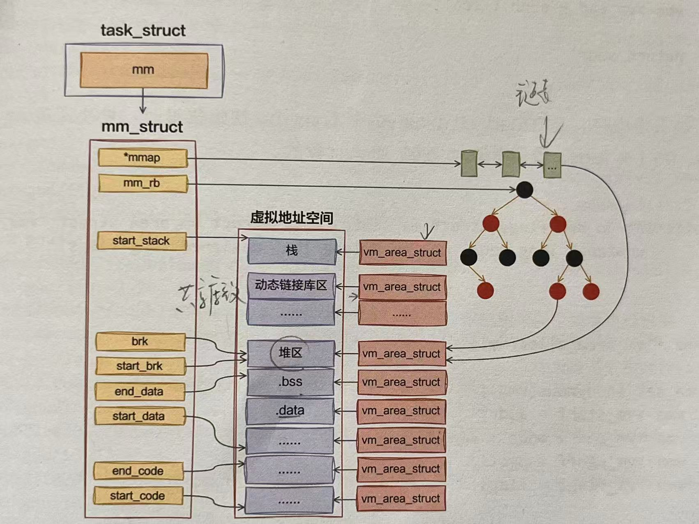

# 进程如何使用内存
进程的运行过程中离不开对内存的使用。进程在启动过程中对代码段，数据段的加载，栈的初始化都涉及对内存的申请和使用。另外，程序运行过程中在堆中申请的各种变量也都依赖内存的分配。所以内存是进程的核心资源。

1. 申请内存得到的真的是物理内存吗？不是，malloc先得到vm_area_struct虚拟页面，当真正访问变量时才会分配物理内存。
2. 对虚拟内存的申请如何转换为对物理内存的访问？触发缺页中断page fault,使用伙伴系统提供的函数接口alloc_page分配实际的物理内存。
3. top命令输出进程的内存指标中VIRT和RES分别是什么含义？
4. 栈的大小限制是多少？这个限制可以调整吗？
5. 当栈发生溢出后应用程序会发生什么？
6. 进程栈和线程栈是相同的东西吗？
7. malloc大致是如何工作的？


## 虚拟内存和物理页

虚拟内存的管理以进程为单位，每个进程都有一个虚拟地址空间。进程的task_struct都有**mm_struct类型的mm**，用来**代表进程的虚拟地址空间**。

```c
// file:include/linux/sched.h
struct task_struct{
    ...
    struct mm_struct;
};
```

在虚拟地址空间中，每段已经分出去的虚拟内存区域用VMA表示，结构体为`vm_area_struct`。mm表示的是一整块范围，vm_area_struct表示的是这块范围内被用掉的虚拟内存。

```c
// file:include/linux/mm_types.h
struct vm_area_struct{
    unsigned long vm_start; // 虚拟地址范围的开始
    unsigned long vm_end; //虚拟地址范围的结束
    ...
};
```
当进程运行一段时间后，会分配出去很多段地址范围，存在许多vm_area_struct对象。许多个vm_area_struct对象各自所指明的一分配出去的内存地址加起来就是对整个虚拟地址空间的占用情况。同时，内核也会保证**各个vm_area_struct之间的地址范围不会存在交叉**的情况。

进程运行过程中不断分配和释放vm_area_struct，在内存访问的过程中，也需要经常查找虚拟地址和某个vm_area_struct之间的关系。所以所有的vm_area_struct对象需要使用合适的数据结构进行维护，才能做到**高性能的遍历或查询**。

Linux 6.1版本之前，一直使用红黑树管理vm_area_struct对象，使用红黑树查询、插入、删除可能做到O(logn)的复杂度,效率比较高但是遍历性能比较低。所以除了红黑树还使用了双向链表来加速遍历过程。

> 平时我们思考某种应用场景，往往想到的是采用哪一种数据结构更合适。但是如果任何一种数据结构都不能满足所有需求，同时采用两种数据结构来管理也是一个很好的选择。

```c
// file:linux-5.4.56:include/linux/mm_types.h
struct mm_struct{
    // 双向链表
    struct vm_area_struct * mmap;
    // 红黑树
    struct rb_root mm_rb;
    // 锁
    struct rw_semaphore mmap_sem;
};
```
但是以上方法存在最明显的缺陷是**近些年服务器上的核数越来越多，应用程序的线程也越来越多，多线程情况下锁争用问题**开始浮现出来。2019年的LFSMM(Linux Storage, Filesystem, and Memory-Management Summit)峰会上多次讨论了这个问题。需要加锁的原因是，红黑树由于需要平衡操作，可能会影响多个红黑树的节点。还有需要将修改同步到双向链表。所以基于红黑树+双向链表的结构就必须加锁。

在Linux6.1版本中对VMA的管理替换成了mapple tree，这种数据结构一开始就是按照无锁的方式设计的，使用Linux中现的线程安全——read-copy-update(RCU)无锁编程方式实现。这样做降低了锁开销。

```c
// file:include/linux/mm_types.h
struct mm_struct{
    struct{
        struct maple_tree  mm_mt;
        ...
    }
};

// file:include/linux/maple_tree.h
struct maple_tree{
    ...
    void __rcu *ma_root;
    unsigned int ma_flags;
};
```

当进程申请内存的时候，申请到的是vm_area_struct，只是一段地址范围。不会立即分配物理内存，而是要**等到实际访问的时候。等进程在运行中在栈上开始分配和访问变量的时候**，如果物理页还没有分配，会触发缺页中断，分配真正的内存。

用户态缺页中断的入口函数为`do_user_addr_fault`。在这个函数中调用`find_vma`找到地址所在vma对象。凡是用户空间的地址，都调用`do_user_addr_fault`进行缺页中断的处理。6.1之前是遍历双向链表。6.1之后变成了在maple tree的查找函数mas_walk中查询。

```c
// file:arch/x86/mm/fault.c
static inline void do_user_addr_fault(..., unsigned long address){
    ...
    // 根据新的address查找到对应的vma
    vma = find_vma(mm, address);
    ...
good_area:
    // 调用handle_mm_fault来完成真正的内存申请
    fault = handle_mm_fault(mm, vma, address, flags);
}

// file:mm/nommu.c
struct vm_area_struct *find_vma(struct mm_struct *mm, unsigned long addr){
    MA_STATE(mas,  &mm->mm_mt,addr ,addr);
    return mas_walk(&mas);
}

// file:include/linux/maple_tree.h
#define MA_STATE(name, mt, first, end) \
    struct ma_state name={
        .tree = mt,
        .index = first, 
        .last = end,
        .node = MAS_START,
        .min = 0, 
        .max = ULONG_MAX,
        .alloc = NULL,
    }

// file:lib/maple_tree.c
void *mas_walk(struct ma_state *mas){
retry:
    entry = mas_state_walk(mas);
    ...

return entry;
}
```
MAS_STATE宏的作用是构造一个查找用的参数对象，把要用的maple tree的地址，还有要查找的地址都放到一个变量里，然后把构造出来的参数对象传递到mas_walk函数中进行真正的查询。

> Linux6.1版本中很多函数都把比较长的参数列表以一个参数对象的形式整合起来，这样代码看起来更清晰，容易理解。

找到正确的vma之后，do_user_addr_fault会依次调用handle_mm_fault->__handle_mm_fault来完成真正的物理内存申请。在__handle_mm_fault中，将参数统一到了一起vm_fault，包括缺页的内存地址address，也包括各级页表项。

```c
struct vm_fault {
	const struct {
		struct vm_area_struct *vma;	/* 缺页 VMA */
		unsigned long address;		/* 缺页地址 */
	};
	pmd_t *pmd;			/* 二级页表项 */
	pud_t *pud;		    /* 三级页表项 */
	pte_t *pte;		    /* 四级页表项 */
};

// file:mm/memory.c
static vm_fault_t __handle_mm_fault(struct vm_area_struct * vma, unsigned long address, unsigned int flags){
    // 将各种参数对象统一整合到了参数对象vm_fault中
    struct vm_fault vmf={
        .vma = vma.
        .address = address&PAGE_MASK,
        .real_address = address,

    };

    // 依次查看或申请每一级页表项
    pgd = pgd_offset(mm, address);
    p4d = p4d_alloc(mm, pgd, address);

    vmf.pud = pud_alloc(mm, p4d, address);
    ...
    vmf.pmd = pmd_alloc(mm, vmf.pud, address);
    ... 
    return handle_pte_fault(&vmf);
}
```
Linux是用四级页表来管理虚拟地址空间到物理内存之间的映射的，所以在实际申请物理页面之前，需要先检查一遍需要的各级页表是否存在，不存在的话需要申请。
- 一级页表:Page Global Dir, PGD
- 二级页表:Page Upper Dir, PUD
- 三级页表:Page Mid Dir, PMD
- 四级页表:Page Table Entry, PTE


问题：为什么PGD直接查看偏移即可但是后面的几个页表都需要申请？

在Linux内核的页表管理中，PGD（Page Global Directory）是页表的最顶层，它直接由内核管理，作为虚拟地址到物理地址转换的起点。而后续的PUD（Page Upper Directory）、PMD（Page Middle Directory）和PTE（Page Table Entry）等页表项需要动态申请.PGD在内核初始化时被分配和设置，并且通常会为每个进程单独分配一个PGD。这是因为在Linux内核中，每个进程都有自己的页表，用于管理其虚拟地址空间。PGD作为页表的根目录，用于存储指向PUD的指针。PGD的大小和地址范围是固定的，每个PGD项对应一个固定的虚拟地址范围。内核可以通过简单的位移和掩码操作直接从虚拟地址计算出对应的PGD项位置。例如，在x86_64架构中，PGD项的大小是8字节，每个PGD项对应一个PUD。PUD、PMD和PTE等页表项是在需要时才动态申请的。这是因为不是所有的虚拟地址空间都会被使用，按需分配可以节省内存资源。例如，一个进程可能只使用其虚拟地址空间的一部分，这样内核就只需要为这些实际使用的部分分配相应的PUD、PMD和PTE。


使用四级页表进行映射，在实际申请物理页面前，先检查一遍各级页表是否存在，不存在需要申请。申请好各级页表之后进入`do_anonymous_page`进行处理。在handle_pte_fault中会进行很多内存缺页处理，比如文件映射缺页处理，swap缺页处理，写时复制缺页处理，匿名映射页处理等。开发者申请的内存是匿名映射页处理，进入do_anonymous_page函数。

```c
// file:mm/memory.c
static vm_fault_t handle_pte_fault(struct vm_fault *vmf){
    vmf->pte = pte_offset_map(vmf-pmd, vmf->address);
    ...
    // 匿名映射页处理
    return do_anonymous_page(vmf);
    // 其他处理
    ...
}

// file:mm/memory.c
static vm_fault_t do_anonymous_page(struct vm_fault * vmf){
    ...
    // 分配可移动的匿名页面，底层通过alloc_page支持
    page = alloc_zeroed_user_highpage_movable(vma, vmf->address);
    ...

}
```
内核是用伙伴系统来管理所有的物理内存页的。其它模块需要物理页的时候都会调用伙伴系统对外提供的函数来申请物理内存。


## 虚拟内存使用方式
整个进程的运行过程是对虚拟内存的分配和使用。使用方式包括几类：

- 操作系统加载程序时对虚拟内存进行设置和使用。
    - 程序启动时，将程序代码段、数据段通过mmap映射到虚拟地址空间。
    - 对新进程初始化栈区和堆区。
- 程序运行期间动态地对所存储的各种数据进行申请和释放。
    - 栈，进程、线程运行时函数调用、存储局部变量使用栈。
    - 堆，开发语言运行时通过new、malloc等从堆中分配内存。依赖操作系统提供的虚拟地址空间相关的mmap、brk等系统调用实现。


### 进程启动时对虚拟内存的使用
在解析完ELF文件后：
- 为进程创建地址空间，准备大小为4kb的栈。
- 将可执行文件及其依赖的各种so动态链接库通过`elf_map`映射到虚拟地址空间中。
- 对进程堆区进行初始化。

在程序加载启动成功后，在进程的地址空间中的代码段、数据段就都设置完毕了，堆、栈也都初始化好了。在底层实现上无论是代码段数据段还是堆和栈，都对应着一个个的vm_area_struct对象。每一个vm_area_struct对象都表示这段虚拟地址空间已经分配和使用了。





#### 栈
具体到每一种内存的使用方式，在底层都是申请vm_area_struct来实现的。对于栈，是在execve中依次调用`do_execve_common`,` bprm_mm_init`, 最后在`__bprm_mm_init`中申请vm_area_struct对象。

```c
static int __bprm_mm_init(struct linux_binprm *bprm)
{
	struct mm_struct *mm = bprm->mm;
    // 申请占用一段地址范围
	bprm->vma = vma = vm_area_alloc(mm);
	vma->vm_end = STACK_TOP_MAX;
	vma->vm_start = vma->vm_end - PAGE_SIZE;
}
```

#### 可执行文件和动态链接库
对于可执行文件及进程所依赖的各种so动态链接库，是execve依次调用do_execve_common、search_binary_handler、load_elf_binary、elf_map，然后调用mmap_region申请vm_area_struct对象。

```c
unsigned long mmap_region(struct file *file, unsigned long addr,
		unsigned long len, vm_flags_t vm_flags, unsigned long pgoff,
		struct list_head *uf)
{
	vma = vm_area_alloc(mm);
	vma->vm_start = addr;
	vma->vm_end = addr + len;
	
	return addr;
}
```
#### 堆

对于堆内存，是在load_elf_binary的最后set_brk初始化堆时，依次调用vm_brk_flags、do_brk_flags，最后申请vm_area_struct对象。
```c
static int do_brk_flags(unsigned long addr, unsigned long len, unsigned long flags, struct list_head *uf)
{
	vma = vm_area_alloc(mm);

	vma_set_anonymous(vma);
	vma->vm_start = addr;
	vma->vm_end = addr + len;
	vma->vm_pgoff = pgoff;
	vma->vm_flags = flags;
}

```
可以通过`cat /proc/pid/maps`查看具体进程虚拟地址空间。


### mmap

在与虚拟内存管理相关的系统调用中最接近底层且最常用的，就是mmap。在各种运行时（比如glibc, Go运行时）中，经常能看到对它的使用。这个系统调用可以用于文件映射和匿名映射。

```c
// file:arch/x86/kernel/sys_x86_64.c
SYSCALL_DEFINE6(mmap, unsigned long, addr, unsigned long, len, unsigned long, prot, unsigned long, flags, unsigned long, fd, unsigned long, off)
{
    ...
    return ksys_mmap_pgoff(addr, len, prot, flags, fd, off >> PAGE_SHIFT);
}
```

接下来的实现调用逻辑比较深，ksys_mmap_pgoff->vm_mmap_pgoff->do_mmap_pgoff->do_mmap->mmap_region。具体调用过程不多展开，直接看mmap_region:
```c
// file:mm/mmap.c
unsigned long mmap_region(struct file * file, unsigned long addr, unsigned long len, vm_flags_t vm_flags, unsigned long pgoff, struct list_head * uf)
{
    ...
    // 申请新的vm_area_struct
    vma = vm_area_alloc(mm);
    // 对其进行初始化
    vma->vm_start = addr;
    vma->vm_end = addr + len;
    ...
    return addr;
}
```
mmap_regionn中调用vm_area_alloc申请了一个新的vm_area_struct对象，对其进行初始化。

### sbrk和brk

进程启动后，exec系统调用会给进程初始化好当前虚拟地址空间中的堆区，也设置好start_brk和brk等指针。


sbrk和brk系统调用在sbrk和brk指针基础上工作，sbrk系统调用返回mm_struct->brk指针的值，brk系统调用是修改mm_struct->brk。函数是do_brk_flags。
```c
// file:mm/mmap.c
static int do_brk_flags(unsigned long addr, unsigned long len, unsigned long flags, struct list_head *uf)
{
	struct mm_struct *mm = current->mm;
	// 在现有的vma上进行扩展
	vma = vma_merge(mm, prev, addr, addr + len, flags,
			NULL, NULL, pgoff, NULL, NULL_VM_UFFD_CTX);
	if (vma)
		goto out;

	// 申请新的vma
	vma = vm_area_alloc(mm);
	vma->vm_start = addr;
	vma->vm_end = addr + len;
    ......
}

```
例子：
```c
#include <stdio.h>
#include <unistd.h>
#include <sys/types.h>
#include <stdlib.h>

int main()
{
	void *curr_brk, *tmp_brk = NULL;
	// sbrk(0) 获取当前 program break 位置 
	tmp_brk = curr_brk = sbrk(0);
	getchar();

	// 使用 brk 增加 program break 位置 
	brk(curr_brk+4096);
	curr_brk = sbrk(0);
	getchar();

	// 使用 brk 减小 program break 位置 
	brk(tmp_brk);
	curr_brk = sbrk(0);
	getchar();

	return 0;
}

cat /proc/3454/maps
5556dc96e000-5556dc98f000 rw-p 00000000 00:00 0                          [heap]

cat /proc/3454/maps
5556dc96e000-5556dc990000 rw-p 00000000 00:00 0                          [heap]

cat /proc/3454/maps
5556dc96e000-5556dc98f000 rw-p 00000000 00:00 0                          [heap]

```

## 进程栈如何使用内存


```c
static int bprm_mm_init(struct linux_binprm *bprm)
{
	bprm->mm = mm = mm_alloc();
	err = __bprm_mm_init(bprm);
};
```

申请完地址空间后，就给进程申请一页大小的虚拟地址空间，作为进程的栈内存，把栈的指针保存到bprm->p中。
```c
static int __bprm_mm_init(struct linux_binprm *bprm)
{
	bprm->vma = vma = vm_area_alloc(mm); // 申请了一个vma对象作为栈使用
	vma->vm_end = STACK_TOP_MAX; // 地址空间顶部的位置
	vma->vm_start = vma->vm_end - PAGE_SIZE; // 栈向下增长所以先赋值vm_end再赋值vm_start
    
	bprm->p = vma->vm_end - sizeof(void *);
}
```
这里的栈内存**只是申请一个表示一段地址范围的vma对象，并没有真正申请物理内存**。


接下来使用`load_elf_binary`加载可执行二进制程序，把准备的进程栈地址空间指针设置到新的进程mm对象上。

```c
// file:fs/binfmt_elf.c
static int load_elf_binary(struct linux_binprm *bprm){
    // ELF文件头解析
    // 读取Program Header
    // 清空从父进程继承来的资源
    ...
    current->mm->start_stack = bprm->p;
}
```


进程在被加载、启动的时候，栈内存默认只分配了4KB的空间。随着程序的运行，当栈中保存的调用链、局部变量越来越多的时候，必然会超过4KB。在`__do_page_fault`源码中，扩充栈空间是由expand_stack函数来完成的。

```c
// file:arch/x86/mm/fault.c
static inline void do_user_addr_fault(..., unsigned long address){
    if(likely(vma->vm_start <= address))
        goto good_area;

    // 如果vma的开始地址比address大，则判断VM_GROWSDOWN是否可以动态扩充
    if(unlikely(!(vma->vm_flags & VM_GROWSDOWN))){
        bad_area(regs, hw_error_code, address);
        return;
    }

    // 对vma进行扩充
    if(unlikely(expand_stack(vma, address))){
        bad_area(regs, error_code, address);
        return;
    }
good_area:
    handle_mm_fault(vma, address, flags, regs);
    ......
}
```

如果栈内存vma开始地址比要访问的address大，要调用`expand_stack`对栈的虚拟空间进行补充。


```c
int expand_stack(struct vm_area_struct *vma, unsigned long address)
{
	return expand_downwards(vma, address);
}
int expand_downwards(struct vm_area_struct *vma,
				   unsigned long address)
{
    ...
        // 计算栈扩大后的大小
		size = vma->vm_end - address;
    	// 计算需要扩展几个页面
		grow = (vma->vm_start - address) >> PAGE_SHIFT;

		...
            // 判断是否允许扩充
			error = acct_stack_growth(vma, size, grow);
			...
                // 开始扩充
				vma->vm_start = address;
    ...
}

```

```c
// file:mm/mmap.c
static int acct_stack_growth(struct vm_area_struct * vma, unsigned long size, unsigned long grow){
    ...
    // 检查地址空间是否超出整体地址空间大小的限制
    if(!may_expand_vm(mm, grow))
        return -ENOMEN;
    // 检查是否超出栈的大小限制
    // rlim[RLIMIT_STACK].rlim_cur
    if(size > rlimit(RLIMIT_STACK))
        return -ENOMEM;

    ...
    return 0;
}
```
可以通过`ulimit -a`查看以上限制：


如果觉得系统默认的大小不合适，可以通过ulimit命令修改。
```shell
hong@hong-VMware-Virtual-Platform:~$ ulimit -s 10240
hong@hong-VMware-Virtual-Platform:~$ ulimit -a
real-time non-blocking time  (microseconds, -R) unlimited
core file size              (blocks, -c) 0
data seg size               (kbytes, -d) unlimited
scheduling priority                 (-e) 0
file size                   (blocks, -f) unlimited
pending signals                     (-i) 39244
max locked memory           (kbytes, -l) 1265748
max memory size             (kbytes, -m) unlimited
open files                          (-n) 1024
pipe size                (512 bytes, -p) 8
POSIX message queues         (bytes, -q) 819200
real-time priority                  (-r) 0
stack size                  (kbytes, -s) 10240
cpu time                   (seconds, -t) unlimited
max user processes                  (-u) 39244
virtual memory              (kbytes, -v) unlimited
file locks                          (-x) unlimited
```
如果想要长期修改可以通过修改/etc/security/limits.conf文件的方式。
```shell
vi /etc/security/limits.conf
...
* soft stack 1024000
```


当栈溢出后应用程序会发生什么？Segmentation Fault(core dumped).

进程栈内存的工作原理？
1. 进程在加载的时候给进程栈申请了一块虚拟地址空间vma内核对象。vm_start和vm_end之间留了一个Page，也就是说默认给栈准备了4KB的空间。
2. 当进程运行的过程中在栈上开始分配和访问变量的时候，如果物理页还没有分配，会触发缺页中断。在缺页中断中调用内核的伙伴系统真正地分配物理内存。
3. 当栈中的存储超过4KB时栈会自动进行扩大。不过大小要受到限制，其大小限制可以通过ulimit -s命令查看和设置。

## 线程栈如何使用内存

同一个进程下所有线程使用的都是同一块内存，但各个线程栈区独立，每个线程在并行调用时在栈上独立的进栈和出栈。

在Linux内核中并没有线程的概念，内核原生的clone系统调用仅支持生成一个和父进程共享地址空间等资源的轻量级进程而已。多线程在linux中最早是由LinuxThreads引入的，LinuxThreads项目希望在用户空间模拟对线程的支持。但该项目在信号处理、调度和进程间同步原语等方面有许多缺点，且该线程模型不满足POSIX标准。

为了改进LinuxThreads，需要做两方面的工作：一方面是在内核上提供支持，另一方面是重写线程库。后来有两个改进的Linux线程的项目被发起，一是IBM的NGPT——Next Generation POSIX Threads,另一个是RedHat的NPTL——Native POSIX Thread Library.现在只剩NPTL了，目前在Linux中使用`pthread_create`来创建线程，使用的就是NPTL。

Linux中的线程包含了两部分：
- 用户态glibc库：创建线程的`pthread_create`就是在glibc库中，glibc库完全是在用户态运行的。
- 内核态的clone系统调用：通过clone可以创建和父进程共享内存的用户进程。

pthread_create函数调用`__pthread_create_2_1`：
1. 定义线程对象指针
2. 确定栈空间大小
3. allocate_stack申请用户栈内存
4. create_thread调用内核clone系统调用创建线程

```c
int
__pthread_create_2_1 (pthread_t *newthread, const pthread_attr_t *attr,
		      void *(*start_routine) (void *), void *arg)
{
    // glibc线程对象
    struct pthread *pd = NULL;
    // 确定栈空间大小
    // 申请用户栈
    int err = allocate_stack (iattr, &pd, &stackaddr, &stacksize);
    // 创建线程
    retval = create_thread (pd, iattr, &stopped_start, stackaddr,
			      stacksize, &thread_ran);
}
```

⚠️<font color=#fda>**先申请内存，然后才调用系统调用创建的线程。Linux内核并没有处理线程栈内存，而是由glibc库在用户态申请后传给clone系统调用的。**</font>

### glibc线程对象

线程资源分为两部分，一部分是内核资源，例如代表轻量级进程的内核对象task_struct, 另一部分是用户态内存资源，包含线程栈，用户资源的数据结构是`struct pthread`，每个pthread对应唯一一个线程。

也就是线程结构体还是对应kernel的task_struct，而内存资源是在用户态使用glibc库申请的。

```c
struct pthread
{
    pid_t tid; // 线程id
    
    void *stackblock; // 线程栈内存
  	size_t stackblock_size;
}

```

### 确定栈空间大小

调用ALLOCATE_STACK, ALLOCATE_STACK是一个宏，最终会调用allocate_stack.
- 确定栈空间大小
- 申请栈内存

其中attr->stacksize是创建线程时传入的参数，如果用户指定了栈的大小，则使用用户指定的值。如果用户没有指定，就使用默认的大小__default_stacksize。
```c
// file:nptl/allocatestack.c
static int
allocate_stack (const struct pthread_attr *attr, struct pthread **pdp,
		void **stack, size_t *stacksize)
{
    if (attr->stacksize != 0)
    	size = attr->stacksize;
  	else
      	size = __default_pthread_attr.internal.stacksize;
}
```

和进程栈空间一样，getrlimit读取的栈大小系统配置可以使用ulimit命令来查看。在读取到当前系统的配置后，开始真正决定栈的实际大小。先处理的是ulimit没有配置或者配置不合理的情况:
- 如果ulimit没有配置或者是配置的无限大，那么配置的大小是ARCH_STACK_DEFAULT_SIZE(32MB)
- 如果配置得太小，可能会导致程序无法正常运行，所以glibc库最小也会给PTHREAD_STACK_MIN大小(16384B,16KB)

在ulimit配置合理的情况下，将取到的配置值对齐就可以使用了。

<font color=#fda>**无论给栈设置得多大，NPTL都会强行将你的线程栈大小限制到32MB以内。**</font>


### 申请用户栈
申请内存步骤:
- get_cached_stack获取一段缓存直接用，以避免频繁地对内存申请和释放
- 如果没取到缓存，使用mmap申请一段匿名空间
- pthread对象先放到栈上
- 把栈添加到链表进行管理
```c
// file:nptl/allocatestack.c
static int
allocate_stack (const struct pthread_attr *attr, struct pthread **pdp,
		void **stack, size_t *stacksize)
{
    struct pthread *pd;
    
    pd = get_cached_stack (&size, &mem);
    if (pd == NULL)
	{
	  	mem = __mmap (NULL, size, (guardsize == 0) ? prot : PROT_NONE,
			MAP_PRIVATE | MAP_ANONYMOUS | MAP_STACK, -1, 0);
        pd = (struct pthread *) ((((uintptr_t) mem + size
				    - tls_static_size_for_stack)
				    & ~tls_static_align_m1)
				   - TLS_PRE_TCB_SIZE);
        pd->stackblock = mem;
	  	pd->stackblock_size = size;
    }
    __nptl_stack_list_add (&pd->list, &GL (dl_stack_used));
}

```


问题：进程栈和线程栈的区别？

1. 进程栈是在内核空间创建进程时申请的，但是线程栈内核根本不管，而是由glibc申请出来的
2. 进程栈创建初始化的时候只有4KB,而线程栈一次性申请一块指定大小的空间，没有伸缩功能
3. 进程栈随着使用可以自动伸缩，线程栈是提前申请出来的，不可以伸缩

进程栈和线程栈的相同点是最大限制都是ulimit中stack size指定的大小。

> 事实上，线程栈也不是完全不可以自动伸缩。Go运行时就实现了栈的伸缩功能。具体做法是先分配一块小一点的内存，然后随着程序运行发现栈内存不够的时候，再用mmap申请一块儿大的，把原来的小栈复制过去再释放掉，全部都是由运行时完成的。

申请到内存后，mem指针指向新内存的低地址，通过mem和size算出高地址，先把struct pthread放进去。线程栈内存有两个用途，<font color=#fda>**存储struct pthread和真正的线程栈内存**。</font>(实际上就是在原有的线程栈的地址空间中找一块儿没有被进程的栈,堆等应用的地址空间，然后申请一块儿匿名地址空间给线程栈，不仅存线程栈还存线程栈对象，因为线程栈对象也是用户态申请的，线程必须通过mmap来管理自己的栈)


### 创建线程

在create_thread调用do_clone系统调用创建线程。创建的进程和线程，都生成了task_struct对象。对于线程，创建的时候使用了flag，所以内核在创建task_struct时不在申请mm_struct、fs_struct、打开文件列表files_struct，新线程的这些都和创建它的任务共享。

```c
// file:nptl/sysdeps/pthread/createthread.c
static int create_thread(struct pthread * pd, const struct pthread_attr * attr, STACK_VARIABLES_PARMS){
    ....
    int clone_flags = (CLONE_VM | CLONE_FS | CLONE_FILES | CLONE_SIGNAL | CLONE_SETTLS | CLONE_PARENT_SETTID | CLONE_CHILD_CLEARTID | 
    CLONE_SYSVSEM | 0);

    do_clone(pd, attr, clone_flags, start_thread, STACK_VARIABLES_ARGS, 1);
    ...
}
```

线程也生成了一个task_struct对象，区别是线程创建时使用了一些特殊的flags,不再申请mm_struct, 目录信息fs_struct, 打开文件列表files_struct。新线程的这些成员都和创建它的任务共享。


glibc中的每个线程在结束阶段都会做一个公共的操作，即释放那些已经结束线程的栈内存。将这些栈内存从stack_used移除，放入stack_cache链表中。目的是把这块儿内存缓存起来，以便下次再创建新线程时使用，这也就可以避免频繁申请内存了。 


## 进程堆内存管理

操作系统为应为应用层提供了 mmap、brk 等系统调用来申请内存。但是这些系统调用在很多的时候，我们并不会直接使用。原因有以下两个:

1. 系统调用管理的**内存粒度太大**。系统调用申请内存都是整页4KB起，但是我们平时编程的时候经常需要申请几十字节的小对象。如果使用 mmap 未免碎片率也太大了。
2. 频繁的系统调用的**开销比较大**。和函数调用比起来，系统的调用的开销非常的大。如果每次申请内存都发起系统调用，那么我们的应用程序将慢如牛。

所以，现代编程语言的做法都是自己在应用层实现了一个内存分配器。其思想都和内核自己用的 SLAB 内存分配器类似。都是内存分配器预先向操作系统申请一些内存，然后自己构造一个内存池。当我们申请内存的时候，直接由分配器从预先申请好的内存池里申请。当我们释放内存的时候，分配器会将这些内存管理起来，并通过一些策略来判断是否将其回收给操作系统。

通过这种方式既灵活地管理了各种不同大小的小对象，也避免了用户频率地调用 mmap 系统调用所造成的开销。常见的内存分配器有 glibc 中的 ptmalloc、Google 的 tcmalloc、Facebook 的 jemalloc 等等。这里介绍的是ptmalloc分配器。


### ptmalloc内存分配器定义

#### 分配区arena
在 ptmalloc 中，使用分配区 arena 管理从操作系统中批量申请来的内存。之所以要有多个分配区，原因是多线程在操作一个分配区的时候需要加锁。在线程比较多的时候，在锁上浪费的开销会比较多。为了降低锁开销，ptmalloc支持多个分配区。这样在单个分配区上锁的竞争开销就会小很多。

在ptmalloc中存在一个全局的主分配区，是用静态变量的方式定义的。

```c
//file:malloc/malloc.c
static struct malloc_state main_arena;
```

分配区的数据类型是`struct malloc_state`，其定义如下：
```c
//file:malloc/malloc.c
struct malloc_state {
 // 锁，用来解决在多线程分配时的竞争问题
 mutex_t mutex;

 // 分配区下管理内存的各种数据结构
 ...

 /* Linked list */
 struct malloc_state *next;
}
```
在分配区中，首先有一个锁。这是因为多个分配区只是能降低锁竞争的发生，但不能完全杜绝。所以还需要一个锁来应对多线程申请内存时的竞争问题。接下来就是分配区中内存管理的各种数据结构。这部分下个小节我们再详细看。

再看下next指针。通过这个指针，ptmalloc把<font color=#fda>**所有的分配区都以一个链表组织了起来**，方便后面的遍历</font>。


#### 内存块chunk
在每个 arena 中，最基本的内存分配的单位是 malloc_chunk，我们简称 chunk。它包含 header 和 body 两部分。这是 chunk 在 glibc 中的定义：

```c

// file:malloc/malloc.c
struct malloc_chunk {
 INTERNAL_SIZE_T      prev_size;  /* Size of previous chunk (if free).  */
 INTERNAL_SIZE_T      size;       /* Size in bytes, including overhead. */

 struct malloc_chunk* fd;         /* double links -- used only if free. */
 struct malloc_chunk* bk;

 /* Only used for large blocks: pointer to next larger size.  */
 struct malloc_chunk* fd_nextsize; /* double links -- used only if free. */
 struct malloc_chunk* bk_nextsize;
};
```

如果是空闲空间的话，fd和bk，以及fd_nextsize和bk_nextsize才有用。

我们在开发中每次调用 malloc 申请内存的时候，分配器都会给我们分配一个大小合适的 chunk 出来，把 body 部分的 user data 的地址返回给我们。这样我们就可以向该地址写入和读取数据了。


如果我们在开发中调用free释放内存的话，其对应的chunk对象其实并不会归还给内核。而是由glibc又组织管理了起来。其body部分的fd、bk字段分别是指向上一个和下一个空闲的chunk（chunk在使用的时候是没有这两个字段的，这块内存在不同场景下的用途不同），用来当双向链表指针来使用。


#### 空闲内存块链表bins
glibc会将相似大小的空闲内存块chunk都串起来。这样等下次用户再来分配的时候，先找到链表，然后就可以从链表中取下一个元素快速分配。这样的一个链表被称为一个bin。ptmalloc 中根据管理的内存块的大小，总共有**fastbins、smallbins、largebins和 unsortedbins**四类。

这四类bins分别定义在`struct malloc_state`的不同成员里。


```c
//file:malloc/malloc.c
struct malloc_state {

 /* Fastbins */
 mfastbinptr      fastbins[NFASTBINS];

 /* Base of the topmost chunk -- not otherwise kept in a bin */
 mchunkptr        top;

 /* The remainder from the most recent split of a small request */
 mchunkptr        last_remainder;

 /* Normal bins packed as described above */
 mchunkptr        bins[NBINS * 2];

 /* Bitmap of bins */
 unsigned int     binmap[BINMAPSIZE];
}
```

fastbins是用来管理尺寸最小空闲内存块的链表。其管理的内存块的最大大小是`MAX_FAST_SIZE`。


```c
#define MAX_FAST_SIZE     (80 * SIZE_SZ / 4)
```
SIZE_SZ这个宏指的是指针的大小，在32位系统下，SIZE_SZ等于4 。在64位系统下，它等于8。因为现在都是64位系统，所以本文中后面的例子中我们都是以SIZE_SZ为8来举例。所以在64位系统下，MAX_FAST_SIZE = 80 * 8 / 4 = 160字节。

bins是用来管理空闲内存块的主要链表数组。其链表总数为**2\ * NBINS** 个，NBINS 的大小是 128，所以这里总共有 256 个空闲链表.

```c
//file:malloc/malloc.c
#define NBINS             128
```
<font color=#fda>**smallbins,largebins和unsortedbins都使用的是这个数组。**</font>

另外top成员是用来保存着<font color=#fad>**特殊的top chunk**</font>。当所有的空闲链表中都申请不到合适的大小的时候，会来这里申请。

##### 1. fastbins

其中fastbins成员定义的是尺寸最小的元素的链表。它存在的原因是，用户的应用程序中绝大多数的内存分配是小内存，这组bin是用于提高小内存的分配效率的。

fastbin中有多个链表，每个bin链表管理的都是固定大小的chunk内存块。在64位系统下，每个链表管理的chunk元素大小分别是32字节、48字节、......、128字节等不同的大小。


glibc 中提供了`fastbin_index`函数可以快速地根据要申请的内存大小找到fastbins下对应的数组下标。
```c
//file:malloc/malloc.c
#define fastbin_index(sz) \
  ((((unsigned int)(sz)) >> (SIZE_SZ == 8 ? 4 : 3)) - 2)
```
例如要申请的内存块大小是32字节，fastbin_index(32)计算后可知应该到下标位0的空闲内存链表里去找。再比如要申请的内存块大小是64字节，fastbin_index(64)计算后得知数组下标为2。

##### 2. smallbins
smallbins是在malloc_state下的bins成员中管理的。


smallbins数组总共有64个链表指针，是由NSMALLBINS来定义的。

```c
//file:malloc/malloc.c
#define NSMALLBINS         64
```

和fastbin一样，同一个small bin中的chunk具有相同的大小。small bin在64位系统上，两个相邻的small bin中的chunk大小相差16字节(MALLOC_ALIGNMENT是2个SIZE_SZ，一个SIZE_SZ大小是8)。

```c
//file:malloc/malloc.c
#define MALLOC_ALIGNMENT       (2 * SIZE_SZ)
#define SMALLBIN_WIDTH    MALLOC_ALIGNMENT
```

管理的chunk大小范围定义在`in_smallbin_range`中能看到。只要小于MIN_LARGE_SIZE的都属于small bin的管理范围。


```c
#define MIN_LARGE_SIZE    (NSMALLBINS * SMALLBIN_WIDTH)
#define in_smallbin_range(sz)  \
  ((unsigned long)(sz) < (unsigned long)MIN_LARGE_SIZE)
```

通过上面的源码可以看出MIN_LARGE_SIZE的大小等于64 * 16 = 1024。所以small bin管理的内存块大小是从32字节、48字节、......、1008字节。（在 glibc 64位系统中没有管理16字节的空闲内存，是32字节起的）

另外glibc也提供了根据申请的字节大小快速算出其在small bin中的下标的函数smallbin_index。

```c
//file:malloc/malloc.c
#define smallbin_index(sz) \
  (SMALLBIN_WIDTH == 16 ? (((unsigned)(sz)) >> 4) : (((unsigned)(sz)) >> 3))
```
例如要申请的内存块大小是32 smallbin_index(32)计算后可知应该到下标位2的空闲内存链表里去找。再比如要申请的内存块大小是64 smallbin_index(64)计算后得知数组下标为 3。

##### 3. largebins
largebins和smallbins的区别是它管理的内存块比较大。其管理的内存是1024起的。

而且每两个相邻的largebin之间管理的内存块大小不再是固定的等差数列。这是为了用较少的链表数来更大块空闲内存的管理。

`largebin_index_64`函数用来根据要申请的内存大小计算出其在large bins中的下标。
```c
//file:malloc/malloc.c
#define largebin_index_64(sz)                                                \
(((((unsigned long)(sz)) >>  6) <= 48)?  48 + (((unsigned long)(sz)) >>  6): \
 ((((unsigned long)(sz)) >>  9) <= 20)?  91 + (((unsigned long)(sz)) >>  9): \
 ((((unsigned long)(sz)) >> 12) <= 10)? 110 + (((unsigned long)(sz)) >> 12): \
 ((((unsigned long)(sz)) >> 15) <=  4)? 119 + (((unsigned long)(sz)) >> 15): \
 ((((unsigned long)(sz)) >> 18) <=  2)? 124 + (((unsigned long)(sz)) >> 18): \
     126)
```

##### 4. unsortedbins
unsortedbins比较特殊，它管理的内存块不再是和smallbins或largebins中那样是相同或者相近大小的。而是<font color=#fda>**不固定，是被当做缓存区来用的**</font>。

当用户释放一个堆块之后，会先进入unsortedbin。再次分配堆块时，ptmalloc会优先检查这个链表中是否存在合适的堆块，如果找到了，就直接返回给用户(这个过程可能会对unsortedbin中的堆块进行切割)。若没有找到合适的，系统也会顺带清空这个链表上的元素，把它放到合适的smallbin或者large bin中。

##### 5. top chunk
另外还有有个独立于fastbins、smallbins、largebins和unsortedbins之外的一个特殊的chunk叫top chunk。


如果没有空闲的chunk可用的时候，或者需要分配的chunk足够大，当各种bins都不满足需求，会从top chunk中尝试分配。


### malloc的工作过程

glibc在分配区arena中分别用fastbins、bins（保存着 smallbins、largebins和unsortedbins）以及top chunk来管理着当前已经申请到的所有空闲内存块。

有了这些组织手段后，当用户要分配内存的时候，malloc函数就可以根据其大小，从合适的bins中查找合适的chunk。

假如用户要申请30字节的内存，那就直接找到32字节这个bin链表，从链表头部摘下来一个chunk直接用。
假如用户要申请500字节的内存，那就找到512字节的bin链表，摘下来一个chunk使用
......
当用户用完需要释放的时候，glibc再根据其内存块大小，放到合适的bin下管理起来。下次再给用户申请时备用。

另外还有就是为ptmalloc管理的chunk可能会发生拆分或者合并。当需要申请小内存块，但是没有大小合适的时候，会将大的chunk拆成多个小chunk。如果申请大内存块的时候，而系统中又存在大量的小chunk的时候，又会发生合并，以降低碎片率。

这样不管如何申请和释放，都不会导致严重的碎片问题发生。这就是glibc内存分配器的主要管理。

malloc在glibc中的实现函数名是`public_mALLOc`。
```c
//file:malloc/malloc.c
Void_t*
public_mALLOc(size_t bytes)
{
 // 选一个分配区 arena 出来，并为其加锁
 arena_lookup(ar_ptr);
 arena_lock(ar_ptr, bytes);

 // 从分配区申请内存
 victim = _int_malloc(ar_ptr, bytes);

 // 如果选中的分配区没有申请成功，则换一个分配区申请
 ......

 // 释放锁并返回
 mutex_unlock(&ar_ptr->mutex);
 return victim;
}
```
在`public_mALLOc`中主要的逻辑就是选择分配区和锁操作，这是为了避免多线程冲突。真正的内存申请核心逻辑都在`_int_malloc`函数中。这个函数非常的长。为了清晰可见，我们把它的骨干逻辑列出来。
```c
//file:malloc/malloc.c
static Void_t*
_int_malloc(mstate av, size_t bytes)
{
 // 对用户请求的字节数进行规范化
 INTERNAL_SIZE_T nb; /* normalized request size */
 checked_request2size(bytes, nb);

 // 1.从 fastbins 中申请内存
 if ((unsigned long)(nb) <= (unsigned long)(get_max_fast ())) {
  ...
 }

 // 2.从 smallbins 中申请内存
 if (in_smallbin_range(nb)) {
  ...
 }

 for(;;) {
  // 3.遍历搜索 unsorted bins
  while ( (victim = unsorted_chunks(av)->bk) != unsorted_chunks(av)) {
   // 判断是否对 chunk 进行切割
 ...

   // 判断是否精准匹配，若匹配可以直接返回
   ...

   // 若不精准匹配，则将 chunk 放到对应的 bins 中
   // 如果属于 smallbins，则插入到 smallbins 中
   // 如果属于 largebins，则插入到 largebins 中
   ...

   // 避免遍历 unsorted bin 占用过多时间
   if (++iters >= MAX_ITERS)
    break;
  }

  // 4.如果属于 large 范围或者之前的 fastbins/smallbins/unsorted bins 请求都失败
  //   则从 large bin 中寻找 chunk，可能会涉及到切割
  ...


  // 5.尝试从 top chunk 中申请
  //   可能会涉及对 fastbins 中 chunk 的合并
 use_top:
  victim = av->top;
     size = chunksize(victim);
  ...

  // 最后，分配区中没申请到，则向操作系统申请
  void *p = sYSMALLOc(nb, av);
 }
}
```
在一进入函数的时候，首先是调用`checked_request2size`对用户请求的字节数进行规范化。因为分配区中管理的都是32、64等对齐的字节数的内存。如果用户请求30字节，那么ptmalloc会对齐一下，然后按32字节为其申请。

接着是从分配区的各种bins中尝试为用户分配内存。总共包括以下几次的尝试:
1. 如果申请字节数小于fast bins管理的内存块最大字节数，则尝试从fastbins中申请内存，申请成功就返回
2. 如果申请字节数小于small bins管理的内存，则尝试从smallbins中申请内存，申请成功就返回
3. 尝试从unsorted bins中申请内存，申请成功就返回
4. 尝试从large bins中申请内存，申请成功就返回
5. 如果前面的步骤申请都没成功，尝试从top chunk中申请内存并返回
6. 从操作系统中使用mmap等系统调用申请内存

在这些分配尝试中，一旦某一步申请成功了，就会返回。后面的步骤就不需要进行了。

最后在top chunk中也没有足够的内存的时候，就会调用sYSMALLOc来向操作系统发起内存申请。
```c
//file:malloc/malloc.c
static Void_t* sYSMALLOc(INTERNAL_SIZE_T nb, mstate av)
{
 ...
 mm = (char*)(MMAP(0, size, PROT_READ|PROT_WRITE, MAP_PRIVATE));
 ...
}
```
在sYSMALLOc中，是通过mmap等系统调用来申请内存的。

另外还有就是穿插在这些的尝试中间，可能会涉及到chunk的切分，将大块的chunks切分成较小的返回给用户。也可能涉及到多个小chunk的合并，用来降低内存碎片率。

问题:reminder的作用？

为了存储上一次分配操作中剩余的内存块。如果在后续的内存分配中需要一个小于这个剩余块大小的内存块，直接使用这个剩余块可以避免频繁地进行内存分割，从而提高分配效率。这个字段的存在主要是为了减少内存碎片和分配的开销。如果存在`last_remainder`，在分配新内存块时，系统会优先检查是否能利用这个剩余块，而不是直接进行新的分配或分割。

## SLAB分配器

目前的内存分配都是以页面（4KB）为单位的。

对于各个内核运行中实际使用的对象来说，多大的对象都有。有的对象有1K多，但有的对象只有几百、甚至几十个字节。如果都直接分配一个4K的页面来存储的话也太败家了，所以伙伴系统并不能直接使用。在伙伴系统之上，内核又给自己搞了一个专用的内存分配器，叫slab。

这个分配器最大的特点就是，一个slab内只分配特定大小、甚至是特定的对象。这样当一个对象释放内存后，另一个同类对象可以直接使用这块内存。通过这种办法极大地降低了碎片发生的几率。


slab相关的内核对象定义如下：
```c
//file: include/linux/slab_def.h
struct kmem_cache {
    struct kmem_cache_node **node
    ......
}

//file: mm/slab.h
struct kmem_cache_node {
    struct list_head slabs_partial; 
    struct list_head slabs_full;
    struct list_head slabs_free;
    ......
}
```
每个cache都有**满、半满、空**三个链表。每个链表节点都对应一个slab，一个slab由 1 个或者多个内存页组成。

在每一个 slab 内都保存的是同等大小的对象。 一个cache的组成示意图如下：


当 cache 中内存不够的时候，会调用基于伙伴系统的分配器（__alloc_pages函数）请求整页连续内存的分配。

```c
//file: mm/slab.c
static void *kmem_getpages(struct kmem_cache *cachep, 
         gfp_t flags, int nodeid)
{
    ......
    flags |= cachep->allocflags;
    if (cachep->flags & SLAB_RECLAIM_ACCOUNT)
        flags |= __GFP_RECLAIMABLE;

    page = alloc_pages_exact_node(nodeid, ...);
    ......
}


//file: include/linux/gfp.h
static inline struct page *alloc_pages_exact_node(int nid, 
        gfp_t gfp_mask,unsigned int order)
{
    return __alloc_pages(gfp_mask, order, node_zonelist(nid, gfp_mask));
}
```
内核中会有很多个 kmem_cache 存在。它们是在linux初始化，或者是运行的过程中分配出来的。它们有的是专用的，有的是通用的。


上图中，我们看到 socket_alloc 内核对象都存在 TCP的专用 kmem_cache 中。

通过查看 /proc/slabinfo 我们可以查看到所有的 kmem cache。


另外 linux 还提供了一个特别方便的命令 slabtop 来按照占用内存从大往小进行排列。这个命令用来分析 slab 内存开销非常的方便。


无论是 /proc/slabinfo，还是 slabtop 命令的输出。里面都包含了每个 cache 中 slab的如下两个关键信息。
objsize：每个对象的大小
objperslab：一个 slab 里存放的对象的数量
在 /proc/slabinfo 还多输出了一个pagesperslab。展示了一个slab 占用的页面的数量，每个页面4K，这样也就能算出每个 slab 占用的内存大小。

最后，slab 管理器组件提供了若干接口函数，方便自己使用。举三个例子：

- kmem_cache_create: 方便地创建一个基于 slab 的内核对象管理器。
- kmem_cache_alloc: 快速为某个对象申请内存
- kmem_cache_free: 归还对象占用的内存给 slab 管理器

在内核的源码中，可以大量见到 kmem_cache 开头函数的使用。

## 参考文献

https://mp.weixin.qq.com/s/Jo8KEzfb1OXShrb3PT4U_A

https://mp.weixin.qq.com/s/pTP7ELOm4-JsAl1o_nyS-Q


https://mp.weixin.qq.com/s/KzKkXhxjBLcgiHHB18ASGw


https://mp.weixin.qq.com/s/7ZyCXUABL0Urso4VeaEdBQ


https://mp.weixin.qq.com/s/OR2XB4J76haGc1THeq7WQg

http://ftp.gnu.org/gnu/glibc/