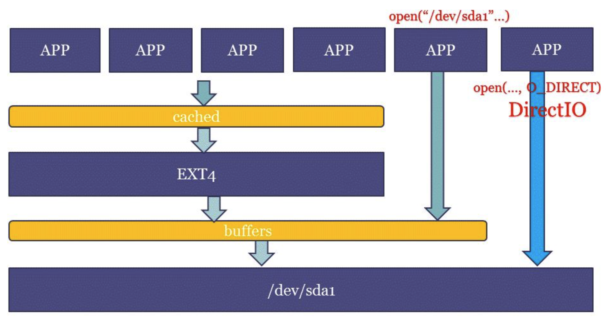
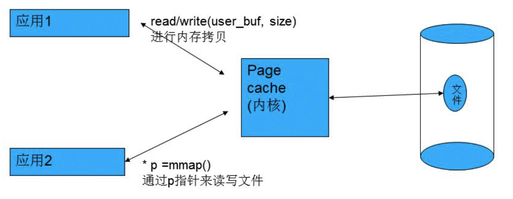
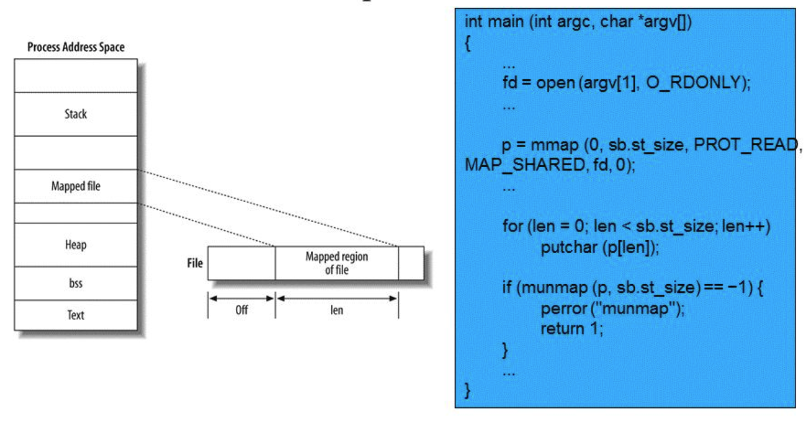
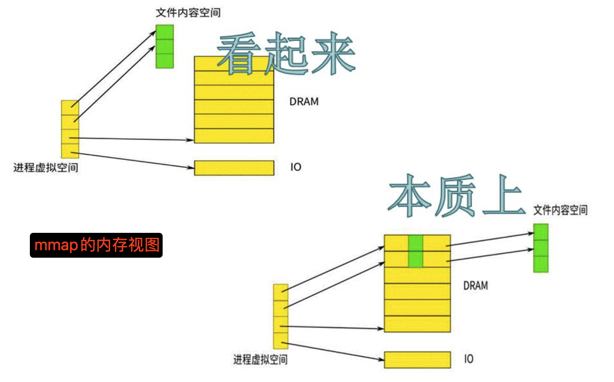
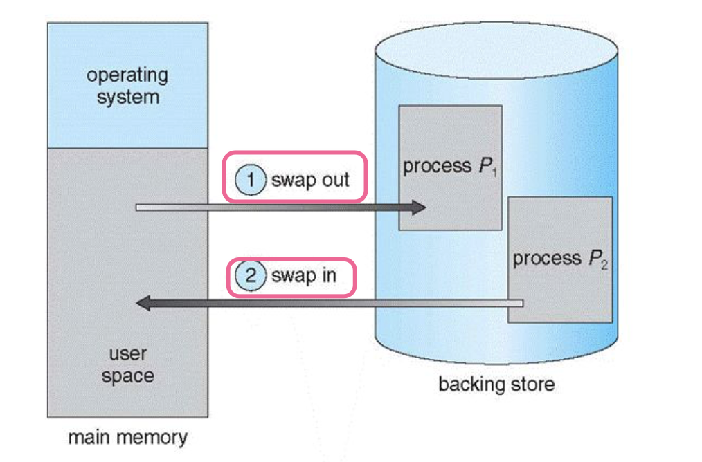
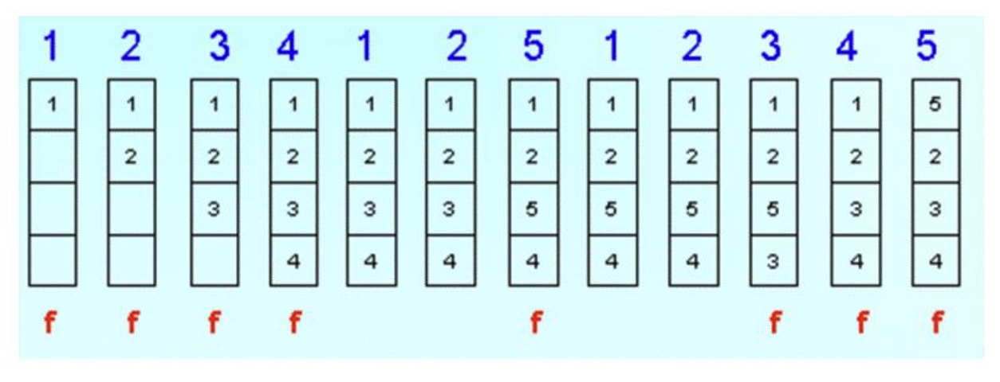

# 内存与IO的交换


## Page Cache

首先说一下文件系统，linux文件系统的三层结构想必大家多少都了解一些，每个进程中都有一个用户文件描述符表，表项指向一个全局的文件表中的某个表项，文件表表项有一个指向内存inode的指针，每个inode唯一标识一个文件。如果同时有多个进程打开同一文件，他们的用户文件描述符表项指向不同的文件表项，但是这些文件表项会指向同一个inode。

此时又会引出另外一个东东：page cache。**内核会为每个文件单独维护一个page cache**，用户进程对于文件的大多数读写操作会直接作用到page cache上，内核会选择在适当的时候将page cache中的内容写到磁盘上（当然我们可以手工fsync控制回写），这样可以大大减少磁盘的访问次数，从而提高性能。Page cache是linux内核文件访问过程中很重要的数据结构，page cache中会保存用户进程访问过得该文件的内容，这些内容以页为单位保存在内存中，当用户需要访问文件中的某个偏移量上的数据时，内核会以偏移量为索引，找到相应的内存页，如果该页没有读入内存，则需要访问磁盘读取数据。为了提高页得查询速度同时节省page cache数据结构占用的内存，linux内核使用树来保存page cache中的页。


page cache的两种形式:
- 以文件系统中的文件为背景:cached
- 以裸分区/dev/sdax等为背景:buffers




page cache对程序速度的影响：
`echo 3 > /proc/sys/vm/drop_caches`命令强制系统立即清理指定的缓存，释放内存供其他应用程序使用。不过，执行该命令可能会导致磁盘 I/O 增加，因为之前缓存在内存中的数据可能需要重新从磁盘读取。
- 0：不执行任何清理操作（默认值）。
- 1：仅清理页缓存。
- 2：清理目录项和inode。
- 3：同时清理页缓存、目录项和inode。


```shell
hong@hong-VMware-Virtual-Platform:~/Desktop/memory/memory-courses/day4$ sudo sh -c 'echo 3 > /proc/sys/vm/drop_caches'
hong@hong-VMware-Virtual-Platform:~/Desktop/memory/memory-courses/day4$ time python3 hello.py 
Hello World! Love, Python

real	0m0.055s
user	0m0.045s
sys  	0m0.006s
```

## read/write vs. mmap

read/write系统调用访问文件，涉及到用户态到内核态的转换，二者读取硬盘文件中的对应数据，此过程中内核会采用**预读**的方式，比如需要访问100字节，内核实际会按照4KB(内存页大小)存储在page cache中，而后再将read指定的数据，从page cache中拷贝到用户缓冲区（可能是heap也有可能是stack或者是全局变量中）中。



mmap系统调用将硬盘文件映射到用户内存中，将page cache中的页直接映射到用户进程地址空间中，进程直接访问自身地址空间的虚拟地址来访问page cache中的页，这样只涉及page cache到用户缓冲区之间的拷贝。将文件一部分内容map到进程虚拟地址空间，如下图所示:



mmap只需要一次系统调用，后续操作不需要系统调用，访问的数据不需要在page cache和用户缓冲区之间拷贝，当频繁对一个文件进行读取操作时，mmap会比read高效一些。并且如果是用read/write将buffer写回page cache意味着整个文件都要与磁盘同步(即使这个文件只有个别page被修改了)，而mmap的同步粒度是page，可以根据page数据结构的dirty位来决定是否需要与disk同步。这是mmap比read高效的主要原因。对于那种频繁读写同一个文件的程序更是如此。



在上半部分视图中，mmap 使文件内容看起来像是直接映射到进程的虚拟内存空间。进程可以直接通过虚拟内存地址访问文件内容，就好像文件内容已经在内存中一样。实际上，文件内容可能还在磁盘上，内核会根据需要将数据从磁盘加载到物理内存。
而本质上，内核在后台处理文件内容在磁盘和物理内存之间的来回传输。mmap只是建立了文件和进程虚拟内存之间的映射关系，但实际的数据传输由内核根据需要进行管理。


问题1. **从 page cache 拷贝到用户空间涉及到用户态到内核态的切换对吗？而从 page cache 到 Disk 只涉及内核态？**

   - 从页面缓存（page cache）拷贝到用户空间的操作涉及用户态到内核态的切换。当用户态的程序调用 `read` 系统调用时，CPU 从用户态切换到内核态，内核负责将数据从页面缓存拷贝到用户缓冲区。完成拷贝后，CPU 再切换回用户态，继续执行用户程序。
   - 从页面缓存到磁盘（Disk）的操作主要在内核态完成。页面缓存中的脏页（dirty pages，即被修改过的页面）由内核的脏页写回机制（如 `pdflush` 守护进程或 `flush` 线程）处理，将数据写回磁盘。这个过程通常在内核态完成，不需要切换到用户态。

问题2. **mmap 虽然建立了用户虚拟地址空间和 page cache 的联系，但是 page cache 和 Disk 之间的拷贝和 read/write 一致吗，还是加载预读 4KB？还是有不同？有什么不同？**

   - `mmap` 建立了用户虚拟地址空间和页面缓存的联系，使得用户程序可以直接通过访问虚拟内存来读写文件内容。这个过程和 `read/write` 的页面缓存与磁盘之间的拷贝机制有一些相似之处，但也存在显著差异。
   - 预读（prefetching）是文件系统和内核为了提高性能而采用的一种技术，它会提前将可能需要访问的数据从磁盘读取到页面缓存中。对于 `mmap` 映射的文件，当第一次访问某个页面时，如果该页面不在页面缓存中，会触发一个页面错误（page fault），内核会从磁盘读取相应的页面到页面缓存。这个读取过程可能会读取比实际请求更多的数据（如 4KB 的页面），以提高后续访问的性能,但是一般仍是4KB。
   - `read/write` 通常按需读取数据，不会自动进行预读。每次 `read` 调用都会从页面缓存中读取指定数量的数据到用户缓冲区。如果数据不在页面缓存中，`read` 调用会阻塞，等待内核从磁盘读取数据。
   - `mmap` 的优势在于减少显式的数据拷贝和系统调用的开销，而 `read/write` 则更直接和简单，适用于顺序访问的场景。

问题3. **mmap 是第一次触发就要加载全部的文件内容到 page cache 吗？如果 mmap 第一次触发就要加载全部的文件内容到 page cache，如果 page cache 大小不够用怎么办？mmap 的第一次映射是不是比较慢？**

   - `mmap` 不会在第一次映射时就加载全部的文件内容到页面缓存。`mmap` 会建立用户虚拟地址空间和文件之间的映射关系，但实际的数据加载是在第一次访问对应的内存页面时才触发的。这种机制称为“按需分页”（demand paging）。
   - 当用户程序第一次访问某个页面时，如果该页面不在页面缓存中，会触发一个页面错误。内核会从磁盘读取相应的页面到页面缓存，并将其映射到用户虚拟地址空间。
   - 如果页面缓存的大小不足以容纳所有需要的页面，内核会使用页面替换算法（如最近最少使用，LRU）来释放一些页面以腾出空间。这个过程对 `mmap` 和 `read/write` 都是相同的。
   - `mmap` 的第一次映射操作本身并不慢，它只是建立虚拟地址空间和文件之间的映射关系。然而，当第一次访问某个页面时，页面错误处理会导致磁盘 I/O 操作，这个过程可能会比较慢，尤其是当需要从磁盘读取大量数据时。对于 `read/write`，第一次读取操作也会触发类似的磁盘 I/O，因此两者的性能差异主要取决于后续的访问模式和数据拷贝的开销。


```shell
hong@hong-VMware-Virtual-Platform:~/Desktop/memory/memory-courses/day4$  gcc mmap.c 
mmap.c: In function ‘main’:
mmap.c:33:9: warning: implicit declaration of function ‘close’; did you mean ‘pclose’? [-Wimplicit-function-declaration]
   33 |         close(fd);
      |         ^~~~~
      |         pclose

hong@hong-VMware-Virtual-Platform:~/Desktop/memory/memory-courses/day4$ ./a.out 
print("Hello World! Love, Python")

abcnt("Hello World! Love, Python")
hong@hong-VMware-Virtual-Platform:~/Desktop/memory/memory-courses/day4$ cat mmap.c 
#include <sys/mman.h>
#include <stdlib.h>
#include <fcntl.h>
#include <stdio.h>

int main(int argc, char **argv)
{
	char *m;
	int i;

	int fd = open("./hello.py", O_RDWR, S_IRUSR);
	if (fd == -1) {
		perror("hello.py failed\n");
		exit(-1);
	};

#define MAP_SIZE 50
	m = mmap(0, MAP_SIZE, PROT_READ | PROT_WRITE,
			MAP_SHARED, fd, 0);

	if (m == MAP_FAILED) {
		perror("mmap /dev/sda failed\n");
		exit(-1);
	}
	printf("%s\n", m);

	*m='a';
	*(m+1)='b';
	m[2]='c';
	printf("%s\n", m);

	munmap(m, MAP_SIZE);
	close(fd);
}

```


最后再说一下page cache的话题，从上面所说我们从磁盘文件中读取的内容都会存在page cache中，但当我们关闭这个文件时，page cache中内容会立马释放掉吗？答案是否，磁盘的读取速度比内存慢太多，如果能命中page cache可以显著提升性能，万一后续又有对这个文件的操作，系统就可以很快速的响应。当然，这些文件内容也不是一直存在page cache中的，一般只要系统有空闲物理内存，内核都会拿来当缓存使用，但当物理内存不够用，内存会清理出部分page cache应急，这也就是告诉我们程序对于物理内存的使用能省则省，交给内核使用，作用很大。

还有就是普通的write调用只是将数据写到page cache中，并将其标记为dirty就返回了，磁盘I/O通常不会立即执行，这样做的好处是减少磁盘的回写次数，提供吞吐率，不足就是机器一旦意外挂掉，page cache中的数据就会丢失。一般安全性比较高的程序会在每次write之后，调用fsync立即将page cache中的内容回写到磁盘中。


当然mmap也有一定的限制:
1. mmap的对齐方式是page为大小的，有存在内存内部碎片的可能(调用的时候length没有对齐)，所以mmap不适合小文件。
2. mmap后的内存大小不能改变。当一个文件被mmap后，如果其他程序要改变文件的大小，要特别留意[8]。
3. mmap不能处理所有类型的文件，例如pipes、tty、网络设备文件就不能处理。
4. mmap要求进程提供一块连续的虚拟内存空间，对于大文件(1G)的内存映射。有时候会失败。尽管空闲内存大于1G，但是很有可能找不到连续的1G的内存空间。
5. mmap对于那种批量写(write-only)的情景并没有优势。


## file-backed page和anonymous page

file-backed映射把进程的虚拟地址空间映射到files,这些页面的内容与磁盘上的文件相关联。这些页面是通过 mmap 系统调用将文件映射到进程的虚拟内存空间中。对这些页面的修改最终会写回到磁盘上的文件中。多个进程可以共享同一个文件的 file-backed pages。
- 比如代码段:程序的可执行文件的代码段通常通过 file-backed pages 映射到内存。
- 比如mmap一个字体文件:程序的初始化数据段也通过 file-backed pages 映射到内存。

Anonymous映射是进程的虚拟地址空间没有映射到任何file，不与任何文件关联的页面。这些页面的内容仅存在于内存中，没有对应的磁盘文件。这些页面是通过匿名映射（如 mmap 的 `MAP_ANONYMOUS` 标志）创建的。anonymous pages 通常为创建它们的进程所私有，不会与其他进程共享。对这些页面的修改不会写回到磁盘，除非内核需要将它们换出到交换空间（swap space）。
- stack
- heap
- CoW(Copy-on-Write) pages

## 匿名页和Swap

当物理内存不足时，内核的内存管理子系统会决定将哪些页面交换到磁盘。对于匿名页面，由于它们没有对应的文件，内核会将它们写入交换空间。这个过程涉及到将匿名页面从物理内存复制到交换空间，然后释放物理内存供其他用途。
Anonymous pages （没有任何文件背景）分配一个swapfile文件或者一个swap分区，来进行交换到磁盘的动作。对于匿名页面，交换到磁盘的动作意味着内核将这些页面的内容写入交换空间。当这些页面再次被访问时，内核会从交换空间读取它们，并将它们放回物理内存。这个过程对用户进程是透明的，但会引入额外的 I/O 开销，因为需要访问磁盘。文件支持的页面（file-backed pages）在交换时会写回对应的文件，而匿名页面由于没有文件关联，只能写入交换空间。




## Linux Page Replacement

用LRU算法来进行swap和page cache的页面替换。




## zRAM Swap

zRAM是一种内存压缩技术，它通过在物理内存中开辟一个压缩块（compressed block）来存储压缩后的数据。当系统需要交换数据时，zRAM会将数据压缩后存储在内存中的压缩块中，而不是直接写入磁盘。这样可以显著减少交换数据所需的存储空间，提高交换效率。

zRAM因为需要开辟一小块内存作为compressed block使用，这样的swap访问速度可以提高很多，但压缩需要占用CPU时间。


## swappiness
- swapiness反映是否积极地使用swap空间
    - swapiness = 0 仅在内存不足的情况下，使用swap空间
    - swapiness = 60 默认值
    - swapiness = 100 内核将积极的使用swap空间
```shell
hong@hong-VMware-Virtual-Platform:~/Desktop/memory/memory-courses/day4$ cat /proc/sys/vm/swappiness 
60
```

## 参考文献


mmap与read/write的区别：
https://www.cnblogs.com/beifei/archive/2011/06/12/2078840.html

When should I use mmap for file access?
https://stackoverflow.com/questions/258091/when-should-i-use-mmap-for-file-access

mmap与read write对比：
https://nineright.github.io/2014/03/12/mmap-io.html