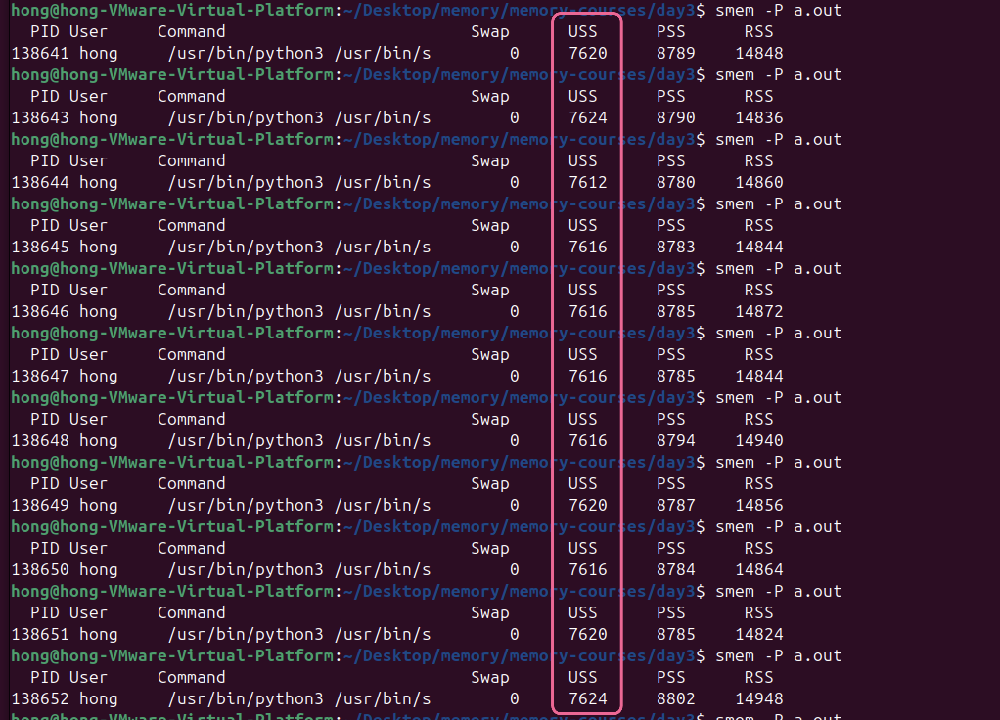

# 进程的内存消耗与泄漏
> 学习编程，千万不要急于求成，一定要多读一些经典书籍，多看源码，多下苦功夫去死磕代码，这样技术才能长进。
## 进程的虚拟地址空间VMA
进程的每一段虚拟地址空间就是一个VMA。


pmap, /proc/\<pid>/maps, /proc/\<pid>/smaps

pmap是一个Linux命令行工具，用于报告进程的内存映射情况。它显示了进程的虚拟内存地址空间的布局，包括每个内存段的大小、权限、以及实际的内存使用情况。pmap对于诊断内存问题、了解进程内存布局以及优化程序性能都是非常有用的。


pmap 命令的输出包括以下几个部分：

- 地址范围：内存段的起始和结束地址。
- 大小：该内存段的大小。
- RSS：实际使用的物理内存量。
- PSS：比例共享内存量 (Proportional Set Size)，用于衡量共享内存的分配。
- 可用性：内存段的可用性和权限（如读、写、执行）。
- 路径：内存段的文件映射路径，通常为程序的共享库或内核模块路径。


maps文件可以查看某个进程的代码段、栈区、堆区、动态库、内核区对应的虚拟地址
```shell
$ cat /proc/self/maps 
00400000-0040b000 r-xp 00000000 fd:00 48              /mnt/cf/orig/root/bin/cat
0060a000-0060b000 r--p 0000a000 fd:00 48              /mnt/cf/orig/root/bin/cat
0060b000-0060c000 rw-p 0000b000 fd:00 48              /mnt/cf/orig/root/bin/cat # 代码段
0060c000-0062d000 rw-p 00000000 00:00 0               [heap] # 堆区
7f1fff43b000-7f1fff5d4000 r-xp 00000000 fd:00 861   /mnt/cf/orig/root/lib64/libc-2.15.so
7f1fff5d4000-7f1fff7d3000 ---p 00199000 fd:00 861  /mnt/cf/orig/root/lib64/libc-2.15.so
7f1fff7d3000-7f1fff7d7000 r--p 00198000 fd:00 861   /mnt/cf/orig/root/lib64/libc-2.15.so
7f1fff7d7000-7f1fff7d9000 rw-p 0019c000 fd:00 861   /mnt/cf/orig/root/lib64/libc-2.15.so
7f1fff7d9000-7f1fff7dd000 rw-p 00000000 00:00 0 
7f1fff7dd000-7f1fff7fe000 r-xp 00000000 fd:00 2554  /mnt/cf/orig/root/lib64/ld-2.15.so
7f1fff9f9000-7f1fff9fd000 rw-p 00000000 00:00 0 
7f1fff9fd000-7f1fff9fe000 r--p 00020000 fd:00 2554  /mnt/cf/orig/root/lib64/ld-2.15.so
7f1fff9fe000-7f1fff9ff000 rw-p 00021000 fd:00 2554  /mnt/cf/orig/root/lib64/ld-2.15.so
7f1fff9ff000-7f1fffa00000 rw-p 00000000 00:00 0 
7fff443de000-7fff443ff000 rw-p 00000000 00:00 0     [stack] # 用户态栈区
7fff443ff000-7fff44400000 r-xp 00000000 00:00 0     [vdso]
ffffffffff600000-ffffffffff601000 r-xp 00000000 00:00 0  [vsyscall] # 内核区
```

有时候可以通过不断查看某个进程的maps文件，通过查看其虚拟内存（堆区）是否不停增长来简单判断进程是否发生了内存溢出。<font color=#dfa>**maps文件只能显示简单的分区，smap文件可以显示每个分区的更详细的内存占用数据。**</font>下图是smaps文件内存示例, 实际显示内容会将每一个区都显示出来，下面只拷贝了栈区:

```shell
$ cat /proc/self/smaps 
7fff76e18000-7fff76e39000 rw-p 00000000 00:00 0                          [stack]
Size:                132 kB # 虚拟内存大小
KernelPageSize:        4 kB # 实际使用物理内存大小
MMUPageSize:           4 kB
Rss:                  16 kB
Pss:                  16 kB
Pss_Dirty:            16 kB
Shared_Clean:          0 kB # 页面被改，则是dirty,否则是clean,页面引用计数>1,是shared,否则是private
Shared_Dirty:          0 kB
Private_Clean:         0 kB
Private_Dirty:        16 kB
Referenced:           16 kB
Anonymous:            16 kB
KSM:                   0 kB
LazyFree:              0 kB
AnonHugePages:         0 kB
ShmemPmdMapped:        0 kB
FilePmdMapped:         0 kB
Shared_Hugetlb:        0 kB
Private_Hugetlb:       0 kB
Swap:                  0 kB # 处于交换区的页面大小
SwapPss:               0 kB # 操作系统一个页面大小
Locked:                0 kB # 体系结构MMU一个页面大小 
THPeligible:           0
VmFlags: rd wr mr mw me gd ac 
```


## VMA与程序的各个段及库
VMA的类型:
- 匿名VMA（Anonymous VMA）：如堆和栈，这些区域没有映射到具体的文件，通常用于进程的动态内存分配。
- 文件映射VMA（File-backed VMA）：如文本段和数据段，这些区域映射到具体的文件（如可执行文件或共享库）。


## VSS和RSS的区别


下图展示了虚拟内存空间大小（VSS，即 Virtual Set Size）与常驻内存集大小（RSS，即 Resident Set Size）之间的区别，并通过一个程序堆（heap）扩展的示例来说明两者的不同。


初始状态下程序的堆大小为8KB，RSS（实际使用的物理内存）为8KB。调用`brk()`系统调用以扩展其堆的大小。堆的虚拟内存区域扩展到16KB，但新增加的8KB页面尚未映射到物理内存。此时，VSS增加到16KB，但RSS仍然是8KB，因为新增的页面尚未实际使用。程序尝试访问新扩展的内存区域，这会导致Page Fault。页面错误是因为访问的虚拟地址尚未映射到物理内存。内核响应页面错误，为进程分配新的物理页面帧，并创建相应的页表项（PTE，即 Page Table Entry）。此时，RSS增加到12KB，因为实际使用的物理内存增加了。内核恢复程序的执行，程序继续运行，仿佛什么都没有发生。

综上：
- VSS（Virtual Set Size）：表示进程的虚拟内存空间的总大小，包括所有映射的内存区域，如代码段、数据段、堆、栈以及共享库等。它反映了进程的虚拟内存使用情况，包括已分配但尚未使用的内存。
- RSS（Resident Set Size）：表示进程实际驻留在物理内存中的大小，即进程当前使用的物理内存大小。它反映了进程的实际内存使用情况。

在程序扩展堆的过程中，VSS会立即增加，而RSS只有在实际访问新分配的内存时才会增加。

---

## Page Fault

Page Fault是一种常见的内存访问异常，它可以在程序访问未分配或权限不足的内存时发生。根据访问的地址和权限，Page Fault可能会导致段错误（Segv）或只是触发正常的内存分配过程。理解这些不同的Page Fault类型有助于调试和优化程序的内存使用。

在程序运行过程中发生Page Fault有几种可能性:
- **发生Page Fault后，有可能Segv**：
  - **非法区域（2）**：访问未映射的内存区域。
  - **VMA 权限不对（3）**：访问已映射的内存区域但权限不足。
- **有可能不Segv，而是申请内存（1和4）**：
  - **普通Page Fault（Minor Fault，1）**：堆区域的第一次写操作。
  - **普通Page Fault（Major Fault，4）**：代码段的第一次读或执行操作。

它通过不同的内存访问场景来解释Page Fault的原因。以下是图中内容的详细解释：


1. 堆区域（Heap VMA）的R+W权限
    - **初始状态**：堆区域的虚拟内存区域（VMA）具有读（R）和写（W）权限。
    - **第一次写操作**：当程序第一次写入堆区域时，会触发 Page Fault。这是因为堆区域虽然在虚拟内存中被分配了空间，但实际的物理内存页面尚未分配。
    - **结果**：内核会分配实际的物理内存页面，并将权限设置为 R+W。这种类型的 Page Fault 属于普通 Page Fault（Minor Fault），不会导致段错误（Segv, Segmentation Fault）。

2. 访问非法区域（Segv）
    - **空区域**：程序尝试访问一个未映射的内存区域（空区域）。这种访问会导致 Segmentation Fault（Segv），因为访问的地址不在进程的合法地址空间内。

3. VMA权限不对（Segv）
    - **代码段 VMA**：代码段的 VMA 具有读（R）和执行（X）权限，但没有写（W）权限。
    - **写操作**：如果程序尝试写入代码段区域，会触发 Page Fault。由于代码段没有写权限，这会导致 Segmentation Fault（Segv）。

4. 正常访问代码段
    - **代码段 VMA**：代码段的 VMA 具有读（R）和执行（X）权限。
    - **读或执行操作**：当程序在代码段区域执行指令或读取数据时，会触发 Page Fault。这是因为代码段的页面可能尚未加载到物理内存中。
    - **结果**：内核会分配实际的物理内存页面，并将权限设置为 R+X。这种类型的 Page Fault 属于普通 Page Fault（Major Fault），不会导致段错误（Segv）。


---


这张图展示了内存是如何被多个进程共享和私有使用的。它通过几个进程（如Bash进程1044、1045和Cat进程1054）来说明内存的共享和私有映射。

1. 进程的虚拟内存布局
    - **Bash进程1044和1045**：每个进程都有自己的虚拟内存布局，包括文本段（text segment）、libc库的文本段、数据段和堆（Heap）。
    - **Cat进程1054**：同样有自己的虚拟内存布局。

2. 页表的作用
    - **页表（Page Table）**：每个进程都有自己的页表，用于将虚拟内存地址映射到物理内存地址。图中显示了进程1044、1045和1054的页表。

3. 内存共享
    - **共享内存区域**：图中显示了libc库的文本段被多个进程共享。例如，Bash进程1044和1045都共享同一个libc库的物理内存页面。
    - **私有内存区域**：每个进程的堆和数据段通常是私有的，不会被其他进程共享。

4. 物理内存映射
    - **物理内存**：物理内存被多个进程共享。图中显示了不同的进程如何共享和私有使用物理内存。
    - **被多个箭头指向的区域**：表示这些物理内存页面被多个进程共享。例如，libc的文本段被多个Bash进程共享。


通过这张图，可以理解操作系统如何有效地管理内存，允许多个进程共享某些内存区域（如共享库），同时保持其他区域的私有性（如堆和栈），从而优化内存使用并确保进程隔离。

---


下图展示了VSS（虚拟内存集大小）、RSS（常驻内存集大小）、PSS（比例内存集大小）和USS（唯一内存集大小）的概念，并通过一个具体的例子来说明它们的计算方法。

- **VSS**：包括所有映射的内存区域，无论是否实际使用。
- **RSS**：包括进程实际使用的物理内存，包括共享部分。
- **PSS**：分摊共享内存后的内存使用量。
- **USS**：进程独有的物理内存使用量。


以下是图中内容的详细解释：

1. **Bash 进程 1044 和 1045**：
   - 每个 Bash 进程都有自己的虚拟内存布局，包括文本段（text segment）、libc 库的文本段、数据段和堆（Heap）。
   - 每个进程都有自己的页表，用于将虚拟内存地址映射到物理内存地址。

2. **共享内存区域**：
   - 图中显示了 libc 库的文本段和 Bash 的文本段被多个进程共享。例如，Bash 进程 1044 和 1045 都共享同一个 libc 库的物理内存页面。

3. **物理内存映射**：
   - 物理内存被多个进程共享。图中显示了不同的进程如何共享和私有使用物理内存。
   - 被多个箭头指向的区域表示这些物理内存页面被多个进程共享。

VSS、RSS、PSS和USS的计算：

1. **VSS（Virtual Set Size）**：
   - VSS 是进程的虚拟内存总大小，包括所有映射的内存区域，无论这些区域是否实际分配了物理内存。
   - 在图中，VSS = 1（Bash 文本段） + 2（libc 文本段） + 3（堆）。

2. **RSS（Resident Set Size）**：
   - RSS 是进程实际驻留在物理内存中的大小，包括共享内存区域。
   - 在图中，RSS = 4（被 3 个箭头指向的 libc 文本段） + 5（被 2 个箭头指向的 Bash 文本段） + 6（私有的堆区域）。

3. **PSS（Proportional Set Size）**：
   - PSS 是进程的“比例”内存使用量，它考虑了共享内存区域在多个进程之间的分摊。
   - 在图中，PSS = 4/3（共享的 libc 文本段被 3 个进程共享） + 5/2（共享的 Bash 文本段被 2 个进程共享） + 6（私有的堆区域）。

4. **USS（Unique Set Size）**：
   - USS 是进程完全私有的物理内存大小，不包括共享内存区域。
   - 在图中，USS = 6（私有的堆区域）。


通过理解这些内存使用指标，可以更全面地分析和优化系统的内存使用情况。

---


### smem
smem 是Linux系统上的一款可以生成多种内存耗用报告的命令行工具。与现有工具不一样的是 smem 可以报告 PSS【Proportional Set Size（按比例占用大小）】，这是一种更有意义的指标。可以衡量虚拟内存系统的库和应用程序所占用的内存数量。
 
由于大部分的物理内存通常在多个应用程序之间共享，名为驻留集大小（RSS）的这个标准的内存耗用衡量指标会大大高估内存耗用情况。PSS这个参数而是衡量了每个应用程序在每个共享内存区中的「公平分配」，给出了一个切合实际的衡量指标。


```shell
ong@hong-VMware-Virtual-Platform:~$ smem 
  PID User     Command                         Swap      USS      PSS      RSS 
 2374 hong     /usr/libexec/gnome-session-        0      460      511     5700 
 2311 hong     /usr/libexec/gdm-wayland-se        0      504      557     6188 
 2581 hong     /usr/libexec/gsd-screensave        0      564      613     6224 
 2283 hong     /usr/libexec/xdg-permission        0      576      625     6224 
 2566 hong     /usr/libexec/gsd-a11y-setti        0      628      689     6704 
 2835 hong     /usr/libexec/ibus-memconf          0      648      740     7112 
 3033 hong     /usr/libexec/gvfsd-metadata        0      676      754     6724 
 2909 hong     /usr/libexec/gvfs-mtp-volum        0      700      758     6740 
 2372 hong     /usr/libexec/gcr-ssh-agent         0      700      777     6628 
 2455 hong     /usr/bin/dbus-daemon --conf        0      628      802     5292 
 2580 hong     /usr/libexec/gsd-rfkill            0      760      818     6752 
 2892 hong     /usr/libexec/gvfs-goa-volum        0      704      821     6580 
 2841 hong     /usr/libexec/ibus-portal           0      744      829     7288 
 2943 hong     /usr/libexec/dconf-service         0      804      852     6184 
 2501 hong     /usr/libexec/at-spi2-regist        0      804      869     7496 
 2440 hong     /usr/libexec/at-spi-bus-lau        0      804      878     7824 
 2404 hong     /usr/libexec/gvfsd-fuse /ru        0      796      912     7276 
 2881 hong     /usr/libexec/gvfs-gphoto2-v        0      812      912     6968 
 2572 hong     /usr/libexec/gsd-housekeepi        0      876      986     7944 
 2227 hong     /usr/bin/pipewire -c filter        0      884     1037     5588 
 2390 hong     /usr/libexec/gvfsd                 0      936     1063     7936 
 2279 hong     /usr/libexec/xdg-document-p        0      956     1074     7660 
 2583 hong     /usr/libexec/gsd-smartcard         0     1040     1160     7696 
 2944 hong     /snap/snapd-desktop-integra        0      380     1184     1992 
 2937 hong     /usr/libexec/ibus-engine-si        0     1188     1297     7824 
 2584 hong     /usr/libexec/gsd-sound             0     1204     1302     9020 
 2899 hong     /usr/libexec/gvfs-afc-volum        0     1156     1366     8204 
 2838 hong     /usr/libexec/goa-identity-s        0     1364     1531     9052 
 2570 hong     /usr/libexec/gsd-datetime          0     1360     1565    11840 
 ...
```

smem还支持图像化输出系统内存使用情况:
```shell
smem --bar pid -c "pss uss rss"
```
如果想要查看进程的名称，可以将pid替换为name即可。


--- 

## 进程内存泄漏的界定

 C/C++相比其他高级编程语言，具有指针的概念，指针即是内存地址。C/C++可以通过指针来直接访问内存空间，效率上的提升是不言而喻的，是其他高级编程语言不可比拟的；比如访问内存一段数据，通过指针可以直接从内存空间读取数据，避免了中间过程函数压栈、数据拷贝甚至消息传输等待。指针是C/C++的优势，但也是一个隐患，指针是一把双刃剑，由于内存交给了程序员管理，这是存在隐患的；人嘛总会有疏忽的时候，如果申请了内存，一个疏忽忘记释放了，未释放的内存将不能被系统再申请使用，即是一直占用又不能使用，俗称内存泄露；久而久之，系统长时间运行后将申请不到内存，系统上所有任务执行失败，只能重启系统。内存交给了程序员管理，除了内存泄露的情况外，还可能引起其他的问题，总结起来包括如下几点。

- 访问没有申请内存的空指针（空指针）
- 访问已释放内存的指针（野指针）
- 内存越界访问
- 内存泄露，申请了内存没有释放
- 重复释放内存
  

虽然动态内存（这里默认指的是堆上的动态内存，由程序员管理；栈上的动态内存由系统管理）存在一定的隐患，可靠性取决于程序员的认真和细心，但因为其具有优良的灵活性和高效率以及内存复用，在实际应用中，对于一些动态数据交互场合，动态内存往往是首选。因此，一方面除了程序员本身的谨慎使用，另一方面也涌现出各类“内存异常“的检测工具，毕竟当代码量数以万计时，依靠人力去检查是不切实际的。


观察程序是否有内存泄漏，一般通过**连续多点采样法**，随着时间越久，进程耗费的内存越多，如下图所示:


观察一个有内存泄漏的进程

```c
void main(void)
{
	unsigned int *p1, *p2;
	while(1)
	{
		p1=malloc(4096*3);
		p1[0] = 0;
		p1[1024] = 1;
		p1[1024*2] = 2;

		p2=malloc(1024);
		p2[0] = 1;
		free(p2);
		sleep(1);
	}
}
```


 

并没有出现预期的USS随着时间增长，说明系统中应该存在自动回收的机制。但是目前并没有自动解决内存泄漏的方法。说明实验方法又问题，重新做就正常了:


## 内存泄漏的检查valgrind
```shell
valgrind --tool=memcheck --leak-check=yes ./a.out
```


## 内存泄漏的检查 addresssanitizer

Sanitizer可以在检测到内存泄露第一时间立刻终止进程，并且它可以深入检测（随应用进程一起编译）。

ASAN（AddressSanitizer的缩写）是一款面向C/C++语言的内存错误问题检查工具，可以检测如下内存问题： 
- 使用已释放内存（野指针）
- 堆内存越界（读写）
- 栈内存越界（读写）
- 全局变量越界（读写）
- 函数返回局部变量
- 内存泄漏

ASAN工具比 Valgrind 更高效，主要由两部分组成：
- 编译器插桩模块（编译器instrumentation 模块）
- 运行时库（提供malloc()/free()替代项的运行时库）

gcc 4.8 开始，AddressSanitizer 成为 gcc 的一部分，但不支持符号信息，无法显示出问题的函数和行数。从 4.9 开始，gcc 支持 AddressSanitizer 的所有功能。

```shell
gcc -g -O0 -fsanitize=address ./leak-example.c
```


AddressSanitizer 的输出通常会在程序结束时显示。如果程序一直在运行，则可能不会看到最终的泄漏报告。一开始leak-example.c是while(1)循环♻️所以没有输出信息。


---

## 参考文献
pmap: 命令查看 Linux 中进程的内存使用情况：
https://www.cnblogs.com/zhanchenjin/p/18404259

linux 内存查看方法：meminfo\maps\smaps\status 文件解析
https://www.cnblogs.com/jiayy/p/3458076.html

PerfGeeks团队:
https://github.com/AlexFeng123/PerfGeeks


smem memory reporting tool：
https://www.selenic.com/smem/

smem code:
https://github.com/kwkroeger/smem/blob/master/smem

Linux内存管理神器：smem工具
https://blog.csdn.net/yychuyu/article/details/129172090

如何使用Valgrind检测内存泄漏：
https://blog.csdn.net/qq_20553613/article/details/106503929

内核内存泄漏分析工具及使用方法:
https://blog.csdn.net/ALoserCopyright/article/details/136219247


https://gitcode.com/gh_mirrors/san/sanitizers?utm_source=csdn_github_accelerator&isLogin=1


内存检测工具sanitizer[内存泄漏、内存越界] VS valgrind:
https://blog.csdn.net/bandaoyu/article/details/106920878


