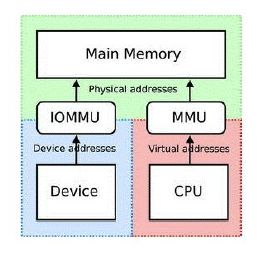

# 其他工程问题及调优


## DMA与cache一致性

DMA传输外设数据到memory，cache中可能是老的数据。

CPU写数据到memory，cache中是新数据，MEM是老数据。


Coherent DMA buffers
```c
// CMA和此API自动融合，调用dma_alloc_coherent将从CMA获得内存
void * dma_alloc_coherent(struct device *dev, size_t size, dma_addr_t *dma_handle, gfp_t flag);

void dma_free_coherent(struct device * dev, size_t size, void* cpu_attr, dma_addr_t dma_handle);
```

DMA Streaming Mapping

```c
int dma_map_sg(...);
void dma_unmap_sg(...);
dma_addr_t dma_map_single(...);
void dma_unmap_single(...);
```

## iommu(smmu)

把不连续的内存用来做DMA，以及限制DMA的访问范围(protection)
IOMMU被融合到DMA APIs




这张图主要讲了IOMMU（输入/输出内存管理单元，也称为SMMU，系统级内存管理单元）的作用和它如何融入DMA（直接内存访问）API中。以下是对图中内容的详细解释：

### IOMMU(smmu)

- **作用**：
  - IOMMU允许使用不连续的内存来进行DMA操作，同时可以限制DMA的访问范围，提供保护机制。
  - 例如，它可以防止设备访问不应访问的内存区域，从而提高系统的安全性。

- **融入DMA APIs**：
  - IOMMU被集成到DMA的API中，使得设备驱动程序可以更方便地使用IOMMU的功能。

### 图中的内容

- **左侧文字**：
  - 引用了Russell King的观点，说明ARM架构与其他支持IOMMU的架构没有什么不同，不需要发明全新的框架来处理IOMMU，现有的钩子（hooks）至少在初始阶段是适用的。

- **右侧图示**：
  - 展示了IOMMU和MMU（内存管理单元）在系统中的位置。
  - IOMMU负责处理设备的物理地址，而MMU负责处理CPU的虚拟地址。
  - IOMMU使得设备可以使用虚拟地址进行DMA操作，而这些虚拟地址最终会被转换为物理地址。

### DMA内存分配流程

- **dma_alloc_coherent**：
  - 用于分配一致的DMA内存，这种内存对于设备和CPU都是可读写的，并且数据在两者之间是一致的。

- **分配方式**：
  - **alloc_pages**：直接分配物理页面。
  - **cma**：使用连续内存分配器（CMA）来分配连续的物理内存。
  - **iommu(smmu)**：通过IOMMU来管理内存，允许使用不连续的物理内存进行DMA操作。

### 总结

这张图主要展示了IOMMU在DMA操作中的作用，以及它是如何被集成到DMA API中的。通过IOMMU，可以使用不连续的内存进行DMA操作，同时提供内存访问的保护机制。这对于提高系统的安全性和灵活性非常重要。

## cgroups
在Linux读写文件时，它用于缓存文件的逻辑内容，从而加快对磁盘上映像和数据的访问。
cgroups（Control Groups）本身主要用于限制和隔离进程组使用的资源，如 CPU、内存、磁盘 I/O 等，而不是直接用于缓存文件内容以加速磁盘访问。不过，cgroups 可以间接影响文件系统缓存的行为，因为文件系统缓存是内存的一部分，而 cgroups 可以限制内存使用。例如，通过限制内存使用，cgroups 可以影响内核为文件系统缓存分配的内存量。这种限制可以帮助优化资源分配，确保关键进程获得足够的内存资源。

## 文件Dirty数据的写回

这些参数用于控制 Linux 内核中脏页（dirty pages）的管理。脏页是指已经被修改但尚未写回磁盘的内存页面。内核会根据这些参数决定何时将脏页写回磁盘，以平衡内存使用和磁盘 I/O 性能。以下是每个参数的详细解释：

### 1. `dirty_ratio`
- **作用**：这个参数设置了一个阈值，表示当系统中脏页的数量达到总内存的多少百分比时，生成脏数据的进程会开始自己写回脏数据到磁盘。
- **取值范围**：通常是一个百分比值（例如，20 表示 20%）。
- **示例**：如果 `dirty_ratio` 设置为 20，并且系统总内存为 1000 MB，那么当脏页达到 200 MB 时，生成脏数据的进程会开始写回脏数据。

### 2. `dirty_expire_centisecs`
- **作用**：这个参数定义了脏数据在内存中可以停留的最长时间。超过这个时间的脏数据将被视为“过期”，并由内核的 flusher 线程写回到磁盘。
- **单位**：以 100 分之一秒为单位（centisecs）。
- **示例**：如果设置为 3000，表示 3000 个 100 分之一秒（即 30 秒）。

### 3. `dirty_writeback_centisecs`
- **作用**：内核的 flusher 线程会定期唤醒，并将“过期”的脏数据写回磁盘。这个参数设置了 flusher 线程定期唤醒的时间间隔。
- **单位**：同样以 100 分之一秒为单位。
- **示例**：如果设置为 500，表示 flusher 线程每 500 个 100 分之一秒（即 5 秒）唤醒一次。

### 4. `dirty_background_ratio`
- **作用**：这个参数设置了一个阈值，表示当系统中脏页的数量达到总内存的多少百分比时，后台的 kernel flusher 线程会开始写回脏数据。
- **取值范围**：通常是一个百分比值。
- **示例**：如果设置为 10，并且系统总内存为 1000 MB，那么当脏页达到 100 MB 时，后台的 flusher 线程会开始写回脏数据。

### 总结
这些参数共同控制了脏页的写回机制，确保系统在内存使用和磁盘 I/O 之间取得平衡。通过调整这些参数，可以优化系统的性能，避免磁盘 I/O 成为瓶颈。例如，在写入密集型的应用场景中，可以适当增加 `dirty_ratio` 和 `dirty_background_ratio` 的值，以减少磁盘写入的频率，提高性能。

## vfs_cache_pressure

该文件表示内核回收用于directory和inode cache内存的倾向
`vfs_cache_pressure` 是一个内核参数，它控制内核回收用于目录项（dentries）和inode cache的内存的倾向。简单来说：

- **低值**：内核较少地回收目录项和inode cache内存，更倾向于保留这些缓存以提高文件访问速度。
- **高值**：内核更积极地回收目录项和inode cache内存，以释放更多内存供其他用途（如页面缓存或用户应用）使用。

### 为什么调整这个参数？
- 如果系统内存紧张，且页面缓存或交换分区使用率较高，增加 `vfs_cache_pressure` 可以释放更多内存给页面缓存或用户应用，减少交换操作，提升整体性能。
- 如果文件系统操作频繁，适度降低该值可能减少目录项和inode的回收，提高文件访问速度。

调整内核参数需要谨慎，建议在充分测试和评估后进行。

## 水位设置:min_free_kbytes与lowmem_reserve_ratio

min_free_kbytes

lowmem_reserve_ratio


这张图解释了 Linux 内核内存管理中的两个重要参数：`min_free_kbytes` 和 `lowmem_reserve_ratio`。这些参数用于管理内存水位，以确保系统在不同的内存压力下能够有效地分配和回收内存。

### 1. `min_free_kbytes`

- **作用**：该参数用于强制 Linux 虚拟内存管理器保持一定数量的空闲内存在内存中。内核使用这个值为每个低内存区域（lowmem zone）计算一个水印（watermark）值。
- **计算方式**：每个低内存区域会根据其大小按比例分配一定数量的预留空闲页面。
- **PF_MEMALLOC**：这是一种紧急内存分配标志，可以忽略内存管理的水印进行分配，通常用于关键的内核操作。
- **公式**：
  - `min_free_kbytes = 4 * sqrt(lowmem_kbytes)`：这意味着 `min_free_kbytes` 随着内存的增加而增加，但不是线性增长。
  - `watermark[min] = per_zone_min_free_pages`：每个区域的最低水印值。
  - `watermark[high] - watermark[low] = watermark[low] - watermark[min] = per_zone_min_free_pages * 1/4`：定义了高、低和最小水印值之间的间隔。

### 2. `lowmem_reserve_ratio`

- **作用**：该参数决定了内核在保护低内存区域时的激进程度。低内存区域通常用于满足内核和用户进程的内存需求。
- **工作原理**：内核会根据这个比例来决定有多少内存应该预留给低内存区域，即使在内存压力较大的情况下。

### 总结

这些参数帮助内核有效地管理内存分配和回收，确保系统在不同的内存使用场景下都能保持稳定运行。通过调整这些参数，可以优化系统在内存不足时的行为，减少内存压力对系统性能的影响。


## getdelays

Documentation/accounting/getdelays.c工具，测量调度,I/O,Swap,Reclaim的延迟


## vmstat

vmstat可以展现给定时间间隔的服务器的状态值，包括Linux的CPU使用率，内存使用，虚拟内存交换情况，IO读写情况

