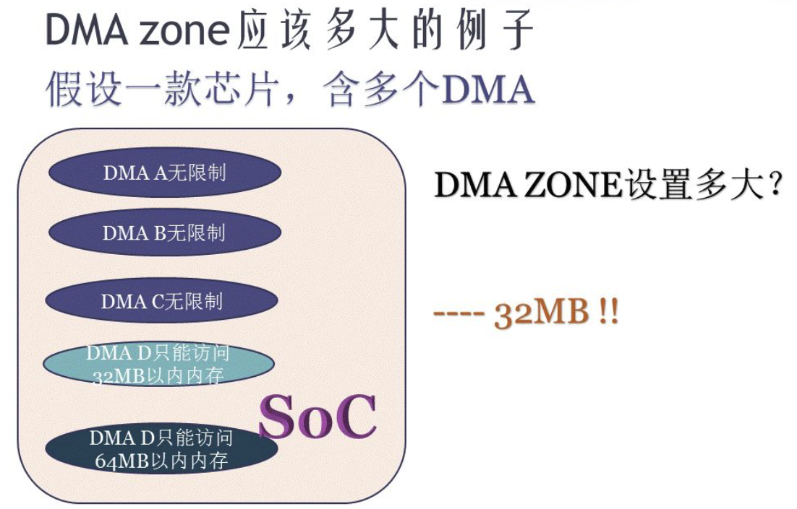
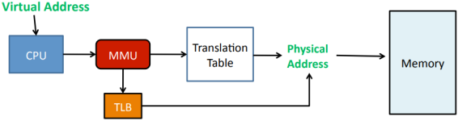

# 系统物理内存初始化

> 千万不要被教科书和各种网上的资料蒙蔽了双眼，你一定要真正自己探索和搞清楚事情的本源。

- CPU寻址内存，虚拟地址，物理地址（分页机制，虚实地址转换）
- MMU以及RWX权限kernel和user模式权限
- 内存的zone:DMA, Normal和Highmem
- Linux内存管理Buddy算法
- 连续内存分配器（CMA）

## 分页机制

Linux内核应该有4级页表，进程访问虚拟地v=(p,d),MMU再以p为索引检索页表，找到对应的page frame，加上偏移d，得到最终的无力地址。页表中会声明RWX权限，也可以声明kernel/user+kernel权限。

页表中的每个条目（Page Table Entry，PTE）通常包含以下权限标志：
- R（Read）：表示该页面是否可以被读取。
- W（Write）：表示该页面是否可以被写入。
- X（Execute）：表示该页面是否可以被执行。

这些权限标志用于控制进程对页面的访问方式。例如：
- 代码段：通常设置为只读（R）和可执行（X），但不允许写入（W）。
- 数据段：通常设置为可读（R）和可写（W），但不允许执行（X）。
- 堆和栈：通常设置为可读（R）、可写（W），但不允许执行（X），除非在某些情况下需要执行代码（如 JIT 编译）。

除了读写执行权限外，页表条目还可以包含一个标志，用于区分页面是属于内核空间还是用户空间：
- U（User）：表示该页面可以被用户模式下的进程访问。
- K（Kernel）：表示该页面只能被内核模式下的进程访问。


<font color=#dfa>**⚠️⚠️⚠️找不到物理地址或者权限不对都会发生Page Fault！**</font>

找不到物理地址的常见情况如下：
1. 页面未分配：进程尝试访问一个尚未分配的页面。例如，进程访问了一个超出其合法地址空间的地址。
2. 页面置换：进程访问的页面已经被换出（swap out）到磁盘，而当前不在物理内存中。操作系统需要从磁盘中加载该页面到物理内存中。
3. 映射未建立：进程尝试访问一个未被映射的地址。例如，进程访问了一个非法的地址，如空指针解引用（NULL pointer dereference）。

权限问题的常见情况如下：
1. 读写执行权限不足：进程尝试对页面进行非法操作。例如，进程尝试写入一个只读页面，或者执行一个不可执行的页面。
2. 用户/内核权限冲突：进程尝试访问一个属于内核空间的页面，而当前进程处于用户模式。例如，用户程序尝试访问内核代码或数据。

以下是一个背离RWX权限导致错误的例子


没有注释掉g=1的时候，会出现编译错误，将g=1注释掉之后，可以编译通过。编译器只检查代码的语法和语义，而不会检查运行时的行为。

但是后者运行时会出现Segment Fault:


在链接阶段，链接器会将g的定义和引用链接在一起。由于g被声明为const，链接器会将g放置在只读段域（如.rodata段）中。当`add_g`函数尝试修改g时，它实际上尝试写入一个只读内存区域，这会触发一个Segment Fault。


**问题:Page Fault和Segment Fault的区别？**

Page Fault是一种硬件异常，通常发生在页面不在物理内存中或映射未建立时。操作系统会尝试加载页面并更新页表。page fault 又分为几种，major page fault、 minor page fault、 invalid(segment fault)。
- major page fault也称为hard page fault, 指需要访问的内存不在虚拟地址空间，也不在物理内存中，需要从慢速设备载入。从swap回到物理内存也是hard page fault。
- minor page fault也称为soft page fault, 指需要访问的内存不在虚拟地址空间，但是在物理内存中，只需要MMU建立物理内存和虚拟地址空间的映射关系即可。（通常是多个进程访问同一个共享内存中的数据，可能某些进程还没有建立起映射关系，所以访问时会出现soft page fault）
- invalid fault也称为segment fault, 指进程需要访问的内存地址不在它的虚拟地址空间范围内，属于越界访问，内核会报segment fault错误。

Segment Fault是一种软件异常，通常发生在访问非法地址或权限不足时。操作系统会发送`SIGSEGV`信号终止进程。

| 特征             | Page Fault（页错误）   | Segment Fault（段错误）  |
| -------------- | ----------------- | ------------------- |
| **触发原因**       | 页面不在物理内存中或映射未建立   | 访问非法地址或权限不足         |
| **处理方式**       | 加载页面到物理内存并更新页表    | 发送 `SIGSEGV` 信号终止进程 |
| **是否涉及磁盘 I/O** | 可能涉及磁盘 I/O（如页面置换） | 通常不涉及磁盘 I/O         |
| **是否合法地址**     | 地址可能合法，但页面不在物理内存中 | 地址非法或访问权限不足         |
| **信号**         | 通常不直接发送信号，除非地址非法  | 发送 `SIGSEGV` 信号     |

---

背离特权模式保护的meltdown漏洞

Meltdown破坏了位于用户和操作系统之间的基本隔离，它允许用户空间的程序非法访问内核空间的数据，因此其他程序以及操作系统的敏感信息会被窃取。这个漏洞“熔化”了由硬件来实现的安全边界。允许低权限用户级别的应用程序“越界”访问系统级的内存，从而造成数据泄露。这个漏洞利用了现代处理器的乱序执行（Out-of-Order Execution）和预测执行（Speculative Execution）特性，通过侧信道攻击（Side-Channel Attack）从用户空间读取内核空间的数据。


页表中可以声明kernel/user+kernel权限，meltdown则从用户空间偷取了内核空间数据。

侧信道攻击（Side-Channel Attack）是一种利用计算机系统物理实现的弱点来进行攻击的方法。它不直接针对系统的逻辑或软件算法，而是通过分析系统在运行时的物理表现（如电磁辐射、声音、功耗、处理时间等）来获取敏感信息，比如密钥、密码或其他私有数据。


---


为什么内存要分Zone？

在 Linux 内核中，物理内存被划分为不同的Zone，主要是为了更好地管理内存，满足不同类型的内存需求。内存分区的主要原因包括：

- **DMA设备的限制**：某些硬件设备（如ISA设备）的DMA引擎只能访问有限的物理内存范围。例如，ISA设备的DMA只能访问前16MB的物理内存。因此，Linux 内核将这部分内存划分为 `ZONE_DMA`，以确保这些设备可以正常工作。
- **内核地址空间的限制**：在32位系统中，内核的虚拟地址空间有限（通常为1GB）。当物理内存超过这个范围时，内核无法直接映射所有物理内存。因此，内核将物理内存划分为不同的区域，以便更好地管理。
- **内存管理的灵活性**：通过将内存划分为不同的区域，内核可以更灵活地管理内存，例如，将某些区域专门用于内核数据，某些区域用于用户空间数据。


在32位系统中，内核空间的虚拟地址范围通常为3GB到4GB。为了管理物理内存，Linux内核将物理内存划分为以下三个区域：

- **ZONE_DMA**：0MB到16MB，用于DMA设备访问。
- **ZONE_NORMAL**：16MB到896MB，内核可以直接映射这部分内存。
- **ZONE_HIGHMEM**：896MB以上，这部分内存不能被内核直接映射，需要通过动态映射（如 `kmap`）来访问。


当物理内存超过896MB时，内核会使用`ZONE_HIGHMEM`来管理这部分内存。内核通过动态映射技术（如`kmap`）将`ZONE_HIGHMEM`中的页面映射到内核地址空间。
`kmap`函数会将`ZONE_HIGHMEM`中的页面映射到内核地址空间的一个固定区域（通常是`PKMAP_BASE`到`FIXADDR_START`之间）。这种映射是临时的，使用完毕后需要解除映射。


DMA ZONE存在的原因是某些硬件DMA引擎无法访问所有物理内存。例如，ISA设备的DMA引擎只能访问前16MB的物理内存。因此，Linux内核将这部分内存划分为 `ZONE_DMA`，以确保这些设备可以正常工作。


在讨论 DMA（直接内存访问）和内存区域（ZONE）时，特别是在32位系统上，内核空间通常被限制在3GB到4GB的虚拟地址范围内。这意味着内核可以直接访问的物理内存被限制在大约896MB（即3GB虚拟地址空间映射到物理地址空间）。然而，现代计算机系统通常配备的物理内存远远超过这个限制。

**问题：DMA+ZONE往3G以上一一映射？？** 未解决

DMA可以在进程和外设之间进行数据搬移。DMA Zone应该设置多大？32MB
在图片中，我们看到一款SoC包含多个DMA（直接内存访问）控制器。其中，DMA A、B和C没有访问限制，而DMA D只能访问32MB以内的内存，DMA E只能访问64MB以内的内存。

尽管存在多个DMA控制器，但DMA Zone被设置为32MB，限制最严格的DMA控制器决定DMA Zone大小。
因为DMA Zone必须能够被所有DMA控制器访问。在这个例子中，DMA D只能访问32MB以内的内存，这是所有DMA控制器中限制最严格的。因此，为了确保所有DMA控制器都能访问DMA Zone，DMA Zone被设置为32MB。


dma_alloc_coherent()申请的内存是非cache的吗？一定是物理连续的吗？（转自 https://blog.csdn.net/21cnbao/article/details/79133658）

要解答这个问题，首先要理解什么叫cache coherent。还是继续看这个DMA的图，我们假设MEM里面有一块红色的区域，并且CPU读过它，于是红色区域也进CACHE：


但是，假设现在DMA把外设的一个白色搬移到了内存原本红色的位置：


这个时候，内存虽然白了，CPU读到的却还是红色，因为CACHE命中了，这就出现了cache的不coherent。
当然，如果是CPU写数据到内存，它也只是先写进cache（不一定进了内存），这个时候如果做一个内存到外设的DMA操作，外设可能就得到错误的内存里面的老数据。
所以cache coherent的最简单方法，自然是让CPU访问DMA buffer的时候也不带cache。事实上，缺省情况下，dma_alloc_coherent()申请的内存缺省是进行uncache配置的。
但是，由于现代SoC特别强，这样有一些SoC里面可以用硬件做CPU和外设的cache coherence，如图中的cache coherent interconnect：


这些SoC的厂商就可以把内核的通用实现overwrite掉，变成dma_alloc_coherent()申请的内存也是可以带cache的。


dma_alloc_coherent()申请的内存一定是物理连续的吗？

绝大多数的SoC目前都支持和使用CMA技术，并且多数情况下，DMA coherent APIs以CMA区域为申请的后端，这个时候，dma alloc coherent本质上用__alloc_from_contiguous()从CMA区域获取内存，申请出来的内存显然是物理连续的。这一点，在设备树dts里面就可以轻松配置,要么配置一个自己特定的cma区域，要么从“linux,cma-default”指定的缺省的CMA池子里面取内存：

```c
 reserved-memory {
                #address-cells = <1>;
                #size-cells = <1>;
                ranges;

                /* global autoconfigured region for contiguous allocations */
                linux,cma {
                        compatible = "shared-dma-pool";
                        reusable;
                        size = <0x4000000>;
                        alignment = <0x2000>;
                        linux,cma-default;
                };

                display_reserved: framebuffer@78000000 {
                        reg = <0x78000000 0x800000>;
                };

                multimedia_reserved: multimedia@77000000 {
                        compatible = "acme,multimedia-memory";
                        reg = <0x77000000 0x4000000>;
                };
        };
```

但是，如果IOMMU存在（ARM里面叫SMMU）的话，DMA完全可以访问非连续的内存，并且把物理上不连续的内存，用IOMMU进行重新映射为I/O virtual address (IOVA)：


所以`dma_alloc_coherent()`这个API只是一个前端的界面，它的内存究竟从哪里来，究竟要不要连续，带不带cache，都完全是因人而异的。

---

## CMA机制

CMA（Contiguous Memory Allocator）是一种在Linux内核中用于分配连续内存的技术。它主要用于解决内存碎片化问题，特别是对于需要连续内存块的设备，如某些DMA（Direct Memory Access）控制器。

在现代操作系统中，内存管理通常采用分页机制，这可能导致内存碎片化。内存碎片化是指系统中虽然还有大量空闲内存，但这些内存被分割成许多小块，无法满足需要大块连续内存的应用程序或设备的需求。例如：
- **DMA**：某些硬件设备（如显卡、网络卡等）需要连续的内存块来传输数据。如果内存碎片化严重，这些设备可能无法找到足够大的连续内存块，从而影响性能或导致错误。
- **嵌入式系统**：在资源受限的嵌入式系统中，连续内存对于性能和稳定性至关重要。

Buddy算法会导致内存碎片化。空闲内存很多，但是连续的空闲内存少。谁需要连续的空闲内存？DMA。

解决内存碎片🧩的方式有以下两种:
- 一般方法：reserved内存
- 高级方法：CMA（连续内存分配器）


`Reserved内存`（预留内存）和 `CMA`（连续内存分配器）都是Linux内核用来管理内存的技术，特别是当系统需要为某些硬件设备（如DMA）保留连续的内存区域时。它们的主要区别在于管理连续内存的方式和效率：


reserved类型的内存区通常由CMA（Contiguous Memory Allocator，连续内存分配器）管理。因为内存资源非常宝贵，如果reserved内存没有被使用时，CMA将reserved内存分配给用户使用；当驱动需要使用时，则腾出来给驱动使用。但是并不是所有的预留内存都由CMA管理，比如modem，TA等永久分配给其他核心使用的内存空间，内核并不为这部分空间建立内存映射，而是交给DMA（Direct Memory Allocator）管理。


### Reserved内存（预留内存）

1. **定义**：预留内存是一种简单的内存管理策略，其中一部分内存在系统启动时就被保留下来，不参与常规的内存分配。这部分内存被预留给需要连续内存块的设备或用途。

2. **优点**：
   - 实现简单，易于理解和管理。
   - 可以确保为特定用途保留足够的连续内存。

3. **缺点**：
   - 可能导致内存浪费，因为预留的内存即使未被使用也不能被其他部分的系统所利用。
   - 预留内存的大小在系统启动时就固定了，不够灵活。

### CMA（连续内存分配器）

1. **定义**：CMA是一种更高级的内存管理技术，它允许内核动态地分配和回收连续的内存块，而不需要在系统启动时就预留一大块内存。

2. **工作原理**：
   - CMA通过在物理内存中创建一个或多个连续的内存区域来工作，这些区域可以动态地分配给需要连续内存的设备。
   - 当没有设备需要连续内存时，CMA区域可以被用作普通的内存，从而提高内存的利用率。

3. **优点**：
   - 提高了内存的利用率，因为CMA区域在不被用作连续内存时可以被其他用途使用。
   - 更加灵活，可以根据需要动态地调整连续内存的大小。

4. **缺点**：
   - 实现更复杂，需要更复杂的内存管理策略。
   - 可能会增加内存管理的开销，因为需要动态地移动内存页来维护连续的内存区域。

### 总结

- **Reserved内存**是一种简单直接的方法，通过在系统启动时预留一大块内存来确保连续内存的可用性，但这种方法不够灵活且可能导致内存浪费。
- **CMA**提供了一种更灵活和高效的管理连续内存的方法，它允许动态地分配和回收连续的内存块，从而提高内存的利用率，但实现更复杂。

在实际应用中，选择哪种方法取决于具体的系统需求和硬件特性。对于需要高效利用内存且硬件支持动态内存管理的系统，CMA可能是更好的选择。而对于简单或资源受限的系统，预留内存可能是一个更实际的解决方案。

### CMA（连续内存分配器）

CMA是一种专门用于分配连续内存的技术，它通过预留一部分内存区域来确保这些区域始终包含连续的内存块。CMA 的主要特点包括：
1. **预留内存**：在系统启动时，CMA 会预留一部分内存区域，这些区域不会被 Buddy 算法管理，从而确保这些区域始终包含连续的内存块。
2. **动态分配**：CMA 支持动态分配和回收连续内存块，这使得它能够灵活地满足不同设备的需求。
3. **兼容性**：CMA 可以与现有的内存管理机制（如 Buddy 算法）协同工作，提供连续内存分配的同时，不干扰其他内存管理操作。

### 实现原理

CMA 的实现通常包括以下步骤：

1. **内存预留**：在系统启动时，通过内核参数或配置文件指定预留内存的大小和位置。
2. **内存管理**：CMA 使用专门的数据结构（如链表）来管理预留的内存区域，确保这些区域始终包含连续的内存块。
3. **内存分配**：当设备需要连续内存时，CMA 会从预留的内存区域中分配连续的内存块。
4. **内存回收**：当设备释放连续内存时，CMA 会将内存块回收到预留的内存区域中，以便后续分配。


MMU和TLB



　　Linux进程发起的内存访问请求时，都是虚拟地址。虚拟地址会被CPU直接送往MMU，MMU首先在TLBs中查找是否有对应进程（ASID）的匹配的页表项，如果存在则直接引用；否则在内存中加载对应进程的页表，从中找到匹配的页表项。页表项中记录了实际物理页的基地址，再结合虚拟地址的偏移地址（偏移地址直接引用）字段，计算出具体的物理地址。

　　Linux进程所有的内存访问请求，都必须先通过上述机制计算出物理地址，随后才能完成物理内存的读写。

　　MMU包含两个物理单元：

　　1）table walk unit 负责从内存读取页表

　　2）TLBs (Translation Lookside Buffers) 负责缓存最近使用过的页表项

　　这里面有一个问题是，每一个进程的虚拟内存地址空间布局基本一致，必然就存在不同进程的虚拟地址一致的情况，那么MMU怎么区分接收到的虚拟地址是属于哪一个进程的呢？答案是ASID(Application Specific ID，也有文档翻译为Address Space ID)。在进行TLB页表项查找时，TLB页表项的属性字段包含ASID标识，用来指定该页表项属于哪一个进程。MMU从内存中读取页表时，是通过task_struct->mm_struct->pgd查找对应页表项的，即ASID只在TLBs中生效。


页表机制

 

　　Linux内核使用页表机制管理虚拟内存地址空间，页表保存在内存中，由MMU进行加载和解析。

　　ARMv8 MMU支持4级页表。

　　Linux内核支持很多芯片平台，为了统一起见，Linux内核使用3级页表，涉及到每一个具体的芯片平台有自己的页表实现。

　　页表分为全局页表和局部页表，内核维护和使用全局页表，每一个进程拥有自己的局部页表。Linux内核为每一个进程维护一个task_struct结构体（即进程描述符），task_struct->mm_struct结构体成员用来保存该进程的局部页表。

　　Linux进程上下文切换时，内核负责加载当前进程的局部页表，即构建当前进程的虚拟地址空间。

　　通常来讲，Linux虚拟地址一般分为4个字段：

　　1）PGD（Page Global Directory）全局页表项

　　2）PMD（Page Middle Directory）中间页表项

　　3）PTE（Page Table）页表

　　4）Offset 偏移地址

　　二级页表中，PMD通常直接映射到PGD。

、__do_page_fault()

　　Linux内核中，使用__do_page_fault()函数处理缺页中断。

缺页中断


　　Linux进程从用户态进入内核态，只有两种方式——系统调用和缺页中断。

　　Linux系统中使用fork()系统调用（其他操作系统中通常是spawn()函数）创建进程，其实在内核态是由两个系统调用实现的，即clone()和exec()。clone()系统调用负责拷贝父进程的task_struct结构体，exec()系统调用负责创建虚拟地址空间并加载应用程序。

　　实际上，Linux系统采用著名的写时复制（Copy-On-Write）技术。首先分配好虚拟地址区域，但是并没有实际映射到物理内存，只有在真正要使用时，才分配、映射并读写物理内存。不管是malloc()函数还是ld加载器加载应用程序都是这么实现的。而这一切的基础就是缺页中断。

　　当Linux进程发起内存访问请求时，发出的是虚拟地址，这个时候MMU就会到TLBs或者内存中加载页表，并查找是否有匹配的页表项。如果没有找到匹配的页表项，则产生缺页中断，由Linux内核分配物理内存，建立新的页表项。

　　值得一提的是，物理内存通常是有限的，并不能满足所有进程的内存需求。因此，Linux内核引入了swap机制，用来将不频繁使用的页表项对应的物理内存的内容替换到磁盘的swap分区，从而释放物理内存和页表项，用来满足其他进程的需求。Linux内核线程kwapd负责实现swap机制。

　　嵌入式Linux系统中，往往不支持swap机制，因为嵌入式Linux的物理存储介质通常为Nor Flash或者Nand Flash，其大小一般都远远小于物理内存大小，而且读写速度慢，从各方面看都不能发挥出swap机制的优势。因此，这种情况下，就不得不依赖于Linux内核提供的另外一个杀手进程——Low Memory Killer，一旦系统可用内存低于阈值，则狠心杀掉部分进程，从而释放出物理内存。

　　Linux内核还提供另外一个工具——OOM (Out of Memory Killer)，通过设置进程的内存阈值，一旦超过阈值则杀死进程
以释放内存。即LMK是从整个系统的维度释放物理内存，OOM从进程的维度释放物理内存。


进程虚拟地址空间布局

　　以32位系统为例，说明Linux进程虚拟地址空间的布局。Linux 32位系统中，虚拟地址空间寻址范围是4GB，分为内核空间和用户空间两部分，以CONFIG_PAGE_OFFSET为界，高1GB为内核空间，低3GB为用户空间。


 

5.1、用户空间


　　用户空间从低地址到高地址分别为：

　　1）代码段

　　2）数据段（存放全局初始化数据）

　　3）BSS段（存放全局未初始化数据）

　　4）堆（从低地址向高地址增长，通常用于动态内存分配，如malloc函数）

　　5）内存映射段（动态库、libc等基础库映射区）

　　6）栈（进程调用栈，存放局部变量和临时变量）

　　　　进程的栈大小默认为8MB，可以通过ulimit -s设置，一般Linux系统支持栈自动扩展，当栈大小不够时，产生缺页中断，扩展栈大小。

　　　　线程的栈位于进程的堆中，因为使用pthread_create()创建线程的时候，实际上是调用malloc()函数在进程的堆中分配一段指定大小（因此线程的栈不能动态增长）的内存用来作为线程的栈。

　　7）环境变量和命令行参数

 

5.2、内核空间


　　Linux 32位系统中，内核空间分为直接映射内存段（通常用来做DMA、内核代码段和数据段等），VMALLOC区、持久映射区和高端内存映射区等。但是Linux 64位系统中，这些概念就渐渐模糊了。

　　每一个进程的内核空间的内容是不一样的，Linux进程的进程描述符（task_struct结构体）存放在内核空间的低地址，这是基于安全考虑的，因为用户态可能被篡改。


内存布局中包含CMA区域，平时这部分内存可以给应用程序使用，也可以用于存储可移动的页面（movable pages）。当DMA需要连续内存时，CMA区域的内存会被分配给DMA使用，此时其他内存页会被移动到其他地方，以确保CMA区域有足够的连续内存。


Buddy算法，空闲页面按2的n次方来管理


而Linux支持NUMA技术，对于NUMA设备，NUMA系统的结点通常是由一组CPU和本地内存组成，每一个节点都有相应的本地内存，因此buddyinfo 中的Node0表示节点ID；而每一个节点下的内存设备，又可以划分为多个内存区域（zone），因此下面的显示中，对于Node0的内存，又划分类DMA、Normal、HighMem区域。而后面则是表示空闲的区域。

```shell
hong@hong-VMware-Virtual-Platform:~$ cat /proc/buddyinfo
Node 0, zone      DMA      2      2      2      4      0      0      0      0      0      0      0 
Node 0, zone    DMA32    381    608    385    212     68     18      1      1      1      0      6 
Node 0, zone   Normal  51617  34431  10767   2942   1309    324     51     16      8     26     11 
```
---

内核代码和数据通常设置为内核权限（K），用户模式下的进程无法访问。而用户程序的代码和数据通常设置为用户权限（U），用户模式下的进程可以访问。


特权模式权限和非特权模式权限大致对应于 kernel 模式权限和 user 模式权限，但不能完全等同，二者在计算机体系结构中有明确的对应关系和区别。

在计算机体系结构中，通常将处理器的执行模式分为不同的特权级别，以保护系统的稳定性和安全性。常见的两种模式是：
特权模式（内核模式）：处理器处于最高特权级别（如 x86 架构中的 ring 0），具有完全访问计算机所有资源和指令的权限。操作系统内核和设备驱动程序通常在这个模式下运行。
非特权模式（用户模式）：处理器处于较低特权级别（如 x86 架构中的 ring 3），只能执行有限的指令集，访问受限的资源。用户程序（如应用程序）通常在这个模式下运行。

| 特征       | 特权模式权限 (内核模式)      | 非特权模式权限 (用户模式)            |
| -------- | ------------------ | ------------------------- |
| **特权级别** | 最高，可以执行所有指令，访问所有资源 | 较低，只能执行有限的指令，访问受限的资源      |
| **执行主体** | 操作系统内核、设备驱动程序等     | 用户程序、应用程序等                |
| **资源访问** | 可以直接访问硬件设备、内存等系统资源 | 不能直接访问硬件设备，只能通过系统调用请求内核服务 |
| **目的**   | 管理系统资源、提供系统服务      | 执行用户的应用程序                 |
| **安全性**  | 高风险，任何错误可能导致系统崩溃   | 较安全，程序错误不会直接影响系统稳定和其他用户程序 |


特权模式权限和非特权模式权限大致对应于 kernel 模式权限和 user 模式权限，但特权模式权限是更广泛的概念，涵盖了处理器的执行模式和权限级别，而 kernel 和 user 模式权限主要侧重于操作系统中对资源和执行环境的划分。

## 参考文献
Memory Management:
https://tldp.org/LDP/tlk/mm/memory.html

page fault和segment fault的区别:
https://blog.csdn.net/bdfpxsfh/article/details/129472868

page fault带来性能问题：
https://developer.aliyun.com/article/55820

PostgreSQL如何潇洒的处理每天上百TB的数据增量：
https://developer.aliyun.com/article/8528

宋宝华： 用代码切身实践体会meltdown漏洞:
https://mp.weixin.qq.com/s?__biz=Mzg2OTc0ODAzMw==&mid=2247501972&idx=1&sn=867d612ee43888be8b1495f440a83f58&source=41&poc_token=HLyHNWijbgBte3ZzrmP-vbd_g0zGvJ7T9_032NVd


MELTDOWN EXPLOIT POC
https://github.com/paboldin/meltdown-exploit

一步一步理解CPU芯片漏洞：Meltdown与Spectre
https://www.freebuf.com/articles/system/159811.html

Meltdown复现与linux检测Meltdown的原理分析:
https://xuanxuanblingbling.github.io/ctf/pwn/2020/06/30/meltdown/

处理器A级漏洞Meltdown(熔毁)和Spectre(幽灵)分析报告:
http://santiy.com/response/Meltdown.html

宋宝华：关于linux内存管理中DMA ZONE和dma_alloc_coherent若干误解的澄清
https://blog.csdn.net/21cnbao/article/details/79133658

Linux内核最新的连续内存分配器(CMA)——避免预留大块内存：
https://blog.csdn.net/21cnbao/article/details/7309757

Linux高级调试与优化——内存管理:
https://www.cnblogs.com/justin-y-lin/p/11270209.html

Linux /proc/buddyinfo理解:
https://blog.csdn.net/lickylin/article/details/50726847