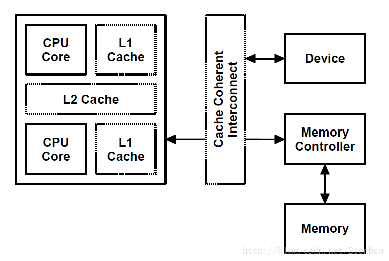
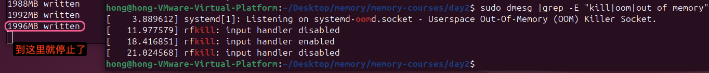

# 系统物理内存初始化

> 千万不要被教科书和各种网上的资料蒙蔽了双眼，你一定要真正自己探索和搞清楚事情的本源。

- CPU寻址内存，虚拟地址，物理地址（分页机制，虚实地址转换）
- MMU以及RWX权限kernel和user模式权限
- 内存的zone:DMA, Normal和Highmem
- Linux内存管理Buddy算法
- 连续内存分配器（CMA）

## 分页机制

Linux内核应该有4级页表，进程访问虚拟地v=(p,d),MMU再以p为索引检索页表，找到对应的page frame，加上偏移d，得到最终的无力地址。页表中会声明RWX权限，也可以声明kernel/user+kernel权限。

页表中的每个条目（Page Table Entry，PTE）通常包含以下权限标志：
- R（Read）：表示该页面是否可以被读取。
- W（Write）：表示该页面是否可以被写入。
- X（Execute）：表示该页面是否可以被执行。

这些权限标志用于控制进程对页面的访问方式。例如：
- 代码段：通常设置为只读（R）和可执行（X），但不允许写入（W）。
- 数据段：通常设置为可读（R）和可写（W），但不允许执行（X）。
- 堆和栈：通常设置为可读（R）、可写（W），但不允许执行（X），除非在某些情况下需要执行代码（如 JIT 编译）。

除了读写执行权限外，页表条目还可以包含一个标志，用于区分页面是属于内核空间还是用户空间：
- U（User）：表示该页面可以被用户模式下的进程访问。
- K（Kernel）：表示该页面只能被内核模式下的进程访问。


<font color=#dfa>**⚠️⚠️⚠️找不到物理地址或者权限不对都会发生Page Fault！**</font>

找不到物理地址的常见情况如下：
1. 页面未分配：进程尝试访问一个尚未分配的页面。例如，进程访问了一个超出其合法地址空间的地址。
2. 页面置换：进程访问的页面已经被换出（swap out）到磁盘，而当前不在物理内存中。操作系统需要从磁盘中加载该页面到物理内存中。
3. 映射未建立：进程尝试访问一个未被映射的地址。例如，进程访问了一个非法的地址，如空指针解引用（NULL pointer dereference）。

权限问题的常见情况如下：
1. 读写执行权限不足：进程尝试对页面进行非法操作。例如，进程尝试写入一个只读页面，或者执行一个不可执行的页面。
2. 用户/内核权限冲突：进程尝试访问一个属于内核空间的页面，而当前进程处于用户模式。例如，用户程序尝试访问内核代码或数据。

以下是一个背离RWX权限导致错误的例子


没有注释掉g=1的时候，会出现编译错误，将g=1注释掉之后，可以编译通过。编译器只检查代码的语法和语义，而不会检查运行时的行为。

但是后者运行时会出现Segment Fault:


在链接阶段，链接器会将g的定义和引用链接在一起。由于g被声明为const，链接器会将g放置在只读段域（如.rodata段）中。当`add_g`函数尝试修改g时，它实际上尝试写入一个只读内存区域，这会触发一个Segment Fault。


**问题:Page Fault和Segment Fault的区别？**

Page Fault是一种硬件异常，通常发生在页面不在物理内存中或映射未建立时。操作系统会尝试加载页面并更新页表。page fault 又分为几种，major page fault、 minor page fault、 invalid(segment fault)。
- major page fault也称为hard page fault, 指需要访问的内存不在虚拟地址空间，也不在物理内存中，需要从慢速设备载入。从swap回到物理内存也是hard page fault。
- minor page fault也称为soft page fault, 指需要访问的内存不在虚拟地址空间，但是在物理内存中，只需要MMU建立物理内存和虚拟地址空间的映射关系即可。（通常是多个进程访问同一个共享内存中的数据，可能某些进程还没有建立起映射关系，所以访问时会出现soft page fault）
- invalid fault也称为segment fault, 指进程需要访问的内存地址不在它的虚拟地址空间范围内，属于越界访问，内核会报segment fault错误。

Segment Fault是一种软件异常，通常发生在访问非法地址或权限不足时。操作系统会发送`SIGSEGV`信号终止进程。

| 特征             | Page Fault（页错误）   | Segment Fault（段错误）  |
| -------------- | ----------------- | ------------------- |
| **触发原因**       | 页面不在物理内存中或映射未建立   | 访问非法地址或权限不足         |
| **处理方式**       | 加载页面到物理内存并更新页表    | 发送 `SIGSEGV` 信号终止进程 |
| **是否涉及磁盘 I/O** | 可能涉及磁盘 I/O（如页面置换） | 通常不涉及磁盘 I/O         |
| **是否合法地址**     | 地址可能合法，但页面不在物理内存中 | 地址非法或访问权限不足         |
| **信号**         | 通常不直接发送信号，除非地址非法  | 发送 `SIGSEGV` 信号     |

---

背离特权模式保护的meltdown漏洞

Meltdown破坏了位于用户和操作系统之间的基本隔离，它允许用户空间的程序非法访问内核空间的数据，因此其他程序以及操作系统的敏感信息会被窃取。这个漏洞“熔化”了由硬件来实现的安全边界。允许低权限用户级别的应用程序“越界”访问系统级的内存，从而造成数据泄露。这个漏洞利用了现代处理器的乱序执行（Out-of-Order Execution）和预测执行（Speculative Execution）特性，通过侧信道攻击（Side-Channel Attack）从用户空间读取内核空间的数据。


页表中可以声明kernel/user+kernel权限，meltdown则从用户空间偷取了内核空间数据。

侧信道攻击（Side-Channel Attack）是一种利用计算机系统物理实现的弱点来进行攻击的方法。它不直接针对系统的逻辑或软件算法，而是通过分析系统在运行时的物理表现（如电磁辐射、声音、功耗、处理时间等）来获取敏感信息，比如密钥、密码或其他私有数据。


---


为什么内存要分Zone？

在 Linux 内核中，物理内存被划分为不同的Zone，主要是为了更好地管理内存，满足不同类型的内存需求。内存分区的主要原因包括：

- **DMA设备的限制**：某些硬件设备（如ISA设备）的DMA引擎只能访问有限的物理内存范围。例如，ISA设备的DMA只能访问前16MB的物理内存。因此，Linux 内核将这部分内存划分为 `ZONE_DMA`，以确保这些设备可以正常工作。
- **内核地址空间的限制**：在32位系统中，内核的虚拟地址空间有限（通常为1GB）。当物理内存超过这个范围时，内核无法直接映射所有物理内存。因此，内核将物理内存划分为不同的区域，以便更好地管理。
- **内存管理的灵活性**：通过将内存划分为不同的区域，内核可以更灵活地管理内存，例如，将某些区域专门用于内核数据，某些区域用于用户空间数据。


在32位系统中，内核空间的虚拟地址范围通常为3GB到4GB。为了管理物理内存，Linux内核将物理内存划分为以下三个区域：

- **ZONE_DMA**：0MB到16MB，用于DMA设备访问。
- **ZONE_NORMAL**：16MB到896MB，内核可以直接映射这部分内存。
- **ZONE_HIGHMEM**：896MB以上，这部分内存不能被内核直接映射，需要通过动态映射（如 `kmap`）来访问。


当物理内存超过896MB时，内核会使用`ZONE_HIGHMEM`来管理这部分内存。内核通过动态映射技术（如`kmap`）将`ZONE_HIGHMEM`中的页面映射到内核地址空间。
`kmap`函数会将`ZONE_HIGHMEM`中的页面映射到内核地址空间的一个固定区域（通常是`PKMAP_BASE`到`FIXADDR_START`之间）。这种映射是临时的，使用完毕后需要解除映射。


DMA ZONE存在的原因是某些硬件DMA引擎无法访问所有物理内存。例如，ISA设备的DMA引擎只能访问前16MB的物理内存。因此，Linux内核将这部分内存划分为 `ZONE_DMA`，以确保这些设备可以正常工作。


在讨论 DMA（直接内存访问）和内存区域（ZONE）时，特别是在32位系统上，内核空间通常被限制在3GB到4GB的虚拟地址范围内。这意味着内核可以直接访问的物理内存被限制在大约896MB（即3GB虚拟地址空间映射到物理地址空间）。然而，现代计算机系统通常配备的物理内存远远超过这个限制。

**问题：DMA+ZONE往3G以上一一映射？？** 未解决

DMA可以在进程和外设之间进行数据搬移。DMA Zone应该设置多大？32MB
在图片中，我们看到一款SoC包含多个DMA（直接内存访问）控制器。其中，DMA A、B和C没有访问限制，而DMA D只能访问32MB以内的内存，DMA E只能访问64MB以内的内存。

尽管存在多个DMA控制器，但DMA Zone被设置为32MB，限制最严格的DMA控制器决定DMA Zone大小。
因为DMA Zone必须能够被所有DMA控制器访问。在这个例子中，DMA D只能访问32MB以内的内存，这是所有DMA控制器中限制最严格的。因此，为了确保所有DMA控制器都能访问DMA Zone，DMA Zone被设置为32MB。


dma_alloc_coherent()申请的内存是非cache的吗？一定是物理连续的吗？（转自 https://blog.csdn.net/21cnbao/article/details/79133658）

要解答这个问题，首先要理解什么叫cache coherent。还是继续看这个DMA的图，我们假设MEM里面有一块红色的区域，并且CPU读过它，于是红色区域也进CACHE：


但是，假设现在DMA把外设的一个白色搬移到了内存原本红色的位置：


这个时候，内存虽然白了，CPU读到的却还是红色，因为CACHE命中了，这就出现了cache的不coherent。
当然，如果是CPU写数据到内存，它也只是先写进cache（不一定进了内存），这个时候如果做一个内存到外设的DMA操作，外设可能就得到错误的内存里面的老数据。
所以cache coherent的最简单方法，自然是让CPU访问DMA buffer的时候也不带cache。事实上，缺省情况下，dma_alloc_coherent()申请的内存缺省是进行uncache配置的。
但是，由于现代SoC特别强，这样有一些SoC里面可以用硬件做CPU和外设的cache coherence，如图中的cache coherent interconnect：



这些SoC的厂商就可以把内核的通用实现overwrite掉，变成dma_alloc_coherent()申请的内存也是可以带cache的。


dma_alloc_coherent()申请的内存一定是物理连续的吗？

绝大多数的SoC目前都支持和使用CMA技术，并且多数情况下，DMA coherent APIs以CMA区域为申请的后端，这个时候，dma alloc coherent本质上用__alloc_from_contiguous()从CMA区域获取内存，申请出来的内存显然是物理连续的。这一点，在设备树dts里面就可以轻松配置,要么配置一个自己特定的cma区域，要么从“linux,cma-default”指定的缺省的CMA池子里面取内存：

```c
 reserved-memory {
                #address-cells = <1>;
                #size-cells = <1>;
                ranges;

                /* global autoconfigured region for contiguous allocations */
                linux,cma {
                        compatible = "shared-dma-pool";
                        reusable;
                        size = <0x4000000>;
                        alignment = <0x2000>;
                        linux,cma-default;
                };

                display_reserved: framebuffer@78000000 {
                        reg = <0x78000000 0x800000>;
                };

                multimedia_reserved: multimedia@77000000 {
                        compatible = "acme,multimedia-memory";
                        reg = <0x77000000 0x4000000>;
                };
        };
```

但是，如果IOMMU存在（ARM里面叫SMMU）的话，DMA完全可以访问非连续的内存，并且把物理上不连续的内存，用IOMMU进行重新映射为I/O virtual address (IOVA)：


所以`dma_alloc_coherent()`这个API只是一个前端的界面，它的内存究竟从哪里来，究竟要不要连续，带不带cache，都完全是因人而异的。

---

## CMA机制

CMA（Contiguous Memory Allocator）是一种在Linux内核中用于分配连续内存的技术。它主要用于解决内存碎片化问题，特别是对于需要连续内存块的设备，如某些DMA（Direct Memory Access）控制器。

在现代操作系统中，内存管理通常采用分页机制，这可能导致内存碎片化。内存碎片化是指系统中虽然还有大量空闲内存，但这些内存被分割成许多小块，无法满足需要大块连续内存的应用程序或设备的需求。例如：
- **DMA**：某些硬件设备（如显卡、网络卡等）需要连续的内存块来传输数据。如果内存碎片化严重，这些设备可能无法找到足够大的连续内存块，从而影响性能或导致错误。
- **嵌入式系统**：在资源受限的嵌入式系统中，连续内存对于性能和稳定性至关重要。

Buddy算法，空闲页面按2的n次方来管理.


Buddy算法会导致内存碎片化。空闲内存很多，但是连续的空闲内存少。谁需要连续的空闲内存？DMA。

解决内存碎片🧩的方式有以下两种:
- 一般方法：reserved内存,预留内存是一种简单的内存管理策略，其中一部分内存在系统启动时就被保留下来，不参与常规的内存分配。这部分内存被预留给需要连续内存块的设备或用途。可能导致内存浪费，因为预留的内存即使未被使用也不能被其他部分的系统所利用。预留内存的大小在系统启动时就固定了，不够灵活。
- 高级方法：CMA（连续内存分配器）,CMA是一种更高级的内存管理技术，它允许内核动态地分配和回收连续的内存块，而不需要在系统启动时就预留一大块内存。在系统启动时，CMA会预留一部分内存区域，这些区域不会被Buddy算法管理，从而确保这些区域始终包含连续的内存块。CMA支持动态分配和回收连续内存块，这使得它能够灵活地满足不同设备的需求。CMA可以与现有的内存管理机制（如 Buddy 算法）协同工作，提供连续内存分配的同时，不干扰其他内存管理操作。

`Reserved内存`（预留内存）和 `CMA`（连续内存分配器）都是Linux内核用来管理内存的技术，特别是当系统需要为某些硬件设备（如DMA）保留连续的内存区域时。它们的主要区别在于管理连续内存的方式和效率：

Reserved类型的内存区通常由CMA管理。因为内存资源非常宝贵，如果reserved内存没有被使用时，CMA将reserved内存分配给用户使用；当驱动需要使用时，则腾出来给驱动使用。但是并不是所有的预留内存都由CMA管理，比如modem，TA等永久分配给其他核心使用的内存空间，内核并不为这部分空间建立内存映射，而是交给DMA（Direct Memory Allocator）管理。

---

## MMU和TLB


　　Linux进程发起的内存访问请求时，都是虚拟地址。虚拟地址会被CPU直接送往MMU，MMU首先在TLBs中查找是否有对应进程（ASID）的匹配的页表项，如果存在则直接引用；否则在内存中加载对应进程的页表，从中找到匹配的页表项。页表项中记录了实际物理页的基地址，再结合虚拟地址的偏移地址（偏移地址直接引用）字段，计算出具体的物理地址。

　　Linux进程所有的内存访问请求，都必须先通过上述机制计算出物理地址，随后才能完成物理内存的读写。

　　MMU包含两个物理单元：

　　1）table walk unit 负责从内存读取页表

　　2）TLBs (Translation Lookside Buffers) 负责缓存最近使用过的页表项

　　这里面有一个问题是，每一个进程的虚拟内存地址空间布局基本一致，必然就存在不同进程的虚拟地址一致的情况，那么MMU怎么区分接收到的虚拟地址是属于哪一个进程的呢？答案是ASID(Application Specific ID，也有文档翻译为Address Space ID)。在进行TLB页表项查找时，TLB页表项的属性字段包含ASID标识，用来指定该页表项属于哪一个进程。MMU从内存中读取页表时，是通过task_struct->mm_struct->pgd查找对应页表项的，即ASID只在TLBs中生效。


### 页表机制

 

Linux内核使用页表机制管理虚拟内存地址空间，页表保存在内存中，由MMU进行加载和解析。ARMv8 MMU支持4级页表。Linux内核支持很多芯片平台，为了统一起见，Linux内核使用3级页表，涉及到每一个具体的芯片平台有自己的页表实现。页表分为全局页表和局部页表，内核维护和使用全局页表，每一个进程拥有自己的局部页表。Linux内核为每一个进程维护一个task_struct结构体（即进程描述符），task_struct->mm_struct结构体成员用来保存该进程的局部页表。Linux进程上下文切换时，内核负责加载当前进程的局部页表，即构建当前进程的虚拟地址空间。

通常来讲，Linux虚拟地址一般分为4个字段：
1. PGD（Page Global Directory）全局页表项
2. PMD（Page Middle Directory）中间页表项
3. PTE（Page Table）页表
4. Offset 偏移地址

二级页表中，PMD通常直接映射到PGD。


　

### 缺页中断
Linux内核中，使用`__do_page_fault()`函数处理缺页中断。


Linux进程从用户态进入内核态，只有两种方式——系统调用和缺页中断。

Linux系统中使用`fork()`系统调用（其他操作系统中通常是`spawn()`函数）创建进程，其实在内核态是由两个系统调用实现的，即`clone()`和`exec()`。`clone()`系统调用负责拷贝父进程的task_struct结构体，`exec()`系统调用负责创建虚拟地址空间并加载应用程序。

实际上，Linux系统采用著名的写时复制（Copy-On-Write）技术。首先分配好虚拟地址区域，但是并没有实际映射到物理内存，只有在真正要使用时，才分配、映射并读写物理内存。不管是`malloc()`函数还是ld加载器加载应用程序都是这么实现的。而这一切的基础就是缺页中断。

当Linux进程发起内存访问请求时，发出的是虚拟地址，这个时候MMU就会到TLBs或者内存中加载页表，并查找是否有匹配的页表项。如果没有找到匹配的页表项，则产生缺页中断，由Linux内核分配物理内存，建立新的页表项。

值得一提的是，物理内存通常是有限的，并不能满足所有进程的内存需求。因此，Linux内核引入了swap机制，用来将不频繁使用的页表项对应的物理内存的内容替换到磁盘的swap分区，从而释放物理内存和页表项，用来满足其他进程的需求。Linux内核线程kwapd负责实现swap机制。

嵌入式Linux系统中，往往不支持swap机制，因为嵌入式Linux的物理存储介质通常为Nor Flash或者Nand Flash，其大小一般都远远小于物理内存大小，而且读写速度慢，从各方面看都不能发挥出swap机制的优势。因此，这种情况下，就不得不依赖于Linux内核提供的另外一个<font color=#dfa>**杀手进程——Low Memory Killer**</font>，一旦系统可用内存低于阈值，则狠心杀掉部分进程，从而释放出物理内存。

Linux内核还提供另外一个工具——<font color=#dfa>**OOM(Out of Memory Killer)**</font>，通过设置进程的内存阈值，一旦超过阈值则杀死进程以释放内存。即LMK是从整个系统的维度释放物理内存，OOM从进程的维度释放物理内存。


### 进程虚拟地址空间布局

以32位系统为例，说明Linux进程虚拟地址空间的布局。Linux 32位系统中，虚拟地址空间寻址范围是4GB，分为内核空间和用户空间两部分，以CONFIG_PAGE_OFFSET为界，高1GB为内核空间，低3GB为用户空间。


 

#### 用户空间


用户空间从低地址到高地址分别为：
1. 代码段
2. 数据段（存放全局初始化数据）
3. BSS段（存放全局未初始化数据）
4. 堆（从低地址向高地址增长，通常用于动态内存分配，如malloc函数）
5. 内存映射段（动态库、libc等基础库映射区）
6. 栈（进程调用栈，存放局部变量和临时变量）

进程的栈大小默认为8MB，可以通过`ulimit -s`设置，一般Linux系统支持栈自动扩展，当栈大小不够时，产生缺页中断，扩展栈大小。线程的栈位于进程的堆中，因为使用`pthread_create()`创建线程的时候，实际上是调用malloc()函数在进程的堆中分配一段指定大小（因此线程的栈不能动态增长）的内存用来作为线程的栈。


 

#### 内核空间


Linux 32位系统中，内核空间分为直接映射内存段（通常用来做DMA、内核代码段和数据段等），VMALLOC区、持久映射区和高端内存映射区等。但是Linux 64位系统中，这些概念就渐渐模糊了。每一个进程的内核空间的内容是不一样的，Linux进程的进程描述符（task_struct结构体）存放在内核空间的低地址，这是基于安全考虑的，因为用户态可能被篡改。

Linux支持NUMA技术，对于NUMA设备，NUMA系统的结点通常是由一组CPU和本地内存组成，每一个节点都有相应的本地内存，因此buddyinfo 中的Node0表示节点ID；而每一个节点下的内存设备，又可以划分为多个内存区域（zone），因此下面的显示中，对于Node0的内存，又划分类DMA、Normal、HighMem区域。而后面则是表示空闲的区域。第一行的横坐标就是1，2，4到1024一共11个链表的数据。

```shell
hong@hong-VMware-Virtual-Platform:~$ cat /proc/buddyinfo
Node 0, zone      DMA      2      2      2      4      0      0      0      0      0      0      0 
Node 0, zone    DMA32    381    608    385    212     68     18      1      1      1      0      6 
Node 0, zone   Normal  51617  34431  10767   2942   1309    324     51     16      8     26     11 
```
---


```shell
sudo cat /proc/slabinfo # 查看slabinfo
slabinfo - version: 2.1
# name            <active_objs> <num_objs> <objsize> <objperslab> <pagesperslab> : tunables <limit> <batchcount> <sharedfactor> : slabdata <active_slabs> <num_slabs> <sharedavail>
isofs_inode_cache     24     24    680   12    2 : tunables    0    0    0 : slabdata      2      2      0
QIPCRTR               38     38    832   19    4 : tunables    0    0    0 : slabdata      2      2      0
ext4_groupinfo_4k    814    814    184   22    1 : tunables    0    0    0 : slabdata     37     37      0
fsverity_info          0      0    264   15    1 : tunables    0    0    0 : slabdata      0      0      0
fscrypt_inode_info      0      0    128   32    1 : tunables    0    0    0 : slabdata      0      0      0
MPTCPv6                0      0   2176   15    8 : tunables    0    0    0 : slabdata      0      0      0
ip6-frags              0      0    184   22    1 : tunables    0    0    0 : slabdata      0      0      0
PINGv6                26     26   1216   13    4 : tunables    0    0    0 : slabdata      2      2      0
```

```shell
sudo slabtop # 动态查看slab的信息
```
结果如下：


以下代码的演示了如何锁定内存，确保它不会被交换到磁盘，并且确保它被加载到物理内存中。这在某些需要高性能或实时处理的应用程序中是必要的。

```c
#include <malloc.h>
#include <sys/mman.h>

#define SOMESIZE (100*1024*1024)	// 100MB

int main(int argc, char *argv[])
{
	unsigned char *buffer;
	int i;

	if (!mlockall(MCL_CURRENT | MCL_FUTURE))
		mallopt(M_TRIM_THRESHOLD, -1UL);
	mallopt(M_MMAP_MAX, 0);

	buffer = malloc(SOMESIZE);
	if (!buffer)
		exit(-1);

	/* 
	 * Touch each page in this piece of memory to get it
	 * mapped into RAM
	 */
	for (i = 0; i < SOMESIZE; i += 4 * 1024)
		buffer[i] = 0;
	free(buffer);
	/* <do your RT-thing> */

	while(1);
	return 0;
}
```

`mlockall`是一个POSIX函数，用于锁定调用进程的地址空间内的所有可锁定的内存区域，使它们不能被交换到磁盘上。这通常用于需要保证内存常驻的应用程序，如数据库或实时系统。
- MCL_CURRENT：锁定当前已分配的内存。
- MCL_FUTURE：锁定将来分配的内存。

当这两个选项一起使用时，可以确保当前和未来分配的所有内存都保持在物理内存中，不会被操作系统交换出去。

`mallopt`一个用来调整内存分配器行为的函数。它接受两个参数：一个是要设置的选项，另一个是该选项的新值。
- M_TRIM_THRESHOLD：设置内存收缩的阈值。当空闲内存低于这个阈值时，内存分配器会尝试收缩内存，释放一些内存给系统。设置为-1UL表示禁用内存收缩功能，即内存分配器不会自动收缩内存。
- M_MMAP_MAX：设置内存映射（mmap）的最大值。值为0表示禁用内存映射。


"Touch每个页面"是指访问内存块中的每个页面，确保它们被加载到物理内存中。这通常通过简单地写入或读取每个页面来实现。
```c
for (i = 0; i < SOMESIZE; i += 4 * 1024)
    buffer[i] = 0;
```
这段代码通过循环访问每个页面，确保它们被加载到物理内存中。这样做的目的是确保分配的内存块是"驻留"的，即它已经被加载到物理内存中，而不是仅仅存在于虚拟内存中。


free(buffer) 是释放之前通过malloc分配的内存。然而，在这个特定的代码中，由于使用了`mlockall(MCL_CURRENT | MCL_FUTURE)`锁定了内存，即使调用了free，内存也不会被释放回系统，而是保持锁定状态。


kmalloc用于从内核空间分配连续的物理内存。它通常用于内核数据结构，这些数据结构需要快速访问且对物理内存的连续性有要求。kmalloc分配的内存位于内核的直接映射区（LOW memory 映射区），这意味着分配的虚拟地址和物理地址之间有固定的映射关系，通常是**1:1的映射**。图中显示kmalloc直接从物理内存中分配空间，并且映射到内核空间的LOW memory区域。

vmalloc用于从内核空间分配虚拟连续的内存，但物理内存可以是不连续的。它通过创建多个物理内存碎片并将它们映射到一个虚拟地址区域来实现这一点。vmalloc适用于需要大范围连续虚拟地址空间的情况，例如，当需要映射设备驱动程序中的大缓冲区时。
图中显示vmalloc通过多个映射区从物理内存中分配空间，但这些空间在物理上是不连续的，映射到内核空间的vmalloc映射区。

ioremap用于映射I/O设备的物理地址空间到内核的虚拟地址空间。它通常用于访问硬件寄存器，这些寄存器位于特定的物理地址上。ioremap不分配内存，而是建立虚拟地址到特定物理地址的映射。图中显示ioremap将寄存器的物理地址映射到内核空间的用户空间区域。


可以通过查看vmallocinfo看出系统的寄存器映射情况:
```c 
ong@hong-VMware-Virtual-Platform:~/Desktop/memory/memory-courses/day2$ sudo cat /proc/vmallocinfo | grep ioremap
0xffffb70b00005000-0xffffb70b00007000    8192 x86_acpi_os_ioremap+0xe/0x20 phys=0x00000000bfefe000 ioremap
0xffffb70b00007000-0xffffb70b00009000    8192 x86_acpi_os_ioremap+0xe/0x20 phys=0x00000000bfeff000 ioremap
0xffffb70b00009000-0xffffb70b0000b000    8192 x86_acpi_os_ioremap+0xe/0x20 phys=0x00000000bfedc000 ioremap
0xffffb70b0000b000-0xffffb70b0000d000    8192 x86_acpi_os_ioremap+0xe/0x20 phys=0x00000000bfedb000 ioremap
0xffffb70b0000d000-0xffffb70b0000f000    8192 hpet_enable+0xb5/0x510 phys=0x00000000fed00000 ioremap
0xffffb70b01800000-0xffffb70b02001000 8392704 memremap+0x80/0x140 phys=0x00000000fe000000 ioremap
0xffffb70b08000000-0xffffb70b10001000 134221824 pci_mmcfg_arch_init+0x64/0x100 phys=0x00000000f0000000 ioremap
0xffffb70b00031000-0xffffb70b00033000    8192 pci_iomap+0xbc/0x190 phys=0x00000000fd5ee000 ioremap
0xffffb70b0003e000-0xffffb70b00040000    8192 x86_acpi_os_ioremap+0xe/0x20 phys=0x00000000fe800000 ioremap
0xffffb70b00040000-0xffffb70b00063000  143360 x86_acpi_os_ioremap+0xe/0x20 phys=0x00000000bfedd000 ioremap
0xffffb70b00069000-0xffffb70b0006b000    8192 x86_acpi_os_ioremap+0xe/0x20 phys=0x00000000fe829000 ioremap
0xffffb70b000c1000-0xffffb70b000c3000    8192 __pci_enable_msix_range+0x2bb/0x570 phys=0x00000000febfe000 ioremap
0xffffb70b00479000-0xffffb70b0047b000    8192 x86_acpi_os_ioremap+0xe/0x20 phys=0x00000000fe807000 ioremap
0xffffb70b0059a000-0xffffb70b0059d000   12288 x86_acpi_os_ioremap+0xe/0x20 phys=0x00000000fe800000 ioremap
0xffffb70b00d90000-0xffffb70b00d99000   36864 memremap+0x80/0x140 phys=0x00000000000e0000 ioremap
0xffffb70b005c0000-0xffffb70b005e1000  135168 mpt_mapresources+0x1fd/0x480 [mptbase] phys=0x00000000feba0000 ioremap
0xffffb70b00720000-0xffffb70b00741000  135168 pci_ioremap_bar+0x55/0xc0 phys=0x00000000fd5c0000 ioremap
0xffffb70b00f5d000-0xffffb70b00f5f000    8192 devm_ioremap+0x4a/0xb0 phys=0x00000000fd5ef000 ioremap
```


### malloc:VSS vs. RSS
- 虚拟内存大小（VSS）：虚拟内存大小（VSS）指的是进程的虚拟地址空间的总大小，包括所有代码、数据、堆、栈和映射的文件等。在图中，VSS在堆扩展后增加到 16KB。
- 常驻内存集（RSS）：常驻内存集（RSS）指的是进程实际驻留在物理内存中的大小。在图中，RSS在页面错误处理后增加到12KB，因为新分配的页面被映射到了物理内存。


以上步骤的解析如下:
1. 程序调用brk()扩展堆
    - 初始状态：程序的堆（Heap）大小为8KB，常驻内存集（RSS）也是8KB。此时，堆中已使用的部分和未使用的部分都映射到了物理内存
    - 调用brk()：程序调用brk()系统调用以扩展堆的大小。brk()会增加数据段（通常是堆）的末尾地址，从而扩展VMA
2. brk()扩展堆的VMA
    - 扩展VMA：brk()扩展了堆的VMA，使其大小增加到16KB。然而，新增加的页面并没有立即映射到物理内存上，它们处于“匿名”状态。
    - RSS未变：此时，常驻内存集（RSS）仍然是8KB，因为新增加的页面还没有被实际使用，也没有映射到物理内存。
3. 程序尝试访问新内存导致页面错误
    - 访问新内存：程序尝试访问新扩展的内存区域，这会导致Page Fault
    - 页面错误：当程序访问一个未映射到物理内存的虚拟地址时，处理器会触发页面错误异常
4. 内核处理页面错误
    - 内核分配页面：内核响应页面错误异常，为该虚拟地址分配一个物理页面帧，并创建PTE
    - 更新页表：内核更新页表，将新的物理页面映射到引起页面错误的虚拟地址
    - 恢复执行：内核恢复程序的执行，程序继续运行，好像什么都没发生过一样


内存耗尽的程序例子如下：
```c
#include <stdlib.h>
#include <stdio.h>
#include <string.h>

int main(int argc, char **argv)
{
	int max = -1;
	int mb = 0;
	char *buffer;
	int i;
#define SIZE 2000
	unsigned int *p = malloc(1024 * 1024 * SIZE);

	printf("malloc buffer: %p\n", p);

	for (i = 0; i < 1024 * 1024 * (SIZE/sizeof(int)); i++) {
		p[i] = 123;
		if ((i & 0xFFFFF) == 0) {
			printf("%dMB written\n", i >> 18);
			usleep(100000);
		}
	}
	pause();
	return 0;
}
```
设定条件：
- 总内存1G
- swapoff -a 
- echo 1 > /proc/sys/vm/overcommit_memory

```shell
$ sudo swapoff -a # 关闭交换空间
$ sudo sh -c 'echo 1 > /proc/sys/vm/overcommit_memory'  # 内核将允许任意数量的内存分配请求，即使这可能会超过物理内存和交换空间的总和
$ gcc oom.c
$ ./a.out
$ sudo dmesg |grep -E "kill|oom|out of memory"
```



没发现有类似下面的message（其实是因为自己的memory size设置太大了）:
```shell
[Fri Apr 26 10:22:44 2024] oom-kill:constraint=CONSTRAINT_NONE,nodemask=(null),cpuset=/,mems_allowed=0,global_oom,task_memcg=/user.slice/user-0.slice/session-6695.scope,task=website20240424,pid=1508765,uid=0
[Fri Apr 26 10:22:44 2024] Out of memory: Killed process 1508765 (website20240424) total-vm:2380796kB, anon-rss:574076kB, file-rss:0kB, shmem-rss:0kB, UID:0 pgtables:1328kB oom_score_adj:0
```

参数overcommit_memory可以设置为三个值之一：
- 0（默认值）：内核将检查每个内存分配请求，以确保有足够的物理内存和交换空间来满足该请求。如果没有足够的资源，请求将失败。
- 1：内核将允许任意数量的内存分配请求，即使这可能会超过物理内存和交换空间的总和。内核假设用户会负责确保系统不会耗尽所有内存资源。
- 2：内核将不允许超过已分配交换空间的内存分配请求。如果请求的内存量超过了物理内存和已分配交换空间的总和，请求将失败。

---

#### OOM打分因子
在Linux内核中，当系统面临内存不足（Out-Of-Memory，OOM）的情况时，内核需要决定哪个进程应该被终止以释放内存。
Linux的OOM killer是为了在**内存不足**的情况下，杀掉<font color=#dfa>**消耗内存最多、优先级最低的任务**</font>，从而保障系统不被搞挂。为了做出这个决定，内核给每个进程分配一个“OOM 分数”（oom_score），这个分数基于多个因素，用于衡量进程在内存回收时的优先级。这里有两个取决因素：
1. oom_score内核通过内存消耗计算得出 
2. oom_score_adj允许用户自定义，等同于优先级，优先级越高值越小（-1000 ~1000）。

当内存紧张的时候，内核通过`oom = oom_score + oom_score_adj`计算出分数最高的进程，向其发送关闭信号。
整个流程怎样的呢？mm/oom_kill.c中的`oom_badness()`給每个进程一个oom score,取决于：
- 驻留内存，pagetable和swap的使用。采用百分比乘以10(percent-times-ten):一个使用全部内存的进程得分1000，使用0个字节的进程得分0
- root用户进程减去30
- oom_score_adj:oom_score会加上oom_score_adj这个值
- oom_adj:-15~15系数调整

oom_score = 内存消耗/总内存 *1000
- 内存消耗包括：常驻内存RSS + 进程页面 + 交换内存
- 总内存包括：总的物理内存 + 交换分区


以下是Linux 6.14.6的代码:
```c
// file:/mm/oom_kill.c
long oom_badness(struct task_struct *p, unsigned long totalpages)
{
        long points;
        long adj;

        if (oom_unkillable_task(p))
                return LONG_MIN;

        p = find_lock_task_mm(p);
        if (!p)
                return LONG_MIN;

        /*
         * Do not even consider tasks which are explicitly marked oom
         * unkillable or have been already oom reaped or the are in
         * the middle of vfork
         */
        adj = (long)p->signal->oom_score_adj;
        if (adj == OOM_SCORE_ADJ_MIN ||
                        test_bit(MMF_OOM_SKIP, &p->mm->flags) ||
                        in_vfork(p)) {
                task_unlock(p);
                return LONG_MIN;
        }

        /*
         * The baseline for the badness score is the proportion of RAM that each
         * task's rss, pagetable and swap space use.
         */
         //累加 常驻内存RSS + 进程页面 + 交换内存
        points = get_mm_rss(p->mm) + get_mm_counter(p->mm, MM_SWAPENTS) +
                mm_pgtables_bytes(p->mm) / PAGE_SIZE;
        task_unlock(p);

        /* Normalize to oom_score_adj units */
        //oom_score_adj 归一化
        adj *= totalpages / 1000;
        //oom = oom_score + oom_score_adj 
        points += adj;

        return points;
}

/*
 * Determine the type of allocation constraint.
 */
// 计算总内存
static enum oom_constraint constrained_alloc(struct oom_control *oc)
{
        ...

        if (is_memcg_oom(oc)) {
                oc->totalpages = mem_cgroup_get_max(oc->memcg) ?: 1;
                return CONSTRAINT_MEMCG;
        }

        /* Default to all available memory */
        //总内存 = 物理内存 + 交换分区
        oc->totalpages = totalram_pages() + total_swap_pages;

        if (!IS_ENABLED(CONFIG_NUMA))
                return CONSTRAINT_NONE;
        ...
}
```

通过循环调用oom_badness找出oom最大的进程:

```c
/*
 * Simple selection loop. We choose the process with the highest number of
 * 'points'. In case scan was aborted, oc->chosen is set to -1.
 */
static void select_bad_process(struct oom_control *oc)
{
        oc->chosen_points = LONG_MIN;

        if (is_memcg_oom(oc))
                mem_cgroup_scan_tasks(oc->memcg, oom_evaluate_task, oc);
        else {
                struct task_struct *p;

                rcu_read_lock();
                for_each_process(p) //循环遍历所有进程
                        if (oom_evaluate_task(p, oc))
                                break;
                rcu_read_unlock();
        }
}
//选出最大oom进程
static int oom_evaluate_task(struct task_struct *task, void *arg)
{
        struct oom_control *oc = arg;
        long points;

        if (oom_unkillable_task(task))
                goto next;

        /* p may not have freeable memory in nodemask */
        if (!is_memcg_oom(oc) && !oom_cpuset_eligible(task, oc))
                goto next;

        /*
         * This task already has access to memory reserves and is being killed.
         * Don't allow any other task to have access to the reserves unless
         * the task has MMF_OOM_SKIP because chances that it would release
         * any memory is quite low.
         */
        if (!is_sysrq_oom(oc) && tsk_is_oom_victim(task)) {
                if (test_bit(MMF_OOM_SKIP, &task->signal->oom_mm->flags))
                        goto next;
                goto abort;
        }

        /*
         * If task is allocating a lot of memory and has been marked to be
         * killed first if it triggers an oom, then select it.
         */
        if (oom_task_origin(task)) {
                points = LONG_MAX;
                goto select;
        }

        points = oom_badness(task, oc->totalpages); //调用上面的oom_badness方法计算oom
        if (points == LONG_MIN || points < oc->chosen_points)
                goto next;


select:
        if (oc->chosen)
                put_task_struct(oc->chosen);
        get_task_struct(task);
        oc->chosen = task;
        oc->chosen_points = points;
next:
        return 0;
abort:
        if (oc->chosen)
                put_task_struct(oc->chosen);
        oc->chosen = (void *)-1UL;
        return 1;
}


```
关闭进程:
```c
//发送kill信号关闭进程
oom_kill_process(p, gfp_mask, order, points, totalpages, NULL,
				 nodemask, "Out of memory");

```


Android在程序退出的时候，并不杀死进程，而是等OOM再杀死进程；Android根据不同的进程类型设置不同的oom_obj？？


通过oom_adj调整进程的oom打分

```shell
cd /proc/${pid}
echo ${value} > oom_adj
```
这种打分会带来什么影响?

`oom_adj`（也称为 `oom_score_adj`）是Linux内核中的一个可调参数，用于调整特定进程的oom score。`oom_adj` 的调整对于系统管理员和用户来说是一个有用的工具，可以对特定进程的内存管理策略进行微调。下面是`oom_adj`调整进程oom score的主要作用：

### 1. 保护关键进程

通过给关键进程设置一个较低的 `oom_adj` 值（例如 -17），可以降低这些进程的 OOM 打分，从而减少它们在内存不足时被终止的可能性。这对于确保关键服务的稳定性和连续性非常重要。

### 2. 控制非关键进程的优先级

对于非关键进程，可以通过设置一个较高的 `oom_adj` 值（例如 15）来增加它们的 OOM 打分，使这些进程在内存不足时更可能被终止。这有助于释放内存资源，优先保证关键进程的运行。

### 3. 微调内存管理策略

`oom_adj` 提供了一种灵活的方式来微调系统的内存管理策略，允许管理员根据实际需求和应用的重要性来调整进程的内存使用优先级。

### 4. 避免不必要的服务中断

在某些情况下，可能不希望某些服务因为内存不足而被终止，即使它们不是关键服务。通过调整这些服务的 `oom_adj` 值，可以减少它们被终止的风险，从而避免不必要的服务中断。

### 5. 优化资源利用

通过合理设置 `oom_adj` 值，可以更有效地利用系统资源，确保在内存不足时优先保留对业务影响最大的进程。

### 使用方法

`oom_adj` 的值可以在 `/proc/[pid]/oom_score_adj` 文件中设置，其中 `[pid]` 是进程的 ID。这个文件的值范围通常是 -1000 到 1000。默认情况下，这个值是 0。设置这个值后，内核会根据进程的内存使用情况和其他因素计算其 OOM 打分，并在内存不足时使用这个打分来决定哪个进程应该被终止。

### 注意事项

- 修改 `oom_adj` 值可能会影响系统的稳定性，特别是在设置过高或过低的值时。
- 在生产环境中，应该谨慎使用 `oom_adj`，并根据实际需求和测试结果进行调整。
- 除了 `oom_adj`，还可以通过其他机制（如 cgroups）来更精细地控制进程的内存使用。

总之，`oom_adj` 是 Linux 内核提供的一个有用工具，可以帮助管理员和用户更有效地管理内存资源，特别是在内存紧张的情况下。通过合理设置 `oom_adj` 值，可以保护关键进程，优化资源利用，并避免不必要的服务中断。


---

内核代码和数据通常设置为内核权限（K），用户模式下的进程无法访问。而用户程序的代码和数据通常设置为用户权限（U），用户模式下的进程可以访问。

特权模式权限和非特权模式权限大致对应于 kernel 模式权限和 user 模式权限，但不能完全等同，二者在计算机体系结构中有明确的对应关系和区别。

在计算机体系结构中，通常将处理器的执行模式分为不同的特权级别，以保护系统的稳定性和安全性。常见的两种模式是：
特权模式（内核模式）：处理器处于最高特权级别（如 x86 架构中的 ring 0），具有完全访问计算机所有资源和指令的权限。操作系统内核和设备驱动程序通常在这个模式下运行。
非特权模式（用户模式）：处理器处于较低特权级别（如 x86 架构中的 ring 3），只能执行有限的指令集，访问受限的资源。用户程序（如应用程序）通常在这个模式下运行。

| 特征       | 特权模式权限 (内核模式)      | 非特权模式权限 (用户模式)            |
| -------- | ------------------ | ------------------------- |
| **特权级别** | 最高，可以执行所有指令，访问所有资源 | 较低，只能执行有限的指令，访问受限的资源      |
| **执行主体** | 操作系统内核、设备驱动程序等     | 用户程序、应用程序等                |
| **资源访问** | 可以直接访问硬件设备、内存等系统资源 | 不能直接访问硬件设备，只能通过系统调用请求内核服务 |
| **目的**   | 管理系统资源、提供系统服务      | 执行用户的应用程序                 |
| **安全性**  | 高风险，任何错误可能导致系统崩溃   | 较安全，程序错误不会直接影响系统稳定和其他用户程序 |


特权模式权限和非特权模式权限大致对应于 kernel 模式权限和 user 模式权限，但特权模式权限是更广泛的概念，涵盖了处理器的执行模式和权限级别，而 kernel 和 user 模式权限主要侧重于操作系统中对资源和执行环境的划分。

## 参考文献
Memory Management:
https://tldp.org/LDP/tlk/mm/memory.html

page fault和segment fault的区别:
https://blog.csdn.net/bdfpxsfh/article/details/129472868

page fault带来性能问题：
https://developer.aliyun.com/article/55820

PostgreSQL如何潇洒的处理每天上百TB的数据增量：
https://developer.aliyun.com/article/8528

宋宝华： 用代码切身实践体会meltdown漏洞:
https://mp.weixin.qq.com/s?__biz=Mzg2OTc0ODAzMw==&mid=2247501972&idx=1&sn=867d612ee43888be8b1495f440a83f58&source=41&poc_token=HLyHNWijbgBte3ZzrmP-vbd_g0zGvJ7T9_032NVd


MELTDOWN EXPLOIT POC
https://github.com/paboldin/meltdown-exploit

一步一步理解CPU芯片漏洞：Meltdown与Spectre
https://www.freebuf.com/articles/system/159811.html

Meltdown复现与linux检测Meltdown的原理分析:
https://xuanxuanblingbling.github.io/ctf/pwn/2020/06/30/meltdown/

处理器A级漏洞Meltdown(熔毁)和Spectre(幽灵)分析报告:
http://santiy.com/response/Meltdown.html

宋宝华：关于linux内存管理中DMA ZONE和dma_alloc_coherent若干误解的澄清
https://blog.csdn.net/21cnbao/article/details/79133658

Linux内核最新的连续内存分配器(CMA)——避免预留大块内存：
https://blog.csdn.net/21cnbao/article/details/7309757

Linux高级调试与优化——内存管理:
https://www.cnblogs.com/justin-y-lin/p/11270209.html

Linux /proc/buddyinfo理解:
https://blog.csdn.net/lickylin/article/details/50726847

oom详解：
https://blog.csdn.net/wllabs/article/details/103916169

linux的oom score是如何计算出来的:
http://blog.csdn.net/u010278923/article/details/105688107