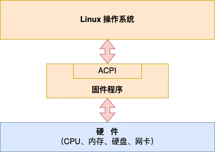
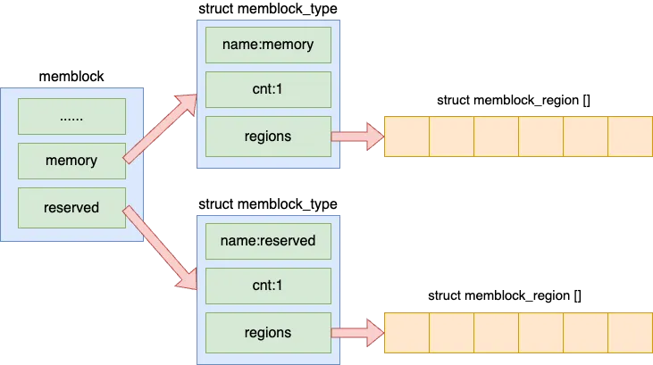
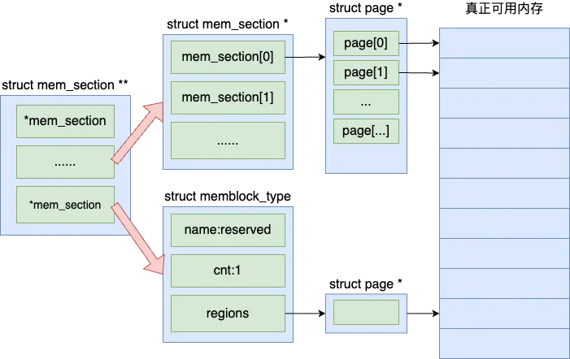
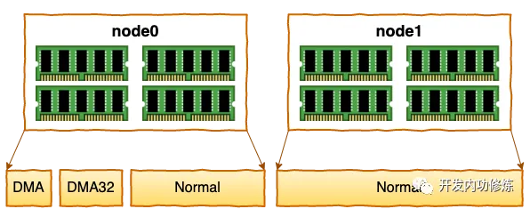
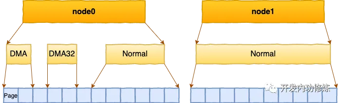
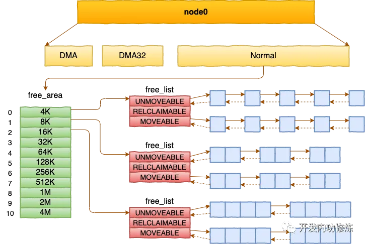
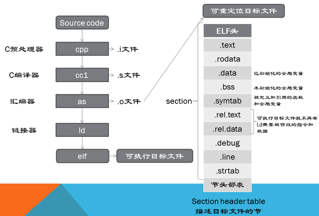
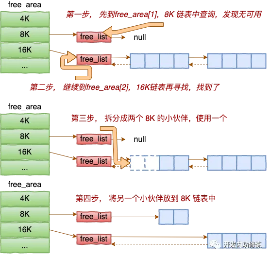

Linux内核在刚启动时不知道内存硬件信息，内核必须对整个系统的内存进行初始化，以方便后面的使用。具体过程包括
**物理内存检测,memblock初期分配器创建,内存NUMA的节点信息获取,页管理机制初始化,向伙伴系统交接可用内存范围**等。
1. 内核是通过什么手段来识别可用内存硬件范围的？
2. 内核管理物理内存都使用了哪些技术手段？
3. 为什么free -m命令展示的总内存比dmidecode中输出的要少，少了的这些内存哪里去了？
4. 内核是怎么知道某个内存地址范围属于哪个NUMA节点的呢？

## e820表

内存从硬件来讲就是连接在主板上的一根根有着金手指的硬件，内核需要识别到这些内存才可以进行后面的使用。

在计算机体系结构中，除了操作系统和硬件，中间还存在一层固件firmware。如下图所示：



固件是位于主板上的<font color=#9234>**使用SPI Nor Flash存储着的软件**</font>。在硬件和操作系统中起到承上启下的作用，firmware对外提供的接口规范是**高级配置和电源接口(APCI, Advanced Configuration and Power Interface)**。该规范定义了计算机硬件和操作系统之间的接口，包含的主要内容有**计算机硬件配置描述,设备通信方式,电源功能管理等**。在计算机启动过程中，固件负责**硬件自检，初始化硬件设备，加载操作系统引导程序，将控制权转移到操作系统并提供接口供操作系统读取硬件信息**。操作系统所需要的内存等硬件信息都是通过固件来获取的。


> 第一个版本ACPI 1.0是在1997年由Intel, Microsoft和东芝公司共同推出的。UEFI Forum: https://uefi.org/https://uefi.org/

操作系统启动时要做的一件重要的事情就是**探测可用物理内存的地址范围**。在固件ACPI接口规范中定义了探测内存的物理分布规范。<font color=#dfa>内核请求中断号`15H`，并设置操作码为`E820 H`。</font>因为操作码是E820，所以这个获取机制也被常称为E820。


内核在启动的时候也有个`main`函数。在`main`函数中会调用 `detect_memory`，物理内存安装检测就是在这个函数开始处理的。`detect_memory_e820`函数发出0x15中断并处理所有结果，把内存地址范围保存到`boot_params.e820_table`对象中。
```c
//-main
//--detect_memory
//---detect_memory_e820

//file:arch/x86/boot/main.c
void main(void)
{
 detect_memory();
 ...
}

// file:arch/x86/boot/memory.c
void detect_memory(void)
{
 detect_memory_e820();
 ...
}

//file:arch/x86/boot/memory.c
static void detect_memory_e820(void)
{
 struct boot_e820_entry *desc = boot_params.e820_table;//boot_params只是一个启动的中间过程的数据

 initregs(&ireg);
 ireg.ax  = 0xe820;
 ...

 do {
  intcall(0x15, &ireg, &oreg); //发出0x15中断
  ...
  *desc++ = buf;
  count++;
 }while (ireg.ebx && count < ARRAY_SIZE(boot_params.e820_table));

 boot_params.e820_entries = count;
}
```
在上面代码中，把内存地址范围数据保存到`boot_params`中了。但`boot_params`只是一个中间启动过程数据。内存这么重要的数据还是应该单独存起来。所以，还专门有一个`e820_table`全局数据结构。

> `__initdata`表示这个变量是在内核初始化阶段使用的数据。在内核启动过程中，会有一些数据只在初始化阶段需要，当初始化完成后，这些数据可以被释放或者丢弃，以节省内存。这种机制有助于减少内核在运行时占用的内存空间。e820_table_init 这个变量可能在初始化内存映射（e820 表用于描述物理内存的布局）相关的结构时发挥作用，其数据在内核初始化阶段被使用。

> `__refdata`是一个标记，表示这个变量在内核初始化代码中被引用。它与`__initdata`类似，但适用于指针类型。这个指针可能被用于在内核后续运行过程中访问在初始化阶段设置好的e820表数据，以便操作系统能够正确地管理物理内存。

```c
//file:arch/x86/kernel/e820.c
static struct e820_table e820_table_init  __initdata;
struct e820_table *e820_table __refdata   = &e820_table_init;

//file:arch/x86/include/asm/e820/types.h
struct e820_table {
 __u32 nr_entries; // e820表项数量
 struct e820_entry entries[E820_MAX_ENTRIES]; //具体的表项
};
```
在内核启动的后面的过程中，会把`boot_params.e820_table`中的数据拷贝到这个全局的e820_table中。并把它打印出来。具体是在`e820__memory_setup`函数中处理的。关于保存过程不是很主要，主要在于<font color=#dfa>**内存检测结果的打印**</font>。

> 需要的时候再看调用关系，直接找最主要的函数看就看可以了。

```c
//file:arch\x86\kernel\e820.c
void __init e820__memory_setup(void)
{
 // 保存boot_params.e820_table保存到全局e820_table中
 char *who;
 who = x86_init.resources.memory_setup();
 ...

 // 打印内存检测结果
 pr_info("BIOS-provided physical RAM map:\n");
 e820__print_table(who);
}


//file:arch\x86\kernel\e820.c
void __init e820__print_table(char *who)
{
 int i;

 for (i = 0; i < e820_table->nr_entries; i++) {
  pr_info("%s: [mem %#018Lx-%#018Lx] ",
   who,
   e820_table->entries[i].addr,
   e820_table->entries[i].addr + e820_table->entries[i].size - 1);

  e820_print_type(e820_table->entries[i].type);
  pr_cont("\n");
 }
}

```
内核启动过程中输出的信息通过dmesg命令来查看。其中，标记<font color=#dfa>**usable是实际可用的物理内存地址范围**</font>。标记为<font color=#dfa>**reserved的内存不能被分配使用，可能是内存启动时用来保存内核的一些关键数据和代码，也可能没有实际的物理内存映射到这个范围**</font>。
但它们被保留用于特定的硬件、BIOS、内核或系统功能。内核在启动时会根据这些信息来管理内存，确保不分配和使用这些保留区域。比如：

- 设备和外设的寄存器映射：许多硬件设备（如显卡、网卡、PCIe设备等）会使用一些内存地址范围来映射它们的寄存器或内存空间。这些地址范围是被保留给设备使用的，并不是实际的物理内存。
- BIOS/UEFI保留区域：在计算机启动的早期阶段，BIOS或UEFI会使用一些内存区域来存储它的代码、数据结构和配置信息。这些区域会被标记为保留的（如reserved），以防止操作系统误写入。

```shell
hong@hong-VMware-Virtual-Platform:~/Desktop/memory/memory-courses/day5$ sudo dmesg | grep "BIOS-e820"
[sudo] password for hong: 
[    0.000000] BIOS-e820: [mem 0x0000000000000000-0x000000000009e7ff] usable
[    0.000000] BIOS-e820: [mem 0x000000000009e800-0x000000000009ffff] reserved
[    0.000000] BIOS-e820: [mem 0x00000000000dc000-0x00000000000fffff] reserved
[    0.000000] BIOS-e820: [mem 0x0000000000100000-0x00000000bfecffff] usable
[    0.000000] BIOS-e820: [mem 0x00000000bfed0000-0x00000000bfefefff] ACPI data
[    0.000000] BIOS-e820: [mem 0x00000000bfeff000-0x00000000bfefffff] ACPI NVS
[    0.000000] BIOS-e820: [mem 0x00000000bff00000-0x00000000bfffffff] usable
[    0.000000] BIOS-e820: [mem 0x00000000f0000000-0x00000000f7ffffff] reserved
[    0.000000] BIOS-e820: [mem 0x00000000fec00000-0x00000000fec0ffff] reserved
[    0.000000] BIOS-e820: [mem 0x00000000fee00000-0x00000000fee00fff] reserved
[    0.000000] BIOS-e820: [mem 0x00000000fffe0000-0x00000000ffffffff] reserved
[    0.000000] BIOS-e820: [mem 0x0000000100000000-0x00000002dfffffff] usable
```


一台服务器上会被插入多条内存。但操作系统在刚开始的时候，对内存的可用地址范围、NUMA分组信息都是一无所知每条需要被编排进某个地址范围然后才能被CPU使用。Linux操作系统在启动的时候会向固件程序发起15号中断，并设置操作码为E820 H。然后固件上报内存地址范围，内核会把它保存并打印出来。

使用`dmseg`可以查看到Linux在启动时对内存探测过程的记录。其中输出的最后一列为 usable 是实际可用的物理内存地址范围。被标记为 reserved 的内存不能被分配使用，可能是内存启动时用来保存内核的一些关键数据和代码，也可能没有映射到实际的物理内存。有了这个`e820_table`表示的可用物理内存地址范围后，后面内核会通过自己的初期分配器memblock、以及伙伴系统两种机制将所有可用的物理内存管理起来。

其中memblock管理方式比较粗放，仅仅用于内核启动时。启动好了后memblock会把可用物理页交接给伙伴系统。伙伴系统管理的比较精细，会按 4KB、8KB、16KB 等各种不同大小的空闲块来管理。当我们的应用程序执行过程中，发现对应虚拟地址对应物理内存还没有分配的时候，会触发缺页中断。在缺页中断中向伙伴系统申请指定大小的物理内存页面。

## 初期memblock内存分配器

内核在启动时通过E820机制获得可用的内存地址范围后，还需要将这些内存都管理起来，以应对后面系统运行时的各种功能的内存申请。

内核中采用了两种内存管理机制来管理物理内存。第一种是**初期内存分配器**。在内核刚启动的时候，采用的是较为简单的内存分配器。这种内存分配器仅仅只为了满足系统启动时间内对内存页的简单管理，管理粒度较粗。第二种就是在系统启动后正常运行时采用的复杂一些但是能高效管理4kB粒度的**伙伴系统**，是运行时的主要物理内存分配页。

在Linux的早期版本中，初期分配器采用的是bootmem。但在2010年之后，就慢慢替换成了memblock内存分配器。


### memblock内存分配器的创建

内存在通过E820机制检测到可用的内存地址范围后，调用`e820__memory_setup`函数把检测结果保存到e820_table全局数据结构中。紧接着下一步就是调用`e820_memblock_setup`函数创建memblock内存分配器。

memblock就是按照检测到的内存地址范围是usable还是reserved分成两个对象，然后分别用memblock_region数组存起来。memblock就是按照type分类地存储在memblock_regions数组中，所有memblock_regions都放在memblock结构体中。在`e820__memblock_setup`函数中遍历e820 table中的每一段内存区域，如果是预留内存就调用`memblock_reserve`添加到reserved成员中，也就是**预留内存列表**。添加过程会修改reserved中的区域数量cnt,然后再设置regions中的一个元素。如果是可用内存就调用memblock_add添加到memory成员中，也就是**可用内存列表**。在memblock创建完成后，紧接着还调用`memblock_dump_all()`进行了一次打印输出。
```c
/* 
- memblock
    - memblock_regions:usable  
    - memblock_regions:reserved
    - ...
*/


//file:arch/x86/kernel/setup.c
void __init setup_arch(char **cmdline_p)
{
 ...
 // 保存物理内存检测结果
 e820__memory_setup();
 ...

 // membloc内存分配器初始化
 // 根据e820_table创建memblock内存分配器
 e820__memblock_setup();
}

//file:arch/x86/kernel/e820.c
void __init e820__memblock_setup(void)
{
 ...
for (i = 0; i < e820_table->nr_entries; i++) {
struct e820_entry *entry = &e820_table->entries[i];
  ...
if (entry->type == E820_TYPE_SOFT_RESERVED)
   memblock_reserve(entry->addr, entry->size);

  memblock_add(entry->addr, entry->size);
 }

// 打印 memblock 创建结果
 memblock_dump_all();
}

```

memblock内存分配器的定义如下：
```c
//file:mm/memblock.c
struct memblock memblock __initdata_memblock = {
 .memory.regions  = memblock_memory_init_regions,
 .memory.cnt  = 1, /* empty dummy entry */
 .memory.max  = INIT_MEMBLOCK_MEMORY_REGIONS,
 .memory.name  = "memory",

 .reserved.regions = memblock_reserved_init_regions,
 .reserved.cnt  = 1, /* empty dummy entry */
 .reserved.max  = INIT_MEMBLOCK_RESERVED_REGIONS,
 .reserved.name  = "reserved",

 .bottom_up  = false,
 .current_limit  = MEMBLOCK_ALLOC_ANYWHERE,
}

#define INIT_MEMBLOCK_REGIONS   128
#define INIT_MEMBLOCK_RESERVED_REGIONS  INIT_MEMBLOCK_REGIONS
#define INIT_MEMBLOCK_MEMORY_REGIONS  INIT_MEMBLOCK_REGIONS

static struct memblock_region memblock_memory_init_regions[INIT_MEMBLOCK_MEMORY_REGIONS] __initdata_memblock; // usable

static struct memblock_region memblock_reserved_init_regions[INIT_MEMBLOCK_RESERVED_REGIONS] __initdata_memblock; // reserved 
```




memblock创建过程中的输出信息很重要，对于观察memblock的创建过程非常有帮助。可以通过dmesg命令来查看，但是需要在Linux启动参数中添加`memblock=debug`并重启才可以。

```shell
sudo cp /boot/grub/grub.cfg /boot/grub/grub.cfg.bak
sudo vim /boot/grub/grub.cfg

# 添加如下信息
/boot/vmlinuz-6.14.x86_64 root=UUID=... memblock=debug

sudo update-grub # 更新grub配置文件，重新生成/boot/grub/grub.cfg

# 查看输出中是否包含memblock=debug信息
hong@hong-VMware-Virtual-Platform:~/Desktop$ cat /proc/cmdline | grep memblock
BOOT_IMAGE=/boot/vmlinuz-6.11.0-26-generic root=UUID=0e3ab9c2-8bb6-43dd-ad46-c57a8fadb741 ro quiet splash memblock=debug


hong@hong-VMware-Virtual-Platform:~/Desktop$ sudo dmesg 
...
[    0.012824] MEMBLOCK configuration:
[    0.012828]  memory size = 0x000000029ff6d800 reserved size = 0x000000000792a800
[    0.012833]  memory.cnt  = 0x4
[    0.012838]  memory[0x0]	[0x0000000000001000-0x000000000009dfff], 0x000000000009d000 bytes flags: 0x0
[    0.012843]  memory[0x1]	[0x0000000000100000-0x00000000bfecffff], 0x00000000bfdd0000 bytes flags: 0x0
[    0.012848]  memory[0x2]	[0x00000000bff00000-0x00000000bfffffff], 0x0000000000100000 bytes flags: 0x0
[    0.012853]  memory[0x3]	[0x0000000100000000-0x00000002dfffffff], 0x00000001e0000000 bytes flags: 0x0
[    0.012858]  reserved.cnt  = 0x4
[    0.012862]  reserved[0x0]	[0x0000000000000000-0x000000000000ffff], 0x0000000000010000 bytes flags: 0x0
[    0.012867]  reserved[0x1]	[0x000000000009e800-0x00000000000fffff], 0x0000000000061800 bytes flags: 0x0
[    0.012872]  reserved[0x2]	[0x000000002f6a1000-0x0000000033b47fff], 0x00000000044a7000 bytes flags: 0x0
[    0.012877]  reserved[0x3]	[0x0000000239600000-0x000000023ca11fff], 0x0000000003412000 bytes flags: 0x0
...
```

> /proc/cmdline保存了内核启动时的命令行参数。这些参数是在系统启动过程中由引导加载程序传递给内核的。文件中的内容反映了内核启动时所使用的配置和选项。


### 向memblock分配器申请内存

内核在启动的过程中，伙伴系统没有创建。这时所有的内存都是通过memblock内存分配器来分配的。比较重要的两个使用的场景是<font color=#dfa>**crash kernel内存申请**</font>和<font color=#dfa>**页管理初始化**</font>。

#### crash kernel内存申请


内核为了在崩溃时能记录崩溃的现场，方便以后排查分析，设计实现了一套<font color=#fad>**kdump机制**</font>。kdump机制在服务器上启动了两个内核，第一个是正常使用的内核，第二个是崩溃发生时kdump机制使用的应急内核（虽然一般认为服务器上只有一套内核，但实际上是启动了两个内核）。


有了kdump机制，发生系统崩溃的时候kdump使用kexec启动到第二个内核中运行。第二个内核提供了一个稳定的环境，用于收集和处理崩溃时的内存转储信息。与捕获内核一起加载的初始化内核模块（initramfs或initrd），它包含了一些必要的工具和驱动程序，用于支持捕获内核的运行和内存转储操作。这些工具通常包括`makedumpfile`等，用于对内存转储文件进行处理`makedumpfile`工具运行在捕获内核环境中，用于分析和压缩内存转储数据。它会读取`/proc/vmcore`文件，该文件包含了**系统崩溃时的内存镜像**，并将其进行裁剪和压缩，然后将生成的转储文件保存到指定的位置，如本地磁盘、NFS共享或远程服务器等。`/etc/kdump.conf`是kdump服务的配置文件，指定了内存转储文件的保存位置、转储级别等参数。捕获内核启动后，会根据这个配置文件来执行相应的转储操作。这样第一个内核中的内存就得以保留下来了。然后可以把崩溃时的所有运行状态都收集到dump core中。

kdump机制是**需要额外的内存**才能工作的。通过`reserve_crashkernel_low`和 `reserve_crashkernel`两个函数向memblock内存分配器申请内存。

```c
//file:arch/x86/kernel/setup.c
static int __init reserve_crashkernel_low(void)
{
 ...
// 申请内存
 low_base = memblock_phys_alloc_range(low_size, CRASH_ALIGN, 0, CRASH_ADDR_LOW_MAX);
 pr_info("Reserving %ldMB of low memory at %ldMB for crashkernel (low RAM limit: %ldMB)\n",
  (unsignedlong)(low_size >> 20),
  (unsignedlong)(low_base >> 20),
  (unsignedlong)(low_mem_limit >> 20));
 ...
}

static void __init reserve_crashkernel(void)
{ ...
// 申请内存
 low_base = memblock_phys_alloc_range(low_size, CRASH_ALIGN, 0, CRASH_ADDR_LOW_MAX);
 pr_info("Reserving %ldMB of memory at %ldMB for crashkernel (System RAM: %ldMB)\n",
  (unsignedlong)(crash_size >> 20),
  (unsignedlong)(crash_base >> 20),
  (unsignedlong)(total_mem >> 20));
}


```

查看系统的dump core保留内存大小发现没有相关service正在运行：
```shell
hong@hong-VMware-Virtual-Platform:~/Desktop$ systemctl status kdump.service
Unit kdump.service could not be found.

# 查看是否加载了kdump相关的内核模块
lsmod | grep crash # 发现无输出

# 某些发行版中，kdump服务并不是默认安装的，需要手动安装kdump相关的软件包
sudo apt-get install kdump-tools 


```

查看dmesg信息中为core dump保留的内存信息如下:
```shell
hong@hong-VMware-Virtual-Platform:/etc/kdump$ sudo dmesg | grep crashkernel
[    0.000000] Command line: BOOT_IMAGE=/boot/vmlinuz-6.11.0-26-generic root=UUID=0e3ab9c2-8bb6-43dd-ad46-c57a8fadb741 ro quiet splash crashkernel=2G-4G:320M,4G-32G:512M,32G-64G:1024M,64G-128G:2048M,128G-:4096M
[    0.012853] crashkernel reserved: 0x000000009f000000 - 0x00000000bf000000 (512 MB)
[    0.255995] Kernel command line: BOOT_IMAGE=/boot/vmlinuz-6.11.0-26-generic root=UUID=0e3ab9c2-8bb6-43dd-ad46-c57a8fadb741 ro quiet splash crashkernel=2G-4G:320M,4G-32G:512M,32G-64G:1024M,64G-128G:2048M,128G-:4096M

```
**以上内存会被一直占用，用户程序无法使用。**

问题：为什么用于kdump机制的内存要有两个部分还是low memory和memory，二者有什么区别吗？还会有其他部分的内存被映射过来吗？如何修改用于kdump机制的内存大小？原书作者输出信息如下：
```shell
......
[    0.010832] Reserving 128MB of low memory at 2928MB for crashkernel (System low RAM: 3071MB)
[    0.010835] Reserving 128MB of memory at 17264MB for crashkernel (System RAM: 16383MB)
```

- 低内存和高内存的区别：低内存是指系统内存中较低的地址范围，通常在 4GB 以下。低内存对于某些硬件设备（如DMA设备）来说是必需的，因为这些设备可能只能访问低内存地址。高内存是指系统内存中较高的地址范围，通常在4GB以上。在64位系统中，高内存的寻址能力更强，但某些硬件设备可能无法访问高内存地址。
- 为何要预留两部分内存？一是确保捕获内核的稳定性，低内存区域对于捕获内核的稳定性至关重要，因为一些关键的硬件设备（如网络设备、存储设备等）需要低内存来执行DMA操作。预留低内存可以确保捕获内核在系统崩溃时能够稳定运行并与硬件设备进行通信。二是为了提高内存转储的效率。高内存区域通常具有更大的连续内存空间，可以提供更多的内存用于内存转储。高内存区域的预留可以确保捕获内核有足够的空间来保存系统崩溃时的内存信息，从而提高内存转储的效率和完整性。
- 是否会有其他部分的内存被映射过来？ 除了低内存和高内存区域外，系统还可能根据实际需求将其他部分的内存映射到捕获内核的地址空间中。例如，某些特定的内存区域可能被用于存储系统关键数据或设备驱动所需的信息。这些映射操作通常由内核在启动时自动完成，以确保捕获内核能够正常工作并收集完整的系统状态信息。
- 如何修改用于kdump机制的内存大小？
    1. 修改GRUB配置文件：打开/etc/default/grub文件，在GRUB_CMDLINE_LINUX或GRUB_CMDLINE_LINUX_DEFAULT变量中添加或修改crashkernel参数。
    例如，保留128MB内存，可以设置为crashkernel=128M；根据内存范围设置不同的保留大小，如crashkernel=512M-2G:64M,2G-:128M，表示当系统内存总量在 512MB 到 2GB 之间时保留 64MB，超过2GB时保留 128MB。如果需要指定内存的起始地址，可以使用crashkernel=大小@偏移量的格式，如crashkernel=128M@16M，表示从 16MB 的物理地址开始保留 128MB 内存。保存文件后，运行`grub2-mkconfig -o /boot/efi/EFI/$(uname -i)/grub.cfg`（对于 UEFI 引导）或`grub2-mkconfig -o /boot/grub2/grub.cfg`（对于 Legacy 引导）来更新 GRUB 配置。
    2. 使用grubby命令：可以使用grubby命令来更新特定内核或所有内核的启动参数。例如，运行`sudo grubby --update-kernel="/boot/vmlinuz-$(uname -r)" --args="crashkernel=128M"`命令，将当前内核的crashkernel参数设置为 128MB。
    也可以使用--args选项来指定新的crashkernel参数值，或者使用--remove-args选项来移除现有的crashkernel参数。


#### 页管理初始化

页管理的初始化还没有更换内存管理器，而只是进行了struct page数据结构的初始化,为未来伙伴系统按页管理内存奠定基础。一个页就要用一个struct page结构来表示，同时**struct page结构体本身也是需要消耗一定的内存的**。在不同的kernel版本中，struct page的大小不一样，**一般是64字节**。

```c
//file:include/linux/mm_types.h
struct page {
 unsigned long flags;
 ...
}
```

页管理机制的初始化具体函数是paging_init，具体的执行路径是在` start_kernel -> setup_arch -> x86_init.paging.pagetable_init -> paging_init`。在paging_init这个函数中为所有的页面都申请了一个struct page对象，将来通过这个对象对页面进行管理。

```c
start_kernel
-> setup_arch
---> e820__memory_setup   // 内核把物理内存检测保存从boot_params.e820_table保存到e820_table中，并打印出来
---> e820__memblock_setup // 根据e820信息构建memblock内存分配器，开启调试能打印
---> x86_init.paging.pagetable_init（native_pagetable_init）
-----> paging_init        // 页管理机制的初始化
->mm_init
--->mem_init
-----> memblock_free_all  // 向伙伴系统移交控制权
```
在paging_init这个函数中为所有的页面都申请一个 struct page 对象。将来通过这个对象来对页面进行管理。内存页管理模型也经过了几代的变化，在最早的时候，采用的是**FLAT模型**、中间还经历了**DISCONTIG模型**，现在都默认采用了
**SPARSEMEM模型**。SPARSEMEM模型在内存中就是一个<font color=#fda>**二维数组**</font>。在这个二维数组中，通过层层包装，最后包含的最小单元就是表示内存的struct page对象。假设struct page结构体大小是64字节。那么平均每4 KB就额外需要消耗64字节内存用来存储这个对象。 64/4096约等于1.56%，那么管理16GB的内存大约需要 (16*1024 MB) * 1.56%，约256MB的内存。


也就是会把memblock开始通过不同的block管理的内存范围全部转换成用page管理，不再是一个个的内存范围[start,end]，而是很多个4KB页面。

```c
//file:mm/sparse.c
#ifdef CONFIG_SPARSEMEM_EXTREME
struct mem_section **mem_section;
#else
struct mem_section mem_section[NR_SECTION_ROOTS][SECTIONS_PER_ROOT]
 ____cacheline_internodealigned_in_smp;
#endif
EXPORT_SYMBOL(mem_section);
```



问题:为什么通过free -m看到的内存比实际内存少?

Linux并不会讲所有物理内存都交给用户使用。Linux为了维护自身的运行，会消耗一些内存。比如kdump机制对内存的消耗，内存的页管理机制对内存的占用，还有其他的包括NUMA机制中的node,zone的管理等也都需要内存。

## NUMA信息感知

非一致性内存访问的含义就是CPU物理核在访问不同的内存条时延迟不同。

不仅仅是跨CPU访问存在延时差异，在同一个CPU的不同核上，由于Mesh架构以及存在两个内存控制器的原因，物理核访问不同的内存控制器上的内存条也会有差异，只不过这个差异没有跨CPU差异大。


Linux需要感知到硬件的NUMA信息，获取过程大概分为两步，第一步是内核识别内存所属节点，第二步把NUMA信息关联到自己的memblock初期内存分配器。ACPI中定义了两个表:
- <font color=#fda>SRAT(System Resource Affinity Table)</font>:表示CPU核和内存的关系，包括有几个node,每个node里有哪几个CPU逻辑核，有哪些内存。
- <font color=#fda>SLIT(System Locality Information Table)</font>:记录了各个节点之间的距离。

CPU读取以上两个表就快可以获得NUNA系统的CPU和物理内存分布信息。操作系统在启动的时候会执行`setup_arch`函数，会在这个函数中发起NUMA信息初始化。在`initmem_init`中，依次调用了`x86_numa_init`、`numa_init`、`x86_acpi_numa_init`，最后执行到了`acpi_numa_init`函数中来读取ACPI中的SRAT表，获取到各个node中的CPU逻辑核、内存的分布信息。

```c
//file:arch/x86/kernel/setup.c
void __init setup_arch(char **cmdline_p)
{
 ...
// 保存物理内存检测结果
 e820__memory_setup();
 ...

// membloc内存分配器初始化
 e820__memblock_setup();

// 内存初始化（包括 NUMA 机制初始化）
 initmem_init();
}
 

 //file:drivers/acpi/numa/srat.c
int __init acpi_numa_init(void)
{
 ...
 // 解析 SRAT 表中的 NUMA 信息
 // 具体包括：CPU_AFFINITY、MEMORY_AFFINITY 等
 if (!acpi_table_parse(ACPI_SIG_SRAT, acpi_parse_srat)) {
  ...
 }
 ...
}
```
在SRAT表读取并解析完成后，Linux操作系统就知道了内存和node的关系了。numa信息都最后保存在了numa_meminfo这个数据结构中，这是一个**全局的列表**，每一项都是`(起始地址, 结束地址, 节点编号)`的三元组，描述了内存块与NUMA节点的关联关系。

```c
//file:arch/x86/mm/numa.c
static struct numa_meminfo numa_meminfo __initdata_or_meminfo;

//file:arch/x86/mm/numa_internal.h
struct numa_meminfo {
 int   nr_blks;
 struct numa_memblk blk[NR_NODE_MEMBLKS];
};
```
在此之后，Linux就可以通过numa_meminfo数组来获取硬件NUMA信息了。有了numa_meminfo数组，memblock就可以根据这个信息读取到自己各个region分别是属于哪个node的了。


```c
//file:arch/x86/mm/numa.c
static int __init numa_init(int (*init_func)(void))
{
 ...

//2.1 把numa相关的信息保存在 numa_meminfo 中
 init_func();

//2.2 memblock 添加 NUMA 信息，并为每个 node 申请对象
 numa_register_memblks(&numa_meminfo);

 ...
// 用于将各个CPU core与NUMA节点关联
 numa_init_array();
return0;
}

```
在 numa_register_memblks 中完成了三件事情:
- 将每一个 memblock region 与 NUMA 节点号关联
- 为每一个 node 都申请一个表示它的内核对象（pglist_data）
- 再次打印 memblock 信息

```c
//file:arch/x86/mm/numa.c
static int __init numa_register_memblks(struct numa_meminfo *mi)
{
 ...
//1.将每一个 memblock region 与 NUMA 节点号关联
for (i = 0; i < mi->nr_blks; i++) {
struct numa_memblk *mb = &mi->blk[i];
  memblock_set_node(mb->start, mb->end - mb->start,
      &memblock.memory, mb->nid);
 }
 ...
//2.为所有可能存在的node申请pglist_data结构体空间 
 for_each_node_mask(nid, node_possible_map) {
  ...
//为nid申请一个pglist_data结构体
  alloc_node_data(nid);
 }

//3.打印MemBlock内存分配器的详细调试信息
 memblock_dump_all();
}
```
再次查看memblock内存分配器的信息，上面标有node节点位置:
```shell
[    0.010796] MEMBLOCK configuration:
[    0.010797]  memory size = 0x00000003fff78c00 reserved size = 0x0000000003d7bd7e
[    0.010797]  memory.cnt  = 0x4
[    0.010799]  memory[0x0] [0x0000000000001000-0x000000000009efff], 0x000000000009e000 bytes on node 0 flags: 0x0
[    0.010800]  memory[0x1] [0x0000000000100000-0x00000000bffd9fff], 0x00000000bfeda000 bytes on node 0 flags: 0x0
[    0.010801]  memory[0x2] [0x0000000100000000-0x000000023fffffff], 0x0000000140000000 bytes on node 0 flags: 0x0
[    0.010802]  memory[0x3] [0x0000000240000000-0x000000043fffffff], 0x0000000200000000 bytes on node 1 flags: 0x0
[    0.010803]  reserved.cnt  = 0x7
[    0.010804]  reserved[0x0] [0x0000000000000000-0x00000000000fffff], 0x0000000000100000 bytes on node 0 flags: 0x0
[    0.010806]  reserved[0x1] [0x0000000001000000-0x000000000340cfff], 0x000000000240d000 bytes on node 0 flags: 0x0
[    0.010807]  reserved[0x2] [0x0000000034f31000-0x000000003678ffff], 0x000000000185f000 bytes on node 0 flags: 0x0
[    0.010808]  reserved[0x3] [0x00000000bffe0000-0x00000000bffe3d7d], 0x0000000000003d7e bytes on node 0 flags: 0x0
[    0.010809]  reserved[0x4] [0x000000023fffb000-0x000000023fffffff], 0x0000000000005000 bytes flags: 0x0
[    0.010810]  reserved[0x5] [0x000000043fff9000-0x000000043fffdfff], 0x0000000000005000 bytes flags: 0x0
[    0.010811]  reserved[0x6] [0x000000043fffe000-0x000000043fffffff], 0x0000000000002000 bytes on node 1 flags: 0x0
```

## 伙伴系统
内核会为每个NUMA node申请一个管理对象，之后会在每个node下创建各个zone。zone表示内存中的一块范围，有不同的类型。
- ZONE_DMA：地址段最低的一块内存区域，ISA(Industry Standard Architecture)设备DMA访问
- ZONE_DMA32：该Zone用于支持32-bits地址总线的DMA设备，只在64-bits系统里才有效
- ZONE_NORMAL：在X86-64架构下，DMA和DMA32之外的内存全部在NORMAL的Zone里管理



在你的机器上，你可以使用通过 zoneinfo 查看到你机器上 zone 的划分，也可以看到每个 zone 下所管理的页面有多少个。
```shell
# cat /proc/zoneinfo
Node 0, zone      DMA
    pages free     3973
        managed  3973
Node 0, zone    DMA32
    pages free     390390
        managed  427659
Node 0, zone   Normal
    pages free     15021616
        managed  15990165
Node 1, zone   Normal
    pages free     16012823
        managed  16514393                        
```


在Linux系统中，所有的node信息是保存在node_data全局数组中的。node在内核中的结构体是struct pglist_data。
```c
// file:arch/x86/mm/numa.c
struct pglist_data * node_data[MAX_NUMNODES];

// file:include/linux/mmzone.h
typedef struct pglist_data{
    struct zone node_zones[MAX_NR_ZONES];

    int node_id;
    ...
}
```
每一个node下会有多个zone,所以在pglist_data结构体内部包含了一个struct zone类型的数组。数组大小是`__MAX_NR_ZONES`,是zone枚举定义中的最大值。

```c
// file:include/linux/mmzone.h
enum zone_type{
    ZONE_DMA,
    ZONE_DMA32,
    ZONE_NORMAL,
    ZONE_HIGHMEM,
    ZONE_MOVABLE,
    __MAX_NR_ZONES
};
```
在每个zone下面的一个数组free_area管理了绝大部分可用的空闲页面，这个数组是伙伴系统实现的重要数据结构。
```c
//file: include/linux/mmzone.h
#define MAX_ORDER 11
struct zone {

    // zone的名称
    const char *name;
    // 管理zone下面所有页面的伙伴系统
    free_area   free_area[MAX_ORDER];
    ......
}
```

**内核中其实不是只有一个伙伴系统，而是在每个zone下都会有一个struct free_area定义的伙伴系统。** free_area是一个11个元素的数组，在每一个数组分别代表的是空闲可分配连续4K、8K、16K、......、4M内存链表。





通过`cat /proc/pagetypeinfo`, 你可以看到当前系统里伙伴系统里各个尺寸的可用连续内存块数量。

```shell
ong@hong-VMware-Virtual-Platform:/etc/kdump$ sudo cat /proc/pagetypeinfo
Page block order: 9
Pages per block:  512

Free pages count per migrate type at order       0      1      2      3      4      5      6      7      8      9     10 
Node    0, zone      DMA, type    Unmovable      0      0      0      1      1      1      1      1      0      1      0 
Node    0, zone      DMA, type      Movable      0      0      0      0      0      0      0      0      0      1      2 
Node    0, zone      DMA, type  Reclaimable      0      0      0      0      0      0      0      0      0      0      0 
Node    0, zone      DMA, type   HighAtomic      0      0      0      0      0      0      0      0      0      0      0 
Node    0, zone      DMA, type      Isolate      0      0      0      0      0      0      0      0      0      0      0 
Node    0, zone    DMA32, type    Unmovable      0      1      0      0      1      0      1      0      1      1      0 
Node    0, zone    DMA32, type      Movable      1      0      0      1      2      2      1      3      2      1    615 
Node    0, zone    DMA32, type  Reclaimable      0      0      0      0      0      0      0      0      0      0      0 
Node    0, zone    DMA32, type   HighAtomic      0      0      0      0      0      0      0      0      0      0      0 
Node    0, zone    DMA32, type      Isolate      0      0      0      0      0      0      0      0      0      0      0 
Node    0, zone   Normal, type    Unmovable      0      0      2     60     34      0      0      3      0      3      5 
Node    0, zone   Normal, type      Movable      0      1      0      1      0      1      1      0      1      0   1349 
Node    0, zone   Normal, type  Reclaimable      1      0      2      2      1      2      0      0      0      0      1 
Node    0, zone   Normal, type   HighAtomic      0      0      0      0      0      0      0      0      0      0      0 
Node    0, zone   Normal, type      Isolate      0      0      0      0      0      0      0      0      0      0      0 

Number of blocks type     Unmovable      Movable  Reclaimable   HighAtomic      Isolate 
Node 0, zone      DMA            3            5            0            0            0 
Node 0, zone    DMA32            4         1524            0            0            0 
Node 0, zone   Normal          234         3574           32            0            0 
```

内核提供分配器函数`alloc_page`到上面的多个链表中寻找<font color=#fad>**可用连续页面**</font>。当内核或用户进程需要物理页的时候，就可以调用`alloc_page`从zone的free_area空闲页面链表中寻找合适的内存块返回。
```c
struct page * alloc_pages(gfp_t gfp_mask, unsigned int order)
```
alloc_pages是怎么工作的呢？我们举个简单的小例子。假如要申请8K-连续两个页框的内存。为了描述方便，我们先暂时忽略UNMOVEABLE、RELCLAIMABLE等不同类型.



伙伴系统中的伙伴指的是两个内存块，大小相同，地址连续，同属于一个大块区域。

基于伙伴系统的内存分配中，有可能需要将大块内存拆分成两个小伙伴。在释放中，可能会将两个小伙伴合并再次组成更大块的连续内存。

在经过内存检测、memblock 内存分配器构建、页管理机制初始化等步骤后，伙伴管理系统就要登场了。在 `mm_init -> mem_init -> memblock_free_all `中， memblock 开启了它给伙伴系统交接内存的交接仪式。


```c
start_kernel
-> setup_arch
---> e820__memory_setup   // 内核把物理内存检测保存从boot_params.e820_table保存到e820_table中，并打印出来
---> e820__memblock_setup // 根据e820信息构建memblock内存分配器，开启调试能打印
---> x86_init.paging.pagetable_init（native_pagetable_init）
-----> paging_init        // 页管理机制的初始化
->mm_init
--->mem_init
-----> memblock_free_all  // 向伙伴系统移交控制权
```

```c

//file:mm/memblock.c
void __init memblock_free_all(void)
{
 unsigned long pages;
 ......
 pages = free_low_memory_core_early();
 totalram_pages_add(pages);
}
```
具体的释放是在`free_low_memory_core_early`中进行的。值得注意的是，memblock 是**把 reserved 和可用内存是分开来交接的**。这样保证 reserved 内存即使交接给了伙伴系统，伙伴系统也不会把它分配出去给用户程序使用。

```c
// mm/memblock.c
static unsigned long __init free_low_memory_core_early(void)
{
 // reserve 内存交接
 memmap_init_reserved_pages();

 // 可用内存交接
 for_each_free_mem_range(i, NUMA_NO_NODE, MEMBLOCK_NONE, &start, &end,
    NULL)
  count += __free_memory_core(start, end); //释放可用内存

 return count;
}
```
在交接完毕后，返回交接的内存页数。这个页数通过`totalram_pages_add`函数添加到一个名为`_totalram_pages`的全局变量中了。

```c
//file:mm/page_alloc.c
atomic_long_t _totalram_pages __read_mostly;
EXPORT_SYMBOL(_totalram_pages);
```

可用内存部分通过`for_each_free_mem_range`来遍历，然后调用`__free_memory_core`进行释放。接着依次调用`__free_pages_memory -> memblock_free_pages -> __free_pages_core -> free_pages_ok -> __free_one_page`后将页面放到zone的free_area数组中对应的位置上。也就是在这里将原来struct memblock数据结构中的内容按照4KB,8KB等等粒度给分配到pglist->zone->free_area对应的区域上，通过这种数据结构的转换来实现向伙伴系统交接物理内存，而且这个时候已经经历过页管理初始化memblock中也不是大块内存而是一个个4KB的页面。实际上就是换细了粒度同时更新了一批处理函数。


## 参考文献 
固件架构 - 你们有什么习惯、技巧和最佳实践吗？
https://www.reddit.com/r/embedded/comments/btqytz/firmware_architecture_what_are_your_habits_tips/?tl=zh-hans

Best Firmware Architecture Attributes：https://www.embeddedrelated.com/showarticle/690.php

Coder kung fu:
https://github.com/yanfeizhang/coder-kung-fu

Linux 内核是如何检测可用物理内存地址范围的？
https://mp.weixin.qq.com/s/jZm9CbPayhAlKaptbkppnQ

Linux 内核“偷吃”了你的内存！
https://mp.weixin.qq.com/s/MSlvaSmX2NQIzK10jjLXZg

https://github.com/yanfeizhang/coder-kung-fu/tree/main

Linux 内核是如何感知到硬件上的 NUMA 信息的？
https://www.51cto.com/article/816762.html

https://mp.weixin.qq.com/s/OR2XB4J76haGc1THeq7WQg