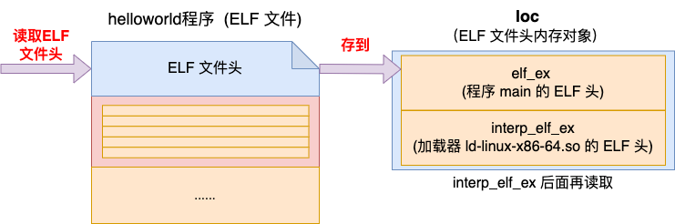

# 进程加载启动原理

> 读文献或看书时使用对文献本身的理解来观察自己的进度或衡量掌握情况是低效的。这个低效不是指动作慢，而是思路容易涣散，因此更容易遗忘。为了有效记忆，自己阅读时应该需要让从文献里提取的信息全方位为自己服务，应尽量避免被作者带着走，而是从“疑惑”和“挑刺”展开思路并延伸为笔记。如果原文中有能够为自己的疑惑和好奇服务的地方，就将其提取出来转化为自己的理解再写成笔记备查，如果仅仅是读出了一个将原文串联起来的思路而没有想法，那这篇文献可能读的不是时候，应该把笔记什么的放下，先移动到下一个焦点找好问题的枝干，等到意识到强关联性时再回来重读并梳理问题笔记。


- 新创建的新进程如何使用不同的代码？
- 编译链接后生成的可执行程序
- shell是如何将这个程序执行起来的？
- 程序的入口一定是main函数吗？

从源代码到最终的可运行程序需要经过编译，汇编和链接的过程。其中编译是将C, Java等语言通过词法分析、语法分析等转换成汇编代码，同时会生成源代码中对应的变量，函数等的符号表。汇编阶段会将汇编代码转换成目标文件object file，该文件包含了汇编代码转换后的机器代码以及相关的符号信息。最后，与库文件等链接生成最终的可执行文件（如Linux下的ELF文件），将源代码中对应的代码部分放到.text Section, 数据部分放到.bss和.data Section。那实际上这个过程并不涉及到具体的运行，其实只是将源代码反复变化格式，将对应的代码和数据整理好，整理成一个格式清晰并且适合系统加载和运行的文件。那么这里比较存在一些问题，比如符号表中的内容是啥样的，最终生成的可执行文件的格式是什么样的，以及为什么要这样组织等等众多问题，但是注意到目前为止都不涉及到执行。


## 可执行文件格式

从最简单的helloworld的例子来看,这里在Linux和MacOS上简单测试了一下，可以通过`file`和`readelf`来查看具体的可执行文件的格式。
```shell
# MaxOS
(base) ➜  malloc git:(master) ✗ file helloworld
helloworld: Mach-O 64-bit executable x86_64
# Linux
hong@hong-VMware-Virtual-Platform:~/Desktop$ file helloworld
helloworld: ELF 64-bit LSB pie executable, x86-64, version 1 (SYSV), dynamically linked, interpreter /lib64/ld-linux-x86-64.so.2, BuildID[sha1]=4ffd25c9334ceeb9d734e1dfdf881f0e0749b95d, for GNU/Linux 3.2.0, not stripped
```
通过file指令的结果可以看出，不同平台生成的可执行文件不同。Mach-O（Mach Object）是苹果公司的操作系统macOS中使用的可执行文件格式。它支持多种架构和文件类型，并提供了插件机制以支持动态链接库等功能。而ELF（Executable and Linkable Format）是Linux系统中使用的可执行文件格式。它也支持多种架构和文件类型，并提供了动态链接和加载等功能。

Linux系统的输出信息中, `ELF 64-bit LSB pie executable`表示当前的文件是一个ELF格式的64位可执行文件，Linux下的**目标文件、可执行文件和CoreDump**都按该格式进行存储。LSB的全称是Linux Standard Base，它是Linux标准规范，制定了应用程序与运行环境之间的二进制接口，以增强Linux发行版的兼容性。x86-64表示该可执行文件的CPU架构。

ELF可执行文件由四部分组成，分别是`ELF header, Program Header Table,Section`和`Section Table`四个部分组成。（两个Table都是索引列表，一个是segment的list，另一个是section的list。）如下为示意图。


### ELF Header

ELF header部分是识别elf文件的重要部分，其中包含了很多metadata,比如当前可执行文件的类型,程序的入口地址等。
**ELF header的大小，32位elf是52字节，64位elf是64字节。**可以通过`readelf --file-header ${program file}`指令查看可执行文件header的内容。

**问题：但是发现用readelf命令查看编译后的可执行文件类型时，发现文件类型是DYN (Shared object file)，而不是EXEC (Executable file)？**

```shell
hong@hong-VMware-Virtual-Platform:~/Desktop$ readelf --file-header helloworld
ELF Header:
  Magic:   7f 45 4c 46 02 01 01 00 00 00 00 00 00 00 00 00  # 主要用于外部程序快速地对这个文件进行识别，快速的判断文件类型是不是ELF
  Class:                             ELF64  # 表示文件是ELF64文件
  Data:                              2\'s complement, little endian
  Version:                           1 (current)
  OS/ABI:                            UNIX - System V
  ABI Version:                       0
  Type:                              DYN (Position-Independent Executable file) # EXEC表示可执行文件,REL表示可重定位的目标文件,DYN表示动态链接库,CORE表示系统调试coredump文件
  Machine:                           Advanced Micro Devices X86-64
  Version:                           0x1
  Entry point address:               0x1050 # 程序入口地址
  Start of program headers:          64 (bytes into file) # Program header的位置
  Start of section headers:          13984 (bytes into file) 
  Flags:                             0x0
  Size of this header:               64 (bytes) # ELF文件头大小 
  Size of program headers:           56 (bytes) # 每个Program header的大小
  Number of program headers:         13 # 总共有多少个program headers
  Size of section headers:           64 (bytes) # 每一个section header的大小
  Number of section headers:         31 # section header的数量
  Section header string table index: 30 
```
发现是gcc默认配置Configured with中的配置选项`--enable-default-pie`产生的,可以加上`-no-pie`禁用掉该默认选项。关于这个选项的内容，此处不是重点，不多展开。
```shell
hong@hong-VMware-Virtual-Platform:~/Desktop$ gcc -v
Using built-in specs.
COLLECT_GCC=gcc
COLLECT_LTO_WRAPPER=/usr/libexec/gcc/x86_64-linux-gnu/13/lto-wrapper
OFFLOAD_TARGET_NAMES=nvptx-none:amdgcn-amdhsa
OFFLOAD_TARGET_DEFAULT=1
Target: x86_64-linux-gnu
Configured with: ../src/configure -v --with-pkgversion='Ubuntu 13.3.0-6ubuntu2~24.04' --with-bugurl=file:///usr/share/doc/gcc-13/README.Bugs --enable-languages=c,ada,c++,go,d,fortran,objc,obj-c++,m2 --prefix=/usr --with-gcc-major-version-only --program-suffix=-13 --program-prefix=x86_64-linux-gnu- --enable-shared --enable-linker-build-id --libexecdir=/usr/libexec --without-included-gettext --enable-threads=posix --libdir=/usr/lib --enable-nls --enable-bootstrap --enable-clocale=gnu --enable-libstdcxx-debug --enable-libstdcxx-time=yes --with-default-libstdcxx-abi=new --enable-libstdcxx-backtrace --enable-gnu-unique-object --disable-vtable-verify --enable-plugin --enable-default-pie --with-system-zlib --enable-libphobos-checking=release --with-target-system-zlib=auto --enable-objc-gc=auto --enable-multiarch --disable-werror --enable-cet --with-arch-32=i686 --with-abi=m64 --with-multilib-list=m32,m64,mx32 --enable-multilib --with-tune=generic --enable-offload-targets=nvptx-none=/build/gcc-13-fG75Ri/gcc-13-13.3.0/debian/tmp-nvptx/usr,amdgcn-amdhsa=/build/gcc-13-fG75Ri/gcc-13-13.3.0/debian/tmp-gcn/usr --enable-offload-defaulted --without-cuda-driver --enable-checking=release --build=x86_64-linux-gnu --host=x86_64-linux-gnu --target=x86_64-linux-gnu --with-build-config=bootstrap-lto-lean --enable-link-serialization=2
Thread model: posix
Supported LTO compression algorithms: zlib zstd
gcc version 13.3.0 (Ubuntu 13.3.0-6ubuntu2~24.04) 
```
添加`-no-pie`选项后，可执行文件类型变成了EXEC:

```shell
# 添加-no-pie选项
gcc helloworld.c -no-pie -o helloworld
```


### Program Header Table

第二个部分就是Program Header Table,这里要辨别一下**Section和Segment的区别**。ELF内部中最重要的组成单位是Section，每一个Section都是由编译链接器生成的，都有不同的用途。例如编译器将代码编译后放到.text Section，将全局变量放到.bss Section中。但是对于操作系统来说，并不关注Section中的内容，只关心这块内容以什么权限(读写执行等)加载到内存，因此相同权限的Section可以一起组成Segment，以方便操作系统更快地加载。（一个是程序角度，一个是操作系统角度）

Program Header Table就是所有Segment的头信息，用来描述所有Segments的。可以通过以下指令`readelf --program-headers ${program file}`分析具体内容,测试结果如下：

```shell
hong@hong-VMware-Virtual-Platform:~/Desktop$ readelf --program-headers helloworld

Elf file type is EXEC (Executable file)
Entry point 0x401050
There are 13 program headers, starting at offset 64

Program Headers:
  Type           Offset             VirtAddr           PhysAddr
                 FileSiz            MemSiz              Flags  Align
  PHDR           0x0000000000000040 0x0000000000400040 0x0000000000400040
                 0x00000000000002d8 0x00000000000002d8  R      0x8
  INTERP         0x0000000000000318 0x0000000000400318 0x0000000000400318
                 0x000000000000001c 0x000000000000001c  R      0x1
      [Requesting program interpreter: /lib64/ld-linux-x86-64.so.2]
  LOAD           0x0000000000000000 0x0000000000400000 0x0000000000400000
                 0x0000000000000500 0x0000000000000500  R      0x1000
  LOAD           0x0000000000001000 0x0000000000401000 0x0000000000401000
                 0x0000000000000169 0x0000000000000169  R E    0x1000
  LOAD           0x0000000000002000 0x0000000000402000 0x0000000000402000
                 0x00000000000000ec 0x00000000000000ec  R      0x1000
  LOAD           0x0000000000002df8 0x0000000000403df8 0x0000000000403df8
                 0x0000000000000220 0x0000000000000228  RW     0x1000
  DYNAMIC        0x0000000000002e08 0x0000000000403e08 0x0000000000403e08
                 0x00000000000001d0 0x00000000000001d0  RW     0x8
  NOTE           0x0000000000000338 0x0000000000400338 0x0000000000400338
                 0x0000000000000030 0x0000000000000030  R      0x8
  NOTE           0x0000000000000368 0x0000000000400368 0x0000000000400368
                 0x0000000000000044 0x0000000000000044  R      0x4
  GNU_PROPERTY   0x0000000000000338 0x0000000000400338 0x0000000000400338
                 0x0000000000000030 0x0000000000000030  R      0x8
  GNU_EH_FRAME   0x0000000000002014 0x0000000000402014 0x0000000000402014
                 0x0000000000000034 0x0000000000000034  R      0x4
  GNU_STACK      0x0000000000000000 0x0000000000000000 0x0000000000000000
                 0x0000000000000000 0x0000000000000000  RW     0x10
  GNU_RELRO      0x0000000000002df8 0x0000000000403df8 0x0000000000403df8
                 0x0000000000000208 0x0000000000000208  R      0x1

 Section to Segment mapping:
  Segment Sections...
   00     
   01     .interp 
   02     .interp .note.gnu.property .note.gnu.build-id .note.ABI-tag .gnu.hash .dynsym .dynstr .gnu.version .gnu.version_r .rela.dyn .rela.plt 
   03     .init .plt .plt.sec .text .fini 
   04     .rodata .eh_frame_hdr .eh_frame 
   05     .init_array .fini_array .dynamic .got .got.plt .data .bss 
   06     .dynamic 
   07     .note.gnu.property 
   08     .note.gnu.build-id .note.ABI-tag 
   09     .note.gnu.property 
   10     .eh_frame_hdr 
   11     
   12     .init_array .fini_array .dynamic .got 
```
其中一些字段含义如下:
- offset:表示当前Segment在二进制文件中的开始位置
- virtaddr:表示加载到虚拟内存后的地址
- filesiz:表示当前Segment的大小
- flag:表示当前的Segment的权限类型，R表示可读，E表示可执行，W表示可写

最下面显示的是每个Segment是由哪几个Section组成的。每个Section的Type类型虽然包括PHDR,INTERP,LOAD,DYNAMIC,NOTE,GNU_EH_FRAME,GNU_STACK,GNU_RELRO等多种,但是**只有LOAD是需要被加载到内存中供运行时使用的**。

**问题:就是上面说的加载到虚拟内存中地址我不理解，现在还没有开始运行，也就是还没有task_struct，为什么会有对应的虚拟内存地址的分配？程序的入口地址是如何选择的？**
- 在链接阶段，链接器会根据链接器脚本（linker script）来确定各段在虚拟地址空间中的起始地址。链接器脚本是一种特殊的文本文件，它指导链接器如何安排输出文件的段。例如，在一个典型的 Linux 系统的链接器脚本中，对于可执行文件，代码段（.text）通常会被放置在相对较低的虚拟地址处，并且起始地址一般是一个满足特定对齐要求的地址。比如，起始地址可能是 0x08048000（对于32位程序）或 0x400000（对于64位程序）。这是因为这些地址在操作系统为进程分配的虚拟地址空间中比较合适，方便程序的加载和运行。数据段（.data）等其他段的起始地址会根据代码段的大小和链接器脚本中的布局规则来确定，通常是紧跟在代码段后面，并且也满足一定的对齐要求，如按照页面大小（通常是4KB）对齐等。这样可以提高内存访问效率，因为现代操作系统的内存管理是以页面为单位进行的。

- 链接器会根据链接器脚本或者默认的规则来确定程序的入口地址。在链接器脚本中有ENTRY命令，可以用来明确指定程序的入口地址。例如，在链接器脚本中写上ENTRY（start），那么程序就会从标签为start的地址开始执行。如果没有显式指定地址入口，链接器通常会将程序的入口地址设置为第一个输入到链接器的目标文件中第一个可执行指令的地址。对于大多数C语言编写的程序来说，程序的入口地址通常是_cstart函数或者_start函数的地址。这些函数是程序启动代码的一部分，负责初始化程序的运行环境，如设置栈、初始化全局变量等，然后再调用main函数。

- **感觉只要是在虚拟地址空间范围内合理的不重合的地址就可以。所以实际上就是一些操作系统启动代码是由编译器生成的，这些启动代码的起始地址就是程序的入口地址。启动代码会完成诸如调用全局构造函数、设置程序参数等操作，然后将控制权交给用户编写的main函数。这种默认的入口地址设置方式是为了方便程序的编写和运行，让开发者可以专注于业务逻辑的编写，而不需要过多考虑程序的启动细节。**

- 当操作系统加载可执行文件时，会根据程序头部表中的信息将各个段加载到进程的虚拟地址空间中。操作系统会根据每个段的虚拟地址信息动态分配虚拟地址空间，并将段映射到这些虚拟地址空间中的对应位置。这样，程序在运行时能够正确访问到各个段的内容。

### Section Header Table

Program Header Table描述每一个Segment，而Section Header Table直接描述每一个Section,**一个针对加载,一个针对链接**。每个Section也都有一些固定的字段用来描述当前的Section的信息。在二进制文件中的位置通过Offset列表示。Section大小通过Size列体现。

问题：一个针对加载一个针对链接是什么意思？加载看起来是在程序要运行之前加载到内存，链接看起来是编译阶段的事儿？
- Program Header Table（程序头部表）针对加载。程序头部表描述了操作系统加载程序到内存时所需的段的信息，这些段被称为程序段（Segment）。每个程序段包含一组相关的节（Section），这些节在加载时被映射到同一个内存区域。程序头部表中的每个条目（Program Header）指定了一个程序段在文件中的位置（偏移量）、大小、在内存中的起始地址、内存中的大小、访问权限（如可读、可写、可执行）等信息。操作系统在加载程序时会根据程序头部表中的信息，将相应的程序段加载到指定的内存地址，并设置相应的访问权限。例如，代码段（.text）通常会被标记为可读和可执行，数据段（.data）会被标记为可读和可写。
- Section Header Table（段头部表）针对链接。段头部表描述了链接器在链接过程中所需的操作细节，每个节（Section）都有一个对应的段头部表条目（Section Header），该条目包含了节的名称、类型、地址、偏移量、大小、标志等信息。链接器会根据段头部表中的信息来合并和重定位各个节，以生成最终的可执行文件。例如，链接器会将多个目标文件中的代码节（.text）合并到一个代码段中，并对其中的符号进行重定位，使其能够正确地引用其他节中的数据和代码。

```shell
hong@hong-VMware-Virtual-Platform:~/Desktop$ readelf --section-headers helloworld
There are 31 section headers, starting at offset 0x3640:

Section Headers:
  [Nr] Name              Type             Address           Offset
       Size              EntSize          Flags  Link  Info  Align
  [ 0]                   NULL             0000000000000000  00000000
       0000000000000000  0000000000000000           0     0     0
  [ 1] .interp           PROGBITS         0000000000400318  00000318
       000000000000001c  0000000000000000   A       0     0     1
  [ 2] .note.gnu.pr[...] NOTE             0000000000400338  00000338
       0000000000000030  0000000000000000   A       0     0     8
  [ 3] .note.gnu.bu[...] NOTE             0000000000400368  00000368
       0000000000000024  0000000000000000   A       0     0     4
  [ 4] .note.ABI-tag     NOTE             000000000040038c  0000038c
       0000000000000020  0000000000000000   A       0     0     4
  [ 5] .gnu.hash         GNU_HASH         00000000004003b0  000003b0
       000000000000001c  0000000000000000   A       6     0     8
  [ 6] .dynsym           DYNSYM           00000000004003d0  000003d0
       0000000000000060  0000000000000018   A       7     1     8
  [ 7] .dynstr           STRTAB           0000000000400430  00000430
       000000000000004a  0000000000000000   A       0     0     1
  [ 8] .gnu.version      VERSYM           000000000040047a  0000047a
       0000000000000008  0000000000000002   A       6     0     2
  [ 9] .gnu.version_r    VERNEED          0000000000400488  00000488
       0000000000000030  0000000000000000   A       7     1     8
  [10] .rela.dyn         RELA             00000000004004b8  000004b8
       0000000000000030  0000000000000018   A       6     0     8
  [11] .rela.plt         RELA             00000000004004e8  000004e8
       0000000000000018  0000000000000018  AI       6    24     8
  [12] .init             PROGBITS         0000000000401000  00001000
       000000000000001b  0000000000000000  AX       0     0     4
  [13] .plt              PROGBITS         0000000000401020  00001020
       0000000000000020  0000000000000010  AX       0     0     16
  [14] .plt.sec          PROGBITS         0000000000401040  00001040
       0000000000000010  0000000000000010  AX       0     0     16
  [15] .text             PROGBITS         0000000000401050  00001050
       0000000000000109  0000000000000000  AX       0     0     16
  [16] .fini             PROGBITS         000000000040115c  0000115c
       000000000000000d  0000000000000000  AX       0     0     4
  [17] .rodata           PROGBITS         0000000000402000  00002000
       0000000000000011  0000000000000000   A       0     0     4
  [18] .eh_frame_hdr     PROGBITS         0000000000402014  00002014
       0000000000000034  0000000000000000   A       0     0     4
  [19] .eh_frame         PROGBITS         0000000000402048  00002048
       00000000000000a4  0000000000000000   A       0     0     8
  [20] .init_array       INIT_ARRAY       0000000000403df8  00002df8
       0000000000000008  0000000000000008  WA       0     0     8
  [21] .fini_array       FINI_ARRAY       0000000000403e00  00002e00
       0000000000000008  0000000000000008  WA       0     0     8
  [22] .dynamic          DYNAMIC          0000000000403e08  00002e08
       00000000000001d0  0000000000000010  WA       7     0     8
  [23] .got              PROGBITS         0000000000403fd8  00002fd8
       0000000000000010  0000000000000008  WA       0     0     8
  [24] .got.plt          PROGBITS         0000000000403fe8  00002fe8
       0000000000000020  0000000000000008  WA       0     0     8
  [25] .data             PROGBITS         0000000000404008  00003008
       0000000000000010  0000000000000000  WA       0     0     8
  [26] .bss              NOBITS           0000000000404018  00003018
       0000000000000008  0000000000000000  WA       0     0     1
  [27] .comment          PROGBITS         0000000000000000  00003018
       000000000000002b  0000000000000001  MS       0     0     1
  [28] .symtab           SYMTAB           0000000000000000  00003048
       0000000000000330  0000000000000018          29    18     8
  [29] .strtab           STRTAB           0000000000000000  00003378
       00000000000001a8  0000000000000000           0     0     1
  [30] .shstrtab         STRTAB           0000000000000000  00003520
       000000000000011f  0000000000000000           0     0     1
Key to Flags:
  W (write), A (alloc), X (execute), M (merge), S (strings), I (info),
  L (link order), O (extra OS processing required), G (group), T (TLS),
  C (compressed), x (unknown), o (OS specific), E (exclude),
  D (mbind), l (large), p (processor specific)
```
Section有很多种类型，每种类型都有独特的作用。其中比较重要的是.text,.data,.bss。编译后的代码要放到.text,可以看到.text的Address和最开始的ELF header的Entry point address显示的入口地址是一样的。.data和.bss也很重要。未初始化的内存区域位于.data,已经初始化的内存区域位于.bss。
```c
int data1;          // 未初始化内存区域位于.data
int data2 = 100;    // 已经初始化的内存区域位于.bss
```

nm命令是linux下自带的特定文件分析工具，一般用来检查分析二进制文件、库文件、可执行文件中的**符号表**，返回二进制文件中各段的信息。通常ELF格式中具有2种符号表：
- .symtab ：该文件中接触到的所有符号都能在这找到，不会被载入到内存中
- .dynsym ： .symtab 的子集，提供给动态链接器使用，会被载入到内存中
```shell
hong@hong-VMware-Virtual-Platform:~/Desktop$ nm -n helloworld
                 w __gmon_start__
                 U __libc_start_main@GLIBC_2.34
                 U printf@GLIBC_2.2.5
000000000040038c r __abi_tag
0000000000401000 T _init
0000000000401050 T _start  # 入口
0000000000401080 T _dl_relocate_static_pie
0000000000401090 t deregister_tm_clones
00000000004010c0 t register_tm_clones
0000000000401100 t __do_global_dtors_aux
0000000000401130 t frame_dummy
0000000000401136 T main
000000000040115c T _fini
0000000000402000 R _IO_stdin_used
0000000000402014 r __GNU_EH_FRAME_HDR
00000000004020e8 r __FRAME_END__
0000000000403df8 d __frame_dummy_init_array_entry
0000000000403e00 d __do_global_dtors_aux_fini_array_entry
0000000000403e08 d _DYNAMIC
0000000000403fe8 d _GLOBAL_OFFSET_TABLE_
0000000000404008 D __data_start
0000000000404008 W data_start
0000000000404010 D __dso_handle
0000000000404018 B __bss_start
0000000000404018 b completed.0
0000000000404018 D _edata
0000000000404018 D __TMC_END__
0000000000404020 B _end
```

通过以上内容可以看出_start函数的地址0000000000401050和前面的.text Section入口地址一致。打印helloworld程序调用栈可以发现:
```c
Breakpoint 1, foo () at helloworld.c:8
8	    printf("%s...\n", __FUNCTION__);
(gdb) bt
#0  foo () at helloworld.c:8
#1  0x00007ffff7c2a304 in call_init (env=<optimized out>, argv=0x7fffffffdeb8, argc=1)
    at ../csu/libc-start.c:145
#2  __libc_start_main_impl (main=0x555555555172 <main>, argc=1, argv=0x7fffffffdeb8, init=<optimized out>, 
    fini=<optimized out>, rtld_fini=<optimized out>, stack_end=0x7fffffffdea8) at ../csu/libc-start.c:347
#3  0x0000555555555085 in _start ()
```
_start函数是glibc提供的函数，在glibc源码中实现，是一个汇编函数。该函数进行了一些寄存器和栈操作，然后进入到`__libc_start_main`进行启动过程。_start函数中做了一些准备工作，将argc, argv，程序的构造函数__libc_csu_init, 析构函数__libc_csu_fini和main函数都通过参数传递给__libc_start_main。
```c
// file:sysdeps/x86_64/elf/start.S
    .text
    .global _start
    .type _start, @function
_start:
    /**
    Extract the arguments as encoded on the stack and set up the arguments for __libc_start_main(int (*main))(int, char**, char**),
    int argc, char *argv,
    void (*init)(void), void(*fini)(void),
    void (*rfld_fini)(void), void *stack_end).
    The arguments are passed via registers and on the stack:
    main:       %rdi
    argc:       %rsi
    argv:       %rdx
    init:       %rcx
    fini:       %r8
    rtld_fini:  %r9
    stack_end:  stack
    */

movq $__libc_csu_fini, %r8
    movq $__libc_csu_init, %rcx
    movq $BP_SYM(main), %rdi
call BP_SYM (__libc_start_main)
```
__libc_start_main函数如下,主要工作是在generic_start_main完成的:
```c
// file/sysdeps/powerpc/elf/libc-start.c
/* The main work is done in the generic function */
#define LIBC_START_MAIN generic_start_main
int BP_SYM(__libc_start_main)(...){
    ...
    return generic_start_main(stinfo->main, argc, ubp_av, auxvec, 
            stinfo->init,  stinfo->fini, rtld_fini,
            stack_on_entry);
}
```
LIBC_START_MAIN是一个宏，实际上就是generic_start_main。兼容方便调用。
generic_start_main函数定义如下:
```c
STATIC int 
LIBC_START_MAIN(int (*main)(int, char**, char** MAIN_AUXVEC_DECL),...){
    //1. 注册退出析构函数
    __cxa_ateinit(...)
    //2. 初始化
    if(init) (*init)(#ifdef INIT_MAIN_ARGS argc, argv, __environ MAIN_AUXVEC_PARAM #endif);
    //3. 进入main函数处理
    result = main(argc, argv, __environ MAIN_AUCVEC_PARAM);
    exit(result);
}
```


## shell启动用户进程
生成可执行程序后就是使用shell将其加载并运行，一般shell进程通过fork+execve加载并运行新进程。
```c
// shell example
int main(int argc, char * argc[]){
    ...
    pid = fork();
    if (pid == 0){ // 如果在子进程中
        execve("helloworld", argv, envp);// 使用exec系列函数加载并运行可执行文件
    }
}
```
shell进程先通过fork系统调用创建一个进程。然后在子进程中调用execve加载执行的程序文件，然后就可以跳转到程序文件的入口处也就是_start开始运行，_start会初始化一些变量，然后调用__libc_start_main->generic_start_main, 其中会先注册析构函数，然后调用`__libc_csu_init`函数。在`__libc_csu_init`执行的时候，会调用一个`__do_global_ctors_aux`函数执行所有全局对象的构造，也会建立打开文件表，初始化标准输入输出流。然后真正执行main函数。

```c
// file:kernel/fork.c
SYSCALL_DEFINE0(fork){
    ...
    return kernel_clone(&args);
}

// file:kernel/fork.c
pid_t kernel_clone(struct kernel_clone_args *args){
    // 复制一个task_struct
    struct task_struct * p;
    p = copy_process(NULL, trace, NUMA_NO_NODE, args); // 复制父进程生成一个新的task_struct

    //子任务加入就绪队列，等待调度器调度
    wake_up_new_task(p);
    .....
}

// file:kernel/fork.c
static struct task_struct *copy_process(...){
    // 1. 复制task_struct结构体
    struct task_struct * p = dup_task_struct(current);
    // 2. 进程核心元素初始化
    retval = copy_files(clone_flags,p);
    retval = copy_fs(clone_flags, p);
    retval = copy_mm(clone_flags, p);
    retval = copy_namespaces(clone_flags, p);
    // 3. 申请PID并设置进程号
    pid = alloc_pid(p->nsproxy->pid_ns);
    p->pid = pid_nr(pid);
    p->tgid = p->pid;
}

```


fork系统调用只能根据shell进程复制一个新进程，这个新进程里的代码,数据都还是和原来的shell进程一样，要想加载并运行另外一个程序，还需要execve系统调用。该系统调用会读取用户输入的可执行文件名,参数列表及环境变量等开始加载并运行用户指定的可执行文件。


```c
// file:fs/exec.c
SYSCALL_DEFINE3(execve, const char __user * , filename , ...){
     return do_execve(getname(filename), argv, envp); // 文件名，参数列表，环境变量
}

int do_execve(...){
     return do_execveat_common(AT_FDCWD, filename, argv, envp, 0);
}

static int do_execveat_common(int fd, struct filename *filename, ...){
     // 1. 保存加载二进制文件使用的参数 paramter
     struct linux_binprm * bprm; 
     // 2. 申请并初始化bprm对象值
     bprm = alloc_bprm(fd, filename); 
     bprm->argc = count(argv, MAX_ARG_STRINGS);
     bprm->envc = count(envp, MAX_ARG_STRINGS);
     ...
     // 3. 执行加载
     bprm_execve(bprm, fd, filename, flags);// 读取可执行文件的头128字节，并选择加载器
}
```
初始化bprm对象的过程如下：


申请并初始化bprm对象的过程如下：
1. 申请linux_binprm内核对象
2. 调用bprm_mm_init申请一个全新的地址空间mm_struct对象，准备留着給新进程使用
3. 调用__bprm_mm_init給新进程的栈申请一页的虚拟内存空间，并将栈指针记录下来，**将vma放到进程地址空间mm_struct的红黑树中管理**

内核对象linux_binprm是进程加载过程中的一个结构，可以理解为一个临时对象。在加载的时候，该内核对象用来保存加载二进制文件时使用的参数等信息，为进程申请的虚拟地址空间以及分配的栈内存也会临时在这里放一会儿。等到进程加载完毕，这个对象就没什么用了。
```c
// file:fs/exec.c
static struct linux_binprm * alloc_bprm(int fd, struct filename *filename){
     struct linux_binprm * bprm = kzalloc(sizeof(*bprm), GFP_KERNEL);
     bprm->filename = ...
     bprm_mm_init(bprm);
     ...
     return bprm;
}

static int bprm_mm_init(struct linux_binprm* bprm){
     //申请一个全新的地址空间mm_struct对象
     bprm->mm = mm = mm_alloc();
     __bprm_mm_init(bprm);
}

static int __bprm_mm_inti(struct linux_binprm* bprm){
     struct mm_struct *mm = bprm->mm;
     ...
     // 申请占用一段地址范围
     // 虚拟地址空间中，每一段地址范围都是用一个vma对象来表示的。vma的vm_start, vm_end两个成员共同声明了当前vma所占用的地址空间范围
     bprm->vma = vma = kmem_cache_zalloc(vm_area_cachep, GFP_KERNEL);
     vma->vm_end = STACK_TOP_MAX; // 地址空间的顶部附近的位置
     vma->vm_start = vma->vm_end - PAGE_SIZE; // 默认申请4KB的地址范围

     // 将这段地址范围放入虚拟地址空间对象中管理
     insert_vm_struct(mm, vma);
     ...
     bprm->p = vma->vm_end - sizeof(void *);//最后将栈指针记录在bprm->p中
}
```
问题：为什么这里先赋值vm_end,再赋值vm_start,而且为什么要赋值为STACK_TOP_MAX？

栈的生长方向是从高地址向低地址生长。先设置vm_end可以明确栈的顶部位置，然后通过简单的减法（vm_end - PAGE_SIZE）来计算出栈的底部位置（vm_start）。这样可以确保栈的大小是正确的，并且边界清晰。先设置vm_end为一个较大的地址（STACK_TOP_MAX），可以为后续可能的栈扩展提供空间。如果先设置vm_start，可能会限制栈向上扩展的能力。STACK_TOP_MAX是用户空间中栈可以占用的最大地址，将其作为栈的初始顶部地址，可以为栈提供尽可能大的空间，避免栈溢出。STACK_TOP_MAX是一个安全的边界值，位于用户空间和内核空间的交界处，将栈的顶部设置为这个值可以防止栈向上生长到内核空间。
```c
// file:fs/exec.c
static int search_binary_handler(struct linux_binprm *bprm){
     //读取可执行文件头，判断文件格式
     prepare_binprm(bprm);
     ...
     // 尝试启动加载
     // 遍历formats中已经注册的全局链表，根据二进制文件头中携带的文件类型数据查找解析器
     // 找到后调用解析器的函数对二进制文件进行加载
retry:
     list_for_each_entry(fmt, &formats, lh){
          retval = fmt->load_binary(bprm); //判断每一个链表元素是否有load_binary函数，如果有尝试使用其进行加载
          ...
          // 加载成功返回
          if(bprm->point_of_no_return || (retval != -ENOEXEC)){
               return retval;
          }
          ...
          // 否则继续尝试
          goto retry;
     }
}

// file:include/uapi/linux/binfmts.h
#define BINPRM_BUF_SIZE 256

// file:fs/exec.c
int prepare_binprm(struct linux_binprm *bprm){
     ...
     memset(bprm->buf,0,BINPRM_BUF_SIZE);
     return kernel_read(bprm->file, 0, bprm->buf,BINPRM_BUF_SIZE);
}


```
Linux在启动的时候，会将自己支持的所有可执行文件的解析器全部加载上，并使用一个formats双向链表来保存所有的解析器。Linux中支持的可执行文件格式如下:
- ELF:Linux上最常用的可执行文件格式
- aout:主要是为了和以前兼容，由于不支持动态链接，所以被ELF取代
- EM86：主要作用是在Alpha的主机上运行Intel的Linux二进制文件


Linux中每一个加载器都用一个linux_binfmt的结构来表示，其中规定了加载二进制可执行文件的load_binary函数指针,以及加载崩溃文件的coredump函数等.
```c
// file:include/linux/binfmts.h
struct linux_binfmt{
     ...
     int (*load_binary)(struct linux_binprm*);
     int (*load_shlib)(struct file*);
     int (*core_dump)(struct coredump_params *cprm);
};

// file:fs/binfmt_elf.c
static struct linux_binfmt elf_format = {
     .module = THIS_MODULE,
     .load_binary = load_elf_binary, // 具体的加载函数，elf加载的入口
     .load_shlib = load_elf_library,
     .core_dump = elf_core_dump,
     .min_coredump = ELF_EXEC_PAGESIZE,
};
```
加载器elf_format会在初始化的时候通过register_binfmt进行注册：
```c
// file:fs/binfmt_elf.c
static int __init init_elf_binfmt(void){
     register_binfmt(&elf_format); // 将加载器挂到formats全局链表中
     return 0;
}

// file:fs/exec.c
static LIST_HEAD(formats);

void __register_binfmt(struct linux_binfmt * fmt, int insert){
     ...
     insert? list_add(&fmt->lh, &formats):
          list_add_tail(&fmt->lh, &formats);
}
```
在源码目录中搜索register_binfmt,可以搜索到Linux操作系统支持的所有格式的加载器，将来Linux加载二进制文件时会遍历formats链表，根据要加载的文件格式来查询合适的加载器:

```shell
# grep -r "register_binfmt" *
fs/binfmt_flat.c: register_binfmt(&flat_format);
fs/binfmt_elf_fdpic.c: register_binfmt(&elf_fdpic_format);
fs/binfmt_som.c: register_binfmt(&som_format);
fs/binfmt_elf.c: register_binfmt(&elf_format);
fs/binfmt_aout.c: register_binfmt(&aout_format);
fs/binfmt_script.c: register_binfmt(&script_format);
fs/binfmt_em86.c: register_binfmt(&em86_format);
```


## ELF文件加载过程
根据上面的内容，读取文件头128字节，判断可执行文件格式遍历加载器执行load_binary函数。本小节介绍的就是load_binary函数到底干了啥。基本上所有的程序加载逻辑都在这个函数中体现了。这个函数的主要工作如下:
1. ELF文件头读取
2. Program Header读取，读取所有的Segment
3. 清空父进程继承来的虚拟地址空间等资源
4. 执行Segment的加载
5. 数据段内存申请，堆初始化
6. 跳转到程序入口点执行
### 读取ELF文件头
do_execve_common函数中已经将ELF文件头读取到bprm->buf中，这里直接复制这段内存就好了。

```c
// file:fs/binfmt_elf.c
static int load_elf_binary(struct linux_binprm * bprm){
     // 文件头解析
     struct elfhdr *elf_ex = (struct elfhdr*)bprm->buf;
     struct elfhdr *interp_elf_ex = NULL;

     // 对头部进行一系列的合法性判断，不合法则直接退出
     if(elf_ex->e_type != ET_EXEC && elf_ex->e_type != ET_DYN) // ET_EXEC 表示独立的可执行文件，ET_DYN 表示需要动态链接的可执行文件
          goto out;
     ...
     // 申请interp_elf_ex对象
     interp_elf_ex = kmalloc(sizeof(*interp_elf_ex), GFP_KERNEL);
}
```
问题:interp_elf_ex对象是存储什么文件头的？

当处理一个动态链接的ELF文件时，需要加载并解析解释器文件。`interp_elf_ex`用于存储解释器文件的ELF文件头信息。如果可执行文件是动态链接类型`(e_type == ET_DYN)`，代码会读取解释器文件的内容，并将其ELF头信息存储到`interp_elf_ex`中。解释器文件ELF头信息用于判断解释器文件的合法性，以及获取解释器文件的加载地址等信息。解释器本身也是一个ELF文件，它会先于主程序运行，完成动态链接和加载工作。
动态链接器（也称为解释器）是一个特殊的程序，它负责在程序运行时加载所需的共享库，并将程序中的动态符号引用解析为实际的内存地址。对于 ELF 文件格式的可执行文件，动态链接器本身也是一个 ELF 文件。ELF 解析器主要负责解析 ELF 文件的头部信息、程序头部表、节头部表等内容，以确定如何正确地加载和执行程序。它会检查 ELF 文件的合法性，提取程序的加载地址、内存布局等信息。

内核中的ELF解析器首先读取可执行文件的ELF头部信息，判断文件类型是否为ET_DYN（动态链接）。如果是动态链接文件，它会查找并提取解释器（动态链接器）的路径。内核根据提取的解释器路径，加载动态链接器到内存中，并将控制权交给动态链接器。动态链接器进一步解析可执行文件的ELF头部和程序头部表，确定程序的内存布局和加载地址。同时，它还会解析程序中的动态符号引用，查找并加载所需的共享库。在动态链接器完成所有符号解析和共享库加载后，将控制权转交给主程序，开始执行程序的代码。

### 读取Program Header
在ELF文件头中记录着Program Header的数量，而且在ELF头之后紧接着就是Program Header Tables。所以内核接下来可以将所有的Program Header都读取出来。


```c
// file:fs/binfmt_elf.c
static int load_elf_binary(struct linux_binprm * bprm){
      //1. ELF 文件头解析
      //2. 读取Program Header
      elf_phdata = load_elf_phdrs(elf_ex, bprm->file);
      if(!elf_phdata)
          goto out;
}

//file:fs/binfmt_elf.c
static struct elf_phdr *load_elf_phdrs(const struct elfhdr *elf_ex, struct file *elf_file)
{
 // elf_ex.e_phnum 中保存的是Program Header数量,再根据Program Header大小sizeof(struct elf_phdr)
 // 一起计算出所有的 Program Header 大小，并读取进来
 size = loc->elf_ex.e_phnum * sizeof(struct elf_phdr);

 // 申请内存并读取
 elf_phdata = kmalloc(size, GFP_KERNEL);
 elf_read(elf_file, elf_phdata, size, elf_ex->e_phoff);//将可执行文件在磁盘上保存的内容读取到内存中
 
 ...
 return elf_phdata;
}
```
**内核在内存的使用上和用户进程中的虚拟地址空间是不一样的，kmalloc系列的函数都是直接在伙伴系统所管理的物理内存中分配的，不需要触发缺页中断。**


### 清空父进程继承来的资源
fork系统调用创建的进程和原进程信息一致，这些在新的程序运行时并没有甚么用，所以需要清空一下。具体工作包括初始化新进程的信号表，应用新的虚拟地址空间对象等。


注意这里最后是将栈指针拷贝到新的mm中，而不是让linux_binprm中的栈指针指向mm中的p。
```c
//file:fs/binfmt_elf.c
static int load_elf_binary(struct linux_binprm *bprm)
{
 //4.1 ELF 文件头解析
 //4.2 Program Header 读取

 //4.3 清空父进程继承来的资源
 //retval = flush_old_exec(bprm);
 begin_new_exec(bprm);
 ...
 //使用新栈
 setup_arg_pages(bprm, randomize_stack_top(STACK_TOP), executable_stack);
 ...
}

// file:fs/exec.c
int begin_new_exec(struct linux_binprm * bprm){
     // 确保文件表不共享
     unshare_files();
     // 释放所有旧的mmap
     exec_mmap(bprm->mm);
     // 确保信号表不共享
     unshare_sighand(me);
     ...
}

// file:fs/exec.c
static int exec_mmap(struct mm_struct * mm){
     struct task_struct * tsk;
     struct mm_struct * old_mm, *active_mm;
     tsk = current;
     old_mm = current->mm;

     // 释放旧空间
     exec_mm_release(tsk, old_mm);

     // 使用bprm中保存的新的地址空间
     tsk->mm = mm;
}

// file:fs/exec.c
int setup_arg_pages(struct linux_binprm *bprm,
                    unsigned long stack_top,
                    int executable_stack){
     ...
     current->mm->start_stack = bprm->p; // 为新进程设置新的栈备用
     ...
}
```


### 执行Segment加载
接下来是将ELF文件中LOAD类型的Segment加载到内存，实用elf_map在虚拟地址空间中为其分配虚拟内存。最后恰当地设置虚拟地址空间mm_struct中的start_code, end_code, start_data, end_data等各个地址空间相关指针。<font color=#dfa>**只有LOAD类型的Segment是需要被映射到内存的。**</font>


计算好内存地址后，调用elf_map将磁盘文件中的内容和虚拟地址空间建立映射，等到访问的时候发生缺页中断加载磁盘文件中的代码或数据。最后设置虚拟地址空间中的代码段。数据段相关的指针是:start_code, end_code, start_data, end_data。


```c
// file:fs/binfmt_elf.c
static int load_elf_binary(struct linux_binprm * bprm){

     ...
     // 执行Segment加载
     // 遍历可执行文件的Program Header
     for(i = 0, elf_ppnt = elf_phdata; i < elf_ex->e_phnum; i++, elf_ppnt++){
          // 只加载类型为LOAD的Segment，否则跳过
          if(elf_ppnt->p_type!=PT_LOAD)
               continue;
          ...
          // 为Segment建立内存mmap, 等程序文件中的内容映射到虚拟内存空间
           // load_bias是Segment要加载到内存的基地址
           /**
           1. 0:直接按照ELF文件中的地址在内存中进行映射
           2. 对齐到整数页的开始:物理文件中可能为了可执行文件的大小足够紧凑，而不考虑对齐的问题。但是OS在加载的时候为了运行效率，需要将Segment加载到整数页的开始位置
           */
          elf_map(bprm->file, load_bias + vaddr, elf_ppnt,
                 elf_prot,elf_flags, total_size); 
         

          // 计算mm_struct所需的各个成员地址
          start_code = ...;
          start_data = ...;
          end_code = ...;
          end_data = ...'
          ......
     }
     mm = current->mm;
     mm->end_code = end_code;
     mm->start_code = start_code;
     mm->start_data = start_data;
     mm->end_data = end_data;
     mm->start_stack = bprm->p;
     ......
}
```

### 数据内存申请和堆初始化

现在虚拟地址空间中的代码段,数据段和栈都已经准备就绪, 还有一个堆内存需要初始化。


```c
// file:fs/binfmt_elf.c
static int load_elf_binary(struct linux_binprm * bprm){
     // 数据内存申请&堆初始化
     retval = set_brk(elf_bss, elf_brk, bss_port);
     if(retval)
          goto out_free_dentry;
     ...
}

static int set_brk(unsigned long start, unsigned long end){
     // 1. 为数据段申请虚拟内存
     start = ELF_PAGEALIGN(start);// 内存对齐
     end = ELF_PAGEALIGN(end);
     if(end > start){
          vm_brk_flags(start, end-start, prot&PROT_EXEC ? VM_EXEC:0);
     }

     // 2. 初始化堆的开始指针和结束指针
     // start_brk 开始指针
     // brk 结束指针
     // 程序初始化时，堆上还是空的，堆从下往上增长，所以堆的开始地址
     current->mm->start_brk = current->mm->brk = end;
     return 0;
}
```
<font color=#sdfa88>**代码中常用的malloc就是用来修改brk相关的指针来实现内存申请的。**</font>

**问题：为什么执行Segment加载过程后还需要为数据段申请虚拟内存？为什么没有为代码段申请虚拟内存？**

在 ELF 文件加载过程中，代码段和数据段的处理方式有所不同。
- 代码段（.text）通常包含可执行的机器指令，这些指令在程序运行时是只读的。
在加载过程中，内核会直接将代码段从 ELF 文件映射到进程的虚拟地址空间中。这个过程是通过 mmap 系统调用实现的，内核会根据 ELF 文件的程序头部表（Program Header Table）中的信息，将代码段映射到合适的虚拟内存区域。因此，代码段的虚拟内存是直接通过 mmap 映射的，不需要额外申请。
- 数据段（.data）包含程序中的全局变量和静态变量，这些数据在程序运行时可能会被修改。
数据段的初始化部分（包含初始值的数据）也会从 ELF 文件映射到虚拟地址空间中，类似于代码段的处理。但数据段的未初始化部分（BSS 段）需要分配内存并初始化为零。这部分内存没有对应的文件内容，因此需要通过 vm_brk_flags 等函数来申请虚拟内存并进行初始化。

代码段的虚拟内存是通过**mmap映射**的，而不是通过`vm_brk_flags`申请的。这是因为代码段的内容直接来源于ELF文件，内核可以直接根据程序头部表中的信息将代码段映射到进程的地址空间中，而不需要额外分配内存。start_data、end_data、start_code、end_code 等变量用于记录代码段和数据段在内存中的位置。这些信息主要用于调试和内存管理等目的。虽然这些信息记录了代码段和数据段的范围，但它们本身并不直接分配虚拟内存。只有当内核通过`mmap`或`vm_brk_flags`等函数实际分配虚拟内存时，才会创建相应的`vm_area_struct`。因此，如果没有为某个内存区域分配`vm_area_struct`，则说明该区域尚未实际分配虚拟内存。


### 跳转到程序入口执行

在ELF文件头中记录了程序的入口地址。如果是<font color=#dfg235>**非动态链接加载**</font>的情况，入口地址就是这个。但如果是<font color=#dfg235>**动态链接加载**</font>的，也就是说存在INTERP类型的Segment，由这个动态链接器先来加载运行，然后再调回程序的代码入口地址。


```shell
hong@hong-VMware-Virtual-Platform:~/Desktop$ readelf --program-headers helloworld

Elf file type is DYN (Position-Independent Executable file)
Entry point 0x1060
There are 13 program headers, starting at offset 64

Program Headers:
  Type           Offset             VirtAddr           PhysAddr
                 FileSiz            MemSiz              Flags  Align
  INTERP         0x0000000000000318 0x0000000000000318 0x0000000000000318
                 0x000000000000001c 0x000000000000001c  R      0x1
      [Requesting program interpreter: /lib64/ld-linux-x86-64.so.2]
```
对于动态加载器类型的Segment，需要先将动态链接器(/lib64/ld-linux-x86-64.so.2)加载到地址空间。
```c
// file:fs/binfmt_elf.c
static int load_elf_binary(struct linux_binprm * bprm){
     // 第一次遍历Program Header Table
     // 只针对PT_INTERP类型的Segment做预处理
     // 这个Segment中保存着动态链接器在文件系统中的路径信息
     for(i = 0; i < loc->elf_ex.e_phnum; i++){
          ...
     }

     // 第二次遍历Program Header Table
     elf_ppnt = elf_phdata;
     for(i = 0; i < loc->elf_ex.e_phnum; i++, elf_ppnt++){
          ...
     }

     // 如果程序中指定了动态链接器，就把动态链接器程序读出来
     if(elf_interpreter){
          // 加载并返回动态链接器代码段地址
          elf_entry = load_elf_interp(&loc->interp_elf_ex, 
                                        interpreter,
                                        &interp_map_addr,
                                        load_bias);
          // 计算动态链接器入口地址
          elf_entry += loc->interp_elf_ex.e_entry;
     }else{
          elf_entry = loc->elf_ex.e_entry;
     }

     // 跳转到入口开始执行
     START_THREAD(elf_ex, regs, elf_entry, bprm->p);
     ...
}
```
每个语言都会提供自己的入口函数，这个入口函数不是main函数，而是很多语言开发者实现的入口函数。在glibc中，这个入口函数是_start,在这个入口函数中会进行很多进入main函数之前的初始化操作，例如全局对象的狗仔，建立打开文件表，初始化标准输入输出流等。也会注册好程序退出时的处理逻辑，接着才会进入到main函数中来执行。可以注意到在加载新程序运行的过程中其实有一些浪费，fork系统调用首先将父进程的很多信息复制了一遍，而execve加载可执行程序的时候又重新赋值。所以。<font color=#dfa>**在实际的shell程序中，一般使用的是`vfork`**</font>。其工作原理基本和fork一致，但区别是会少复制一些在execve系统调用中得不到的信息，进而提高加载性能。
## 总结

问题：shell是如何将可执行程序执行起来的？

Linux在初始化的时候，会将所有支持的加载器都注册到一个全局链表中。对于ELF文件来说，它的加载器在内核定义为elf_format,其二进制加载入口是load_elf_binary函数。一般来说shell进程是通过fork+execve来加载并运行新进程的。执行fork系统调用的作用是创建一个新进程。不过fork创建的新进程的代码、数据都和原来的shell进程的内容一直。要想实现加载并运行另外一个程序，还需要使用到execve系统调用。

在execve系统调用中，会申请一个linux_binprm的对象，在初始化linux_binprm的过程中，会申请一个全新的mm_struct对象，准备留着给新进程使用，还会给新进程的栈准备一页4KB的虚拟内存，读取可执行文件的前128字节。接下来就是调用ELF加载器的load_elf_binary函数进行实际的加载。大致会执行几个步骤：
- ELF文件头解析
- Program Header读取
- 清空父进程继承来的资源，使用新的mm_struct和新的栈
- 执行Segment加载，将ELF文件中的LOAD类型的Segment都加载到虚拟内存
- 为数据Segment申请内存，并将堆的起始指针进行初始化
- 最后计算并跳转到程序入口执行

当用户进程启动后，可以通过proc伪文件来查看进程中的各个Segment:
```shell
cat /proc/${pid}/maps
```


## 参考文献
深入理解ELF文件格式:
https://blog.csdn.net/HongHua_bai/article/details/122288032

ELF文件格式简介:
https://www.cnblogs.com/gongxianjin/p/16906719.html

Linux二进制分析笔记(ELF):
https://ch3nye.top/Linux%E4%BA%8C%E8%BF%9B%E5%88%B6%E5%88%86%E6%9E%90%E7%AC%94%E8%AE%B0(ELF)/


主函数main和程序入口_start:
https://blog.csdn.net/m0_55708805/article/details/117827482

glibc的构造函数和析构函数:
https://github.com/chenpengcong/blog/issues/19

ELF 符号：复杂又麻烦的技术细节：https://www.bluepuni.com/archives/elf-symbols/

万字图文 | 你写的代码是如何跑起来的？:
https://cloud.tencent.com/developer/article/2187949?from=15425&policyId=20240001&traceId=01jw7n1efkz38vd10tr883h1e3&frompage=seopage


