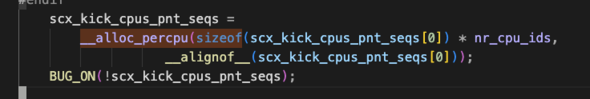

# sched_ext调度机制
sched_ext机制使用调度类的方式装载进入原生内核系统，其实是sched_class的扩展类，和其他调度类比如dl_sched_class, rt_sched_class等是并列存在的。

## sched_ext调度类内核原生结构支持
下面介绍sched_ext调度类修改或利用的一些内核原生结构：
- `struct rq`:运行队列,每CPU结构(一般在类型定义,函数定义中都有percpu的字样),每个CPU都有自己的rq运行队列结构来管理本地运行队列
    - 运行队列是Linux调度中最重要的数据结构，具有大量字段
    - sched_ext中主要添加了`struct scx_rq rq`成员
        ```c
        struct rq { ... 
            struct cfs_rq cfs; 
            struct rt_rq rt; 
            struct dl_rq dl;
        #ifdef CONFIG_SCHED_CLASS_EXT 
            struct scx_rq scx; // sched_ext添加成员
        #endif ... };
        ```
    - `struct rq_flags`:原生内核结构，用于管理运行队列标志位,可以帮助调度器更好地管理和控制进程的调度
        - flags:用于存储运行队列的各种状态和属性(对应一个枚举变量),flags中的每一位都对应着一个特定的标志位，可以通过**位运算**等方式进行设置和读取；
        - cookies:结构体，用于存储**固定进程**的相关信息。在Linux内涵中，固定进程指的是**不会被调度器迁移的进程**，例如`init进程`和`kthreadd进程`等。cookie信息可以帮助调度器识别和处理固定进程；
        - clock_update_flags:
            ```c
            struct rq_flags {
            unsigned long flags;//管理运行队列
            struct pin_cookie cookie; //存储固定进程的相关信息
            #ifdef CONFIG_SCHED_DEBUG 
            /*
            * A copy of (rq::clock_update_flags & RQCF_UPDATED) for the
            * current pin context is stashed here in case it needs to be
            * restored in rq_repin_lock().
            */
            unsigned int clock_update_flags;//队列的时钟更新状态
            #endif
            };
            ```
- `struct task_struct`:进程描述符
    - `struct sched_ext_entity scx`:用于存储当前任务有关scx调度的一些信息，比如其目前处在哪个rq上,~~scx分发标志,list_head成员等~~;（这里应该描述的更清楚scx分发标志代表啥？list_head成员代表啥？）
        ```c
        struct task_struct { 
            ... 
        #ifdef CONFIG_SCHED_CLASS_EXT 
            struct sched_ext_entity scx; //存储当前任务有关scx调度的信息 
        #endif 
            const struct sched_class *sched_class; // 原本的sched_class也会被sched_ext机制所使用,这里的原本调度类是不是为了引用派生的sched_ext class??
            ...
        ```
- `struct sched_class`:调度类(虽然C语言没有派生的概念，但此处可以理解所有调度类都派生自此基类)
    ```c
    /* file: kernel/sched/sched.h */ 
    struct sched_class { 
        void (*enqueue_task)(struct rq *rq, struct task_struct *p, int flags);  // runqueue, task, flags
        void (*dequeue_task)(struct rq *rq, struct task_struct *p, int flags); 
        void (*yield_task)(struct rq *rq); 
        bool (*yield_to_task)(struct rq *rq, struct task_struct *p); 
        struct task_struct *(*pick_next_task)(struct rq *rq);
        void (*put_prev_task)(struct rq *rq, struct task_struct *p); 
        void (*set_next_task)(struct rq *rq, struct task_struct *p, bool first); 
        int (*balance)(struct rq *rq, struct task_struct *prev, struct rq_flags *rf); 
        ... 
        };
    ```
    - sched_ext未做修改，但是利用了该字段来装载自己进入调度系统
        ```c
        DEFINE_SCHED_CLASS(ext) = {
            .enqueue_task           = enqueue_task_scx,
            .dequeue_task           = dequeue_task_scx,
            .yield_task             = yield_task_scx,
            .yield_to_task          = yield_to_task_scx,
            .check_preempt_curr     = check_preempt_curr_scx,
            .pick_next_task         = pick_next_task_scx,
            .put_prev_task          = put_prev_task_scx,
            .set_next_task          = set_next_task_scx,
        #ifdef CONFIG_SMP 
            .balance                = balance_scx, 
            .select_task_rq         = select_task_rq_scx, 
            .pick_task              = pick_task_scx, 
            .set_cpus_allowed       = set_cpus_allowed_scx, 
            .rq_online              = rq_online_scx, 
            .rq_offline             = rq_offline_scx, 
        #endif 
            .task_tick              = task_tick_scx, 
            .switching_to           = switching_to_scx, 
            .switched_to            = switched_to_scx, 
            .reweight_task          = reweight_task_scx, 
            .prio_changed           = prio_changed_scx,
        };
        ```

## sched_ext调度类拓展数据结构
rq->scx_rq->scx_dispatch_q

### sched_ext的runqueue相关扩展结构
为了实现拓展调度功能，sched_ext又定义了多个新数据结构，这里介绍较为核心的数据结构。
- `struct scx_rq`:是struct rq的成员，每个运行队列都有一个scx_rq结构。那这里是队列套队列吗？
    ```c
        struct scx_rq {
        struct scx_dispatch_q	local_dsq; //
        struct list_head	runnable_list;		/* runnable tasks on this rq */
        struct list_head	ddsp_deferred_locals;	/* deferred ddsps from enq */
        unsigned long		ops_qseq;
        u64			extra_enq_flags;	/* see move_task_to_local_dsq() */
        u32			nr_running;
        u32			flags;
        u32			cpuperf_target;		/* [0, SCHED_CAPACITY_SCALE] */
        bool			cpu_released;
        cpumask_var_t		cpus_to_kick;
        cpumask_var_t		cpus_to_kick_if_idle;
        cpumask_var_t		cpus_to_preempt;
        cpumask_var_t		cpus_to_wait;
        unsigned long		pnt_seq;
        struct balance_callback	deferred_bal_cb;
        struct irq_work		deferred_irq_work;
        struct irq_work		kick_cpus_irq_work;
        };
        #endif /* CONFIG_SCHED_CLASS_EXT */
     ```

    - `struct scx_dispatch_q local_dsq`:拥有一个锁结构，由于其他CPU可能回来本CPU的dsq中取任务，因而锁是必要的
        ```c
        /*
        * A dispatch queue (DSQ) can be either a FIFO or p->scx.dsq_vtime ordered
        * queue. A built-in DSQ is always a FIFO. The built-in local DSQs are used to 
        * buffer between the scheduler core and the BPF scheduler. See the
        * documentation for more details.
        */
        struct scx_dispatch_q {
            raw_spinlock_t		lock;
            struct list_head	list;	/* tasks in dispatch order 双向链表 将处于本dsq的所有任务串在一起*/
            struct rb_root		priq;	/* used to order by p->scx.dsq_vtime 红黑树节点按照vtime排序*/
            u32			nr; // DSQ中当前任务数量
            u32			seq;	/* used by BPF iter 用于BPF迭代器遍历DSQ中任务负载*/
            u64			id; //DSQ的唯一标识符
            struct rhash_head	hash_node; //定义了散列表节点，用于快速查找
            struct llist_node	free_node; //用于DSQ的空闲链表，用于回收DSQ
            struct rcu_head		rcu; //Read-Copy-Update用于支持RCU同步机制,允许在不使用锁的情况下安全地更新和访问共享数据,用于在DSQ被释放时，通过RCU机制来确保所有引用DSQ的读者线程都已完成对DSQ的访问
        };
        ```
---
### sched_ext的task_struct相关扩展结构

task_struct->sched_ext_entity->scx_dispatch_q

- `struct sched_ext_entity`:每个task在task_struct中都有一个sched_ext_entity类型的实体，其中包含了一个任务能够被scx调度所需要的全部的字段内容
    - dsq:指向其所在队列
    - dsq_list:串接任务链表
    - flags:指向一个`enum scx_ent_flags`的结构(rq就指向rq_flags,task就指向task_flags,每个有用的struct都对应一个flags)
    - runnable_node:用于在BPF函数中对所有的可执行任务进行链表索引
    ```c
    struct sched_ext_entity {
	struct scx_dispatch_q	*dsq; //当前任务的调度队列
	struct scx_dsq_list_node dsq_list;	/* dispatch order 维护任务在队列中的分派顺序*/
	struct rb_node		dsq_priq;	/* p->scx.dsq_vtime order 使用红黑树维护的优先级队列*/
	u32			dsq_seq; //队列序列号
	u32			dsq_flags;	/* protected by DSQ lock */
	u32			flags;		/* protected by rq lock */
	u32			weight; //任务的调度权重,影响时间片分配和优先级计算,权重越高,获得的时间片越多
	s32			sticky_cpu; //任务倾向于运行的 CPU,调度器优先选择此 CPU，但允许在负载均衡时迁移
	s32			holding_cpu;//任务当前 占用的 CPU，用于实现类似实时调度器的CPU绑定（如防止任务迁移导致缓存失效
	u32			kf_mask;	/* see scx_kf_mask above 当前任务允许调用的 kfunc 集合*/
	struct task_struct	*kf_tasks[2];	/* see SCX_CALL_OP_TASK() 跟踪允许调用 kfunc 的任务*/
	atomic_long_t		ops_state; //调度操作的 状态信息（如任务正在被迁移或分派），用于并发控制

	struct list_head	runnable_node;	/* rq->scx.runnable_list 将任务链接到运行队列的 可运行任务链表*/
	unsigned long		runnable_at;

    #ifdef CONFIG_SCHED_CORE
        u64			core_sched_at;	/* see scx_prio_less() */
    #endif
        u64			ddsp_dsq_id;
        u64			ddsp_enq_flags;

        /* BPF scheduler modifiable fields */

        /*
        * Runtime budget in nsecs. This is usually set through
        * scx_bpf_dispatch() but can also be modified directly by the BPF
        * scheduler. Automatically decreased by SCX as the task executes. On
        * depletion, a scheduling event is triggered.
        *
        * This value is cleared to zero if the task is preempted by
        * %SCX_KICK_PREEMPT and shouldn't be used to determine how long the
        * task ran. Use p->se.sum_exec_runtime instead.
        */
        u64			slice;

        /*
        * Used to order tasks when dispatching to the vtime-ordered priority
        * queue of a dsq. This is usually set through scx_bpf_dispatch_vtime()
        * but can also be modified directly by the BPF scheduler. Modifying it
        * while a task is queued on a dsq may mangle the ordering and is not
        * recommended.
        */
        u64			dsq_vtime;

        /*
        * If set, reject future sched_setscheduler(2) calls updating the policy
        * to %SCHED_EXT with -%EACCES.
        *
        * Can be set from ops.init_task() while the BPF scheduler is being
        * loaded (!scx_init_task_args->fork). If set and the task's policy is
        * already %SCHED_EXT, the task's policy is rejected and forcefully
        * reverted to %SCHED_NORMAL. The number of such events are reported
        * through /sys/kernel/debug/sched_ext::nr_rejected. Setting this flag
        * during fork is not allowed.
        */
        bool			disallow;	/* reject switching into SCX */

        /* cold fields */
    #ifdef CONFIG_EXT_GROUP_SCHED
        struct cgroup		*cgrp_moving_from;
    #endif
        struct list_head	tasks_node;
    };

    ```

- `struct scx_dsp_buf_ent`:percpu结构，用于辅助完成dispatch工作。(6.14版本没有这个结构，看文档可能是使用了local rq作为buffer缓冲core scheduler和BPF scheduler,为什么没有这个结构了？)
    - 向本地dsq中分发任务可能需要等待队列完成或请求锁，为了避免在ops.dispatch()内部执行额外的编码工作以避免锁的顺序倒置问题，因此将其调度分为两个部分:
        - ops.dispatch()调用scx_bpf_dispatch()将task以及dsq等信息存放在scx_dsp_buf_ent中;
        - 一旦ops.dispatch()返回，再调用finish_dispatch()利用scx_dsp_buf_ent中的数据来完成整个过程;
        ```c
        /* dispatch buf */ 
        /* dispatch buf */
        struct scx_dsp_buf_ent {
            struct task_struct	*task;
            unsigned long		qseq;
            u64			dsq_id;
            u64			enq_flags;
        };

        static u32 dispatch_max_batch; 
       // static struct dispatch_buf_ent __percpu *dispatch_buf; 
        //static DEFINE_PER_CPU(u32, dispatch_buf_cursor);
        ```
        
一个指针数组初始化例子：

```c
/* for %SCX_KICK_WAIT */
static unsigned long __percpu *scx_kick_cpus_pnt_seqs;
```
scx_kick_cpus_pnt_seqs[0]实际上是一个unsigned long类型，虽然未被初始化，但是可以用来分配内存，可以用sizeof(scx_kick_cpus_pnt_seqs[0])计算单个元素大小，省去了直接写结构体名称，类型安全，若结构体类型名变更，仅需修改指针定义，分配代码无需调整，若后续需调整数组元素类型(如嵌套结构体)，无需修改内存分配逻辑。但是在开始必须要声明scx_kick_cpus_pnt_seqs的类型。


---


### sched_ext调度类行为相关的扩展结构

struct scx_dsp_ctx

```c
struct scx_dsp_ctx {
	struct rq		*rq; 
	u32			cursor;
	u32			nr_tasks;
	struct scx_dsp_buf_ent	buf[];
};

static struct scx_dsp_ctx __percpu *scx_dsp_ctx;
```


和scx类中的ops绑定，balance_scx->balance_one->声明scx_dsp_ctx，该接口是内核中用于负载均衡的调度器接口
scx_bpf_consume->声明scx_dsp_ctx，指定了当前CPU应该从哪里取得下一个任务，当下一次负载均衡发生的时候该结构的内容也会相应调整

## sched_ext调度机制中的标志类型

sched_ext 技术中定义了许多枚举/结构体类型的标志结构, 用于说明各种操作细节.
- enum scx_dsq_id_flags:通过64bit整数来标识一个dsq
    ```c
    enum scx_dsq_id_flags {
	SCX_DSQ_FLAG_BUILTIN	= 1LLU << 63,
	SCX_DSQ_FLAG_LOCAL_ON	= 1LLU << 62,

	SCX_DSQ_INVALID		= SCX_DSQ_FLAG_BUILTIN | 0,
	SCX_DSQ_GLOBAL		= SCX_DSQ_FLAG_BUILTIN | 1,
	SCX_DSQ_LOCAL		= SCX_DSQ_FLAG_BUILTIN | 2,
	SCX_DSQ_LOCAL_ON	= SCX_DSQ_FLAG_BUILTIN | SCX_DSQ_FLAG_LOCAL_ON,
	SCX_DSQ_LOCAL_CPU_MASK	= 0xffffffffLLU,
    };
    ```
- enum scx_enq_flags:用于dispatch系列的函数(finish_dispatch, scx_bpf_dispatch)中使用，也存在于scx_dsp_buf_ent的enq_flags字段中。
    ```c
    enum scx_enq_flags {
	/* expose select ENQUEUE_* flags as enums */
	SCX_ENQ_WAKEUP		= ENQUEUE_WAKEUP, // 将内核原生标志位暴露出去
	SCX_ENQ_HEAD		= ENQUEUE_HEAD,// 将内核原生标志位暴露出去
	SCX_ENQ_CPU_SELECTED	= ENQUEUE_RQ_SELECTED,

	/* high 32bits are SCX specific */

	/*
	 * Set the following to trigger preemption when calling
	 * scx_bpf_dispatch() with a local dsq as the target. The slice of the
	 * current task is cleared to zero and the CPU is kicked into the
	 * scheduling path. Implies %SCX_ENQ_HEAD.
	 */
	SCX_ENQ_PREEMPT		= 1LLU << 32, // 任务分发完成后立刻执行一次抢占

	/*
	 * The task being enqueued was previously enqueued on the current CPU's
	 * %SCX_DSQ_LOCAL, but was removed from it in a call to the
	 * bpf_scx_reenqueue_local() kfunc. If bpf_scx_reenqueue_local() was
	 * invoked in a ->cpu_release() callback, and the task is again
	 * dispatched back to %SCX_LOCAL_DSQ by this current ->enqueue(), the
	 * task will not be scheduled on the CPU until at least the next invocation
	 * of the ->cpu_acquire() callback.
	 */
	SCX_ENQ_REENQ		= 1LLU << 40, 

	/*
	 * The task being enqueued is the only task available for the cpu. By
	 * default, ext core keeps executing such tasks but when
	 * %SCX_OPS_ENQ_LAST is specified, they're ops.enqueue()'d with the
	 * %SCX_ENQ_LAST flag set.
	 *
	 * The BPF scheduler is responsible for triggering a follow-up
	 * scheduling event. Otherwise, Execution may stall.
	 */
	SCX_ENQ_LAST		= 1LLU << 41, // 当前分发的任务是当前CPU唯一可用任务

	/* high 8 bits are internal */
	__SCX_ENQ_INTERNAL_MASK	= 0xffLLU << 56,

	SCX_ENQ_CLEAR_OPSS	= 1LLU << 56,
	SCX_ENQ_DSQ_PRIQ	= 1LLU << 57,
    };

    ```
- enum scx_ent_flags:说明了当前scx实体的状态如何
    ```c
    /* scx_entity.flags */
    enum scx_ent_flags {
	SCX_TASK_QUEUED		= 1 << 0, /* on ext runqueue 任务实体在扩展就绪队列中*/
	SCX_TASK_RESET_RUNNABLE_AT = 1 << 2, /* runnable_at should be reset 需要重置任务可调度的时间*/
	SCX_TASK_DEQD_FOR_SLEEP	= 1 << 3, /* last dequeue was for SLEEP 最后一次出队操作是因为任务进入睡眠状态 */

	SCX_TASK_STATE_SHIFT	= 8,	  /* bit 8 and 9 are used to carry scx_task_state */
	SCX_TASK_STATE_BITS	= 2,
	SCX_TASK_STATE_MASK	= ((1 << SCX_TASK_STATE_BITS) - 1) << SCX_TASK_STATE_SHIFT, /*用于提取或设置任务状态字段的掩码*/

	SCX_TASK_CURSOR		= 1 << 31, /* iteration cursor, not a task 通常用于在遍历任务队列时标记当前位置，帮助实现迭代器功能*/
    };

    ```
- enum scx_ops_enable_state:定义了ops结构体中的函数状态
    ```c
    enum scx_ops_enable_state {
	SCX_OPS_ENABLING,
	SCX_OPS_ENABLED,
	SCX_OPS_DISABLING,
	SCX_OPS_DISABLED,
    };
    ```
## sched_ext调度机制相关的内核函数

选择一个例子，然后看例子里的代码，再去看例子里代码对应都执行了哪些函数。

sched_ext机制实现了一些内核函数供BPF程序使用。大部分的scx内核函数均被定义在./kernel/sched/ext.c中


