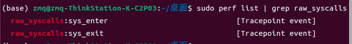
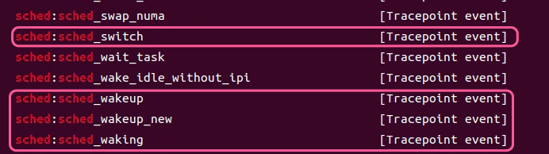
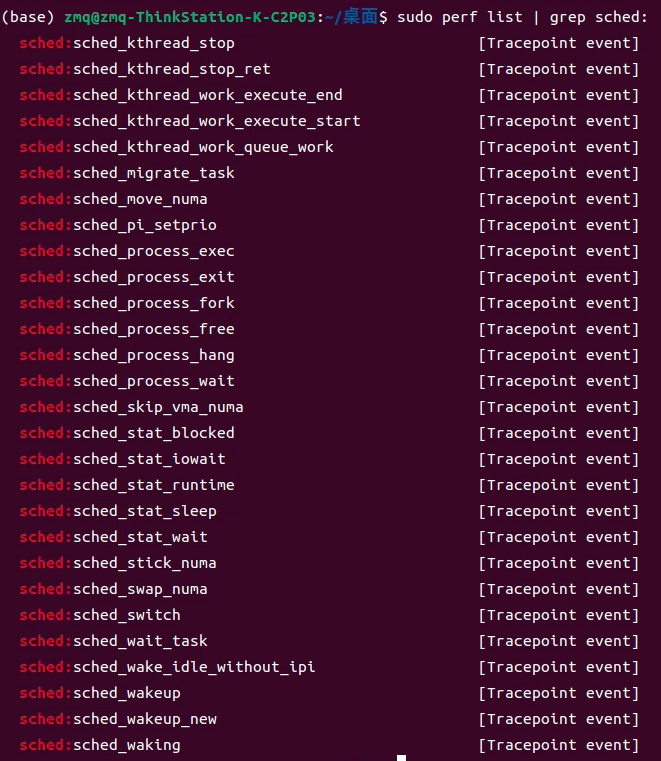
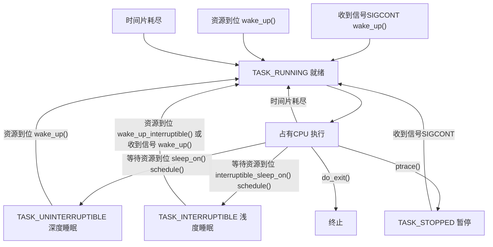
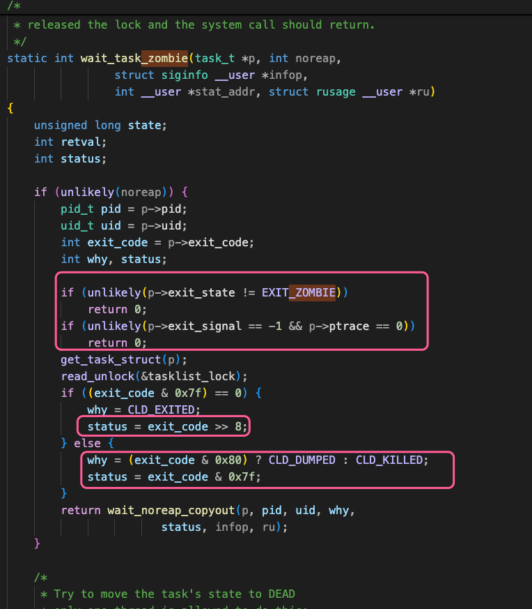
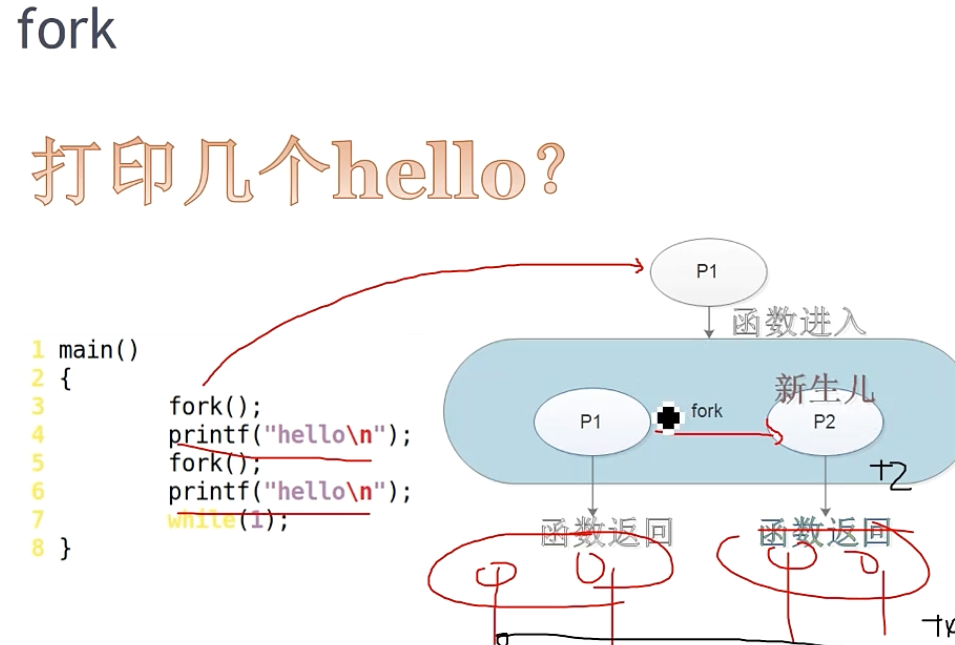
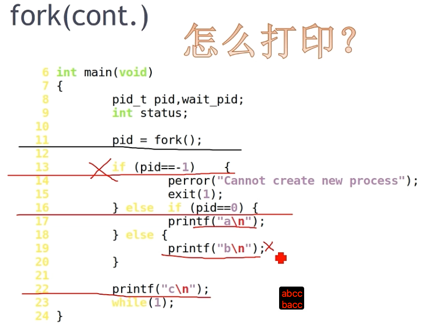
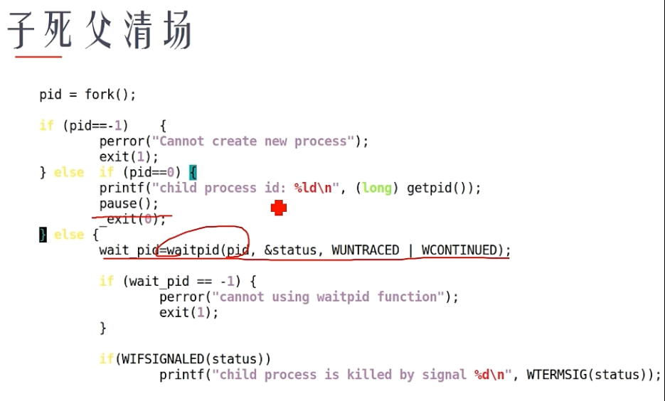
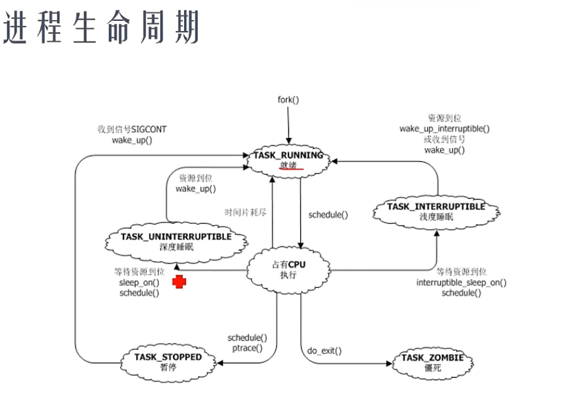

# CPU定界

perf.log文件说明，perf.log文件使用ftrace工具采集

"CPU 定界" (CPU-bound) 和 "GPU 定界" (GPU-bound) 是用来描述程序或任务性能瓶颈在哪里的术语。它们指出是哪个主要处理单元（CPU 或 GPU）的工作负载最重，限制了整体的运行速度。


## 日志格式

```json
python 413019 [033] 1732328.292161386: raw_syscalls:sys_enter: NR 24 (7f0f8e5774f8, 0, 0, 0, 0, 7f0f8e1efdef)
```

- python: 触发该系统调用的进程的命令名。
- 413019: 该 python 进程的进程ID (PID)。
- [033]: 事件被记录时，该进程正在运行的 CPU 核心编号。
- 1732328.292161386: 事件发生的时间戳。这通常是从系统启动开始计算的秒数，精度很高（可能是微秒或纳秒）。
- raw_syscalls:sys_enter: 系统调用的进出，如唤醒、切换等
- raw_syscalls: 表示事件属于原始系统调用追踪类别。
- sys_enter: 表示这是一个系统调用入口事件，即用户空间的程序刚刚进入内核态，准备执行一个系统调用。
- NR 24:
- NR: Number (编号) 的缩写。
- 24: 这是系统调用的编号。在 x86_64 架构的 Linux 上，系统调用号 24 对应的是 sched_yield() 系统调用，作用是建议内核将 CPU 时间让给其他进程。
- (7f0f8e5774f8, 0, 0, 0, 0, 7f0f8e1efdef): 这是传递给该系统调用的参数。ftrace 的 raw_syscalls tracepoint 通常会记录前 6 个寄存器的值，这些寄存器在 x86_64 架构上用于传递系统调用参数。对于 sched_yield() 这种本身不接受用户参数的系统调用，这里显示的值可能代表调用发生时相关寄存器的状态，不一定直接对应用户层面的参数。

```json
python 413019 [033] 1732328.292161888:  raw_syscalls:sys_exit: NR 24 = 0
```
- python 413019 [033] 1732328.292161888: 同上，进程名、PID、CPU核心号、时间戳。注意时间戳比对应的 sys_enter 稍晚一点。
- raw_syscalls:sys_exit: 表示这是一个系统调用出口事件，即内核已经完成了系统调用的处理，准备返回用户空间。
- NR 24: 同上，系统调用编号 sched_yield()。
- = 0: 这是该系统调用的返回值。对于 sched_yield()，返回 0 通常表示成功。


```json
python 413019 [033] 1732328.291556716:     sched:sched_switch: prev_comm=python prev_pid=413019 prev_prio=120 prev_state=R ==> next_comm=kworker/33:0 next_pid=399474 next_prio=120
```

raw_syscalls也是tracepoint事件


sched中几个比较重要的tracepoint:

全部和调度器scheduler相关的tracepoints如下：


## 进程状态转换

第一部分，深入彻底地搞清楚进程生命周期，进程生命周期创建、退出、停止，以及僵尸是个什么意思；

第二部分，深入分析进程创建的写时拷贝技术、以及Linux的线程究竟是怎么回事（为什么称为轻量级进程），此部分也会搞清楚进程0、进程1和托孤，以及睡眠时的等待队列；

第三部分，搞清楚Linux进程调度算法，不同的调度策略、实时性，完全公平调度算法；

第四部分，讲解Linux多核下CPU、中断、软负载均衡，cgroups调度算法以及Linux为什么不是一个实时操作系统。

- Linux进程的生命周期（就绪、运行、睡眠、停止、僵死）
- 僵尸进程，当一个进程是僵尸进程时，资源是个什么情况
- 停止状态与作业控制，cpulimit
- 内存泄漏的真实含义
- task_struct以及task_struct之间的关系
- fork和僵尸

### 进程控制块PCB(process control block)
进程是资源分配的单位。Linux中的进程控制块是task_struct

学习小tip:不要去直接一行一行去看代码，首先有个宏观概念知道这个结构的作用是什么，比如task_struct里有mm(mm_struct), fs(fs_struct),files(files_struct)等等，首先如果是进程资源分配的单位需要指向一部分内存空间也就是mm, 其次需要文件系统的参与，需要知道执行这个进程的代码路径在哪里root在哪里
还有就是进程在运行时可能会打开一些文件，打开的这些文件自然就需要files_struct来保存一些fd_array, file descriptor文件描述符,还可能有一些signals及其他资源。


pid的数量是有限的
```shell
cat /proc/sys/kernel/pid_max
32768 
```
Fork炸弹
创建了很多:进程消耗了全部pid，即使想用kill也用不了，因为kill也要消耗一个pid
```shell
:(){:|:&};:
```

task_struct的管理方式：

系统中有很多进程，每个进程都有pcb，如果零散存放全部是全局变量很不合适，所以需要合理的数据结构进行管理。
最简单的就是linklist，但是linklist是单链表，而进程是树形关系，有父子兄弟。
```shell
pstree
```
所以需要形成树。有的时候需要根据进程的pid找到进程比如
```shell
kill -9 2323563
```
快速检索就需要hash结构，pid->task_struct
1. 如果想快速便利->linklist
2. 如果想找到进程的父进程->tree
3.  如果想根据pid快速找到task_struct->hash
"空间换时间"的方法




僵尸进程是一种临界状态，进程已死，但是父进程还没调用wait4的时候存在的一种状态。
资源已经释放，所以没有内存泄漏task_struct还在，父进程可以查到子进程死因
wait_task_zombie函数中有子进程退出状态的判断，父进程能够知道子进程死亡的原因，如果子进程死了父进程一直不去清理，就会一直是僵尸态
使用kill -9也无法清理僵尸进程，其资源已经消失，不用担心资源浪费，唯一能杀死的办法就是杀掉父进程。


即使是自己写的代码挂了，里面已经申请空间了，Linux也会自动去清理进程，不用担心进程死了内存没释放的问题。这不是内存泄漏的问题，应该担心的内存泄漏是，
进程活着，运行越久，耗费内存越多。

工程上如何观察进程是否有内存泄漏？

连续多点采样法，在不同时刻采样内存，随着时间流逝，内存耗费越来越大，必有内存泄漏。正常的情况是围绕一个均线震荡收敛的。如果一个应用内存震荡都没有一直是平的，说明应用过于简单了。
如果你说写了一个应用就是随着时间内存耗费增长也是有内存泄漏，写的就是一个内存泄漏的程序。


理解fork







几点注意事项：
1. 如果开始第一条数据是exit可以不用考虑，开始的处理，整个log文件有一个开始的位置
2. perf.log 里的时间戳 * 1000000000 +  offset(暂定为 1741678240727699640) =  json 里的 baseTimeNanoseconds ：1735632360000000000  + ts 时间戳 * 1000
3. 【PID过滤】可以使用dict或者linklist存储感兴趣的进程链表，在字典中的进程才进行状态构建



深度睡眠和浅度睡眠是啥？
深度睡眠：必须等到资源才能醒；所以是不会响应任何信号的，使用kill -9依然无法杀掉进程
浅睡眠：资源来了会醒，信号也可以唤醒（信号就是针对进程的异步打断机制）
```shell
# 以下是macos的signal，Linux同样命令可以查看
(base) ➜  ~ kill -l
HUP INT QUIT ILL TRAP ABRT EMT FPE KILL BUS SEGV SYS PIPE ALRM TERM URG STOP TSTP CONT CHLD TTIN TTOU IO XCPU XFSZ VTALRM PROF WINCH INFO USR1 USR2
```

```c
int main()
{
	fork();
	printf("hello\n");
	fork();	
	printf("hello\n");
	while(1);
}
```

```c
#include <stdio.h>
#include <sys/wait.h>
#include <stdlib.h>
#include <unistd.h>

int main(void)
{
	pid_t pid,wait_pid;
	int status;

	pid = fork();

	if (pid==-1)	{
		perror("Cannot create new process");
		exit(1);
	} else 	if (pid==0) {
		printf("a\n");
	} else {
		printf("b\n");
	}

	printf("c\n");
	while(1);
}
```


```c
#include <stdio.h>
#include <sys/wait.h>
#include <stdlib.h>
#include <unistd.h>

int main(void)
{
	pid_t pid,wait_pid;
	int status;

	pid = fork();

	if (pid==-1)	{
		perror("Cannot create new process");
		exit(1);
	} else 	if (pid==0) {
		printf("child process id: %ld\n", (long) getpid());
		pause();
		_exit(0);
	} else {
#if 1 /* define 1 to make child process always a zomie */
		printf("ppid:%d\n", getpid());
		while(1);
#endif
		do {
			wait_pid=waitpid(pid, &status, WUNTRACED | WCONTINUED);

			if (wait_pid == -1) {
				perror("cannot using waitpid function");
				exit(1);
			}

			if (WIFEXITED(status))
				printf("child process exites, status=%d\n", WEXITSTATUS(status));

			if(WIFSIGNALED(status))
				printf("child process is killed by signal %d\n", WTERMSIG(status));

			if (WIFSTOPPED(status))
				printf("child process is stopped by signal %d\n", WSTOPSIG(status));

			if (WIFCONTINUED(status))
				printf("child process resume running....\n");

		} while (!WIFEXITED(status) && !WIFSIGNALED(status));

		exit(0);
	}
}
```

容器init进程是否能够被kill：https://zhuanlan.zhihu.com/p/672380779
Operating Systems:Three Easy Pieces https://pages.cs.wisc.edu/~remzi/OSTEP/

### 进程创建的写时拷贝技术等


- fork、vfork、clone
- 写时拷贝技术
- Linux线程的实现本质
- 进程0和进程1
- 进程的睡眠和等待队列
- 孤儿进程的托孤，SUBREAPER


### 进程调度算法

- CPU/IO消耗型进程
- 吞吐率 vs. 响应
- SCHED_FIFO、SCHED_RR
- SCHED_NORMAL和CFS
- nice、renice
- chrt

### Linux下多CPU的负载均衡
- 多核下负载均衡
- 中断负载均衡、RPS软中断负载均衡
- cgroups和CPU资源分群分配
- Android和NEON对cgroups的采用
- Linux为什么不是硬实时的
- preempt-rt对Linux实时性的改造


## 最终结果

最终生成的json文件格式：
```json 
//CPU进程状态
{
    "ph": "X", 
    "cat": "Trace",
    "ts": 开始时间戳，转换成 us, 和json 文件里的格式一致, 
    "dur": 持续时间,
    "pid": "Pids",
    "tid": "真正的pid",
    "name": "状态，sleep,preempt, running, sys" 
  }
```